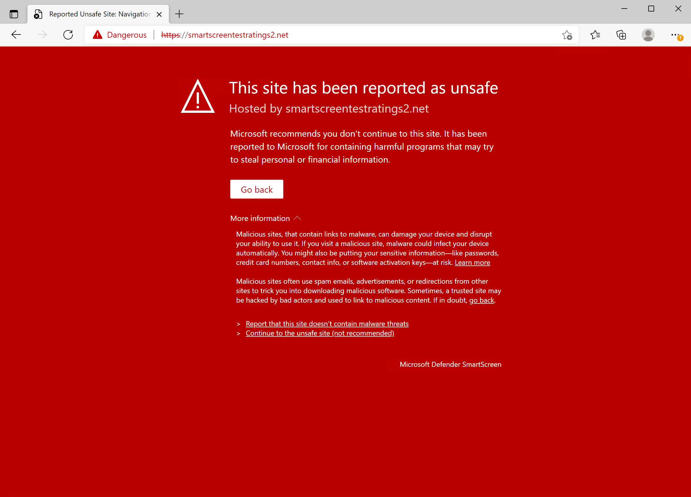

# <a name="web-protection"></a>Web 保护

[!INCLUDE [Microsoft 365 Defender rebranding](../../includes/microsoft-defender.md)]

**适用于：**

- [Microsoft Defender for Endpoint](https://go.microsoft.com/fwlink/p/?linkid=2154037)
- [Microsoft 365 Defender](https://go.microsoft.com/fwlink/?linkid=2118804)


> 希望体验 Microsoft Defender for Endpoint？ [注册免费试用版](https://signup.microsoft.com/create-account/signup?products=7f379fee-c4f9-4278-b0a1-e4c8c2fcdf7e&ru=https://aka.ms/MDEp2OpenTrial?ocid=docs-wdatp-main-abovefoldlink&rtc=1)。


## <a name="about-web-protection"></a>关于 Web 保护

Microsoft Defender for Endpoint 中的 Web 保护功能由[Web 威胁防护、Web](web-threat-protection.md)[内容筛选](web-content-filtering.md)和自定义[指示器构成](manage-indicators.md)。 通过 Web 保护，您可以保护设备免受 Web 威胁，并帮助您控制不需要的内容。 您可以在 Web 门户中查找 Web Microsoft 365 Defender报告，> **Web 保护**。

:::image type="content" alt-text="所有 Web 保护卡的图像。" source="images/web-protection.png" lightbox="images/web-protection.png":::

### <a name="web-threat-protection"></a>Web 威胁防护功能

构成 Web 威胁防护的卡片是一段时间 **的 Web 威胁检测和** **Web 威胁摘要**。

Web 威胁防护包括：

- 全面了解影响组织的 Web 威胁。
- 通过警报和 URL 以及访问这些 URL 的设备的全面配置文件，调查与 Web 相关的威胁活动的功能。
- 一整套安全功能，可跟踪恶意和不需要的网站的常规访问趋势。

有关详细信息，请参阅 [Web 威胁防护](web-threat-protection.md)。

### <a name="custom-indicators"></a>自定义指示器

自定义指示器检测还汇总在组织的 Web 威胁报告中的"一段时间的 **Web** 威胁检测和 Web 威胁 **摘要"下**。

自定义指示器包括：

- 能够创建基于 IP 和 URL 的泄露指示器，以保护你的组织免受威胁。
- 调查与自定义 IP/URL 配置文件和访问这些 URL 的设备相关的活动的功能。
- 为 IP 和 URL 创建允许、阻止和警告策略的能力。

有关详细信息，请参阅为 IP 和 [URL/域创建指示器](indicator-ip-domain.md)

### <a name="web-content-filtering"></a>Web 内容筛选

Web 内容筛选包括 **按类别分类的 Web** 活动 **、Web 内容筛选摘要** 和 **Web 活动摘要**。

Web 内容筛选包括：

- 阻止用户访问被阻止类别的网站，无论他们是在内部浏览还是离开。
- 可以使用 Microsoft Defender for Endpoint 基于角色的访问控制设置中定义的设备组，便捷地将各种策略 [部署到各种用户集](/microsoft-365/security/defender-endpoint/rbac)。
- 可以在相同的中心位置访问 Web 报表，并查看实际块和 Web 使用情况。

有关详细信息，请参阅 [Web 内容筛选](web-content-filtering.md)。

## <a name="order-of-precedence"></a>优先顺序

Web 保护由以下组件组成，按优先顺序列出。 其中每个组件都由 Microsoft Edge 中的 SmartScreen 客户端和所有其他浏览器和进程中的网络保护客户端强制执行。

- 自定义指示器 (IP/URL，Microsoft Defender for Cloud Apps 策略) 
  - 允许
  - Warn
  - 阻止

- Web 威胁 (恶意软件、网络钓鱼) 
  - SmartScreen Intel，包括 Exchange Online Protection (EOP) 
  - 升级

- WCF (Web) 

> [!NOTE]
> Microsoft Defender for Cloud Apps 当前仅生成阻止的 URL 的指示器。

优先级顺序与计算 URL 或 IP 的操作顺序相关。 例如，如果你有 Web 内容筛选策略，可以通过自定义 IP/URL 指示器创建排除项。 IoC (的) 指示器的优先级顺序比 WCF 块高。

同样，在指示器冲突期间，允许始终优先于块 (替代逻辑) 。 这意味着允许指示器将超过存在的任何阻止指示器。

下表总结了在 Web 保护堆栈中出现冲突的一些常见配置。 它还根据上面列出的优先级确定结果。

<br>

****

|自定义指示器策略|Web 威胁策略|WCF 策略|云应用 Defender 策略|结果|
|---|---|---|---|---|
|允许|阻止|阻止|阻止|允许 (Web 保护覆盖) |
|允许|允许|阻止|阻止|允许 (WCF 异常) |
|Warn|阻止|阻止|阻止|警告 (覆盖) |
|

自定义指示器不支持内部 IP 地址。 对于最终用户绕过的警告策略，默认情况下，该用户的站点将取消阻止 24 小时。 此时间范围由管理员修改，并通过 SmartScreen 云服务向下传递。 此外，在使用 Web 威胁阻止 CSP Microsoft Edge恶意软件/网络钓鱼 (时，也可以禁用绕过警告) 。 有关详细信息，请参阅 SmartScreen Microsoft Edge [SmartScreen 设置。](/DeployEdge/microsoft-edge-policies#smartscreen-settings-policies)

## <a name="protect-browsers"></a>保护浏览器

在所有 Web 保护方案中，SmartScreen 和网络保护可以一起使用，以确保跨第一方和第三方浏览器和进程提供保护。 SmartScreen 直接内置于 Microsoft Edge，而 Network Protection 监视第三方浏览器和进程中的流量。 下图说明了此概念。 此两个客户端协同工作以提供多个浏览器/应用覆盖范围的图对于 Web 保护 (指示器、Web 威胁、内容筛选功能的所有功能) 。

:::image type="content" alt-text="将 SmartScreen 和网络保护一同使用。" source="../../media/web-protection-protect-browsers.png" lightbox="../../media/web-protection-protect-browsers.png":::

## <a name="troubleshoot-endpoint-blocks"></a>终结点块疑难解答

来自 SmartScreen 云的响应是标准化的。 可以使用 Fiddler 等工具检查云服务的响应，这有助于确定阻止的来源。

当 SmartScreen 云服务响应允许、阻止或警告响应时，响应类别和服务器上下文将中继回客户端。 在Microsoft Edge中，响应类别用于确定相应的阻止页面，以显示 (恶意、网络钓鱼、组织策略) 。

下表显示了响应及其关联功能。

<br>

****

|ResponseCategory|负责阻止的功能|
|---|---|
|CustomPolicy|WCF|
|CustomBlockList|自定义指示器|
|CasbPolicy|Defender for Cloud Apps|
|恶意|Web 威胁|
|网络钓鱼|Web 威胁|
|||

## <a name="advanced-hunting-for-web-protection"></a>Web 保护高级搜寻

高级搜寻中的 Kusto 查询可用于汇总组织中最多 30 天的 Web 保护块。 这些查询使用上面列出的信息来区分各种块源，并采用用户友好的方式汇总它们。 例如，下面的查询列出了源自数据库的所有 WCF Microsoft Edge。

```kusto
DeviceEvents
| where ActionType == "SmartScreenUrlWarning"
| extend ParsedFields=parse_json(AdditionalFields)
| project DeviceName, ActionType, Timestamp, RemoteUrl, InitiatingProcessFileName, Experience=tostring(ParsedFields.Experience)
| where Experience == "CustomBlockList"
```

同样，您可以使用下面的查询列出源自网络保护网站的所有 WCF (例如，第三方浏览器中的 WCF 块) 。 请注意，ActionType 已更新，"Experience"已更改为"ResponseCategory"。

```kusto
DeviceEvents 
| where ActionType == "ExploitGuardNetworkProtectionBlocked"
| extend ParsedFields=parse_json(AdditionalFields)
| project DeviceName, ActionType, Timestamp, RemoteUrl, InitiatingProcessFileName, ResponseCategory=tostring(ParsedFields.ResponseCategory)
| where ResponseCategory == "CustomPolicy"
```

若要列出由于自定义指示器 (其他功能而) ，请参阅上表，其中概述了每个功能及其各自的响应类别。 还可以修改这些查询以搜索与组织中特定计算机相关的遥测。 请注意，上述每个查询中显示的 ActionType 将只显示 Web 保护功能阻止的连接，不会显示所有网络流量。

## <a name="user-experience"></a>用户体验

如果用户访问具有恶意软件、网络钓鱼或其他 Web 威胁风险的网页，Microsoft Edge 将触发一个阻止页面，其中显示"此网站已被报告为不安全"以及与威胁有关的信息。

> [!div class="mx-imgBorder"]
> 

如果 WCF 或自定义指示器阻止，Microsoft Edge阻止页显示，告知用户此网站被组织阻止。

> [!div class="mx-imgBorder"]
> 

在任何情况下，第三方浏览器中都未显示阻止页，并且用户将看到"安全连接失败"页以及 Toast 通知。 根据负责阻止的策略，用户将在 Toast 通知中看到不同的消息。 例如，Web 内容筛选将显示消息"此内容被阻止"。

> [!div class="mx-imgBorder"]
> 

## <a name="report-false-positives"></a>报告误报

若要报告 SmartScreen 视为具有危险性的网站的误报，请使用在 Microsoft Edge (阻止页上显示的链接，如) 。

对于 WCF，您可以就域的类别进行争议。 导航到 WCF **报告的"** 域"选项卡，然后单击"**报告 Inaccuracy"。** 将打开一个飞出区。 设置事件的优先级并提供其他一些详细信息，如建议类别。 若要详细了解如何启用 WCF 以及如何争议类别，请参阅 [Web 内容筛选](web-content-filtering.md)。

若要详细了解如何提交误报/负数，请参阅在 Microsoft Defender for Endpoint 中解决 [误报/负面影响](defender-endpoint-false-positives-negatives.md)。

## <a name="related-information"></a>相关信息

<br>

****

|主题|说明|
|---|---|
|[Web 威胁防护功能](web-threat-protection.md) | 停止对钓鱼网站、恶意软件矢量、攻击网站、不受信任的或低信誉网站以及已阻止的网站的访问。|
|[Web 内容筛选](web-content-filtering.md) | 根据网站的内容类别跟踪和监管对网站的访问。|
|
