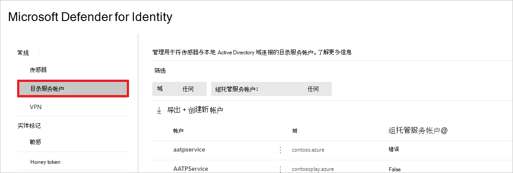

# Microsoft Defender for Identity Directory Services 帐户Microsoft 365 Defender

**适用于：**

- Microsoft 365 Defender
- Defender for Identity

本文介绍如何在 Microsoft 365 Defender 中配置 [Microsoft Defender for Identity](/defender-for-identity) Directory [Services 帐户](/microsoft-365/security/defender/overview-security-center)。

>[!IMPORTANT]
>作为与用户Microsoft 365 Defender的一部分，一些选项和详细信息从他们在 Defender for Identity 门户中的位置发生了更改。 请阅读下面的详细信息，了解在哪里可以找到熟悉的新功能和新功能。

## 配置目录服务帐户

若要将 [传感器与](sensor-health.md#add-a-sensor) Active Directory 域连接，需要配置目录服务帐户。

1. 在 <a href="https://go.microsoft.com/fwlink/p/?linkid=2077139" target="_blank">Microsoft 365 Defender</a>中，转到"**设置**"和"**标识"**。

    

1. 选择 **"目录服务帐户"**。 你将看到哪些帐户与哪些域关联。

    

1. 如果您选择一个帐户，将打开一个包含该帐户设置的窗格。

    

1. 若要添加新的目录服务帐户，**请选择"创建新** 帐户"并填写"**帐户名称**、**域和****密码"**。 还可以选择它是 gMSA (组托管服务帐户) 还是属于 **单标签域**。

    

1. 选择“**保存**”。

## 另请参阅

- [Microsoft Defender for Identity 传感器运行状况和设置](sensor-health.md)
