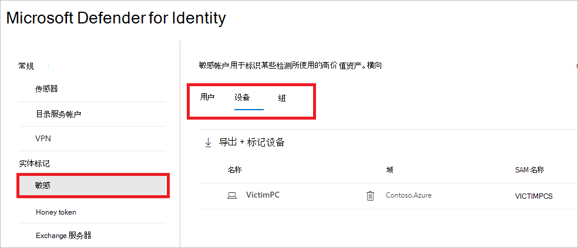
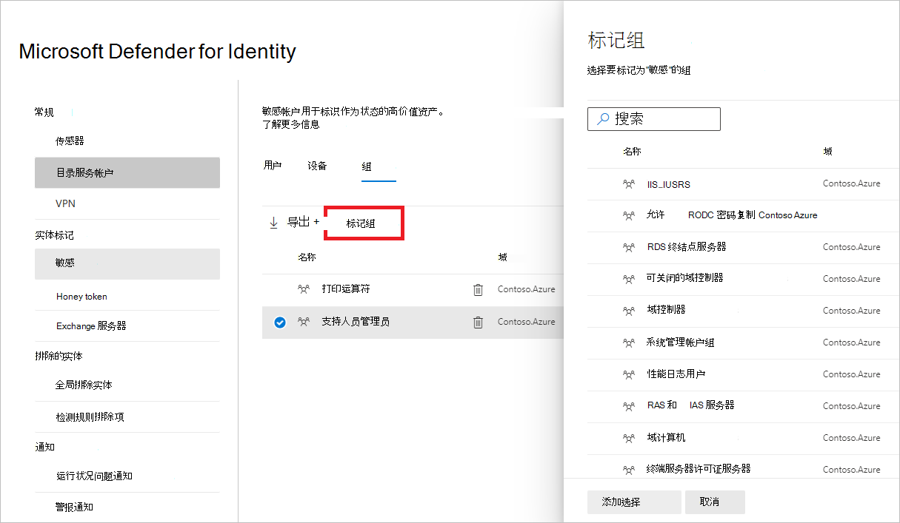
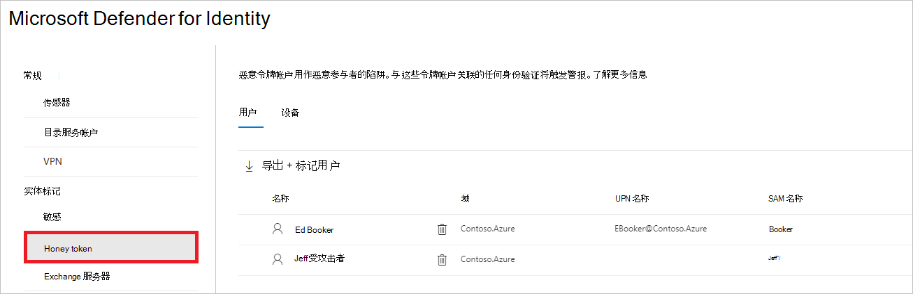
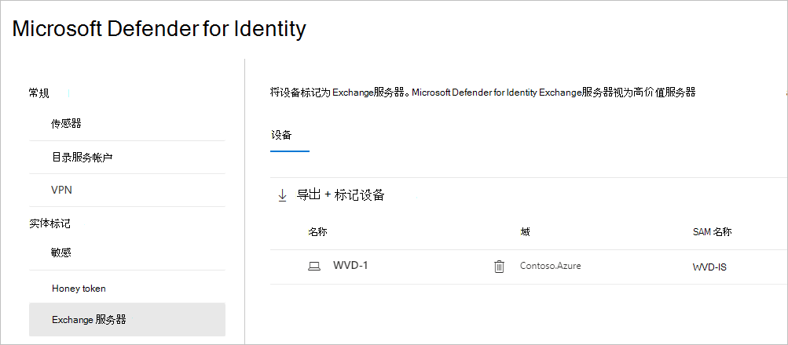

# Defender for Identity 实体标记Microsoft 365 Defender

**适用于：**

- Microsoft 365 Defender
- Defender for Identity

本文介绍如何在 Microsoft [Defender 中应用 Microsoft Defender for Identity](/defender-for-identity) 实体[Microsoft 365 Defender](/microsoft-365/security/defender/overview-security-center)。

>[!IMPORTANT]
>作为与用户Microsoft 365 Defender的一部分，一些选项和详细信息从他们在 Defender for Identity 门户中的位置发生了更改。 请阅读下面的详细信息，了解在哪里可以找到熟悉的新功能和新功能。

## 实体标记

在Microsoft 365 Defender中，你可以设置三种类型的 Defender for Identity 实体标记：**敏感** 标记、**Honeytoken** 标记Exchange **服务器标记**。

若要设置这些标记，<a href="https://go.microsoft.com/fwlink/p/?linkid=2077139" target="_blank">Microsoft 365 Defender，请转到</a>"**设置"****和"标识"**。

标记设置将显示在实体 **标记下**。

若要设置每种类型的标记，请按照下面的说明操作。

## 敏感标记

Sensitive **标记** 用于标识高价值资产。 横向移动路径还依赖于实体的敏感度状态。 Defender for Identity 自动将某些实体视为敏感。 有关这些资产的列表，请参阅 [敏感实体](/defender-for-identity/manage-sensitive-honeytoken-accounts#sensitive-entities)。

还可以手动将用户、设备或组标记为敏感。

1. 选择 **"敏感"**。 然后，你将看到现有的敏感 **用户****、设备和****组**。

    

1. 在每个类别下，选择 **"标记...** "以标记该类型的实体。 例如，在"组 **"下**，选择" **标记组"。** 将打开一个窗格，包含您可以选择标记的组。 若要搜索组，请在搜索框中输入组的名称。

    

1. 选择你的组，然后单击添加 **选择。**

    

## Honeytoken 标记

Honeytoken 实体用作恶意主角的陷阱。 与这些 honeytoken 实体关联的任何身份验证将触发警报。

可以使用 **Honeytoken** 标记来标记用户或设备，方法与标记敏感帐户的方式相同。

1. 选择 **Honeytoken**。 然后，你将看到现有的 honeytoken **用户****和设备**。

    

1. 在每个类别下，选择 **"标记...** "以标记该类型的实体。 例如，在"用户 **"下**，选择" **标记用户"。** 将打开一个窗格，包含您可以选择标记的组。 若要搜索组，请在搜索框中输入组的名称。

    

1. 选择你的用户，然后单击添加 **选择。**

    

## Exchange服务器标记

Defender for Identity Exchange服务器视为高价值资产，并自动将其标记为 **敏感**。 还可以手动将设备标记为Exchange服务器。

1. 选择 **Exchange服务器"**。 然后，你将看到标有 Exchange **服务器标记的现有** 设备。

    

1. 若要将设备标记为Exchange服务器，请选择"**标记设备"**。  将打开一个窗格，并包含可选择标记的设备。 若要搜索设备，请在搜索框中输入其名称。

    

1. 选择你的设备，然后单击添加 **选择。**

    

## 另请参阅

- [管理 Defender for Identity 安全警报](manage-security-alerts.md)
