# Configure Defender for Identity detection exclusions in Microsoft 365 Defender

**适用于：**

- Microsoft 365 Defender
- Defender for Identity

本文介绍了如何在 Microsoft Defender 中[配置标识](/defender-for-identity)[检测排除项](/microsoft-365/security/defender/overview-security-center)Microsoft 365 Defender。

> [!IMPORTANT]
> 作为与用户Microsoft 365 Defender的一部分，一些选项和详细信息从他们在 Defender for Identity 门户中的位置发生了更改。 请阅读下面的详细信息，了解在哪里可以找到熟悉的新功能和新功能。

[!INCLUDE [Product long](includes/product-long.md)] 允许将特定 IP 地址、计算机、域或用户排除在大量检测之外。

例如，使用 **DNS** 作为扫描机制的安全扫描程序可能会触发 DNS 重新警报。 创建排除可帮助 Defender for Identity 忽略此类扫描程序并减少误报。

>[!NOTE]
>在通过 DNS 警报 [打开的"](/defender-for-identity/exfiltration-alerts#suspicious-communication-over-dns-external-id-2031) 可疑通信"的最常见域中，我们观察到客户最常从警报中排除的域。 默认情况下，这些域将添加到排除列表，但您可以选择轻松删除它们。

## 如何添加检测排除项

1. In [Microsoft 365 Defender，](https://security.microsoft.com/)go to **设置** and then **Identities**.

    

1. 然后，你将在左侧 **菜单中** 看到"排除的实体"。

    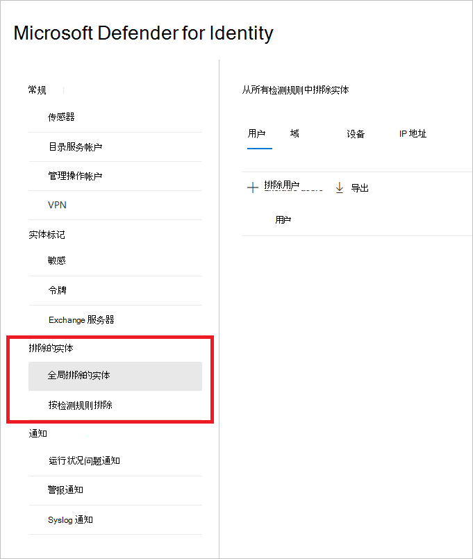

然后，可以通过两种方法设置排除项：检测规则的排除 **项** 和 **全局排除的实体**。

## 检测规则排除项

1. 在左侧菜单中，选择"**按检测规则排除"。** 你将看到检测规则列表。

    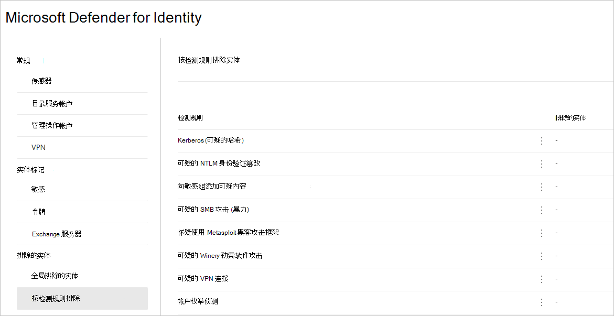

1. 对于要配置的每个检测，请执行以下步骤：

    1. 选择规则。 您可以使用搜索栏搜索检测。 选中后，将打开一个包含检测规则详细信息的窗格。

        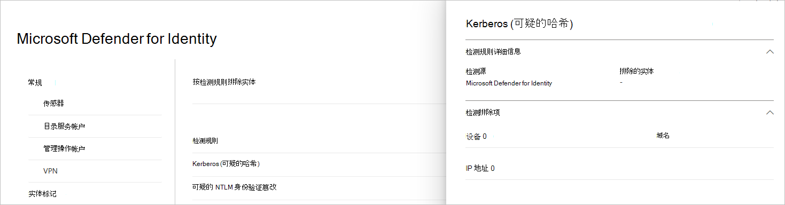

    1. 若要添加排除项，请选择" **已排除实体"** 按钮，然后选择排除类型。 每个规则都有不同的排除实体。 它们包括用户、设备、域和 IP 地址。 本示例中，选项为"排除 **设备**"和"**排除 IP 地址"。**

        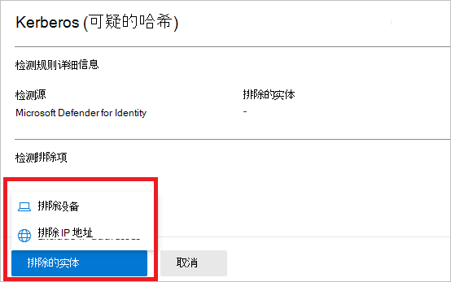

    1. 选择排除类型后，可以添加排除项。 在打开的窗格中，选择 **+** 用于添加排除项的按钮。

        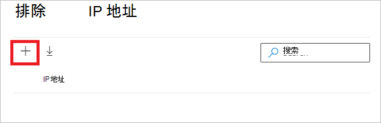

    1. 然后添加要排除的实体。 选择 **" +** 添加"以将实体添加到列表中。

        

    1. 然后选择" **排除此示例 (** IP 地址) 完成排除操作。

        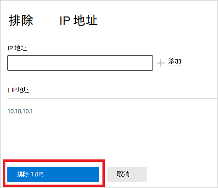

    1. 添加排除项后，可以通过返回到"已排除实体"按钮导出列表或删除 **排除** 项。 在此例中，我们已返回到排除 **设备**。 若要导出列表，请选择向下箭头按钮。

        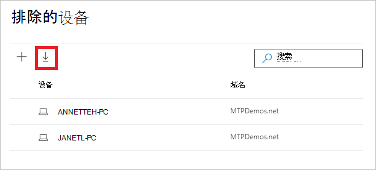

    1. 若要删除排除项，请选择排除项，然后选择回收站图标。

        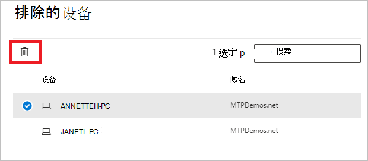

## 全局排除实体

你现在还可以按全局排除 **实体配置排除项**。 全局排除允许你定义某些实体 (IP 地址、子网、设备或域) 所有检测 Defender for Identity 中排除。 例如，如果你排除设备，它将仅适用于将设备标识作为检测的一部分的检测。

1. 在左侧菜单中，选择全局 **排除的实体**。 你将看到可以排除的实体的类别。

    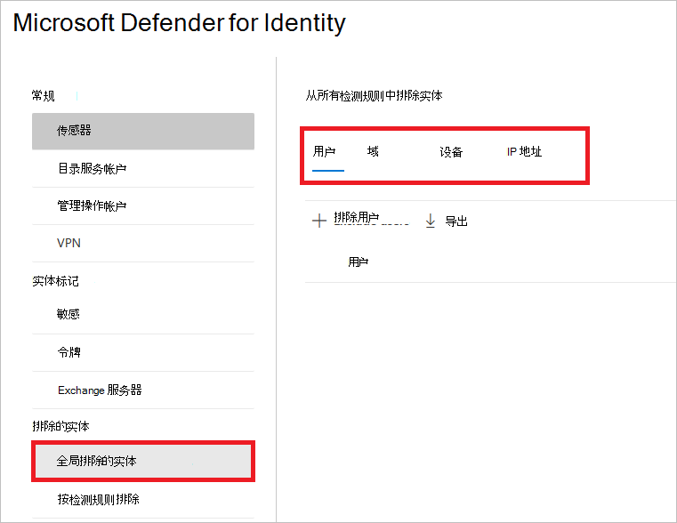

1. 选择排除类型。 在此例中，我们选择了"**排除域"。**

    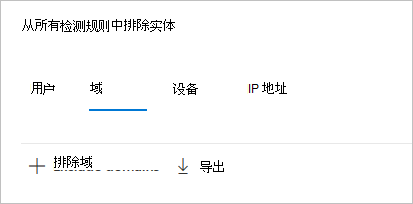

1. 将打开一个窗格，您可以在其中添加要排除的域。 添加要排除的域。

    

1. 域将添加到列表中。 选择 **"排除域** "以完成排除。

    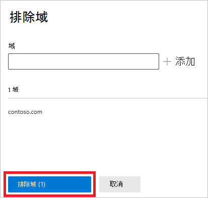

1. 然后，你将在要排除在所有检测规则中的实体列表中看到该域。 可以导出列表，或者通过选择实体并单击"删除"按钮来 **删除** 实体。

    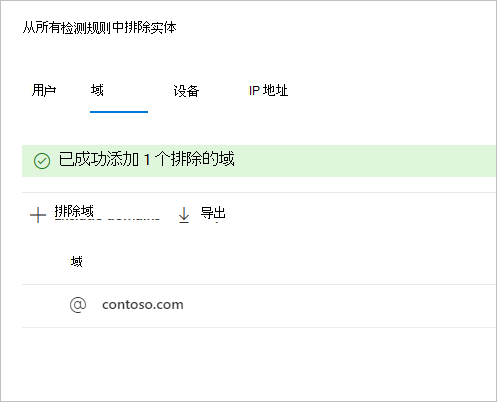

## 另请参阅

- [管理 Defender for Identity 安全警报](manage-security-alerts.md)
