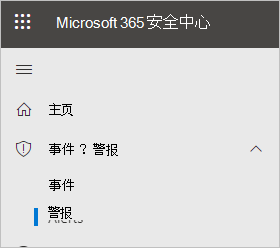
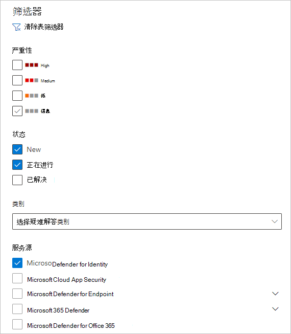
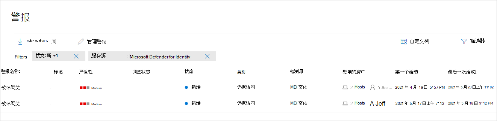
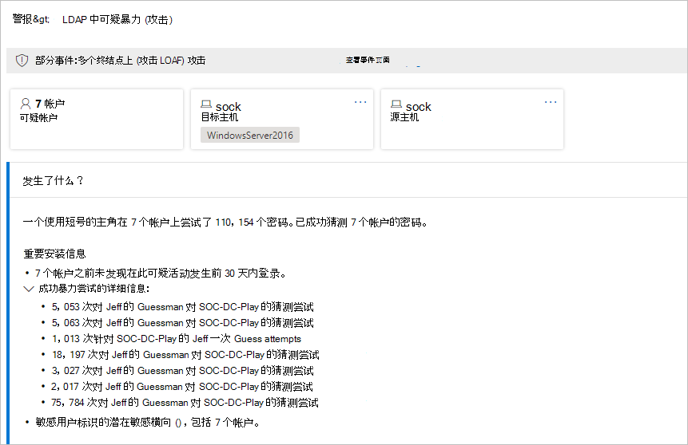
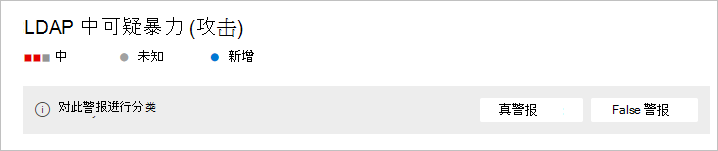
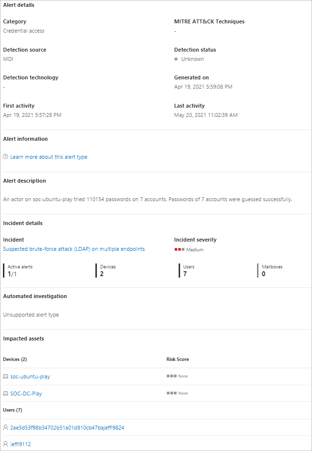
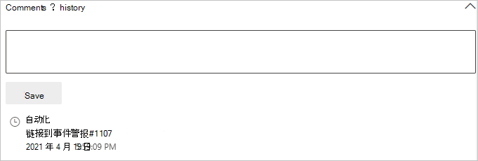

# Defender for Identity security alerts in Microsoft 365 Defender

**适用于：**

- Microsoft 365 Defender
- Defender for Identity

本文介绍了如何使用 Microsoft [Defender for Identity](/defender-for-identity)安全警报的基础知识，Microsoft 365 Defender。 

Defender for Identity 警报在本机集成到具有<a href="https://go.microsoft.com/fwlink/p/?linkid=2077139" target="_blank">Microsoft 365 Defender标识警报</a>页面格式的页面中。 这标记了将完整的[Microsoft Defender for Identity](/defender-for-identity/defender-for-identity-in-microsoft-365-defender)体验引入到 Microsoft 365 Defender。

新的标识警报页面为 Microsoft Defender for Identity 客户提供更好的跨域信号扩充和新自动标识响应功能。 它可确保您保持安全，并有助于提高安全操作的效率。

通过 Microsoft 365 Defender 调查警报的一个好处是，Microsoft Defender for Identity 警报与从套件中的所有其他产品获取的信息进一步关联。 这些增强的警报与其他来自 microsoft Defender for Microsoft 365 Defender 和 Microsoft [Defender for](/microsoft-365/security/office-365-security) Endpoint Office 365警报[格式一致](/microsoft-365/security/defender-endpoint)。 新页面实际上无需导航到其他产品门户来调查与标识相关的警报。

源自 Defender for Identity 的警报现在可以触发 Microsoft 365 Defender 自动调查和响应[ (AIR) ](/microsoft-365/security/defender/m365d-autoir)功能，包括自动修正警报以及缓解可能参与可疑活动的工具和流程。

> [!IMPORTANT]
> 作为与用户Microsoft 365 Defender的一部分，一些选项和详细信息从他们在 Defender for Identity 门户中的位置发生了更改。 请阅读下面的详细信息，了解在哪里可以找到熟悉的新功能和新功能。

## 查看安全警报

可以从多个位置访问警报，包括警报页面、事件页面、各个设备的页面以及高级 **搜寻页面。**  本示例中，我们将查看警报 **页面**。

In <a href="https://go.microsoft.com/fwlink/p/?linkid=2077139" target="_blank">Microsoft 365 Defender，</a>go to **Incidents & alerts** and then to **Alerts**.

To see alerts from Defender for Identity， on the top-right select **Filter**， and then under **Service sources** select Microsoft Defender **for Identity，** and select **Apply**：

警报将显示，并包含以下列中的信息：**警报** 名称、标签、严重性、调查状态、**状态**、**类别**、检测源、影响 **的资产**、第一个活动和最后 **一个活动**。 

## 管理警报

如果单击 **其中一** 个警报的警报名称，你将转到包含警报详细信息的页面。 在左窗格中，你将看到"发生了什么 **"的摘要**：

在"**发生的情况**"框上方是警报的 **"帐户**"、**目标主机****和源主机** 的按钮。 对于其他警报，你可能会看到按钮，了解有关其他主机、帐户、IP 地址、域和安全组的详细信息。 选择其中任何一个，获取有关所涉及的实体的更多详细信息。

在右侧窗格中，你将看到警报 **详细信息**。 你可以在此处查看更多详细信息并执行多个任务：

- **对此警报进行分类** - 你可以在此处指定此警报为 **True 警报或** **False 警报**

    

- **警报状态**- 在 **"设置分类**"中，可以将警报分类为 **True** 或 **False。** 在 **"分配到**"中，可以将警报分配给自己，也可以取消分配。

    

- 警报详细信息 **-** 在警报详细信息下，可以找到有关特定警报的详细信息，按照有关警报类型的文档链接，查看与警报关联的事件，查看链接到此警报类型的任何自动调查，并查看受到影响的设备和用户。 

    

- **注释&历史记录** - 你可以在此处向警报添加注释，并查看与警报关联的所有操作历史记录。

    

- **管理警报** - 如果选择" **管理警报**"，你将转到将允许你编辑的窗格：
  - **状态**- 可以选择"新建 **"、"已解决"** 或"**正在进行"。** 
  - **分类**- 可以选择"真 **警报"或**"**假警报"。**
  - **注释** - 可以添加有关警报的注释。

    如果选择"管理警报"旁边的三个点，可以咨询威胁专家、将警报导出到Excel 文件或 **链接到其他事件**。 

    

    > [!NOTE]
    > 在 Excel 文件中，你现在有两个链接可用：在 **Microsoft Defender 中查看标识** 和在 Microsoft 365 Defender 中 **查看**。 每个链接都将你带到相关门户，并提供有关警报的信息。

## 另请参阅

- [调查警报Microsoft 365 Defender](../defender/investigate-alerts.md)
