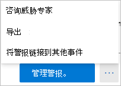

# Defender for Identity security alerts in Microsoft 365 DefenderDefender for Identity security alerts in Microsoft 365 Defender

**适用于：****Applies to:**

- Microsoft 365 DefenderMicrosoft 365 Defender
- Defender for IdentityDefender for Identity

本文介绍了如何在安全中心内使用[Microsoft Defender for Identity](/defender-for-identity)安全警报Microsoft 365[基础知识](/microsoft-365/security/defender/overview-security-center)。This article explains the basics of how to work with [Microsoft Defender for Identity](/defender-for-identity) security alerts in the [Microsoft 365 security center](/microsoft-365/security/defender/overview-security-center).

Defender for Identity 警报已本机集成到具有专用标识[Microsoft 365页面格式](https://security.microsoft.com)的安全中心。Defender for Identity alerts are natively integrated into the [Microsoft 365 security center](https://security.microsoft.com) with a dedicated Identity alert page format. 这标记了将完整的[Microsoft Defender for Identity](/defender-for-identity/defender-for-identity-in-microsoft-365-defender)体验引入到 Microsoft 365 Defender。This marks the first step in the journey to [introduce the full Microsoft Defender for Identity experience into Microsoft 365 Defender](/defender-for-identity/defender-for-identity-in-microsoft-365-defender).

新的标识警报页面为 Microsoft Defender for Identity 客户提供更好的跨域信号扩充和新自动标识响应功能。The new Identity alert page gives Microsoft Defender for Identity customers better cross-domain signal enrichment and new automated identity response capabilities. 它可确保您保持安全，并有助于提高安全操作的效率。It ensures that you stay secure and helps improve the efficiency of your security operations.

通过 Microsoft 365 Defender 调查警报的一个好处是，Microsoft Defender for Identity 警报与从套件中的所有其他产品获取的信息进一步关联。One of the benefits of investigating alerts through [Microsoft 365 Defender](/microsoft-365/security/defender/microsoft-365-defender) is that Microsoft Defender for Identity alerts are further correlated with information obtained from each of the other products in the suite. 这些增强的警报与其他来自 microsoft Defender for Microsoft 365 Defender 和 Microsoft [Defender for](/microsoft-365/security/office-365-security) Endpoint Office 365警报[格式一致](/microsoft-365/security/defender-endpoint)。These enhanced alerts are consistent with the other Microsoft 365 Defender alert formats originating from [Microsoft Defender for Office 365](/microsoft-365/security/office-365-security) and [Microsoft Defender for Endpoint](/microsoft-365/security/defender-endpoint). 新页面实际上无需导航到其他产品门户来调查与标识相关的警报。The new page effectively eliminates the need to navigate to another product portal to investigate alerts associated with identity.

源自 Defender for Identity 的警报现在可以触发 Microsoft 365 Defender 自动调查和响应[ (AIR) ](/microsoft-365/security/defender/m365d-autoir)功能，包括自动修正警报以及缓解可能参与可疑活动的工具和流程。Alerts originating from Defender for Identity can now trigger the [Microsoft 365 Defender automated investigation and response (AIR)](/microsoft-365/security/defender/m365d-autoir) capabilities, including automatically remediating alerts and the mitigation of tools and processes that can contribute to the suspicious activity.

> [!IMPORTANT]
> 作为与用户Microsoft 365 Defender的一部分，一些选项和详细信息从他们在 Defender for Identity 门户中的位置发生了更改。As part of the convergence with Microsoft 365 Defender, some options and details have changed from their location in the Defender for Identity portal. 请阅读下面的详细信息，了解在哪里可以找到熟悉的新功能和新功能。Please read the details below to discover where to find both the familiar and new features.

## 查看安全警报Review security alerts

可以从多个位置访问警报，包括警报页面、事件页面、各个设备的页面以及高级 **搜寻页面。** Alerts can be accessed from multiple locations, including the **Alerts** page, the **Incidents** page, the pages of individual **Devices**, and from the **Advanced hunting** page. 本示例中，我们将查看警报 **页面**。In this example, we'll review the **Alerts page**.

在安全 [Microsoft 365，](https://security.microsoft.com/)转到"事件 **&警报"，** 然后转到"**警报"。**In the [Microsoft 365 security center](https://security.microsoft.com/), go to **Incidents & alerts** and then to **Alerts**.

To see alerts from Defender for Identity， on the top-right select **Filter**， and then under **Service sources** select Microsoft Defender **for Identity，** and select **Apply**：To see alerts from Defender for Identity, on the top-right select **Filter**, and then under **Service sources** select **Microsoft Defender for Identity**, and select **Apply**:

警报将显示，并包含以下列中的信息：**警报** 名称、标签、严重性、调查状态、**状态**、**类别**、检测源、影响 **的资产**、第一个活动和最后 **一个活动**。 The alerts are displayed with information in the following columns: **Alert name**, **Tags**, **Severity**, **Investigation state**, **Status**, **Category**, **Detection source**, **Impacted assets**, **First activity**, and **Last activity**.

## 管理警报Manage alerts

如果单击 **其中一** 个警报的警报名称，你将转到包含警报详细信息的页面。If you click the **Alert name** for one of the alerts, you'll go to the page with details about the alert. 在左窗格中，你将看到"发生了什么 **"的摘要**：In the left pane, you'll see a summary of **What happened**:

"**发生的情况**"框上方是警报的 **"帐户**"、**目标主机\*\*\*\*和源主机** 的按钮。Above the **What happened** box are buttons for the **Accounts**, **Destination Host** and **Source Host** of the alert. 对于其他警报，你可能会看到按钮，了解有关其他主机、帐户、IP 地址、域和安全组的详细信息。For other alerts, you might see buttons for details about additional hosts, accounts, IP addresses, domains, and security groups. 选择其中任何一个，获取有关所涉及的实体的更多详细信息。Select any of them to get more details about the entities involved.

在右侧窗格中，你将看到警报 **详细信息**。On the right pane, you'll see the **Alert details**. 你可以在此处查看更多详细信息并执行多个任务：Here you can see more details and perform several tasks:

- **对此警报进行分类** - 你可以在此处指定此警报为 **True 警报或** **False 警报****Classify this alert** - Here you can designate this alert as a **True alert** or **False alert**

    

- **警报状态**- 在 **"设置分类**"中，可以将警报分类为 **True** 或 **False。****Alert state** - In **Set Classification**, you can classify the alert as **True** or **False**. 在 **"分配到**"中，可以将警报分配给自己，也可以取消分配。In **Assigned to**, you can assign the alert to yourself or unassign it.

    

- 警报详细信息 **-** 在警报详细信息下，可以找到有关特定警报的详细信息，按照有关警报类型的文档链接，查看与警报关联的事件，查看链接到此警报类型的任何自动调查，并查看受到影响的设备和用户。 **Alert details** - Under **Alert details**, you can find more information about the specific alert, follow a link to documentation about the type of alert, see which incident the alert is associated with, review any automated investigations linked to this alert type, and see the impacted devices and users.

    

- **注释&历史记录** - 你可以在此处向警报添加注释，并查看与警报关联的所有操作历史记录。**Comments & history** - Here you can add your comments to the alert, and see the history of all actions associated with the alert.

    

- **管理警报** - 如果选择" **管理警报**"，你将转到将允许你编辑的窗格：**Manage alert** - If you select **Manage alert**, you'll go to a pane that will allow you to edit the:
  - **状态**- 可以选择"新建 **"、"已解决"** 或"**正在进行"。** **Status** - You can choose **New**, **Resolved** or **In progress**.
  - **分类**- 可以选择"真 **警报"或**"**假警报"。****Classification** - You can choose **True alert** or **False alert**.
  - **注释** - 可以添加有关警报的注释。**Comment** - You can add a comment about the alert.

    如果选择"管理警报"旁边的三个点，可以咨询威胁专家、将警报导出到Excel 文件或 **链接到其他事件**。 If you select the three dots next to **Manage alert**, you can **Consult a threat expert**, **Export** the alert to an Excel file, or **Link to another incident**.

    

    > [!NOTE]
    > 在 Excel 文件中，你现在有两个链接可用：在 **Microsoft Defender 中查看标识** 和在 Microsoft 365 Defender 中 **查看**。In the Excel file, you now have two links available: **View in Microsoft Defender for Identity** and **View in Microsoft 365 Defender**. 每个链接将你带到相关门户，并提供有关警报的信息。Each link will bring you to the relevant portal, and provide information about the alert there.

## 另请参阅See also

- [调查警报Microsoft 365 DefenderInvestigate alerts in Microsoft 365 Defender](../defender/investigate-alerts.md)
