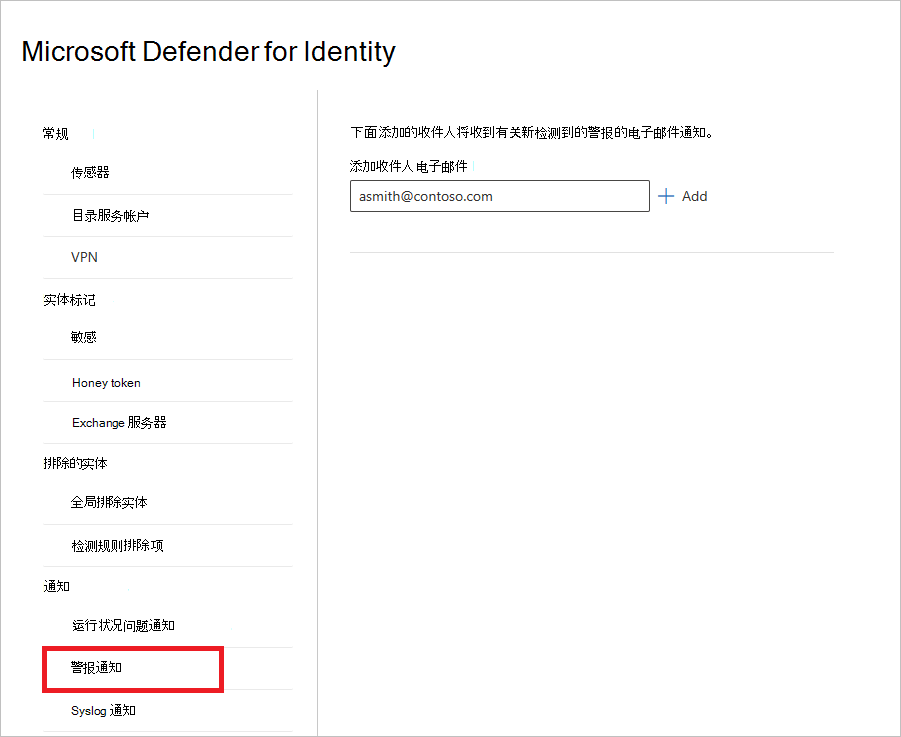
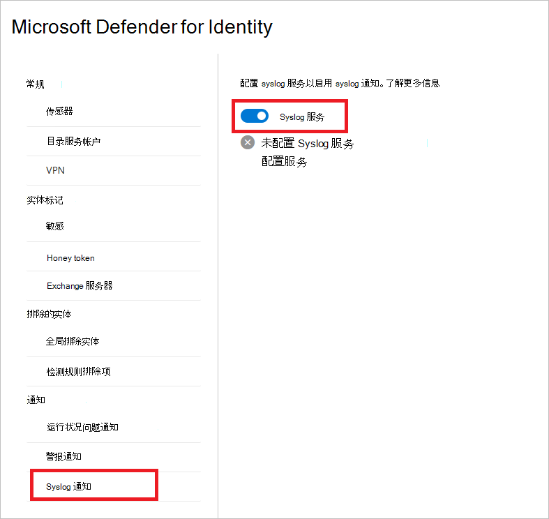

# Defender for Identity notifications in Microsoft 365 Defender

**适用于：**

- Microsoft 365 Defender
- Defender for Identity

本文介绍了如何使用 Microsoft [Defender for Identity 通知在](/defender-for-identity) [Microsoft 365 Defender。](/microsoft-365/security/defender/overview-security-center)

> [!IMPORTANT]
> 作为与用户Microsoft 365 Defender的一部分，一些选项和详细信息从他们在 Defender for Identity 门户中的位置发生了更改。 请阅读下面的详细信息，了解在哪里可以找到熟悉的新功能和新功能。

## 运行状况问题通知

在Microsoft 365 Defender中，可以在 Defender for Identity 中添加运行状况问题的电子邮件通知的收件人。

1. 在 <a href="https://go.microsoft.com/fwlink/p/?linkid=2077139" target="_blank">Microsoft 365 Defender</a>中，转到"**设置**"和"**标识"**。

    

1. 选择 **"运行状况问题通知"**。

1. 输入收件人的电子邮件地址。 选择“**添加**”。

    

1. 当 Defender for Identity 检测到运行状况问题时，收件人将收到包含详细信息的电子邮件通知。

    

    > [!NOTE]
    > 电子邮件提供了两个链接，用于进一步了解有关该问题的详细信息。 你可以转到 **MDI 运行状况中心或** **M365D 中的新运行状况中心**。

## 警报通知

在Microsoft 365 Defender中，您可以为检测到的警报的电子邮件通知添加收件人。

1. 在 <a href="https://go.microsoft.com/fwlink/p/?linkid=2077139" target="_blank">Microsoft 365 Defender</a>中，转到"**设置**"和"**标识"**。

    

1. 选择 **警报通知**。

1. 输入收件人的电子邮件地址。 选择“**添加**”。

    

## Syslog 通知

Defender for Identity 可通过指定传感器向 Syslog 服务器发送安全和运行状况警报，以在检测到可疑活动时通知你。

> [!NOTE]
> 若要了解如何将 Defender for Identity 与 Microsoft Sentinel 集成，请参阅Microsoft 365 Defender [Microsoft Sentinel 集成](/azure/sentinel/microsoft-365-defender-sentinel-integration)。

1. 在 <a href="https://go.microsoft.com/fwlink/p/?linkid=2077139" target="_blank">Microsoft 365 Defender</a>中，转到"**设置**"和"**标识"**。

    

1. 选择 **"Syslog 通知"**。

1. 若要启用 syslog 通知，将 **Syslog 服务** 开关设置为 **打开** 位置。

    

1. 选择 **"配置服务"**。 将打开一个窗格，您可以在其中输入 syslog 服务的详细信息。

    

1. 输入以下详细信息：

    - **传感器** - 从下拉列表中选择将发送警报的传感器。
    - **服务终结点** 和 **端口** - 输入 syslog 服务器的 IP 地址或完全限定 (FQDN) 并指定端口号。 只能配置一个 Syslog 终结点。
    - **Transport** - 选择 **TCP** 或 UDP (传输) 。
    - **Format** - 选择 RFC 3164 (RFC 5424 格式) 。

1. 选择 **"发送测试 SIEM 通知** "，然后验证消息是否在你的 Syslog 基础结构解决方案中收到。

1. 选择“**保存**”。

1. 配置 Syslog 服务后，可以选择向 **Syslog** 服务器发送 (警报或) 运行状况问题。

    

## 另请参阅

- [管理 Defender for Identity 安全警报](manage-security-alerts.md)
