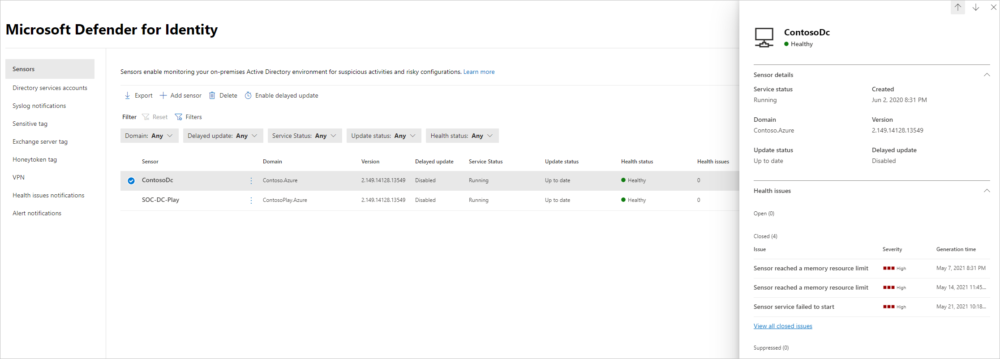

# Microsoft Defender for Identity 传感器运行状况和Microsoft 365 Defender

**适用于：**

- Microsoft 365 Defender
- Defender for Identity

本文介绍如何配置和监视 [Microsoft Defender for Identity](/defender-for-identity) 传感器，[Microsoft 365 Defender。](/microsoft-365/security/defender/overview-security-center)

>[!IMPORTANT]
>作为与用户Microsoft 365 Defender的一部分，一些选项和详细信息从他们在 Defender for Identity 门户中的位置发生了更改。 请阅读下面的详细信息，了解在哪里可以找到熟悉的新功能和新功能。

## 查看 Defender for Identity 传感器设置和状态

1. 在 <a href="https://go.microsoft.com/fwlink/p/?linkid=2077139" target="_blank">Microsoft 365 Defender</a>中，转到"**设置**"和"**标识"**。

    

1. 选择 **"传感器"** 页，其中显示所有 Defender for Identity 传感器。 对于每个传感器，你将看到其名称、域成员身份、版本号、如果更新应延迟、服务状态、更新状态、运行状况状态、运行状况问题数以及创建传感器的时间。

    

    >[!NOTE]
    >在 Defender for Identity 门户中，传感器设置和运行状况信息位于单独的位置。 请注意，Microsoft 365 Defender它们现在在同一页面上。

1. 如果选择" **筛选器"**，可以选择哪些筛选器可用。 然后，对于每个筛选器，你可以选择要显示的传感器。

    

    

1. 如果选择其中一个传感器，将显示一个窗格，其中显示有关该传感器及其运行状况状态的信息。

    

1. 如果您选择任何运行状况问题，您将获得一个包含有关这些问题的更多详细信息的窗格。 如果您选择已关闭的问题，可以从此处重新打开它。

    

1. 如果选择" **管理传感器"**，将打开一个窗格，您可以在其中配置传感器详细信息。

    

    

1. 在 **"传感器"** 页中，可以通过选择"导出"将传感器列表导出.csv **文件。**

    

## 添加传感器

在 **"传感器"** 页面中，可以添加新的传感器。

1. 选择 **"添加传感器"**。

    

1. 将打开一个窗格，为您提供下载传感器安装程序的按钮和生成的访问密钥。

    

1. 选择 **"下载** 安装程序"以本地保存程序包。 zip 文件包括以下文件：

    - Defender for Identity 传感器安装程序

    - 包含连接到 Defender for Identity 云服务所需信息的配置设置文件

1. 复制 **Access 键**。 Defender for Identity 传感器需要访问密钥才能连接到 Defender for Identity 实例。 访问密钥是一个一次密码，用于传感器部署，之后所有通信都使用证书进行身份验证和 TLS 加密执行。 如果需要 **重新生成新的访问键** ，请使用"重新生成密钥"按钮。 它不会影响以前部署的任何传感器，因为它仅用于传感器的初始注册。

1. 将程序包复制到要安装 Defender for Identity 传感器的专用服务器或域控制器。

## 另请参阅

- [管理 Defender for Identity 安全警报](manage-security-alerts.md)
