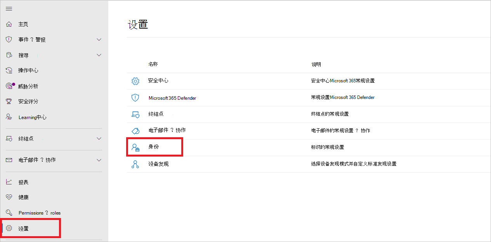
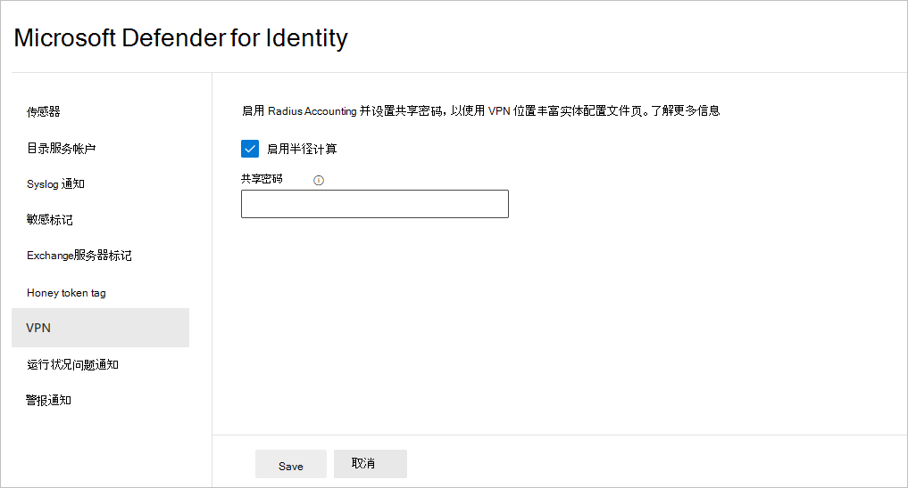

# Defender for Identity VPN integration in Microsoft 365 Defender

**适用于：**

- Microsoft 365 Defender
- Defender for Identity

本文介绍如何将 VPN 与 [Microsoft Defender for Identity](/defender-for-identity) 集成在 [Microsoft 365 Defender](/microsoft-365/security/defender/overview-security-center)。

>[!IMPORTANT]
>作为与<a href="https://go.microsoft.com/fwlink/p/?linkid=2077139" target="_blank">用户Microsoft 365 Defender的</a>一部分，一些选项和详细信息从他们在 Defender for Identity 门户中的位置发生了更改。 请阅读下面的详细信息，了解在哪里可以找到熟悉的新功能和新功能。

[!INCLUDE [Product long](includes/product-long.md)] 可以从 VPN 解决方案收集会计信息。 配置后，用户的配置文件页将包含来自 VPN 连接的信息，例如 IP 地址和建立连接的位置。 这通过提供有关用户活动的其他信息以及异常 VPN 连接的新检测来补充调查过程。 将外部 IP 地址解析为位置的调用是匿名的。 此调用中不会发送任何个人标识符。

[!INCLUDE [Product short](includes/product-short.md)] 通过侦听转发到传感器的 RADIUS 会计事件，与 VPN [!INCLUDE [Product short](includes/product-short.md)] 解决方案集成。 此机制基于 [RFC 2866 (标准](https://tools.ietf.org/html/rfc2866) RADIUS Accounting) ，并且支持以下 VPN 供应商：

- Microsoft
- F5
- 检查点
- Cisco ASA

## 必备条件

若要启用 VPN 集成，请确保设置以下参数：

- 打开传感器和/[!INCLUDE [Product short](includes/product-short.md)]或独立[!INCLUDE [Product short](includes/product-short.md)]传感器上的 UDP 1813 端口。

> [!NOTE]
>
> - 通过启用 **Radius Accounting**[!INCLUDE [Product short](includes/product-short.md)]**[!INCLUDE [Product long](includes/product-long.md)]**，传感器将启用名为 Sensor 的预预配Windows防火墙策略，以允许端口 UDP 1813 上的传入 RADIUS Accounting。
> - 在符合 FIPS 协议和联邦信息处理标准 (不支持 VPN) 

以下示例使用 Microsoft 路由和远程访问服务器 (RRAS) 描述 VPN 配置过程。

如果你使用的是第三方 VPN 解决方案，请参阅他们的文档，了解如何启用 RADIUS Accounting。

## 在 VPN 系统上配置 RADIUS 会计

在 RRAS 服务器上执行以下步骤。

1. 打开 **路由和远程访问** 控制台。
1. 右键单击服务器名称，然后选择"属性 **"**。
1. 在" **安全"选项卡** 的" **会计提供程序"下**，选择 **"RADIUS Accounting** "，然后选择" **配置"**。

    

1. 在"**添加 RADIUS 服务器**  [!INCLUDE [Product short](includes/product-short.md)]"窗口中，键入具有网络连接的最近传感器 (的服务器) 。 若要获得高可用性，可以将其他 [!INCLUDE [Product short](includes/product-short.md)] 传感器添加为 RADIUS 服务器。 在 **"** 端口"下，确保已配置默认值 1813。 选择 **"更改** "，然后键入包含字母数字字符的新共享密码字符串。 记下新的共享密码字符串，因为稍后需要在配置过程中填写 [!INCLUDE [Product short](includes/product-short.md)] 它。 选中"**发送 RADIUS 帐户开"和"记帐关闭消息**"框，在所有打开的对话框中选择"确定"。

    

## 在 Defender 中为标识配置 VPN

[!INCLUDE [Product short](includes/product-short.md)] 收集 VPN 数据，这些数据有助于配置文件计算机连接到网络的位置，并能够检测可疑的 VPN 连接。

若要在 中配置 [!INCLUDE [Product short](includes/product-short.md)] VPN 数据Microsoft 365 Defender：

1. 在 <a href="https://go.microsoft.com/fwlink/p/?linkid=2077139" target="_blank">Microsoft 365 Defender</a>中，转到"**设置**"和"**标识"**。

    

1. 选择 **VPN**。
1. 选择 **"启用半径计算**" **，然后键入** 之前在 RRAS VPN 服务器上配置的共享密码。 然后选择“**保存**”。

    

启用此功能后，所有 Defender for Identity 传感器将在端口 1813 上侦听 RADIUS 记帐事件，并且 VPN 设置已完成。

Defender for Identity 传感器收到 VPN 事件并将其发送到 Defender for Identity 云服务进行处理后，实体配置文件将指示不同的已访问 VPN 位置，配置文件中的活动将指示位置。

## 另请参阅

- [在 Microsoft 365 Defender 中调查警报](../defender/investigate-alerts.md)
