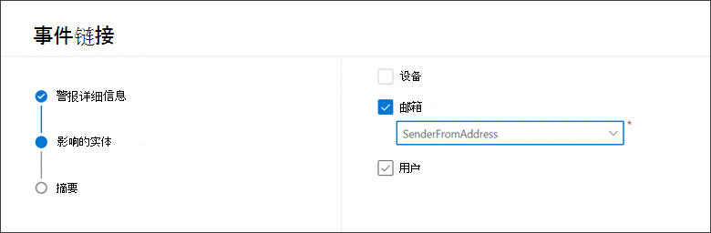

# 将查询结果链接到事件

[!INCLUDE [Microsoft 365 Defender rebranding](../includes/microsoft-defender.md)]

**适用于：**
- Microsoft 365 Defender
- Microsoft Defender for Endpoint

通过指向事件功能的链接，你可以将高级搜寻查询结果添加到调查中的新事件或现有事件。 此功能可帮助你轻松地从高级搜寻活动中捕获记录，以便你可以创建更丰富的时间线或事件上下文，以与事件相关。 

## 将结果链接到新事件或现有事件

1. 在高级搜寻查询页面中，首先在提供的查询字段中输入查询，然后选择" **运行查询** "获取结果。

    
2. 在"结果"页中，选择与正在处理的新调查或当前调查相关的事件或记录，然后选择"链接到事件 **"。**

    
3. 在"**链接到** 事件"窗格中找到"警报详细信息"部分，然后选择"创建新事件"以将事件转换为警报，并将其分组为新事件：

 
       
    
    或者， **选择"链接到现有事件** "，将所选记录添加到现有记录。 从现有事件的下拉列表中选择相关事件。 还可以输入事件名称或 ID 的前几个字符以查找现有事件。 

    
4. 对于任一选择，请提供以下详细信息，然后选择"下一 **步"：**
      - **警报标题** - 提供事件响应者可以理解的结果的描述性标题。 这将成为警报标题。
      - **严重性** - 选择适用于警报组的严重性。
      - **类别** - 为警报选择合适的威胁类别。
      - **说明** - 为分组警报提供有用的说明。
      - **建议的操作** - 提供修正操作。

5. 在" **受影响实体"** 部分，选择主要受影响或受影响的实体。 本节中仅显示基于查询结果的适用实体。 在我们的示例中，我们使用了查询来查找与可能的电子邮件过滤事件相关的事件，因此发件人是受到影响的实体。 例如，如果有四个不同的发件人，则创建四个警报，并链接到所选事件。 
        
6. 选择 **下一步**。
7. 查看"摘要"部分 **提供的详细信息** 。
      
8. 选择“**完成**”。

## 查看事件中的链接记录

您可以选择事件名称以查看事件链接到的事件。
      

在我们的示例中，表示四个选定事件的四个警报已成功链接到新事件。 

在每个警报页面中，您可以在日程表视图或事件（如果可用）中查找 (和查询结果) 事件的完整信息。
      

您还可以选择该事件以打开"检查 **记录"** 窗格。
 

## 筛选使用高级搜寻添加的事件
通过按手动检测源筛选事件队列和警报队列，可以查看从高级搜寻 **生成的** 警报。

 