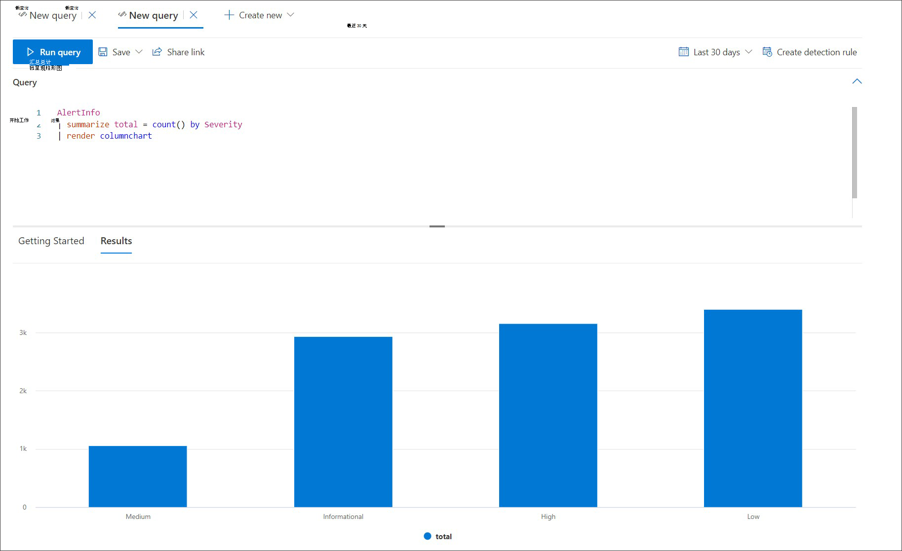
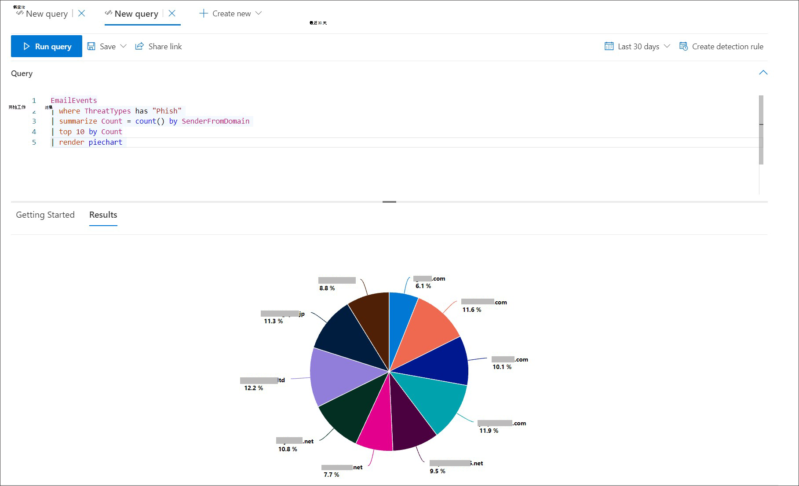
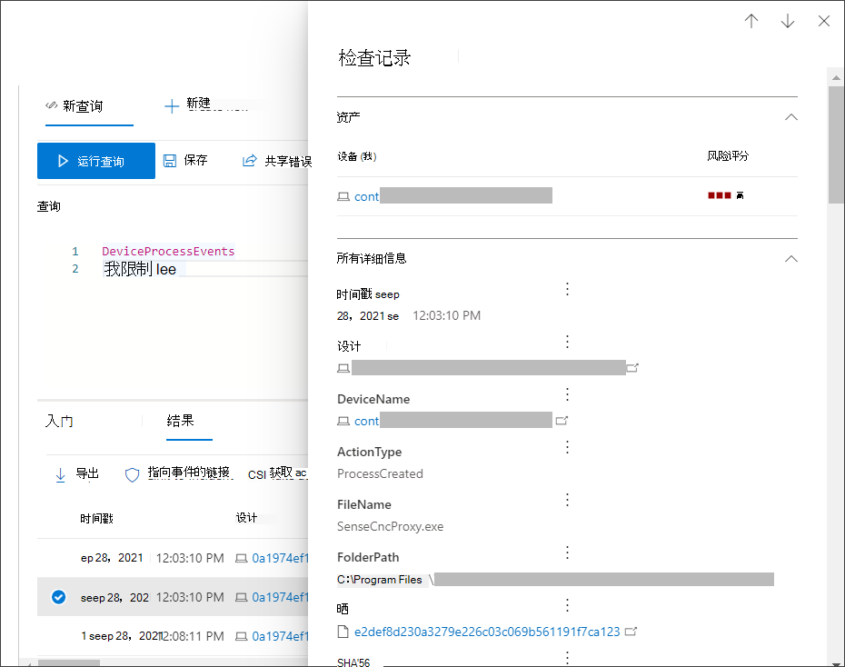
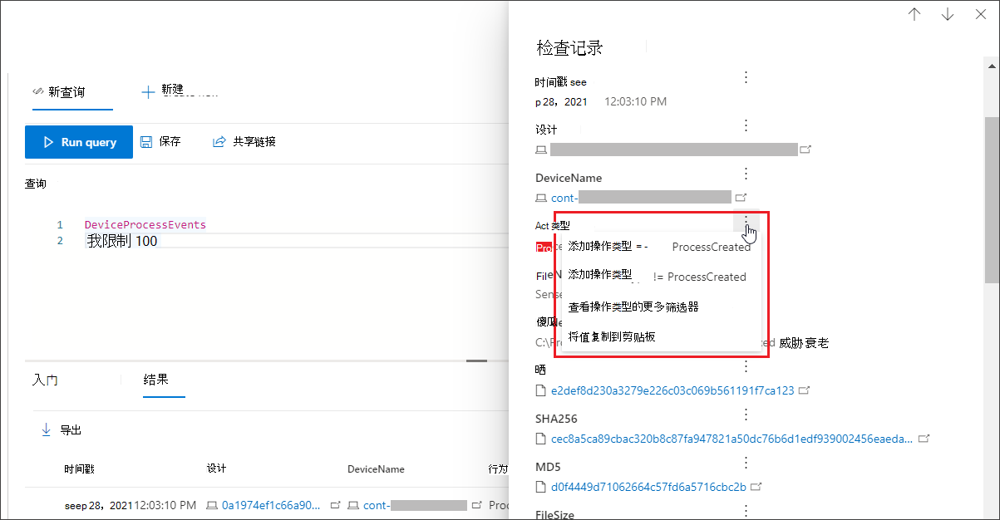

# <a name="work-with-advanced-hunting-query-results"></a>使用高级搜寻查询结果

[!INCLUDE [Microsoft 365 Defender rebranding](../includes/microsoft-defender.md)]


**适用于：**
- Microsoft 365 Defender
- Microsoft Defender for Endpoint

[!INCLUDE [Prerelease information](../includes/prerelease.md)]

虽然你可以构造 [高级](advanced-hunting-overview.md) 搜寻查询以返回非常精确的信息，但您也可以使用查询结果来进一步获得见解并调查特定活动和指示器。 您可以对查询结果执行以下操作：

- 以表格或图表查看结果
- 导出表格和图表
- 向下钻取到详细的实体信息
- 直接从结果调整查询或应用筛选器

## <a name="view-query-results-as-a-table-or-chart"></a>以表或图表查看查询结果
默认情况下，高级搜寻将查询结果显示为表格数据。 还可以显示与图表相同的数据。 高级搜寻支持以下视图：

| 视图类型 | 说明 |
| -- | -- |
| **Table** | 以表格格式显示查询结果 |
| **柱形图** | 将 x 轴上的一系列唯一项呈现为垂直条，其高度代表另一个字段的数值 |
| **堆积柱形图** | 将 x 轴上的一系列唯一项呈现为堆积竖线，其高度代表来自一个或多个其他字段的数字值 |
| **饼图** | 呈现表示唯一项的节饼图。 每个饼图的大小表示来自另一个字段的数值。 |
| **Donut 图表** | 呈现表示唯一项的圆弧。 每个弧的长度表示来自另一个字段的数值。 |
| **折线图** | 绘制一系列唯一项的数值并连接绘制的值 |
| **散点图** | 绘制一系列唯一项的数值 |
| **面积图** | 绘制一系列唯一项的数值并填充绘制值下方的各部分 |

### <a name="construct-queries-for-effective-charts"></a>构造有效图表的查询
呈现图表时，高级搜寻会自动标识感兴趣的列和要聚合的数字值。 若要获取有意义的图表，请构造查询以返回您希望可视化的特定值。 下面是一些示例查询和生成的图表。

#### <a name="alerts-by-severity"></a>按严重性表示的警报
使用 `summarize` 运算符可获取要绘制图表的值的数值计数。 下面的查询使用 `summarize` 运算符按严重性获取警报数。

```kusto
AlertInfo
| summarize Total = count() by Severity
```
呈现结果时，柱形图将每个严重性值显示为单独的列：


*按严重性显示为柱形图的警报查询结果*


#### <a name="phishing-emails-across-top-ten-sender-domains"></a>十大发件人域中的网络钓鱼电子邮件
如果处理的值列表并不有限，可以使用 运算符仅绘制具有最多实例 `Top` 的值的图表。 例如，若要获取钓鱼电子邮件最多的前十个发件人域，请使用以下查询：

```kusto
EmailEvents
| where ThreatTypes has "Phish" 
| summarize Count = count() by SenderFromDomain 
| top 10 by Count
```
使用饼图视图可有效显示顶部域的分布：


*显示钓鱼电子邮件在顶部发件人域分布的饼图*

#### <a name="file-activities-over-time"></a>一段时间的文件活动
将 `summarize` 运算符与 `bin()` 函数一同使用，可以检查一段时间内是否涉及特定指示器的事件。 下面的查询以 30 分钟的间隔对涉及文件的事件进行计数，以显示与该文件 `invoice.doc` 相关的活动峰值：

```kusto
CloudAppEvents
| union DeviceFileEvents
| where FileName == "invoice.doc"
| summarize FileCount = count() by bin(Timestamp, 30m)
```
下面的图表清楚地突出显示了具有更多活动涉及的时间段 `invoice.doc` ： 


*显示一段时间内涉及文件的事件数的图表*


## <a name="export-tables-and-charts"></a>导出表格和图表
运行查询后，选择 **"导出** "将结果保存到本地文件。 所选视图确定结果的导出方式：

- **表视图**— 查询结果以表格形式导出为Microsoft Excel工作簿
- **任何图表** — 查询结果导出为已呈现图表的 JPEG 图像

## <a name="drill-down-from-query-results"></a>从查询结果向下钻取
若要快速检查查询结果中的记录，请选择相应的行以打开" **检查记录"** 面板。 面板根据所选记录提供以下信息：

- **资产** — 记录中 (、设备和用户的主要资产汇总) 丰富的可用信息，如风险和曝光级别
- **所有详细信息** - 记录中列的所有值  



若要查看有关查询结果中的特定实体（如计算机、文件、用户、IP 地址或 URL）的详细信息，请选择实体标识符以打开该实体的详细配置文件页。

## <a name="tweak-your-queries-from-the-results"></a>调整结果中的查询
选择"检查记录"面板中任意列右边的 **三** 个点。 可以使用这些选项执行以下操作：

- 显式查找选定值 (`==`)
- 从查询中排除选定值 (`!=`)
- 获取用于将值添加到查询的更高级运算符，如 `contains`、`starts with` 和 `ends with` 




>[!NOTE]
>本文中的某些表在 Microsoft Defender for Endpoint 中可能不可用。 [打开"Microsoft 365 Defender"](m365d-enable.md)以使用更多数据源搜寻威胁。 你可以按照从 Microsoft Defender for Endpoint 迁移高级搜寻查询中的步骤将高级搜寻工作流从 Microsoft Defender for Endpoint 移动到[Microsoft 365 Defender。](advanced-hunting-migrate-from-mde.md)

## <a name="related-topics"></a>相关主题
- [高级搜寻概述](advanced-hunting-overview.md)
- [了解查询语言](advanced-hunting-query-language.md)
- [使用共享查询](advanced-hunting-shared-queries.md)
- [跨设备、电子邮件、应用和标识进行查寻](advanced-hunting-query-emails-devices.md)
- [了解架构](advanced-hunting-schema-tables.md)
- [应用查询最佳做法](advanced-hunting-best-practices.md)
- [自定义检测概述](custom-detections-overview.md)
