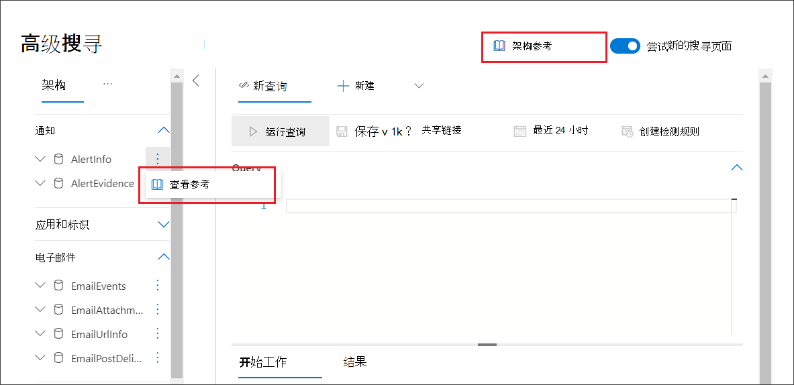

# 了解高级搜寻架构

[!INCLUDE [Microsoft 365 Defender rebranding](../includes/microsoft-defender.md)]

**适用于：**
- Microsoft 365 Defender

[!INCLUDE [Prerelease information](../includes/prerelease.md)]

高级 [搜寻](advanced-hunting-overview.md) 架构由多个表决定，这些表提供事件信息或有关设备、警报、标识和其他实体类型的信息。 若要高效构建跨多个表的查询，需要了解高级搜寻架构中的表和列。

## 在安全中心获取架构信息
构造查询时，请使用内置架构参考快速获取有关架构中每个表的以下信息：

- **表** 说明 表中包含的数据类型以及该数据的来源。
- **列**- 表中的所有列。
- **操作** 类型 - 列中可能 `ActionType` 的值，表示表支持的事件类型。 该信息仅提供给包含事件信息的表。
- **示例** 查询 - 具有表利用方式的示例查询。

### 访问架构引用
若要快速访问架构引用，请选择架构表示中表名称旁边的"查看引用"操作。 还可以选择" **架构引用** "来搜索表。

## 了解架构表
以下引用列出了架构中的所有表。 每个表名称链接到描述该表的列名称的页面。 表和列名称还将在安全中心列出，作为高级搜寻屏幕上的架构表示的一部分。

| 表名 | 说明 |
|------------|-------------|
| **[AlertEvidence](advanced-hunting-alertevidence-table.md)** | 与警报关联的文件、IP 地址、URL、用户或设备 |
| **[AlertInfo](advanced-hunting-alertinfo-table.md)** | 来自 Microsoft Defender for Endpoint、Microsoft Defender for Office 365、Microsoft Cloud App Security 和 Microsoft Defender for Identity 的警报，包括严重性信息和威胁分类  |
| **[CloudAppEvents](advanced-hunting-cloudappevents-table.md)** | 涉及 Office 365 和其他云应用和服务中的帐户和对象的事件 |
| **[DeviceEvents](advanced-hunting-deviceevents-table.md)** | 多个事件类型，包括安全控件 (如 Windows Defender 防病毒和 Exploit Protection) 触发的事件 |
| **[DeviceFileCertificateInfo](advanced-hunting-DeviceFileCertificateInfo-table.md)** | 从终结点上的证书验证事件获取的已签名文件的证书信息 |
| **[DeviceFileEvents](advanced-hunting-devicefileevents-table.md)** | 文件创建、修改和其他文件系统事件 |
| **[DeviceImageLoadEvents](advanced-hunting-deviceimageloadevents-table.md)** | DLL 加载事件 |
| **[DeviceInfo](advanced-hunting-deviceinfo-table.md)** | 计算机信息，包括操作系统信息 |
| **[DeviceLogonEvents](advanced-hunting-devicelogonevents-table.md)** | 设备上的登录和其他身份验证事件 |
| **[DeviceNetworkEvents](advanced-hunting-devicenetworkevents-table.md)** | 网络连接和相关事件 |
| **[DeviceNetworkInfo](advanced-hunting-devicenetworkinfo-table.md)** | 设备的网络属性，包括物理适配器、IP 和 MAC 地址，以及已连接的网络和域 |
| **[DeviceProcessEvents](advanced-hunting-deviceprocessevents-table.md)** | 过程创建和相关事件 |
| **[DeviceRegistryEvents](advanced-hunting-deviceregistryevents-table.md)** | 创建和修改注册表项 |
| **[DeviceTvmSecureConfigurationAssessment](advanced-hunting-devicetvmsecureconfigurationassessment-table.md)** | 威胁和漏洞管理评估事件，指示设备上的各种安全配置的状态 |
| **[DeviceTvmSecureConfigurationAssessmentKB](advanced-hunting-devicetvmsecureconfigurationassessmentkb-table.md)** | 威胁和漏洞管理用于评估设备的各种安全配置的知识库；包括各种标准和基准的映射  |
| **[DeviceTvmSoftwareInventory](advanced-hunting-devicetvmsoftwareinventory-table.md)** | 设备上安装的软件清单，包括其版本信息和终止支持状态 |
| **[DeviceTvmSoftwareVulnerabilities](advanced-hunting-devicetvmsoftwarevulnerabilities-table.md)** | 在设备上找到的软件漏洞以及解决每个漏洞的可用安全更新列表 |
| **[DeviceTvmSoftwareVulnerabilitiesKB](advanced-hunting-devicetvmsoftwarevulnerabilitieskb-table.md)** | 公开披露的漏洞的知识库，包括攻击代码是否已公开 |
| **[EmailAttachmentInfo](advanced-hunting-emailattachmentinfo-table.md)** | 有关电子邮件所附文件的信息 |
| **[EmailEvents](advanced-hunting-emailevents-table.md)** | Microsoft 365 电子邮件事件，包括电子邮件送达和阻止事件 |
| **[EmailPostDeliveryEvents](advanced-hunting-emailpostdeliveryevents-table.md)** | 在传递后所发生的安全事件，即在 Microsoft 365 将电子邮件传递给收件人邮箱后所发生的安全事件 |
| **[EmailUrlInfo](advanced-hunting-emailurlinfo-table.md)** | 有关电子邮件上 URL 的信息 |
| **[IdentityDirectoryEvents](advanced-hunting-identitydirectoryevents-table.md)** | 涉及运行 Active Directory (AD) 的本地域控制器事件。 该表包含一系列身份相关的事件以及域控制器上的系统事件。 |
| **[IdentityInfo](advanced-hunting-identityinfo-table.md)** | 来自不同来源的账户信息，包括 Azure Active Directory |
| **[IdentityLogonEvents](advanced-hunting-identitylogonevents-table.md)** | Active Directory 和 Microsoft 联机服务上的身份验证事件 |
| **[IdentityQueryEvents](advanced-hunting-identityqueryevents-table.md)** | Active Directory 对象的查询，例如用户、组、设备和域 |

## 相关主题
- [高级搜寻概述](advanced-hunting-overview.md)
- [了解查询语言](advanced-hunting-query-language.md)
- [处理查询结果](advanced-hunting-query-results.md)
- [使用共享查询](advanced-hunting-shared-queries.md)
- [跨设备、电子邮件、应用和标识进行查寻](advanced-hunting-query-emails-devices.md)
- [应用查询最佳做法](advanced-hunting-best-practices.md)
