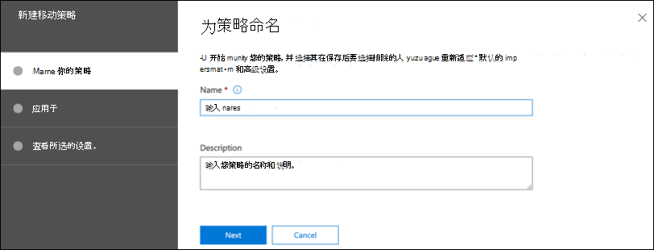
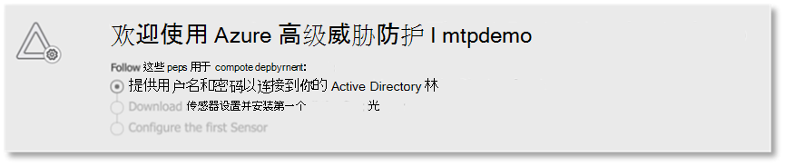
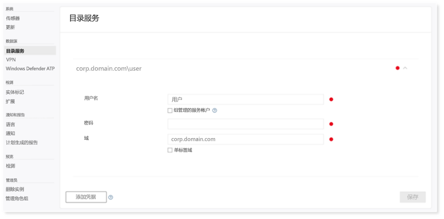
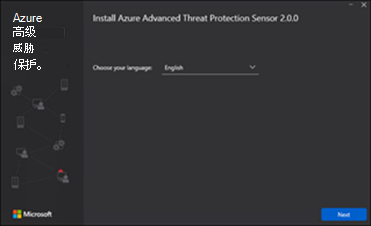
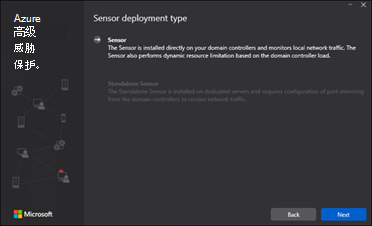
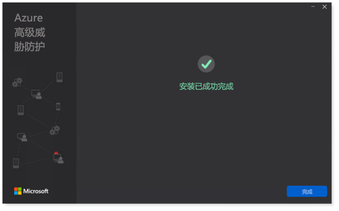
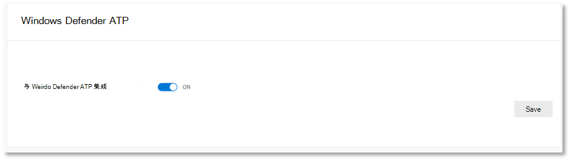
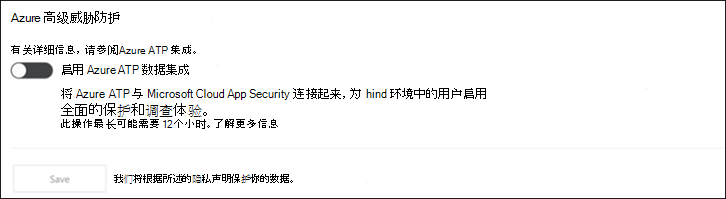
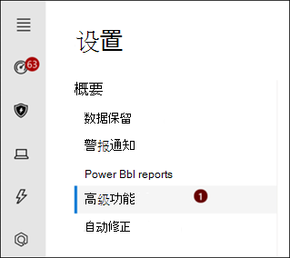
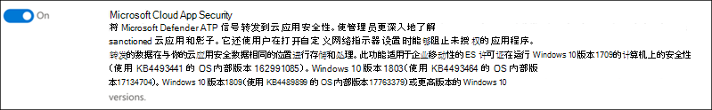

# 为Microsoft 365实验室或试验环境配置 Defender 支柱

[!INCLUDE [Microsoft 365 Defender rebranding](../includes/microsoft-defender.md)]

**适用于：**
- Microsoft 365 Defender

创建 Microsoft 365 Defender 试用实验室或试验环境并部署它的过程分三个阶段：

| [阶段 1：准备](prepare-m365d-eval.md) | [阶段 2：设置](setup-m365deval.md) | 阶段 3：开始使用 |  [返回到试点手册](m365d-pilot.md) |
|--|--|--|--|
|| |*你在这里！* | |

你当前处于配置阶段。

准备工作是任何成功部署的关键。 本文将指导你在准备部署适用于终结点的 Microsoft Defender 时需要考虑的要点。

## Microsoft 365Defender 支柱
Microsoft 365Defender 由四个支柱组成。 尽管一个支柱已经可为网络组织的安全性提供价值，但启用这四个Microsoft 365 Defender 支柱将为你的组织提供最大价值。

本部分将指导你配置：
-   Microsoft Defender for Office 365
-   Microsoft Defender for Identity 
-   Microsoft Cloud App Security
-   Microsoft Defender for Endpoint

## 配置 Microsoft Defender for Office 365

>[!NOTE]
>如果你已启用 Defender for Office 365。 

有一个 PowerShell 模块，名为 Office 365 高级威胁防护建议配置分析器 *(ORCA) ，* 可帮助确定其中一些设置。 在租户中以管理员角色运行时，get-ORCAReport 将有助于生成对反垃圾邮件、防钓鱼和其他邮件安全设置的评估。 可以从 下载此模块 https://www.powershellgallery.com/packages/ORCA/ 。 

1. 导航到 [Office 365安全&中心](https://protection.office.com/homepage)  >  **威胁管理**  >  **策略"**。

   
 
2. 单击 **"防钓鱼"，** 选择" **创建** "并填写策略名称和说明。 点击 **“下一步”**。

   

   > [!NOTE]
   > 在 Microsoft Defender 中编辑高级防钓鱼策略Office 365。 将 **高级网络钓鱼阈值更改为** **2 - 攻击性**。

3. 单击" **添加条件** &quot;下拉菜单，然后选择您的域 (") "收件人域"。 点击 **“下一步”**。

   
 
4. 查看设置。 单击 **"创建此策略** "以确认。 

   
 
5. 选择 **保险箱附件**"，然后选择"打开 **ATP for SharePoint、OneDrive 和 Microsoft Teams"** 选项。

   

6. 单击 + 图标以创建新的安全附件策略，以作为收件人域应用到你的域。 单击“保存”。

   
 
7. 接下来，选择 **"保险箱"** 策略，然后单击铅笔图标以编辑默认策略。

8. 确保未选中" **不跟踪用户** 单击安全链接时"选项，同时选择其余选项。 有关详细信息[保险箱链接](/microsoft-365/security/office-365-security/recommended-settings-for-eop-and-office365)设置。 单击“保存”。 

   

9. 接下来， **选择"反恶意软件"** 策略，选择默认值，然后选择铅笔图标。

10. 单击 **设置** 选择 **是，然后使用默认通知文本** 启用 **恶意软件检测响应**。 打开 **"常见附件类型筛选器** "。 单击“保存”。

    
  
11. 导航到 [Office 365安全&](https://protection.office.com/homepage)  >  **中心搜索**  >  **审核日志搜索** 并启用审核。

    

12. 将 Microsoft Defender for Office 365与 Microsoft Defender for Endpoint 集成。 导航到 [Office 365安全&中心](https://protection.office.com/homepage)威胁管理资源管理器"，然后选择屏幕右上角设置适用于终结点的  >    >  **Microsoft Defender。** 在 Defender for Endpoint 连接对话框中，连接 **Microsoft Defender for Endpoint。**

    

## 为标识配置 Microsoft Defender

>[!NOTE]
>如果已启用 Microsoft Defender 标识，则跳过此步骤

1. 导航到Microsoft 365 [安全>](https://security.microsoft.com/info)**选择更多** Microsoft  >  **Defender 标识资源**。

   

2. 单击 **创建** 以启动 Microsoft Defender 标识向导。 

   

3. 选择 **"提供用户名和密码"以连接到 Active Directory 林**。  

   

4. 输入 Active Directory 本地凭据。 这可以是对 Active Directory 具有读取权限的任何用户帐户。

   

5. 接下来，选择 **"下载传感器设置** "，将文件传输至域控制器。

   

6. 执行 Microsoft Defender for Identity 传感器设置并开始遵循向导。

   
 
7. 在 **传感器** 部署类型上单击"下一步"。

   
 
8. 复制访问键，因为你需要在向导中下一步输入它。

   
 
9. 将访问键复制到向导中，**然后单击安装。** 

   

10. 恭喜！已成功在域控制器上配置 Microsoft Defender 的 Identity。

    
 
11. 在 ["Microsoft Defender 标识设置](https://go.microsoft.com/fwlink/?linkid=2040449) "部分下，选择**Microsoft Defender for Endpoint **，然后打开切换。 单击“保存”。 

    

## 配置Microsoft Cloud App Security

> [!NOTE]
> 如果已启用此功能，请跳过Microsoft Cloud App Security。 

1. 导航到 [Microsoft 365安全中心](https://security.microsoft.com/info)  >  **更多**  >  **资源Microsoft Cloud App Security。**

   

2. 在集成 Microsoft Defender 标识的信息提示符下，选择 **启用 Microsoft Defender 的标识数据集成**。
  
   

   > [!NOTE]
   > 如果看不到此提示，这可能意味着 Microsoft Defender for Identity 数据集成已启用。 但是，如果您不确定，请与 IT 管理员联系以确认。 

3. 转到 **"设置"，** 打开 Microsoft **Defender for Identity 集成** 切换，然后单击"保存 **"。** 

   
   
   > [!NOTE]
   > 对于新的 Microsoft Defender for Identity 实例，此集成切换将自动打开。 在继续执行下一步之前，请确认 Microsoft Defender for Identity 集成已启用。
 
4. 在云发现设置下，选择 **Microsoft Defender 进行终结点集成**，然后启用集成。 单击“保存”。

   

5. 在"云发现设置"**下，** 选择"用户扩充"，然后启用与Azure Active Directory。

   

## 配置 Microsoft Defender for Endpoint

>[!NOTE]
>如果你已启用适用于终结点的 Microsoft Defender，请跳过此步骤。

1. 导航到 [Microsoft 365安全中心](https://security.microsoft.com/info)  >  **"更多**  >  **Microsoft Defender 安全中心"。** 单击“打开”。

   
 
2. 按照 Microsoft Defender for Endpoint 向导操作。 点击 **“下一步”**。 

   

3. 根据首选数据存储位置、数据保留策略、组织规模和选择加入预览功能进行选择。

   
   
   > [!NOTE]
   > 之后，你无法更改某些设置，如数据存储位置。 

   点击 **“下一步”**。 

4. 单击 **"继续** "，它将预配适用于终结点租户的 Microsoft Defender。

   

5. 通过组策略、Microsoft Endpoint Manager或运行 Microsoft Defender for Endpoint 的本地脚本载入终结点。 为简单起见，本指南使用本地脚本。

6. 单击 **下载程序包** ，将载入脚本复制到你的 (程序包) 。

   

7. 在终结点上，以管理员角色运行载入脚本并选择"Y"。 

   

8. 恭喜，你已载入你的第一个终结点。

   

9. 从 Microsoft Defender for Endpoint 向导复制粘贴检测测试。

   

10. 将 PowerShell 脚本复制到提升的命令提示符并运行它。 

    

11. 从 **向导中选择开始使用 Microsoft Defender for Endpoint。**

    
 
12. 请访问[Microsoft Defender 安全中心](https://securitycenter.windows.com/)。 转到 **"设置"，** 然后选择"**高级功能"。** 

    

13. 打开与 Microsoft **Defender 的 Identity 集成**。  

    

14. 打开与威胁Office 365 **集成**。

    

15. 打开与 Microsoft Cloud App Security **集成**。

    

16. 向下滚动并单击 **"保存首选项** "以确认新的集成。

    

## 启动 Microsoft 365 Defender 服务

>[!NOTE]
>从 2020 年 6 月 1 开始，Microsoft 会自动Microsoft 365符合条件的租户启用 Defender 功能。 有关详细信息，[请参阅Community许可证资格的](https://techcommunity.microsoft.com/t5/security-privacy-and-compliance/microsoft-threat-protection-will-automatically-turn-on-for/ba-p/1345426)Microsoft 技术文章。 

转到["Microsoft 365安全中心"。](https://security.microsoft.com/homepage) 导航到 **设置，** 然后选择 **"Microsoft 365 Defender"。**

  

有关更全面的指南，请参阅启用[Microsoft 365 Defender。](m365d-enable.md) 

恭喜！ 你刚刚创建了你的 Microsoft 365 Defender 试用实验室或试点环境！ 现在，你可以熟悉 Microsoft 365 Defender 用户界面了！ 查看你可以从以下 Microsoft 365 Defender 交互式指南中了解哪些内容，并了解如何使用每个仪表板执行日常安全操作任务。

[请查看交互指南](https://aka.ms/MTP-Interactive-Guide)

接下来，你可以模拟攻击，并查看跨产品功能如何检测、创建警报以及自动响应终结点上的无文件攻击。

## 后续步骤

- [生成测试警报](generate-test-alert.md)- 在 defender Microsoft 365实验室中运行攻击模拟。