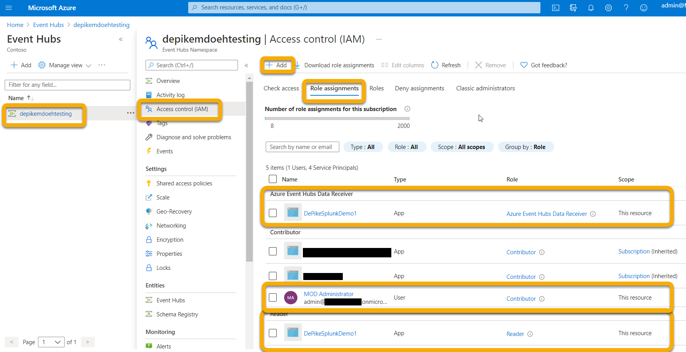
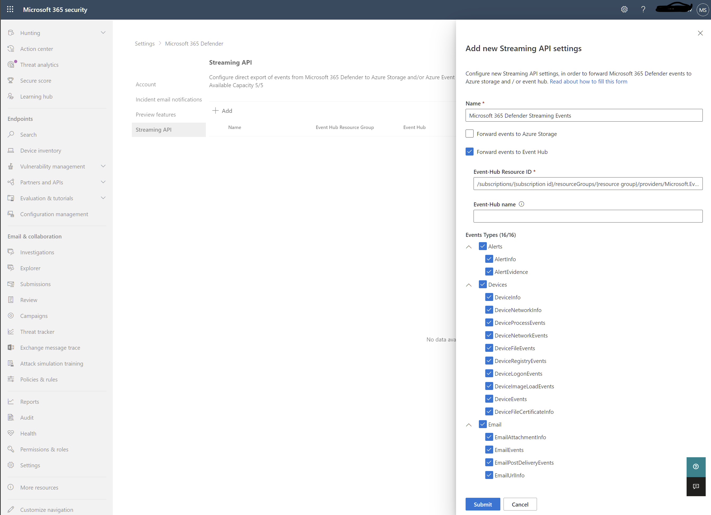

# <a name="configure-your-event-hub"></a>配置事件中心

[!INCLUDE [Microsoft 365 Defender rebranding](../../includes/microsoft-defender.md)]

**适用于：**
- [Microsoft 365 Defender](https://go.microsoft.com/fwlink/?linkid=2118804)

了解如何配置事件中心，以便它可以从事件中心Microsoft 365 Defender。

## <a name="set-up-the-required-resource-provider-in-the-event-hub-subscription"></a>在事件中心订阅中设置必需的资源提供程序

1. 登录 [Azure 门户](https://portal.azure.com)。
1. 选择 **订阅** > **{ 选择事件中心将部署到 }** > **资源提供程序的订阅**。
1. 验证 **Microsoft.Insights** 已注册提供程序。 否则，请注册它。


## <a name="set-up-azure-active-directory-app-registration"></a>设置Azure Active Directory应用注册

> ![注意]你必须具有管理员角色Azure Active Directory (AAD) 必须设置为允许非管理员注册应用。 还必须具有所有者或用户访问管理员角色才能为服务主体分配角色。 有关详细信息，请参阅 Microsoft Docs Azure AD门户&[服务主体创建 \| Microsoft 标识平台应用](/azure/active-directory/develop/howto-create-service-principal-portal)。

1. 创建新的注册 ( \>在应用注册新注册) 服务Azure Active Directory **创建** \> **服务主体。**

1. 只需使用 Name (填写表单，无需重定向 URI) 。

    

    

1. 通过单击"证书""密码" **创建&密码 新建** \> **客户端密码**：

    

> [!WARNING]
> **你将无法再次访问客户端密码，因此请确保保存它**。

## <a name="set-up-event-hub-namespace"></a>设置事件中心命名空间

1. 创建事件中心命名空间：

    转到 **"事件\>** 中心"添加并选择定价层、吞吐量单位和自动 (要求标准定价，在功能下) 适合您预期负载的功能。 有关详细信息，请参阅定价 [- 事件\|中心Microsoft Azure](https://azure.microsoft.com/pricing/details/event-hubs/)

    > [!NOTE]
    > 可以使用现有的事件中心，但吞吐量和缩放是在命名空间级别设置的，因此建议将事件中心放在其现有命名空间中。

   

1. 你还需要此事件中心命名空间的资源 ID。 转到 Azure 事件中心命名空间页面"属性 \> "。 复制"资源 ID"下的文本，并记录该文本Microsoft 365配置部分使用。

    

1. 创建事件中心命名空间后，你需要将应用注册服务主体添加为读者、Azure 事件中心数据接收器，以及将登录到 Microsoft 365 Defender 的用户作为参与者 (还可以在资源组或订阅级别) 进行此操作。

    您可以在 IAM 事件中心 **命名空间**\>访问控制 **(IAM** \>) **添加** 和验证角色 **分配下执行此步骤**：

    

## <a name="set-up-event-hub"></a>设置事件中心

**选项 1：**

可以在命名空间内创建事件中心，选择要导出 (表) 事件类型将写入此 **事件** 中心。

**选项 2：**

你可以将每个表导出到事件中心内的不同事件中心，而不是将 () 表的所有事件类型导出到一个事件中心 (每个事件类型一个事件中心) 。

在此选项中，Microsoft 365 Defender将创建事件中心。

> [!NOTE]
> 如果你使用的事件中心命名空间不是事件中心群集的一部分，你最多只能选择在定义的每个导出 设置 中导出最多 10 个事件类型 (表) ，因为每个事件中心命名空间的 Azure 限制是 10 个事件中心。

例如：


如果选择此选项，可以跳到"配置Microsoft 365 Defender[发送电子邮件表"](#configure-microsoft-365-defender-to-send-email-tables)部分。

通过选择事件中心 + 事件 **中心在命名空间** \> **内创建事件中心**。

分区计数允许通过并行率增加吞吐量，因此建议根据你期望的负载增加此数字。 建议使用默认邮件保留值和捕获值 1 和 Off。


对于此事件中心 (命名空间) 您需要使用发送、侦听声明配置共享访问策略。 单击事件 **中心** \> **共享访问策略** \> **+** 添加，然后为它指定策略名称 (其他位置) 并检查 **发送** 和 **侦听**。


## <a name="configure-microsoft-365-defender-to-send-email-tables"></a>配置Microsoft 365 Defender发送电子邮件表

### <a name="set-up-microsoft-365-defender-send-email-tables-to-splunk-via-event-hub"></a>设置Microsoft 365 Defender事件中心将电子邮件表发送到 Splunk

1. 登录以<a href="https://go.microsoft.com/fwlink/p/?linkid=2077139" target="_blank">Microsoft 365 Defender</a>满足以下所有角色要求的帐户登录：

    - 要导出到的事件中心的 Event Hub *命名空间* 资源级别或更高级别的参与者角色。 如果没有此权限，在尝试保存设置时将看到导出错误。

    - 绑定到 Azure 和 Azure 的租户上的全局管理员Microsoft 365 Defender管理员角色。

    

1. 单击" **原始数据导出 + \> 添加"**。

    现在，你将使用上面记录的数据。

    **名称**：此值是本地值，并且应该是适合您的环境的任何值。

    **将事件转发到事件中心**：选中此复选框。

    **事件中心资源 ID**：此值是在设置事件中心时记录的事件中心命名空间资源 ID。

    **事件中心名称**：如果在事件中心命名空间内创建了事件中心，请粘贴上面记录的事件中心名称。

    如果您选择允许Microsoft 365 Defender创建每个事件类型的事件 (表) ，则此字段保留为空。

    **事件类型**：选择要转发到事件中心，然后转发到自定义应用的高级搜寻表。 警报表来自Microsoft 365 Defender，设备表来自 Microsoft Defender for Endpoint (EDR) ，电子邮件表来自 Microsoft Defender for Office 365。 电子邮件事件记录所有电子邮件事务。 URL (保险箱 Links) ， Attachment (保险箱 Attachments) ， and Post Delivery Events (ZAP) are also recorded and can be joined to the Email Events on the NetworkMessageId field.

    

1. 确保单击"提交 **"**。

### <a name="verify-that-the-events-are-being-exported-to-the-event-hub"></a>验证事件是否导出到事件中心

可以通过运行基本高级搜寻查询来验证事件是否正在发送到事件中心。 选择 **搜寻** \> **高级搜寻** \> **查询** 并输入以下查询：

```console
EmailEvents
|joinkind=fullouterEmailAttachmentInfoonNetworkMessageId
|joinkind=fullouterEmailUrlInfoonNetworkMessageId
|joinkind=fullouterEmailPostDeliveryEventsonNetworkMessageId
|whereTimestamp\>ago(1h)
|count
```

这将显示在上一小时加入所有其他表时收到的电子邮件数。 它还会显示是否看到可以导出到事件中心的事件。 如果此计数显示 0，则你将看不到进入事件中心的任何数据。


验证有要导出的数据后，可以查看事件中心以验证邮件是否传入。 这最多可能需要一个小时。

1. 在 Azure 中，转到 **事件中心** \> 单击命名空间 \> **事件中心 单击**\>事件 **中心**。
1. Under **Overview**， scroll down and in the Messages graph you should see Incoming Messages. 如果你未看到任何结果，则你的自定义应用将没有任何消息要接收。

    
