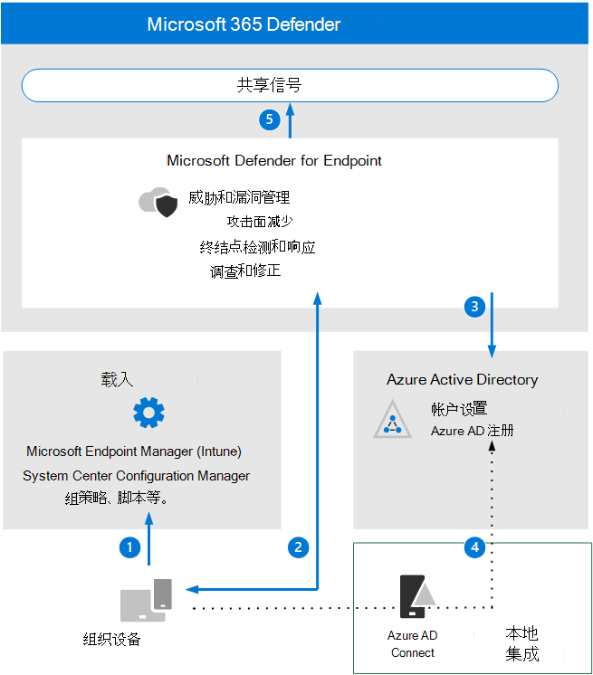

# 查看 Microsoft Defender for Endpoint 体系结构要求和关键概念

**适用于：Microsoft 365 Defender**

本文将指导你设置 Microsoft Defender for Endpoint 环境评估的过程。

有关此过程详细信息，请参阅 [概述文章](eval-defender-endpoint-overview.md)。

在启用 Microsoft Defender for Endpoint 之前，请确保你了解体系结构并满足要求。

## 了解体系结构

下图说明了适用于终结点的 Microsoft Defender 体系结构和集成。 

下表介绍了此图。

呼叫 | 说明
:---|:---|
1 | 设备通过受支持的管理工具之一进行。 
2 | On-boarded devices provide and respond to Microsoft Defender for Endpoint signal data.
3 | 托管设备已加入和/或注册Azure Active Directory。
4  | 已加入域Windows设备会使用Azure Active Directory同步Azure Active Directory 连接。
5 | Microsoft Defender for Endpoint 警报、调查和响应在 Microsoft 365 Defender 中进行管理。

## 了解关键概念

下表确定了在评估、配置和部署 Microsoft Defender for Endpoint 时必须了解的重要概念： 

概念 | 说明 | 更多信息
:---|:---|:---|
管理门户 | Microsoft 365 Defender用于监视和协助响应潜在高级永久性威胁活动或数据泄露警报的门户。 | [Microsoft Defender for Endpoint 门户概述](/microsoft-365/security/defender-endpoint/portal-overview)
攻击面减少 | 通过最大程度地减少组织易受网络威胁和攻击的位置，帮助减少攻击面。 | [减少攻击面概述](/microsoft-365/security/defender-endpoint/overview-attack-surface-reduction)
终结点检测和响应 | 终结点检测和响应功能提供接近实时且可操作的高级攻击检测。 | [终结点检测和响应功能概述](/microsoft-365/security/defender-endpoint/overview-endpoint-detection-response)
行为阻止和抑制 | 行为阻止和抑制功能可帮助根据威胁的行为和进程树识别和停止威胁，即使威胁已开始执行。 | [行为阻止和控制](/microsoft-365/security/defender-endpoint/behavioral-blocking-containment)
自动调查和响应 | 自动调查使用各种基于安全分析员所使用的流程的检查算法，旨在检查警报并立即采取措施来解决违规问题。 | [使用自动调查调查和修正威胁](/microsoft-365/security/defender-endpoint/automated-investigations)
高级搜寻 | 高级搜寻是基于查询的威胁搜寻工具，允许你浏览最多 30 天的原始数据，以便你可以主动检查网络中事件以查找威胁指示器和实体。 | [高级搜寻概述](/microsoft-365/security/defender-endpoint/advanced-hunting-overview)
威胁分析 | 威胁分析是来自专家 Microsoft 安全研究人员的一组报告，涉及最相关的威胁。 | [跟踪并响应新出现的威胁](/microsoft-365/security/defender-endpoint/threat-analytics)

有关 Microsoft Defender for Endpoint 中包含的功能的更多详细信息，请参阅什么是[Microsoft Defender for Endpoint。](/microsoft-365/security/defender-endpoint/microsoft-defender-endpoint)

## SIEM 集成

你可以将 Microsoft Defender for Endpoint 与 Azure Sentinel 集成，以更全面的分析整个组织的安全事件，并生成有效且即时响应的手册。 

Microsoft Defender for Endpoint 还可以集成到 SIEM 解决方案的其他安全 (事件) 中。 有关详细信息，请参阅在 [Microsoft Defender for Endpoint 中启用 SIEM 集成](/microsoft-365/security/defender-endpoint/enable-siem-integration)。

## 后续步骤
[启用评估](eval-defender-endpoint-enable-eval.md)

返回到评估 Microsoft [Defender for Endpoint 的概述](eval-defender-endpoint-overview.md)

返回到评估和试点[计划概述Microsoft 365 Defender](eval-overview.md)
