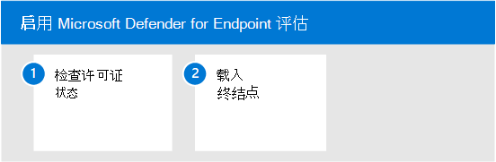
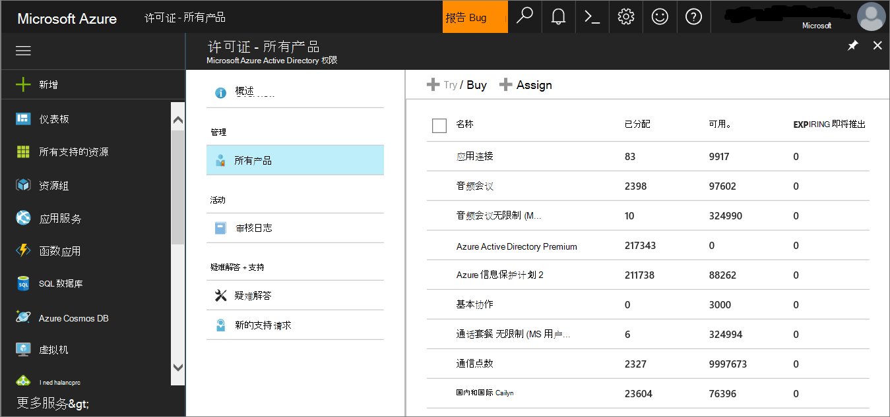
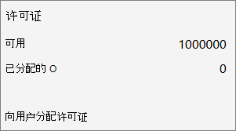

# 启用 Microsoft Defender for Endpoint 评估环境

本文将指导你完成使用生产设备为 Microsoft Defender for Endpoint 设置评估环境的步骤。 

> [!TIP]
> Microsoft Defender for Endpoint 还附带了产品内评估实验室，你可以添加预配置的设备并运行模拟来评估平台的功能。 实验室附带简化的设置体验，可帮助快速演示 Microsoft Defender for Endpoint 的价值，包括针对许多功能（如高级搜寻和威胁分析）的指南。 有关详细信息，请参阅 [评估功能](../defender-endpoint/evaluation-lab.md)。   本文中提供的指南与评估实验室之间的主要区别在于评估环境使用存储设备，而评估实验室使用非生产设备。 

使用以下步骤启用 Microsoft Defender for Endpoint 评估。

- [步骤 1.检查许可证状态](#step-1-check-license-state)
- [步骤 2.载入终结点](#step-2-onboard-endpoints-using-any-of-the-supported-management-tools)

## 步骤 1. 检查许可证状态

首先需要检查许可证状态，以验证是否正确预配了许可证状态。 可以通过管理中心或管理中心门户 **Microsoft Azure此操作**。

1. 若要查看许可证，请转到"Microsoft Azure **门户**"并导航到"Microsoft Azure [门户许可证"部分](https://portal.azure.com/#blade/Microsoft_AAD_IAM/LicensesMenuBlade/Products)。

   

1. 或者，在管理中心中，导航到"**帐单**  >  **""订阅"。**

    在屏幕上，你将看到所有预配的许可证及其当前 **状态**。

    

## 步骤 2. 使用任何受支持的管理工具载入终结点

确认许可证状态已正确预配后，你可以开始将设备载入服务。 

为了评估适用于终结点的 Microsoft Defender，我们建议选择Windows一台进行评估的设备。

你可以选择使用任何受支持的管理工具，但 Intune 提供了最佳集成。 有关详细信息，请参阅配置[Microsoft Defender for Endpoint in Microsoft Intune。](/mem/intune/protect/advanced-threat-protection-configure#enable-microsoft-defender-for-endpoint-in-intune)

规划 [部署](../defender-endpoint/deployment-strategy.md) 主题概述了部署 Defender for Endpoint 所需的一般步骤。  

观看此视频，快速概览载入过程并了解可用的工具和方法。

> [!VIDEO https://www.microsoft.com/videoplayer/embed/RE4bGqr]

### 载入工具选项

下表列出了基于需要载入的终结点的可用工具。

端点 | 工具选项
:---|:---
**Windows** | [本地脚本 (最多 10](../defender-endpoint/configure-endpoints-script.md)台设备) 、组策略[、Microsoft Endpoint Manager/移动设备](../defender-endpoint/configure-endpoints-mdm.md)管理器[、Microsoft Endpoint Configuration Manager、VDI](../defender-endpoint/configure-endpoints-sccm.md)[脚本](../defender-endpoint/configure-endpoints-vdi.md)、与[Microsoft Defender for Cloud 集成](../defender-endpoint/configure-server-endpoints.md#integration-with-azure-defender)
**macOS** | [本地脚本](../defender-endpoint/mac-install-manually.md)、 [Microsoft Endpoint Manager](../defender-endpoint/mac-install-with-intune.md)、 [JAMF Pro](../defender-endpoint/mac-install-with-jamf.md)、[移动设备管理](../defender-endpoint/mac-install-with-other-mdm.md)
**Linux Server** | [本地脚本](../defender-endpoint/linux-install-manually.md)  [、安装](../defender-endpoint/linux-install-with-puppet.md)  [、Ansible](../defender-endpoint/linux-install-with-ansible.md)
**iOS** | [基于应用](../defender-endpoint/ios-install.md)
**Android** | [Microsoft Endpoint Manager](../defender-endpoint/android-intune.md)

## 后续步骤
[设置适用于终结点的 Microsoft Defender 的试点](eval-defender-endpoint-pilot.md)
 
返回到评估 Microsoft [Defender for Endpoint 的概述](eval-defender-endpoint-overview.md)

返回到评估和试点[计划概述Microsoft 365 Defender](eval-overview.md)
