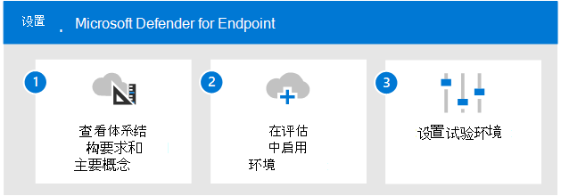

# 评估 Microsoft Defender for Endpoint 概述Evaluate Microsoft Defender for Endpoint overview

**适用于：****Applies to:**

- Microsoft 365 DefenderMicrosoft 365 Defender

本文概述了启用和试用 Microsoft Defender for Endpoint 的过程。This article outlines the process to enable and pilot Microsoft Defender for Endpoint. 在开始此过程之前，请确保你已查看用于评估项目Microsoft 365 Defender并且你已创建了Microsoft 365 Defender[评估环境](eval-create-eval-environment.md)。Before starting this process, be sure you've reviewed the overall process for [evaluating Microsoft 365 Defender](eval-overview.md) and you have [created the Microsoft 365 Defender evaluation environment](eval-create-eval-environment.md). 
 

使用以下步骤启用和试用 Microsoft Defender for Endpoint。Use the following steps to enable and pilot Microsoft Defender for Endpoint.

下表介绍了图中的步骤。The following table describes the steps in the illustration.

 |步骤Step   |说明Description
|---------|---------|
| [步骤 1.查看体系结构要求和关键概念Step 1. Review architecture requirements and key concepts](eval-defender-endpoint-architecture.md)    | 了解 Defender for Endpoint 体系结构以及可供你使用的功能。Understand the Defender for Endpoint architecture and the capabilities available to you.       |
|[步骤 2.启用评估环境Step 2. Enable the evaluation environment](eval-defender-office-365-enable-eval.md)     |   按照步骤设置评估环境。Follow the steps to setup the evaluation environment.      |
|[步骤 3.设置试点 Step 3. Set up the pilot ](eval-defender-office-365-pilot.md)    |    验证试点组、运行模拟，并熟悉关键功能和仪表板。Verify your pilot group, run simulations, and become familiar with key features and dashboards.     |

