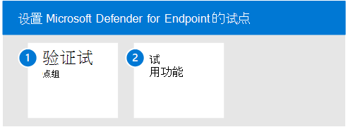

# 试用 Microsoft Defender for Endpoint

本文将指导你运行 Microsoft Defender for Endpoint 试点的过程。 

使用以下步骤为 Microsoft Defender for Endpoint 设置和配置试点。 

- 步骤 1. 验证试点组
- 步骤 2. 试用功能

当你试用 Microsoft Defender for Endpoint 时，你可以选择先将一些设备载入服务，然后再载入整个组织。  

然后，你可以试用可用的功能，例如运行攻击模拟，并查看 Defender for Endpoint 如何显示恶意活动，并让你进行有效的响应。 

## 步骤 1. 验证试点组
完成"启用评估"部分概述的载入步骤后，应大约在一小时后在设备清单列表中看到设备。 

当你看到已载入的设备时，你可以继续尝试功能。 

## 步骤 2. 试用功能
现在，你已完成载入某些设备并验证它们正在向服务报告，通过尝试现成可用的强大功能来熟悉产品。

在试点期间，你可以轻松开始尝试一些功能以查看产品运行情况，而无需完成复杂的配置步骤。

让我们首先查看仪表板。

### 查看设备清单
设备清单是你将看到网络中终结点、网络设备和 IoT 设备列表的地方。 它不仅为你提供了网络中设备的视图，还为你提供了有关这些设备的深入信息，例如域、风险级别、操作系统平台和其他详细信息，以便轻松识别风险最大的设备。

### 查看威胁和漏洞管理仪表板 
威胁漏洞管理可帮助你专注于对组织构成最紧急和最高风险的漏洞。 从仪表板中，获取组织曝光分数、设备的 Microsoft 安全分数、设备曝光分布、顶级安全建议、最易受攻击的软件、顶级修正活动和最公开设备数据等高级视图。 

### 运行模拟
Microsoft Defender for Endpoint 附带了 [可在](https://securitycenter.windows.com/tutorials) 试点设备上运行的"自己执行"攻击方案。  每个文档都包括操作系统和应用程序要求，以及特定于攻击方案的详细说明。 这些脚本安全、有记录且易于使用。 这些方案将反映适用于终结点的 Defender 功能并演练调查体验。

若要运行任何提供的模拟，你至少需要一 [个已载入的设备](../defender-endpoint/onboard-configure.md)。

1. 在  >  **帮助模拟&** 教程中，选择要模拟的可用攻击方案：

   - **方案 1：文档丢弃后门** - 模拟传递社交工程的诱使文档。 文档启动一个专门设计的后门，该后门为攻击者提供控制。

   - **方案 2：** 无文件攻击中的 PowerShell 脚本 - 模拟依赖于 PowerShell 的无文件攻击，展示攻击面减少和设备学习检测恶意内存活动。

   - **方案 3：自动事件响应** - 触发自动调查，自动搜寻并修正泄露项目，从而扩展事件响应容量。

2. 下载并阅读所选方案提供的相应演练文档。

3. 下载模拟文件或通过导航到帮助模拟和教程复制  >  **&脚本**。 你可以选择在测试设备上下载文件或脚本，但这不是强制性的。

4. 根据演练文档中的指示，在测试设备上运行模拟文件或脚本。

> [!NOTE]
> 模拟文件或脚本模拟攻击活动，但实际上是恶意的，不会损害或损害测试设备。

## 后续步骤
[评估 Microsoft Defender for Cloud Apps](eval-defender-mcas-overview.md)

返回到评估 Microsoft [Defender for Endpoint 的概述](eval-defender-endpoint-overview.md)

返回到评估和试点[计划概述Microsoft 365 Defender](eval-overview.md)
