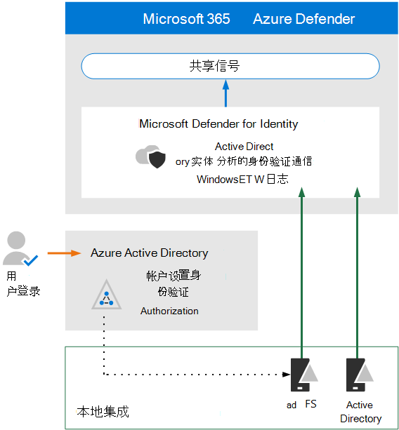

# 查看 Microsoft Defender for Identity 的体系结构要求和关键概念

**适用于：**
- Microsoft 365 Defender

本文是设置 Microsoft Defender for Identity 评估环境过程中第 1 步（第 [3](eval-defender-identity-overview.md) 步）。 有关此过程详细信息，请参阅 [概述文章](eval-defender-identity-overview.md)。

在启用 Microsoft Defender for Identity 之前，请确保你了解体系结构并满足要求。

Microsoft Defender for Identity 使用机器学习和行为分析来识别跨本地网络的攻击，并检测并主动防止与云标识相关的用户登录风险。 有关详细信息，请参阅 [什么是 Microsoft Defender for Identity？](/defender-for-identity/what-is)

Defender for Identity 可保护本地 Active Directory 用户和/或已同步到Azure Active Directory (Azure AD) 。 若要保护仅由用户Azure AD环境，请参阅Azure AD [Identity Protection](/azure/active-directory/identity-protection/overview-identity-protection)。

## 了解体系结构

下图说明了 Defender for Identity 的基准体系结构。 

在此图中：
- 安装在 AD 域控制器上的传感器分析日志和网络流量，并将其发送到 Microsoft Defender for Identity 进行分析和报告。
-  当 Azure AD 配置为使用图示中的 (虚线)  (，传感器还可以分析 Active Directory 联合身份验证服务 (AD FS) 。 
- Microsoft Defender for Identity 将信号共享到 Microsoft 365 Defender，以扩展 XDR (响应) 。

可以在以下服务器上直接安装 Defender for Identity 传感器：

- 域控制器：传感器直接监视域控制器流量，无需专用服务器或端口镜像配置。
- AD FS：传感器直接监视网络流量和身份验证事件。

有关 Defender for Identity 体系结构的深入探讨（包括与 Defender for Cloud Apps 的集成）的信息，请参阅 [Microsoft Defender for Identity 体系结构](/defender-for-identity/architecture)。

## 了解关键概念

下表确定了评估、配置和部署 Microsoft Defender for Identity 时必须了解的重要概念。

|概念  |说明 |更多信息  |
|---------|---------|---------|
| 受监视的活动 | Defender for Identity 监视从组织内部生成的信号，以检测可疑或恶意活动，并帮助你确定每个潜在威胁的有效性，以便你可以有效地进行会审和响应。  |  [Microsoft Defender for Identity 受监视的活动](/defender-for-identity/monitored-activities)       |
| 安全警报    | Defender for Identity 安全警报介绍了网络上传感器检测到的可疑活动，以及每个威胁中涉及的主角和计算机。   | [Microsoft Defender 标识安全警报](/defender-for-identity/suspicious-activity-guide?tabs=external)    |
| 实体配置文件    | 实体配置文件提供对用户、计算机、设备和资源及其访问历史记录的全面深入调查。   | [了解实体配置文件](/defender-for-identity/entity-profiles)  |
| 横向移动路径    | MDI 安全见解的一个关键组成部分是识别攻击者使用非敏感帐户在整个网络中获取对敏感帐户或计算机的访问权限的横向移动路径。  | [Microsoft Defender for Identity 横向移动路径 (LMP) ](/defender-for-identity/use-case-lateral-movement-path)  |
| 网络名称解析    |  网络名称解析 (NNR) 是 MDI 功能的一个组件，可捕获基于网络流量、Windows 事件、ETW 等的活动，并将此原始数据与每个活动所涉及的相关计算机关联。       | [什么是网络名称解析？](/defender-for-identity/nnr-policy)      |
| 报表    | Defender for Identity 报告允许你计划或立即生成和下载提供系统和实体状态信息的报告。  可以创建有关环境中检测到的系统运行状况、安全警报和潜在横向移动路径的报告。   | [Microsoft Defender 标识报告 ](/defender-for-identity/reports)       |
| 角色组    | Defender for Identity 提供基于角色的组和委派访问权限，以根据组织的特定安全性和合规性需求（包括管理员、用户和查看者）保护数据。        |  [Microsoft Defender for Identity 角色组](/defender-for-identity/role-groups)       |
| 管理门户    |  除了安全Microsoft 365 Defender，Defender for Identity 门户还可用于监视和响应可疑活动。      | [使用Microsoft Defender for Identity 门户](/defender-for-identity/workspace-portal)        |
| Microsoft Defender for Cloud Apps 集成   | Microsoft Defender for Cloud Apps 与 Microsoft Defender for Identity 集成，以跨混合环境（云应用和本地环境） (UEBA) 提供用户实体行为分析   | Microsoft Defender for Identity 集成  |
| | | |

## 查看先决条件

Defender for Identity 需要进行一些先决条件工作，以确保本地标识和网络组件满足最低要求。 使用本文作为清单来确保你的环境准备就绪： [Microsoft Defender for Identity 先决条件](/defender-for-identity/prerequisites)。

## 后续步骤

步骤 2/3 [：启用评估环境 Defender for Identity](eval-defender-identity-enable-eval.md)

返回到评估 [Microsoft Defender 标识概述](eval-defender-identity-overview.md)

返回到评估和试点[计划概述Microsoft 365 Defender](eval-overview.md) 
