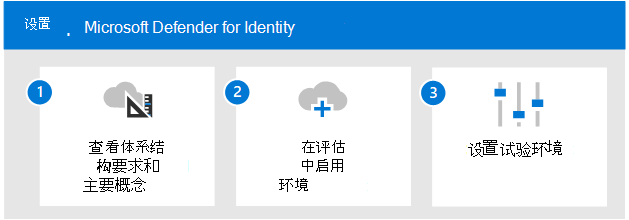

# 评估 Microsoft Defender 标识概述

**适用于：**
- Microsoft 365 Defender

本文概述了启用和试用 Microsoft Defender for Identity 的过程。 在开始此过程之前，请确保你已查看评估项目Microsoft 365 Defender并且已创建Microsoft 365 Defender[评估环境](eval-create-eval-environment.md)。  
 

使用以下步骤启用和试用 Microsoft Defender for Identity。

下表介绍了图中的步骤。

| |步骤  |说明  |
|---------|---------|---------|
|1|[查看体系结构要求和关键概念](eval-defender-identity-architecture.md)    | 了解 Defender for Identity 体系结构并确保你的环境满足体系结构先决条件。       |
|2|[启用评估环境](eval-defender-identity-enable-eval.md)     |   按照步骤设置评估环境。      |
|3|[设置试点](eval-defender-identity-pilot.md)     |   了解标识环境的基准设置，并试用 Defender for Identity 教程。     |
||||

