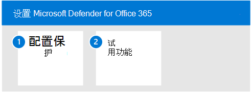

# 试用 Microsoft Defender for Identity

**适用于：**
- Microsoft 365 Defender

本文是设置 Microsoft Defender for Identity 评估环境过程中的第 3 步（第 [3](eval-defender-identity-overview.md) 步）。 有关此过程详细信息，请参阅 [概述文章](eval-defender-identity-overview.md)。

使用以下步骤为 Microsoft Defender 的标识设置和配置试点。 请注意，建议不包括设置试点组。 最佳做法是继续操作，在运行 Active Directory 域服务 (AD DS) 和 Active Directory 联合服务 (AD FS) 的所有服务器上安装传感器。

下表介绍了图中的步骤。

- [步骤 1：为标识环境配置基准建议](#step-1-configure-benchmark-recommendations-for-your-identity-environment)
- [步骤 2：试用功能 - 演练用于识别和修正不同攻击类型的教程 ](#step-2-try-out-capabilities--walk-through-tutorials-for-identifying-and-remediating-different-attack-types)

## 步骤 1. 为标识环境配置基准建议

Microsoft 为使用 Microsoft 云服务的客户提供安全基准建议。 [Azure 安全](/security/benchmark/azure/overview)基准 (ASB) 提供了说明性最佳做法和建议，以帮助提高 Azure 上工作负载、数据和服务的安全性。

这些基准建议包括 Microsoft Defender 标识 的 [Azure 安全基线](/security/benchmark/azure/baselines/defender-for-identity-security-baseline)。 实施这些建议可能需要一些时间来计划和实现。 虽然这将大大提高标识环境的安全性，但不应阻止你继续评估和实现 Microsoft Defender for Identity。 此处提供了这些信息，以用于你的了解。

## 步骤 2. 试用功能 - 演练用于识别和修正不同攻击类型的教程

Microsoft Defender for Identity 文档包括一系列教程，这些教程演示了识别和修正各种攻击类型的过程。

试用 Defender for Identity 教程：
- [重新警报](/defender-for-identity/reconnaissance-alerts)
- [凭据泄露警报](/defender-for-identity/compromised-credentials-alerts)
- [横向移动警报](/defender-for-identity/lateral-movement-alerts)
- [域警报](/defender-for-identity/domain-dominance-alerts)
- [Exfiltration 警报](/defender-for-identity/exfiltration-alerts)
- [调查用户](/defender-for-identity/investigate-a-user)
- [调查计算机](/defender-for-identity/investigate-a-computer)
- [调查横向移动路径](/defender-for-identity/investigate-lateral-movement-path)
- [调查实体](/defender-for-identity/investigate-entity)

## 后续步骤

[评估 Microsoft Defender for Office 365](eval-defender-office-365-overview.md)

返回到评估 Microsoft [Defender for Office 365](eval-defender-office-365-overview.md)

返回到评估和试点[计划概述Microsoft 365 Defender](eval-overview.md)