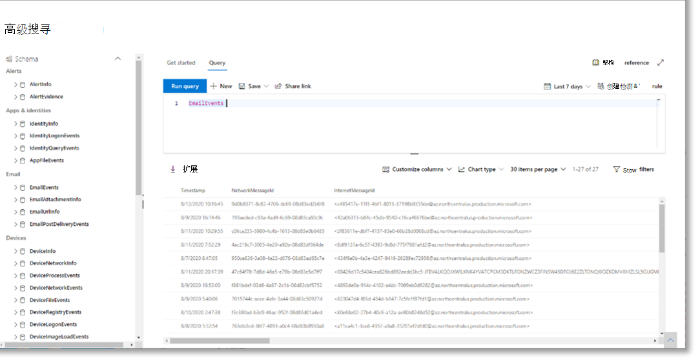
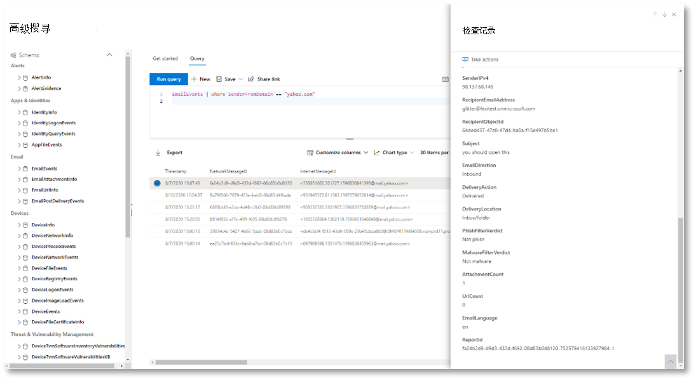
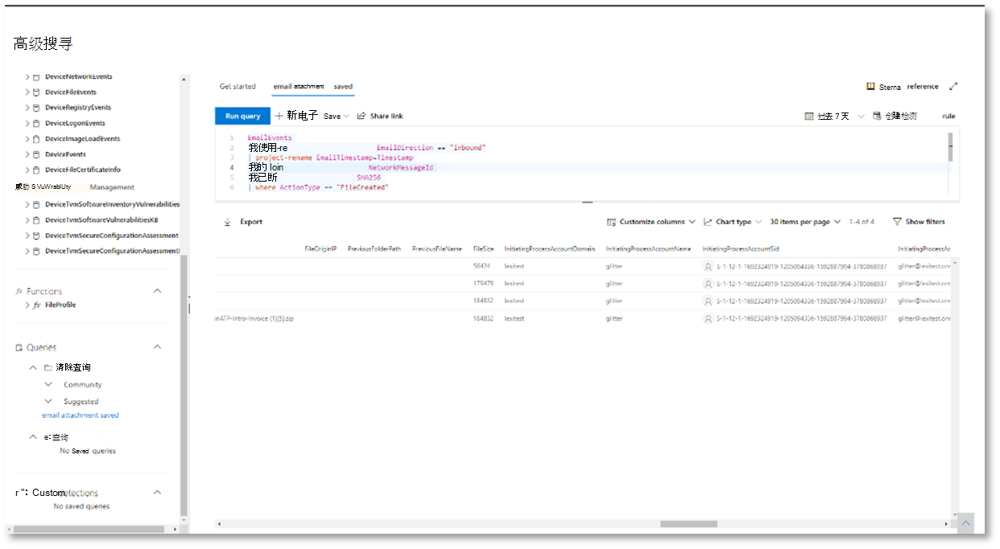
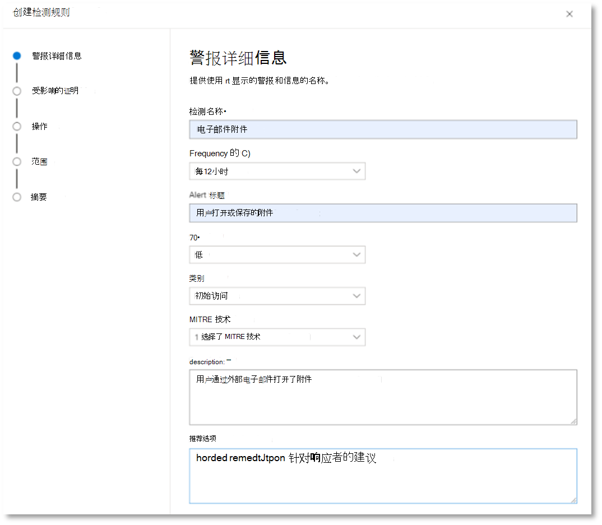
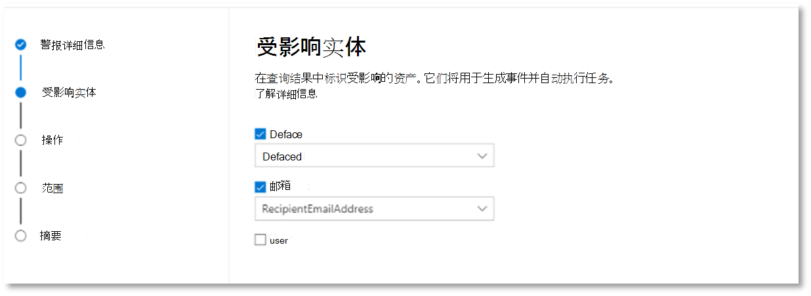
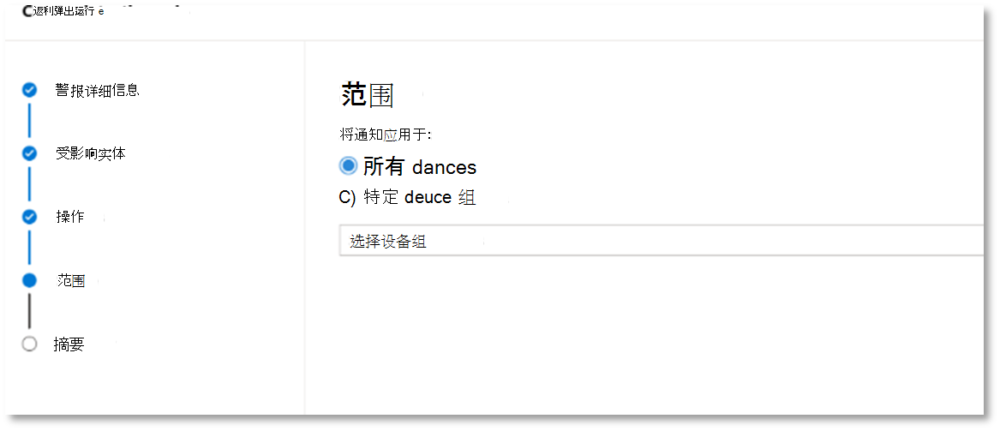
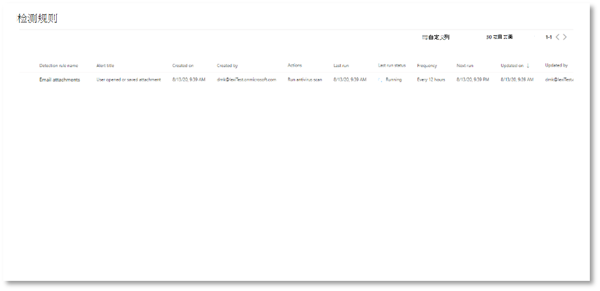
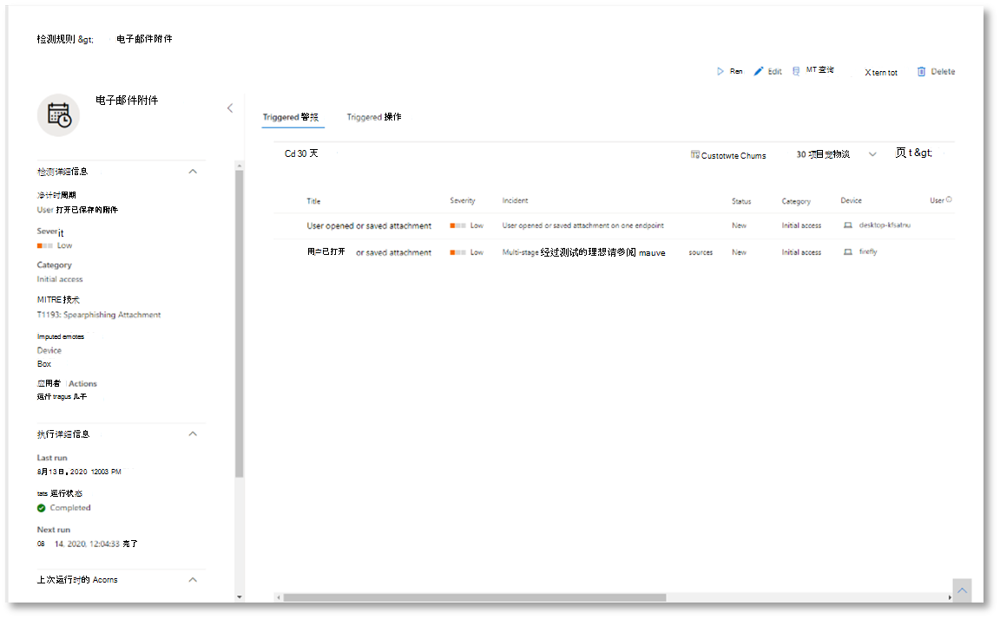

# <a name="try-microsoft-365-defender-incident-response-capabilities-in-a-pilot-environment"></a><span data-ttu-id="93b74-104">尝试Microsoft 365 Defender环境中使用事件响应功能</span><span class="sxs-lookup"><span data-stu-id="93b74-104">Try Microsoft 365 Defender incident response capabilities in a pilot environment</span></span>

<span data-ttu-id="93b74-105">**适用于：**</span><span class="sxs-lookup"><span data-stu-id="93b74-105">**Applies to:**</span></span>
- <span data-ttu-id="93b74-106">Microsoft 365 Defender</span><span class="sxs-lookup"><span data-stu-id="93b74-106">Microsoft 365 Defender</span></span>

<span data-ttu-id="93b74-107">本文是使用试验环境对事件进行调查和响应过程中第 2 步Microsoft 365 Defender [2](eval-defender-investigate-respond.md)步。</span><span class="sxs-lookup"><span data-stu-id="93b74-107">This article is [Step 2 of 2](eval-defender-investigate-respond.md) in the process of performing an investigation and response of an incident in Microsoft 365 Defender using a pilot environment.</span></span> <span data-ttu-id="93b74-108">有关此过程详细信息，请参阅 [概述](eval-defender-investigate-respond.md) 文章。</span><span class="sxs-lookup"><span data-stu-id="93b74-108">For more information about this process, see the [overview](eval-defender-investigate-respond.md) article.</span></span>

<span data-ttu-id="93b74-109">对模拟攻击[执行事件](eval-defender-investigate-respond-simulate-attack.md)响应后，下面是一些Microsoft 365 Defender功能：</span><span class="sxs-lookup"><span data-stu-id="93b74-109">Once you have performed an [incident response for a simulated attack](eval-defender-investigate-respond-simulate-attack.md), here are some Microsoft 365 Defender capabilities to explore:</span></span>

|<span data-ttu-id="93b74-110">功能</span><span class="sxs-lookup"><span data-stu-id="93b74-110">Capability</span></span> |<span data-ttu-id="93b74-111">说明</span><span class="sxs-lookup"><span data-stu-id="93b74-111">Description</span></span> |
|:-------|:-----|
| [<span data-ttu-id="93b74-112">确定事件优先级</span><span class="sxs-lookup"><span data-stu-id="93b74-112">Prioritize incidents</span></span>](#prioritize-incidents) | <span data-ttu-id="93b74-113">使用事件队列的筛选和排序来确定接下来要处理的事件。</span><span class="sxs-lookup"><span data-stu-id="93b74-113">Use filtering and sorting of the incidents queue to determine which incidents to address next.</span></span> |
| [<span data-ttu-id="93b74-114">管理事件</span><span class="sxs-lookup"><span data-stu-id="93b74-114">Manage incidents</span></span>](#manage-incidents) | <span data-ttu-id="93b74-115">修改事件属性以确保正确分配、添加标记和注释以及解决事件。</span><span class="sxs-lookup"><span data-stu-id="93b74-115">Modify incident properties to ensure correct assignment, add tags and comments, and to resolve an incident.</span></span> |
| [<span data-ttu-id="93b74-116">自动调查和响应</span><span class="sxs-lookup"><span data-stu-id="93b74-116">Automated investigation and response</span></span>](#examine-automated-investigation-and-response-with-the-action-center) | <span data-ttu-id="93b74-117">AIR (自动调查和) 功能，可帮助安全运营团队更有效地应对威胁。</span><span class="sxs-lookup"><span data-stu-id="93b74-117">Automated investigation and response (AIR) capabilities that can help your security operations team address threats more efficiently and effectively.</span></span> <span data-ttu-id="93b74-118">操作中心是事件和警报任务（如批准挂起的修正操作）的"单窗格"体验。</span><span class="sxs-lookup"><span data-stu-id="93b74-118">The Action center is a "single pane of glass" experience for incident and alert tasks such as approving pending remediation actions.</span></span> |
| [<span data-ttu-id="93b74-119">高级搜寻</span><span class="sxs-lookup"><span data-stu-id="93b74-119">Advanced hunting</span></span>](#advanced-hunting) | <span data-ttu-id="93b74-120">基于查询的威胁搜寻工具，可让你主动检查网络中事件并查找威胁指示器和实体。</span><span class="sxs-lookup"><span data-stu-id="93b74-120">A query-based threat-hunting tool that lets you proactively inspect events in your network and locate threat indicators and entities.</span></span> <span data-ttu-id="93b74-121">在调查和修正事件期间，你还使用高级搜寻。</span><span class="sxs-lookup"><span data-stu-id="93b74-121">You also use advanced hunting during the investigation and remediation of an incident.</span></span> |
||||

## <a name="prioritize-incidents"></a><span data-ttu-id="93b74-122">确定事件优先级</span><span class="sxs-lookup"><span data-stu-id="93b74-122">Prioritize incidents</span></span>

<span data-ttu-id="93b74-123">在快速启动 Microsoft 365 Defender 门户&事件>事件和事件 (security.microsoft.com) 。 [](https://security.microsoft.com)</span><span class="sxs-lookup"><span data-stu-id="93b74-123">You get to the incident queue from **Incidents & alerts > Incidents** on the quick launch of the Microsoft 365 Defender portal ([security.microsoft.com](https://security.microsoft.com)).</span></span> <span data-ttu-id="93b74-124">下面是一个示例。</span><span class="sxs-lookup"><span data-stu-id="93b74-124">Here's an example.</span></span>

:::image type="content" source="../../media/incidents-queue/incidents-ss-incidents.png" alt-text="事件队列示例":::

<span data-ttu-id="93b74-126">" **最近的事件和警报** "部分显示过去 24 小时内收到的警报数和创建的事件数的图。</span><span class="sxs-lookup"><span data-stu-id="93b74-126">The **Most recent incidents and alerts** section shows a graph of the number of alerts received and incidents created in the last 24 hours.</span></span>

<span data-ttu-id="93b74-127">若要检查事件列表，并区分事件在分配和调查方面的重要性，您可以：</span><span class="sxs-lookup"><span data-stu-id="93b74-127">To examine the list of incidents and prioritize their importance for assignment and investigation, you can:</span></span> 

- <span data-ttu-id="93b74-128">Configure customizable columns (select **Choose columns**) to give you visibility into different characteristics of the incident or the impacted entities.</span><span class="sxs-lookup"><span data-stu-id="93b74-128">Configure customizable columns (select **Choose columns**) to give you visibility into different characteristics of the incident or the impacted entities.</span></span> <span data-ttu-id="93b74-129">这可以帮助您就事件的优先顺序做出明智的决策进行分析。</span><span class="sxs-lookup"><span data-stu-id="93b74-129">This helps you make an informed decision regarding the prioritization of incidents for analysis.</span></span>

- <span data-ttu-id="93b74-130">使用筛选专注于特定方案或威胁。</span><span class="sxs-lookup"><span data-stu-id="93b74-130">Use filtering to focus on a specific scenario or threat.</span></span> <span data-ttu-id="93b74-131">对事件队列应用筛选器可帮助确定需要立即关注的事件。</span><span class="sxs-lookup"><span data-stu-id="93b74-131">Applying filters on the incident queue can help determine which incidents require immediate attention.</span></span> 

<span data-ttu-id="93b74-132">从默认事件队列中，选择"**筛选器**"以查看"筛选器"窗格，可以从中指定一组特定的事件。</span><span class="sxs-lookup"><span data-stu-id="93b74-132">From the default incident queue, select **Filters** to see a **Filters** pane, from which you can specify a specific set of incidents.</span></span> <span data-ttu-id="93b74-133">下面是一个示例。</span><span class="sxs-lookup"><span data-stu-id="93b74-133">Here is an example.</span></span>

:::image type="content" source="../../media/incidents-queue/incidents-ss-incidents-filters.png" alt-text="事件队列的筛选器窗格示例":::

<span data-ttu-id="93b74-135">有关详细信息，请参阅确定 [事件的优先级](incident-queue.md)。</span><span class="sxs-lookup"><span data-stu-id="93b74-135">For more information, see [Prioritize incidents](incident-queue.md).</span></span>

## <a name="manage-incidents"></a><span data-ttu-id="93b74-136">管理事件</span><span class="sxs-lookup"><span data-stu-id="93b74-136">Manage incidents</span></span>

<span data-ttu-id="93b74-137">可以从事件的"管理事件 **"窗格中** 管理事件。</span><span class="sxs-lookup"><span data-stu-id="93b74-137">You can manage incidents from the **Manage incident** pane for an incident.</span></span> <span data-ttu-id="93b74-138">下面是一个示例。</span><span class="sxs-lookup"><span data-stu-id="93b74-138">Here's an example.</span></span>

:::image type="content" source="../../media/incidents-queue/incidents-ss-incidents-manage.png" alt-text="事件的&quot;管理事件&quot;窗格示例":::

<span data-ttu-id="93b74-140">可以从以下位置的"管理 **事件"链接显示** 此窗格：</span><span class="sxs-lookup"><span data-stu-id="93b74-140">You can display this pane from the **Manage incident** link on the:</span></span>

- <span data-ttu-id="93b74-141">事件队列中事件的属性窗格。</span><span class="sxs-lookup"><span data-stu-id="93b74-141">Properties pane of an incident in the incident queue.</span></span>
- <span data-ttu-id="93b74-142">**事件的** 摘要页。</span><span class="sxs-lookup"><span data-stu-id="93b74-142">**Summary** page of an incident.</span></span>

<span data-ttu-id="93b74-143">以下是管理事件的方法：</span><span class="sxs-lookup"><span data-stu-id="93b74-143">Here are the ways you can manage your incidents:</span></span>

- <span data-ttu-id="93b74-144">编辑事件名称</span><span class="sxs-lookup"><span data-stu-id="93b74-144">Edit the incident name</span></span>

  <span data-ttu-id="93b74-145">根据安全团队最佳做法更改自动分配的名称。</span><span class="sxs-lookup"><span data-stu-id="93b74-145">Change the utomatically assigned name based on your security team best practices.</span></span>
  
- <span data-ttu-id="93b74-146">添加事件标记</span><span class="sxs-lookup"><span data-stu-id="93b74-146">Add incident tags</span></span>

  <span data-ttu-id="93b74-147">添加安全团队用于对事件进行分类的标记，稍后可进行筛选。</span><span class="sxs-lookup"><span data-stu-id="93b74-147">Add tags that your security team uses to classify incidents, which can be later filtered.</span></span>
  
- <span data-ttu-id="93b74-148">将事件分配给自己</span><span class="sxs-lookup"><span data-stu-id="93b74-148">Assign the incident to yourself</span></span>

  <span data-ttu-id="93b74-149">将其分配给用户帐户名称，稍后可进行筛选。</span><span class="sxs-lookup"><span data-stu-id="93b74-149">Assign it to your user account name, which can be later filtered.</span></span>
  
- <span data-ttu-id="93b74-150">解决事件</span><span class="sxs-lookup"><span data-stu-id="93b74-150">Resolve an incident</span></span>

  <span data-ttu-id="93b74-151">在修复事件后关闭它。</span><span class="sxs-lookup"><span data-stu-id="93b74-151">Close the incident after it has been remediated.</span></span>
  
- <span data-ttu-id="93b74-152">设置其分类和确定</span><span class="sxs-lookup"><span data-stu-id="93b74-152">Set its classification and determination</span></span>

  <span data-ttu-id="93b74-153">在解决事件时分类并选择威胁类型。</span><span class="sxs-lookup"><span data-stu-id="93b74-153">Classify and select the threat type when you resolve an incident.</span></span>
  
- <span data-ttu-id="93b74-154">添加备注</span><span class="sxs-lookup"><span data-stu-id="93b74-154">Add comments</span></span>

  <span data-ttu-id="93b74-155">根据安全团队最佳做法，对进度、备注或其他信息使用注释。</span><span class="sxs-lookup"><span data-stu-id="93b74-155">Use comments for progress, notes, or other information based on your security team best practices.</span></span> <span data-ttu-id="93b74-156">完整的注释历史记录可从事件详细信息页的"注释和历史记录"选项获得。</span><span class="sxs-lookup"><span data-stu-id="93b74-156">The full comment history is available from the **Comments and history** option in the details page of an incident.</span></span>

<span data-ttu-id="93b74-157">有关详细信息，请参阅管理 [事件](manage-incidents.md)。</span><span class="sxs-lookup"><span data-stu-id="93b74-157">For more information, see [Manage incidents](manage-incidents.md).</span></span>

## <a name="examine-automated-investigation-and-response-with-the-action-center"></a><span data-ttu-id="93b74-158">使用操作中心检查自动调查和响应</span><span class="sxs-lookup"><span data-stu-id="93b74-158">Examine automated investigation and response with the Action center</span></span>

<span data-ttu-id="93b74-159">根据组织的自动调查和响应功能配置方式，自动执行修正操作，或仅在安全运营团队批准后执行修正操作。</span><span class="sxs-lookup"><span data-stu-id="93b74-159">Depending on how automated investigation and response capabilities are configured for your organization, remediation actions are taken automatically or only upon approval by your security operations team.</span></span> <span data-ttu-id="93b74-160">所有操作（无论是挂起操作还是已完成操作）都列在操作[](m365d-action-center.md)中心中，其中列出了设备、电子邮件&协作内容和标识的挂起和已完成的修正操作。</span><span class="sxs-lookup"><span data-stu-id="93b74-160">All actions, whether pending or completed, are listed in the [Action center](m365d-action-center.md), which lists pending and completed remediation actions for your devices, email & collaboration content, and identities in one location.</span></span>

<span data-ttu-id="93b74-161">下面是一个示例。</span><span class="sxs-lookup"><span data-stu-id="93b74-161">Here's an example.</span></span>

:::image type="content" source="../../media/m3d-action-center-unified.png" alt-text="统一操作中心Microsoft 365 Defender":::

<span data-ttu-id="93b74-163">从操作中心，可以选择挂起的操作，然后在飞出窗格中批准或拒绝它们。</span><span class="sxs-lookup"><span data-stu-id="93b74-163">From the Action center, you can select pending actions and then approve or reject them in the flyout pane.</span></span> <span data-ttu-id="93b74-164">下面是一个示例。</span><span class="sxs-lookup"><span data-stu-id="93b74-164">Here's an example.</span></span>

:::image type="content" source="../../media/air-actioncenter-itemselected.png" alt-text="批准或拒绝操作":::

<span data-ttu-id="93b74-166">尽快 (批准或拒绝) 挂起的操作，以便自动调查可以继续并及时完成。</span><span class="sxs-lookup"><span data-stu-id="93b74-166">Approve (or reject) pending actions as soon as possible so that your automated investigations can proceed and complete in a timely manner.</span></span>

<span data-ttu-id="93b74-167">有关详细信息，请参阅自动[调查和响应](m365d-autoir.md)[以及操作中心](m365d-action-center.md)。</span><span class="sxs-lookup"><span data-stu-id="93b74-167">For more information, see [Automated investigation and response](m365d-autoir.md) and [Action center](m365d-action-center.md).</span></span>

## <a name="advanced-hunting"></a><span data-ttu-id="93b74-168">高级搜寻</span><span class="sxs-lookup"><span data-stu-id="93b74-168">Advanced hunting</span></span>

> [!NOTE]
> <span data-ttu-id="93b74-169">在我们演示高级搜寻模拟之前，请观看以下视频，了解高级搜寻概念，查看可在门户中查找它的地方，并了解它可以如何帮助你执行安全操作。</span><span class="sxs-lookup"><span data-stu-id="93b74-169">Before we walk you through the advanced hunting simulation, watch the following video to understand advanced hunting concepts, see where you can find it in the portal, and know how it can help you in your security operations.</span></span>

<br>

> [!VIDEO https://www.microsoft.com/videoplayer/embed/RE4Bp7O]


<span data-ttu-id="93b74-170">如果可选的无文件 [PowerShell](eval-defender-investigate-respond-simulate-attack.md#simulate-an-attack-with-an-isolated-domain-controller-and-client-device-optional) 攻击模拟是已到达凭据访问阶段的真实攻击，可以在调查的任何时间点使用高级搜寻，使用已生成的警报和受影响的实体中已了解的内容主动搜索网络的事件和记录。</span><span class="sxs-lookup"><span data-stu-id="93b74-170">If the [optional fileless PowerShell attack simulation](eval-defender-investigate-respond-simulate-attack.md#simulate-an-attack-with-an-isolated-domain-controller-and-client-device-optional) were a real attack that had already reached the credential access stage, you can use advanced hunting at any point in the investigation to proactively search through events and records in the network using what you already know from the generated alerts and affected entities.</span></span> <span data-ttu-id="93b74-171">例如，可以查询过去 30 天内与外部 IP 地址的任何连接。</span><span class="sxs-lookup"><span data-stu-id="93b74-171">For instance, you can query for any connections to the external IP address in the past 30 days.</span></span>

### <a name="hunting-environment-requirements"></a><span data-ttu-id="93b74-172">搜寻环境要求</span><span class="sxs-lookup"><span data-stu-id="93b74-172">Hunting environment requirements</span></span>

<span data-ttu-id="93b74-173">此模拟需要单个内部邮箱和设备。</span><span class="sxs-lookup"><span data-stu-id="93b74-173">There's a single internal mailbox and device required for this simulation.</span></span> <span data-ttu-id="93b74-174">你还需要一个外部电子邮件帐户来发送测试邮件。</span><span class="sxs-lookup"><span data-stu-id="93b74-174">You'll also need an external email account to send the test message.</span></span>

1. <span data-ttu-id="93b74-175">验证租户是否已启用[Microsoft 365 Defender。](m365d-enable.md#confirm-that-the-service-is-on)</span><span class="sxs-lookup"><span data-stu-id="93b74-175">Verify that your tenant has [enabled Microsoft 365 Defender](m365d-enable.md#confirm-that-the-service-is-on).</span></span>
2. <span data-ttu-id="93b74-176">确定用于接收电子邮件的目标邮箱。</span><span class="sxs-lookup"><span data-stu-id="93b74-176">Identify a target mailbox to be used for receiving email.</span></span>

   - <span data-ttu-id="93b74-177">此邮箱必须受 Microsoft Defender 监视，Office 365</span><span class="sxs-lookup"><span data-stu-id="93b74-177">This mailbox must be monitored by Microsoft Defender for Office 365</span></span>

   - <span data-ttu-id="93b74-178">要求 3 中的设备需要访问此邮箱</span><span class="sxs-lookup"><span data-stu-id="93b74-178">The device from requirement 3 needs to access this mailbox</span></span>

3. <span data-ttu-id="93b74-179">配置测试设备：</span><span class="sxs-lookup"><span data-stu-id="93b74-179">Configure a test device:</span></span>

    <span data-ttu-id="93b74-180">a.</span><span class="sxs-lookup"><span data-stu-id="93b74-180">a.</span></span> <span data-ttu-id="93b74-181">确保使用的是 Windows 10 1903 或更高版本。</span><span class="sxs-lookup"><span data-stu-id="93b74-181">Make sure you are using Windows 10 version 1903 or later version.</span></span>

    <span data-ttu-id="93b74-182">b.</span><span class="sxs-lookup"><span data-stu-id="93b74-182">b.</span></span> <span data-ttu-id="93b74-183">将测试设备加入测试域。</span><span class="sxs-lookup"><span data-stu-id="93b74-183">Join the test device to the test domain.</span></span>

    <span data-ttu-id="93b74-184">c.</span><span class="sxs-lookup"><span data-stu-id="93b74-184">c.</span></span> <span data-ttu-id="93b74-185">[打开"Windows Defender 防病毒"。](/windows/security/threat-protection/windows-defender-antivirus/configure-windows-defender-antivirus-features)</span><span class="sxs-lookup"><span data-stu-id="93b74-185">[Turn on Windows Defender Antivirus](/windows/security/threat-protection/windows-defender-antivirus/configure-windows-defender-antivirus-features).</span></span> <span data-ttu-id="93b74-186">如果无法启用Windows Defender 防病毒，请参阅[此疑难解答主题](/windows/security/threat-protection/microsoft-defender-atp/troubleshoot-onboarding#ensure-that-windows-defender-antivirus-is-not-disabled-by-a-policy)。</span><span class="sxs-lookup"><span data-stu-id="93b74-186">If you are having trouble enabling Windows Defender Antivirus, see [this troubleshooting topic](/windows/security/threat-protection/microsoft-defender-atp/troubleshoot-onboarding#ensure-that-windows-defender-antivirus-is-not-disabled-by-a-policy).</span></span>

    <span data-ttu-id="93b74-187">d.</span><span class="sxs-lookup"><span data-stu-id="93b74-187">d.</span></span> <span data-ttu-id="93b74-188">[载入到 Microsoft Defender for Endpoint](/windows/security/threat-protection/microsoft-defender-atp/configure-endpoints)。</span><span class="sxs-lookup"><span data-stu-id="93b74-188">[Onboard to Microsoft Defender for Endpoint](/windows/security/threat-protection/microsoft-defender-atp/configure-endpoints).</span></span>

### <a name="run-the-simulation"></a><span data-ttu-id="93b74-189">运行模拟</span><span class="sxs-lookup"><span data-stu-id="93b74-189">Run the simulation</span></span>

1. <span data-ttu-id="93b74-190">从外部电子邮件帐户，将电子邮件发送到在搜寻环境要求部分的步骤 2 中标识的邮箱。</span><span class="sxs-lookup"><span data-stu-id="93b74-190">From an external email account, send an email to the mailbox identified in step 2 of the hunting environment requirements section.</span></span> <span data-ttu-id="93b74-191">包括任何现有电子邮件筛选器策略允许的附件。</span><span class="sxs-lookup"><span data-stu-id="93b74-191">Include an attachment that will be allowed through any existing email filter policies.</span></span> <span data-ttu-id="93b74-192">此文件不需要是恶意文件或可执行文件。</span><span class="sxs-lookup"><span data-stu-id="93b74-192">This file does not need to be malicious or an executable.</span></span> <span data-ttu-id="93b74-193">建议的文件类型包括.pdf、.exe(（如果<i></i>) ）或Office文档类型（如 Word 文件）。 <i> </i></span><span class="sxs-lookup"><span data-stu-id="93b74-193">Suggested file types are <i>.pdf</i>, <i>.exe</i> (if allowed), or an Office document type such as a Word file.</span></span>

2. <span data-ttu-id="93b74-194">打开从设备发送的电子邮件，如搜寻环境要求部分的步骤 3 中的定义。</span><span class="sxs-lookup"><span data-stu-id="93b74-194">Open the sent email from the device configured as defined in step 3 of the hunting environment requirements section.</span></span> <span data-ttu-id="93b74-195">打开附件或将文件保存到设备。</span><span class="sxs-lookup"><span data-stu-id="93b74-195">Either open the attachment or save the file to the device.</span></span>

#### <a name="go-hunting"></a><span data-ttu-id="93b74-196">转到搜寻</span><span class="sxs-lookup"><span data-stu-id="93b74-196">Go hunting</span></span>

1. <span data-ttu-id="93b74-197">打开Microsoft 365 Defender[门户](https://security.microsoft.com/)。</span><span class="sxs-lookup"><span data-stu-id="93b74-197">Open the [Microsoft 365 Defender portal](https://security.microsoft.com/).</span></span>

2. <span data-ttu-id="93b74-198">从导航窗格中，选择"搜寻 **>高级搜寻"。**</span><span class="sxs-lookup"><span data-stu-id="93b74-198">From the navigation pane, select **Hunting > Advanced hunting**.</span></span>

3. <span data-ttu-id="93b74-199">生成一个查询，该查询从收集电子邮件事件开始。</span><span class="sxs-lookup"><span data-stu-id="93b74-199">Build a query that starts by gathering email events.</span></span>

   1. <span data-ttu-id="93b74-200">选择 **"查询>新建"。**</span><span class="sxs-lookup"><span data-stu-id="93b74-200">Select **Query > New**.</span></span>

   1. <span data-ttu-id="93b74-201">在"**高级** 搜寻"下的"电子邮件"**组中**，双击 **"EmailEvents"。**</span><span class="sxs-lookup"><span data-stu-id="93b74-201">In the **Email** groups under **Advanced hunting**, double-click **EmailEvents**.</span></span> <span data-ttu-id="93b74-202">您应在查询窗口中看到此内容。</span><span class="sxs-lookup"><span data-stu-id="93b74-202">You should see this in the query window.</span></span>

      ```console
      EmailEvents
      ```

   1. <span data-ttu-id="93b74-203">将查询的时间范围更改为最近 24 小时。</span><span class="sxs-lookup"><span data-stu-id="93b74-203">Change the time frame of the query to the last 24 hours.</span></span> <span data-ttu-id="93b74-204">假设你运行上述模拟时发送的电子邮件是过去 24 小时发送的，否则请根据需要更改时间范围。</span><span class="sxs-lookup"><span data-stu-id="93b74-204">Assuming the email you sent when you ran the simulation above was in the past 24 hours, otherwise change the time frame as needed.</span></span>

   1. <span data-ttu-id="93b74-205">选择 **"运行查询"。**</span><span class="sxs-lookup"><span data-stu-id="93b74-205">Select **Run query**.</span></span> <span data-ttu-id="93b74-206">根据你的试点环境，结果可能会有所不同。</span><span class="sxs-lookup"><span data-stu-id="93b74-206">You may have differing results depending on your pilot environment.</span></span>

      > [!NOTE]
      > <span data-ttu-id="93b74-207">有关限制数据返回的筛选选项，请参阅下一步。</span><span class="sxs-lookup"><span data-stu-id="93b74-207">See the next step for filtering options to limit data return.</span></span>

      

        > [!NOTE]
        > <span data-ttu-id="93b74-209">高级搜寻将查询结果显示为表格数据。</span><span class="sxs-lookup"><span data-stu-id="93b74-209">Advanced hunting displays query results as tabular data.</span></span> <span data-ttu-id="93b74-210">还可以选择查看其他格式类型（如图表）的数据。</span><span class="sxs-lookup"><span data-stu-id="93b74-210">You can also opt to view the data in other format types such as charts.</span></span>

   1. <span data-ttu-id="93b74-211">查看结果，并查看能否识别打开的电子邮件。</span><span class="sxs-lookup"><span data-stu-id="93b74-211">Look at the results and see if you can identify the email you opened.</span></span> <span data-ttu-id="93b74-212">邮件最多可能需要两个小时才能显示在高级搜寻中。</span><span class="sxs-lookup"><span data-stu-id="93b74-212">It may take up to two hours for the message to show up in advanced hunting.</span></span> <span data-ttu-id="93b74-213">若要缩小结果范围，可以将 **where** 条件添加到查询中，以仅查找"yahoo.com"为 SenderMailFromDomain 的电子邮件。</span><span class="sxs-lookup"><span data-stu-id="93b74-213">To narrow down the results, you can add the **where** condition to your query to only look for emails that have "yahoo.com" as their SenderMailFromDomain.</span></span> <span data-ttu-id="93b74-214">下面是一个示例。</span><span class="sxs-lookup"><span data-stu-id="93b74-214">Here is an example.</span></span>

      ```console
      EmailEvents
      | where SenderMailFromDomain == "yahoo.com"
      ```

   1. <span data-ttu-id="93b74-215">单击查询中的结果行，以便可以检查记录。</span><span class="sxs-lookup"><span data-stu-id="93b74-215">Click the resulting rows from the query so you can inspect the record.</span></span>

      

4. <span data-ttu-id="93b74-217">现在，你已验证是否可以看到电子邮件，请为附件添加筛选器。</span><span class="sxs-lookup"><span data-stu-id="93b74-217">Now that you have verified that you can see the email, add a filter for the attachments.</span></span> <span data-ttu-id="93b74-218">重点关注环境中具有附件的所有电子邮件。</span><span class="sxs-lookup"><span data-stu-id="93b74-218">Focus on all emails with attachments in the environment.</span></span> <span data-ttu-id="93b74-219">对于此模拟，重点关注入站电子邮件，而不是从你的环境发送的电子邮件。</span><span class="sxs-lookup"><span data-stu-id="93b74-219">For this simulation, focus on inbound emails, not those that are being sent out from your environment.</span></span> <span data-ttu-id="93b74-220">删除已添加的任何筛选器以查找邮件并添加"|其中 **AttachmentCount > 0** 和 **EmailDirection**  ==  **"Inbound""**</span><span class="sxs-lookup"><span data-stu-id="93b74-220">Remove any filters you have added to locate your message and add "| where **AttachmentCount > 0** and **EmailDirection** == **"Inbound""**</span></span>

   <span data-ttu-id="93b74-221">下面的查询将显示结果，其列表比针对所有电子邮件事件的初始查询短：</span><span class="sxs-lookup"><span data-stu-id="93b74-221">The following query will show you the result with a shorter list than your initial query for all email events:</span></span>

   ```console
   EmailEvents
   | where AttachmentCount > 0 and EmailDirection == "Inbound"
   ```

5. <span data-ttu-id="93b74-222">接下来，包括有关附件 (，例如：文件名、哈希) 到结果集。</span><span class="sxs-lookup"><span data-stu-id="93b74-222">Next, include the information about the attachment (such as: file name, hashes) to your result set.</span></span> <span data-ttu-id="93b74-223">为此，请加入 **EmailAttachmentInfo** 表。</span><span class="sxs-lookup"><span data-stu-id="93b74-223">To do so, join the **EmailAttachmentInfo** table.</span></span> <span data-ttu-id="93b74-224">要用于联接的常用字段是 **NetworkMessageId** 和 **RecipientObjectId**。</span><span class="sxs-lookup"><span data-stu-id="93b74-224">The common fields to use for joining, in this case are **NetworkMessageId** and **RecipientObjectId**.</span></span>

   <span data-ttu-id="93b74-225">以下查询还包括一个附加行"| **项目重命名 EmailTimestamp=Timestamp**"，有助于确定与电子邮件相关的时间戳与下一步将添加的文件操作相关的时间戳。</span><span class="sxs-lookup"><span data-stu-id="93b74-225">The following query also includes an additional line "| **project-rename EmailTimestamp=Timestamp**" that'll help identify which timestamp was related to the email versus timestamps related to file actions that you'll add in the next step.</span></span>

   ```console
   EmailEvents
   | where AttachmentCount > 0 and EmailDirection == "Inbound"
   | project-rename EmailTimestamp=Timestamp
   | join EmailAttachmentInfo on NetworkMessageId, RecipientObjectId
   ```

6. <span data-ttu-id="93b74-226">接下来，使用 **EmailAttachmentInfo** 表中的 **SHA256** 值查找在终结点上发生的 **DeviceFileEvents** (文件操作，) 哈希。</span><span class="sxs-lookup"><span data-stu-id="93b74-226">Next, use the **SHA256** value from the **EmailAttachmentInfo** table to find **DeviceFileEvents** (file actions that happened on the endpoint) for that hash.</span></span> <span data-ttu-id="93b74-227">此处的常用字段是附件的 SHA256 哈希。</span><span class="sxs-lookup"><span data-stu-id="93b74-227">The common field here will be the SHA256 hash for the attachment.</span></span>

   <span data-ttu-id="93b74-228">生成的表现在包含终结点 (Microsoft Defender for Endpoint) 的详细信息，例如设备名称、在此例中 (已执行哪些操作、已筛选为仅包括 FileCreated) 事件和存储文件的位置。</span><span class="sxs-lookup"><span data-stu-id="93b74-228">The resulting table now includes details from the endpoint (Microsoft Defender for Endpoint) such as device name, what action was done (in this case, filtered to only include FileCreated events), and where the file was stored.</span></span> <span data-ttu-id="93b74-229">还将包含与进程关联的帐户名称。</span><span class="sxs-lookup"><span data-stu-id="93b74-229">The account name associated with the process will also be included.</span></span>

   ```console
   EmailEvents
   | where AttachmentCount > 0 and EmailDirection == "Inbound"
   | project-rename EmailTimestamp=Timestamp
   | join EmailAttachmentInfo on NetworkMessageId, RecipientObjectId
   | join DeviceFileEvents on SHA256
   | where ActionType == "FileCreated"
   ```

   <span data-ttu-id="93b74-230">现在，你已创建一个查询，该查询将标识用户打开或保存附件的所有入站电子邮件。</span><span class="sxs-lookup"><span data-stu-id="93b74-230">You've now created a query that'll identify all inbound emails where the user opened or saved the attachment.</span></span> <span data-ttu-id="93b74-231">您还可以优化此查询以筛选特定的发件人域、文件大小、文件类型等。</span><span class="sxs-lookup"><span data-stu-id="93b74-231">You can also refine this query to filter for specific sender domains, file sizes, file types, and so on.</span></span>

7. <span data-ttu-id="93b74-232">函数是一种特殊类型的联接，它让你可以拉取关于文件的更多 TI 数据，如其普遍程度、签名者和颁发者信息等。若要获取有关文件的更多详细信息，请使用 **FileProfile** () 函数扩充：</span><span class="sxs-lookup"><span data-stu-id="93b74-232">Functions are a special kind of join, which let you pull more TI data about a file like its prevalence, signer and issuer info, etc. To get more details on the file, use the **FileProfile()** function enrichment:</span></span>

    ```console
    EmailEvents
    | where AttachmentCount > 0 and EmailDirection == "Inbound"
    | project-rename EmailTimestamp=Timestamp
    | join EmailAttachmentInfo on NetworkMessageId, RecipientObjectId
    | join DeviceFileEvents on SHA256
    | where ActionType == "FileCreated"
    | distinct SHA1
    | invoke FileProfile()
    ```

#### <a name="create-a-detection"></a><span data-ttu-id="93b74-233">创建检测</span><span class="sxs-lookup"><span data-stu-id="93b74-233">Create a detection</span></span>

<span data-ttu-id="93b74-234">创建一个查询，用于标识要在将来是否发生警报的信息，然后可以从该查询创建自定义检测。</span><span class="sxs-lookup"><span data-stu-id="93b74-234">Once you have created a query that identifies information that you'd like to **get alerted** about if they happen in the future, you can create a custom detection from the query.</span></span>

<span data-ttu-id="93b74-235">自定义检测将按照您设置的频率运行查询，并且查询结果将基于您选择的影响资产创建安全警报。</span><span class="sxs-lookup"><span data-stu-id="93b74-235">Custom detections will run the query according to the frequency you set, and the results of the queries will create security alerts, based on the impacted assets you choose.</span></span> <span data-ttu-id="93b74-236">这些警报将关联到事件，并可以像其中一个产品生成任何其他安全警报一样进行会审。</span><span class="sxs-lookup"><span data-stu-id="93b74-236">Those alerts will be correlated to incidents and can be triaged as any other security alert generated by one of the products.</span></span>

1. <span data-ttu-id="93b74-237">在查询页面上，删除在"开始"搜寻说明的步骤 7 中添加的第 7 行和第 8 行，然后单击"**创建检测规则"。**</span><span class="sxs-lookup"><span data-stu-id="93b74-237">On the query page, remove lines 7 and 8 that were added in step 7 of the Go hunting instructions and click **Create detection rule**.</span></span>

   

   > [!NOTE]
   > <span data-ttu-id="93b74-239">如果单击 **"创建检测规则** "，并且查询中出现语法错误，将不会保存检测规则。</span><span class="sxs-lookup"><span data-stu-id="93b74-239">If you click **Create detection rule** and you have syntax errors in your query, your detection rule won't be saved.</span></span> <span data-ttu-id="93b74-240">仔细检查查询以确保没有错误。</span><span class="sxs-lookup"><span data-stu-id="93b74-240">Double-check your query to ensure there's no errors.</span></span>

2. <span data-ttu-id="93b74-241">使用允许安全团队了解警报的信息、生成警报的原因以及预期他们执行哪些操作，填写必填字段。</span><span class="sxs-lookup"><span data-stu-id="93b74-241">Fill in the required fields with the  information that will allow the security team to understand the alert, why it was generated, and what actions you expect them to take.</span></span>

   

   <span data-ttu-id="93b74-243">确保清楚填写字段，以帮助向下一位用户告知有关此检测规则警报的明智决定</span><span class="sxs-lookup"><span data-stu-id="93b74-243">Ensure that you fill out the fields with clarity to help give the next user an informed decision about this detection rule alert</span></span>

3. <span data-ttu-id="93b74-244">选择此警报中影响的实体。</span><span class="sxs-lookup"><span data-stu-id="93b74-244">Select what entities are impacted in this alert.</span></span> <span data-ttu-id="93b74-245">在这种情况下，请选择"**设备和** 邮箱 **"。**</span><span class="sxs-lookup"><span data-stu-id="93b74-245">In this case, select **Device** and **Mailbox**.</span></span>

   

4. <span data-ttu-id="93b74-247">确定触发警报时应执行哪些操作。</span><span class="sxs-lookup"><span data-stu-id="93b74-247">Determine what actions should take place if the alert is triggered.</span></span> <span data-ttu-id="93b74-248">在这种情况下，请运行防病毒扫描，但可能会执行其他操作。</span><span class="sxs-lookup"><span data-stu-id="93b74-248">In this case, run an antivirus scan, though other actions could be taken.</span></span>

   

5. <span data-ttu-id="93b74-250">选择警报规则的范围。</span><span class="sxs-lookup"><span data-stu-id="93b74-250">Select the scope for the alert rule.</span></span> <span data-ttu-id="93b74-251">由于此查询涉及设备，因此设备组根据 Microsoft Defender for Endpoint 上下文在此自定义检测中相关。</span><span class="sxs-lookup"><span data-stu-id="93b74-251">Since this query involves devices, the device groups are relevant in this custom detection according to Microsoft Defender for Endpoint context.</span></span> <span data-ttu-id="93b74-252">创建不包含设备作为受影响实体的自定义检测时，范围不适用。</span><span class="sxs-lookup"><span data-stu-id="93b74-252">When creating a custom detection that does not include devices as impacted entities, scope does not apply.</span></span>

   

   <span data-ttu-id="93b74-254">对于此试点，你可能希望将此规则限制为生产环境中的测试设备的子集。</span><span class="sxs-lookup"><span data-stu-id="93b74-254">For this pilot, you might want to limit this rule to a subset of testing devices in your production environment.</span></span>

6. <span data-ttu-id="93b74-255">选择“**创建**”。</span><span class="sxs-lookup"><span data-stu-id="93b74-255">Select **Create**.</span></span> <span data-ttu-id="93b74-256">然后，从 **导航面板中选择** "自定义检测规则"。</span><span class="sxs-lookup"><span data-stu-id="93b74-256">Then, select **Custom detection rules** from the navigation panel.</span></span>

   

   

   <span data-ttu-id="93b74-259">在此页中，可以选择将打开详细信息页面的检测规则。</span><span class="sxs-lookup"><span data-stu-id="93b74-259">From this page, you can select the detection rule, which will open a details page.</span></span>

   

<!--

### Advanced hunting walk-through exercises

To learn more about advanced hunting, the following webcasts will walk you through the capabilities of advanced hunting within Microsoft 365 Defender to create cross-pillar queries, pivot to entities, and create custom detections and remediation actions.

> [!NOTE]
> Be prepared with your own GitHub account to run the hunting queries in your pilot test lab environment.

|Title|Description|Download MP4|Watch on YouTube|CSL file to use|
|---|---|---|---|---|
|Episode 1: KQL fundamentals|We'll cover the basics of advanced hunting capabilities in Microsoft 365 Defender. Learn about available advanced hunting data and basic KQL syntax and operators.|[MP4](https://aka.ms/MTP15JUL20_MP4)|[YouTube](https://youtu.be/0D9TkGjeJwM)|[Episode 1: CSL file in Git](https://github.com/microsoft/Microsoft-threat-protection-Hunting-Queries/blob/master/Webcasts/TrackingTheAdversary/Episode%201%20-%20KQL%20Fundamentals.csl)|
|Episode 2: Joins|We'll continue learning about data in advanced hunting and how to join tables together. Learn about inner, outer, unique, and semi joins, and the nuances of the default Kusto innerunique join.|[MP4](https://aka.ms/MTP22JUL20_MP4)|[YouTube](https://youtu.be/LMrO6K5TWOU)|[Episode 2: CSL file in Git](https://github.com/microsoft/Microsoft-threat-protection-Hunting-Queries/blob/master/Webcasts/TrackingTheAdversary/Episode%202%20-%20Joins.csl)|
|Episode 3: Summarizing, pivoting, and visualizing data|Now that we're able to filter, manipulate, and join data, it's time to start summarizing, quantifying, pivoting, and visualizing. In this episode, we'll cover the summarize operator and some of the calculations you can perform while diving into additional tables in the advanced hunting schema. We turn our datasets into charts that can help improve analysis.|[MP4](https://aka.ms/MTP29JUL20_MP4)|[YouTube](https://youtu.be/UKnk9U1NH6Y)|[Episode 3: CSL file in Git](https://github.com/microsoft/Microsoft-threat-protection-Hunting-Queries/blob/master/Webcasts/TrackingTheAdversary/Episode%203%20-%20Summarizing%2C%20Pivoting%2C%20and%20Joining.csl)|
|Episode 4: Let's hunt! Applying KQL to incident tracking|Time to track some attacker activity! In this episode, we'll use our improved understanding of KQL and advanced hunting in Microsoft 365 Defender to track an attack. Learn some of the tips and tricks used in the field to track attacker activity, including the ABCs of cybersecurity and how to apply them to incident response.|[MP4](https://aka.ms/MTP5AUG20_MP4)|[YouTube](https://youtu.be/2EUxOc_LNd8)|[Episode 4: CSL file in Git](https://github.com/microsoft/Microsoft-threat-protection-Hunting-Queries/blob/master/Webcasts/TrackingTheAdversary/Episode%204%20-%20Lets%20Hunt.csl)|
|

--> 

### <a name="expert-training-on-advanced-hunting"></a><span data-ttu-id="93b74-261">高级搜寻方面的专家培训</span><span class="sxs-lookup"><span data-stu-id="93b74-261">Expert training on advanced hunting</span></span>

<span data-ttu-id="93b74-262">**跟踪对手是** 一个针对新安全分析师和经验丰富的威胁情报人员的网络广播系列。</span><span class="sxs-lookup"><span data-stu-id="93b74-262">**Tracking the adversary** is a webcast series for new security analysts and seasoned threat hunters.</span></span> <span data-ttu-id="93b74-263">它将指导你完成高级搜寻的基础知识，一切都可以创建自己的复杂查询。</span><span class="sxs-lookup"><span data-stu-id="93b74-263">It guides you through the basics of advanced hunting all the way to creating your own sophisticated queries.</span></span> 

<span data-ttu-id="93b74-264">请参阅 [获取高级搜寻方面的专家培训](advanced-hunting-expert-training.md) 以开始。</span><span class="sxs-lookup"><span data-stu-id="93b74-264">See [Get expert training on advanced hunting](advanced-hunting-expert-training.md) to get started.</span></span>

### <a name="navigation-you-may-need"></a><span data-ttu-id="93b74-265">可能需要的导航</span><span class="sxs-lookup"><span data-stu-id="93b74-265">Navigation you may need</span></span>

[<span data-ttu-id="93b74-266">创建Microsoft 365 Defender评估环境</span><span class="sxs-lookup"><span data-stu-id="93b74-266">Create the Microsoft 365 Defender Evaluation Environment</span></span>](eval-create-eval-environment.md)
