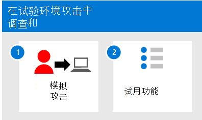

# 在试点环境中使用Microsoft 365 Defender和响应

**适用于：**
- Microsoft 365 Defender

本文概述了使用攻击模拟和教程创建事件并使用攻击Microsoft 365 Defender和响应的过程。 在开始此过程之前，请确保你已查看评估项目Microsoft 365 Defender并且已创建Microsoft 365 Defender[评估环境](eval-create-eval-environment.md)。

使用以下步骤。

下表介绍了图中的步骤。

|步骤  |说明  |
|---------|---------|
| 1. [模拟攻击](eval-defender-investigate-respond-simulate-attack.md)     |   模拟对评估环境的攻击，并使用 Microsoft 365 Defender门户执行事件响应。      |
| 2. [尝试事件响应功能 ](eval-defender-investigate-respond-additional.md)    |    尝试其他事件响应功能。Microsoft 365 Defender。     |
|||

### 可能需要的导航

[创建Microsoft 365 Defender评估环境](eval-create-eval-environment.md)
