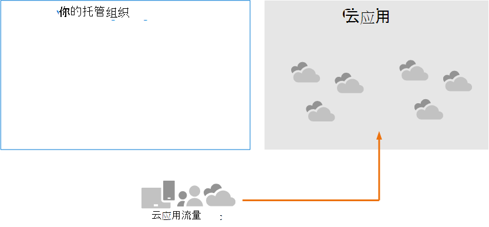
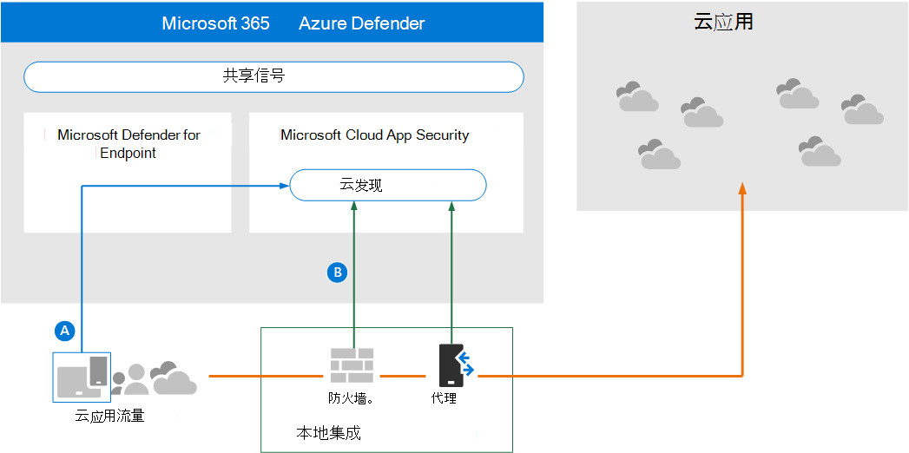
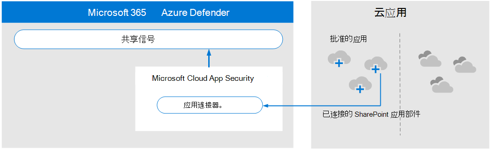
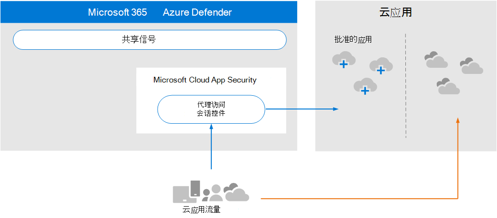
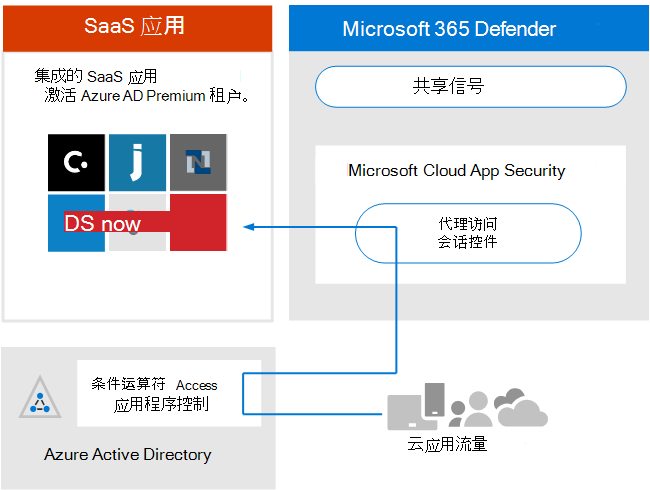

# 查看体系结构要求和解决方案的关键Microsoft Cloud App Security

**适用于：**

- Microsoft 365 Defender

本文是在设置评估环境的过程中第 1 步（第[3](eval-defender-mcas-overview.md)步）Microsoft Cloud App Security一Microsoft 365 Defender。 有关此过程详细信息，请参阅 [概述文章](eval-defender-identity-overview.md)。

在启用Microsoft Cloud App Security，请确保您了解体系结构并满足要求。 

## 了解体系结构

Microsoft Cloud App Security CASB (云访问安全代理) 。 CASB 充当网关守卫，在企业用户和用户使用的云资源之间实时代理访问，无论用户位于何处，无论他们使用何种设备。 Microsoft Cloud App Security与 Microsoft 的管理功能（包括安全Microsoft 365 Defender）。 

如果没有云应用安全，组织使用的云应用将不受管理且不受保护，如上所示。

在此图中：
- 组织使用云应用不受监控且不受保护。 
- 此使用超出在托管组织中实现的保护范围。 

#### 发现云应用

管理云应用使用的第一步是发现组织使用哪些云应用。 下图说明了云发现如何与云应用安全。

在此图中，有两种方法可用于监视网络流量和发现组织使用的云应用。
- 答： 云应用发现与 Microsoft Defender for Endpoint 本地集成。 Defender for Endpoint 报告从 IT 托管的 11 Windows 10和 Windows访问的云应用和服务。 
- B. 为了覆盖连接到网络的所有设备，云应用安全日志收集器安装在防火墙和其他代理上，以从终结点收集数据。 此数据将发送到云应用安全进行分析。

#### 管理云应用

在发现云应用并分析组织如何使用这些应用的行为后，你可以开始管理你选择的云应用。 

在此图中：
- 某些应用已批准使用。 这是开始管理应用的一种简单方法。
- 通过将应用与应用连接器连接，你可以实现更高的可见性和控制。 应用连接器使用应用提供程序的 API。

#### 将会话控件应用到云应用

Microsoft Cloud App Security充当反向代理，提供对批准的云应用的代理访问。 这允许云应用安全应用您配置的会话控件。 

在此图中：
- 组织中用户和设备对批准的云应用的访问权限通过 云应用安全。
- 此代理访问允许应用会话控件。
- 未批准或明确未批准的云应用不受影响。

会话控件允许你将参数应用于组织如何使用云应用。 例如，如果组织使用的是 Salesforce，可以配置仅允许托管设备访问 Salesforce 中组织数据的会话策略。 一个更简单的示例可能是将策略配置为监视来自非托管设备的流量，以便可以在应用更严格的策略之前分析此流量的风险。

#### 与 Azure AD 与条件访问应用控制集成

你可能已经将 SaaS 应用添加到 Azure AD 租户以强制执行多重身份验证和其他条件访问策略。 Microsoft Cloud App Security Azure AD 进行本机集成。 你只需在 Azure AD 中配置策略，以使用 Azure AD 中的条件访问应用云应用安全。 这将通过作为代理的 云应用安全路由这些托管 SaaS 应用的网络流量，这云应用安全监视此流量并应用会话控件。 

在此图中：
- SaaS 应用与 Azure AD 租户集成。 这允许 Azure AD 强制执行条件访问策略，包括多重身份验证。
- 将策略添加到 Azure Active Directory，以将 SaaS 应用的流量云应用安全。 策略指定要应用此策略的 SaaS 应用。 因此，在 Azure AD 强制执行适用于这些 SaaS 应用的任何条件访问策略后，Azure AD 会通过 () 代理云应用安全。
- 云应用安全监视此流量，并应用管理员配置的任何会话控制策略。 

你可能已使用尚未添加到 Azure AD 云应用安全发现和批准的云应用。 通过将这些云应用添加到 Azure AD 租户和条件访问规则的范围，可以利用条件访问应用控制。

#### 保护组织免受黑客攻击

云应用安全本身提供强大的保护。 但是，当与 Microsoft 365 Defender 的其他功能结合使用时，云应用安全向共享信号提供数据，这共同有助于阻止攻击。

从概述到本试点评估和试点指南，值得Microsoft 365 Defender此图示。 

专注于此图的右侧，Microsoft Cloud App Security异常行为，如无法旅行、凭据访问和异常下载、文件共享或邮件转发活动，并报告给安全团队。 因此，云应用安全有助于防止黑客横向移动和敏感数据的窃取。 Microsoft 356 Defender 将来自所有组件的信号关联在一起，以提供完整的攻击情景。

## 了解关键概念

下表确定了在评估、配置和部署Microsoft Cloud App Security。

|概念  |说明 |更多信息  |
|---------|---------|---------|
| 云应用安全仪表板 | 概述了有关组织的最重要的信息，并提供了深入调查的链接。        | [使用仪表板 ](/cloud-app-security/daily-activities-to-protect-your-cloud-environment)       |
| 条件访问应用控制    | 与 Identity Provider 和 IdP (反向代理体系结构) Azure AD 条件访问策略，并选择性地强制执行会话控制。        |  [使用条件访问Microsoft Cloud App Security控制保护应用](/cloud-app-security/proxy-intro-aad)       |
|  云应用程序目录   | 通过云应用目录，你可以全面了解超过 16，000 个云应用的 Microsoft 目录，这些应用根据 80 多个风险因素进行排名和评分。    |  [使用应用风险评分](/cloud-app-security/risk-score)       |
| 云发现仪表板    | 云发现可分析流量日志，旨在进一步深入了解云应用在组织中是如何使用的，并给出警报和风险级别。     |  [使用发现的应用   ](/cloud-app-security/discovered-apps)    |
|连接的应用 |云应用安全使用云到云集成、API 连接器以及利用条件应用访问控制实时访问和会话控件的连接应用提供端到端保护。 |[保护已连接的应用](/cloud-app-security/protect-connected-apps) |
| | | |

## 查看体系结构要求

### 发现云应用

若要发现环境中使用的云应用，你可以执行以下一项或两项操作：

- 与 Microsoft Defender for Endpoint 集成，快速启动并运行云发现。 通过此本机集成，你可以立即开始在 Windows 11 和 Windows 10 设备上、在网络外收集云流量数据。
- 若要发现已连接到网络的所有设备访问的所有云应用，云应用安全防火墙和其他代理上部署云日志收集器。 这将从终结点收集数据，并将其发送到云应用安全进行分析。 云应用安全与一些第三方代理进行本机集成，以使用更多功能。

这些选项包含在步骤 [2 中。启用评估环境](eval-defender-mcas-enable-eval.md)。 

### 将 Azure AD 条件访问策略应用于云应用

条件访问应用 (将条件访问策略应用于云应用) Azure AD 集成。 这不是开始使用 云应用安全。 我们鼓励你在试点阶段（步骤[3）中试用此步骤。试点Microsoft Cloud App Security](eval-defender-mcas-pilot.md)。

## SIEM 集成

你可以将Microsoft Cloud App Security SIEM 服务器或 Azure Sentinel 集成，以集中监视已连接应用中的警报和活动。 

此外，Azure Sentinel Microsoft Cloud App Security连接器，以便与 Azure Sentinel 进行更深入的集成。 这样，你不仅能够了解云应用，还可以获得复杂的分析，以识别和防御网络威胁，并控制数据传输方式。

- [通用 SIEM 集成](/cloud-app-security/siem)
- [将警报和云发现日志从 MCAS 流式传输至 Azure Sentinel](/azure/sentinel/connect-cloud-app-security)

### 后续步骤

步骤 2/3：[为用户启用Microsoft Cloud App Security](eval-defender-mcas-enable-eval.md)

返回到评估结果[概述Microsoft Cloud App Security](eval-defender-mcas-overview.md)

返回到评估和试点[计划概述Microsoft 365 Defender](eval-overview.md)