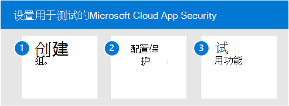

# 试用Microsoft Cloud App Security Microsoft 365 DefenderPilot Microsoft Cloud App Security with Microsoft 365 Defender

**适用于：****Applies to:**
- Microsoft 365 DefenderMicrosoft 365 Defender

本文是设置环境评估环境的第 3 步（第 3 步，第[3](eval-defender-mcas-overview.md)步Microsoft Cloud App Security）。This article is [Step 3 of 3](eval-defender-mcas-overview.md) in the process of setting up the evaluation environment for Microsoft Cloud App Security. 有关此过程详细信息，请参阅 [概述文章](eval-defender-mcas-overview.md)。For more information about this process, see the [overview article](eval-defender-mcas-overview.md).

使用以下步骤为用户设置和配置Microsoft Cloud App Security。Use the following steps to setup and configure the pilot for Microsoft Cloud App Security.

- 步骤 1.Step 1. [创建试点组 — 将试点部署的范围缩小到某些用户组Create the pilot group — Scope your pilot deployment to certain user groups](#step-1-create-the-pilot-group--scope-your-pilot-deployment-to-certain-user-groups)
- [步骤 2.配置保护 — 条件访问应用控制Step 2. Configure protection — Conditional Access App Control](#step-2-configure-protection--conditional-access-app-control)
- [步骤 3.试用功能 - 演练用于保护环境的教程Step 3. Try out capabilities — Walk through tutorials for protecting your environment](#step-3-try-out-capabilities--walk-through-tutorials-for-protecting-your-environment) 

## 步骤 1.Step 1. 创建试点组 — 将试点部署的范围缩小到某些用户组Create the pilot group — Scope your pilot deployment to certain user groups

Microsoft Cloud App Security允许您确定部署的范围。Microsoft Cloud App Security enables you to scope your deployment. 通过作用域，可以选择要监视的应用或排除在监视之外的某些用户组。Scoping allows you to select certain user groups to be monitored for apps or excluded from monitoring. 可以包括或排除用户组。You can include or exclude user groups. 若要确定试点部署的范围，请参阅 [作用域部署](/cloud-app-security/scoped-deployment)。To scope your pilot deployment, see [Scoped Deployment](/cloud-app-security/scoped-deployment).

## 步骤 2.Step 2. 配置保护 — 条件访问应用控制Configure protection — Conditional Access App Control

可以配置的最强大保护之一是条件访问应用控制。One of the most powerful protections you can configure is Conditional Access App Control. 这需要与 Azure AD Azure Active Directory (集成) 。This requires integration with Azure Active Directory (Azure AD). 它允许你将条件访问策略（包括相关策略 (如要求正常运行的设备) 已批准的云应用。It allows you to apply Conditional Access policies, including related policies (like requiring healthy devices), to cloud apps you've sanctioned. 

使用 Microsoft Cloud App Security管理 SaaS 应用的第一步是发现它们，然后将其添加到 Azure AD 租户。The first step in using Microsoft Cloud App Security to manage SaaS apps is to discover these and then add them to your Azure AD tenant. 如果需要发现帮助，请参阅 [发现和管理网络中 SaaS 应用](/cloud-app-security/tutorial-shadow-it)。If you need help with discovery, see [Discover and manage SaaS apps in your network](/cloud-app-security/tutorial-shadow-it). 发现应用后， [将其添加到 Azure AD 租户](/azure/active-directory/manage-apps/add-application-portal)。After you've discovered apps, [add these to your Azure AD tenant](/azure/active-directory/manage-apps/add-application-portal).

可以通过执行以下操作开始管理这些操作：You can begin to manage these by doing the following:

- 首先，在 Azure AD 中，创建新的条件访问策略，并配置为"使用条件访问应用控制"。First, in Azure AD, create a new conditional access policy and configure it to "Use Conditional Access App Control." 这会将请求重定向到云应用安全。This redirects the request to Cloud App Security. 你可以创建一个策略，并添加所有 SaaS 应用到此策略。You can create one policy and add all SaaS apps to this policy.
- 接下来，在云应用安全，创建会话策略。Next, in Cloud App Security, create session policies. 为要应用的每个控件创建一个策略。Create one policy for each control you want to apply.

有关详细信息，包括受支持的应用和客户端，请参阅使用条件访问应用Microsoft Cloud App Security[保护应用](/cloud-app-security/proxy-intro-aad)。For more information, including supported apps and clients, see [Protect apps with Microsoft Cloud App Security Conditional Access App Control](/cloud-app-security/proxy-intro-aad). 

有关示例策略，请参阅[适用于 SaaS Microsoft Cloud App Security推荐策略](../office-365-security/mcas-saas-access-policies.md)。For example policies, see [Recommended Microsoft Cloud App Security policies for SaaS apps](../office-365-security/mcas-saas-access-policies.md). 这些策略基于一组 [常见标识](../office-365-security/microsoft-365-policies-configurations.md) 和设备访问策略，这些策略建议作为所有客户的起点。These policies build on a set of [common identity and device access policies](../office-365-security/microsoft-365-policies-configurations.md) that are recommended as a starting point for all customers. 

## 步骤 3.Step 3. 试用功能 - 演练用于保护环境的教程Try out capabilities — Walk through tutorials for protecting your environment 

本指南Microsoft Cloud App Security包括一系列教程，可帮助你发现风险和保护环境。The Microsoft Cloud App Security documentation includes a series of tutorials to help you discover risk and protect your environment. 

请尝试云应用安全教程：Try out Cloud App Security tutorials:

- [检测可疑用户活动Detect suspicious user activity](/cloud-app-security/tutorial-suspicious-activity)
- [调查有风险的用户Investigate risky users](/cloud-app-security/tutorial-ueba)
- [调查有风险的 OAuth 应用Investigate risky OAuth apps](/cloud-app-security/investigate-risky-oauth)
- [发现和保护敏感信息Discover and protect sensitive information](/cloud-app-security/tutorial-dlp)
- [实时保护组织的任何应用Protect any app in your organization in real time](/cloud-app-security/tutorial-proxy)
- [阻止下载敏感信息Block downloads of sensitive information](/cloud-app-security/use-case-proxy-block-session-aad)
- [使用管理员隔离保护文件Protect your files with admin quarantine](/cloud-app-security/use-case-admin-quarantine)
- [在有风险的操作时要求执行逐步身份验证Require step-up authentication upon risky action](/cloud-app-security/tutorial-step-up-authentication)

## 后续步骤Next steps

[在试点环境中使用Microsoft 365 Defender和响应Investigate and respond using Microsoft 365 Defender in a pilot environment](eval-defender-investigate-respond.md)

返回到评估结果[概述Microsoft Cloud App Security](eval-defender-mcas-overview.md)Return to the overview for [Evaluate Microsoft Cloud App Security](eval-defender-mcas-overview.md)

返回到评估和试点[计划概述Microsoft 365 Defender](eval-overview.md)Return to the overview for [Evaluate and pilot Microsoft 365 Defender](eval-overview.md)