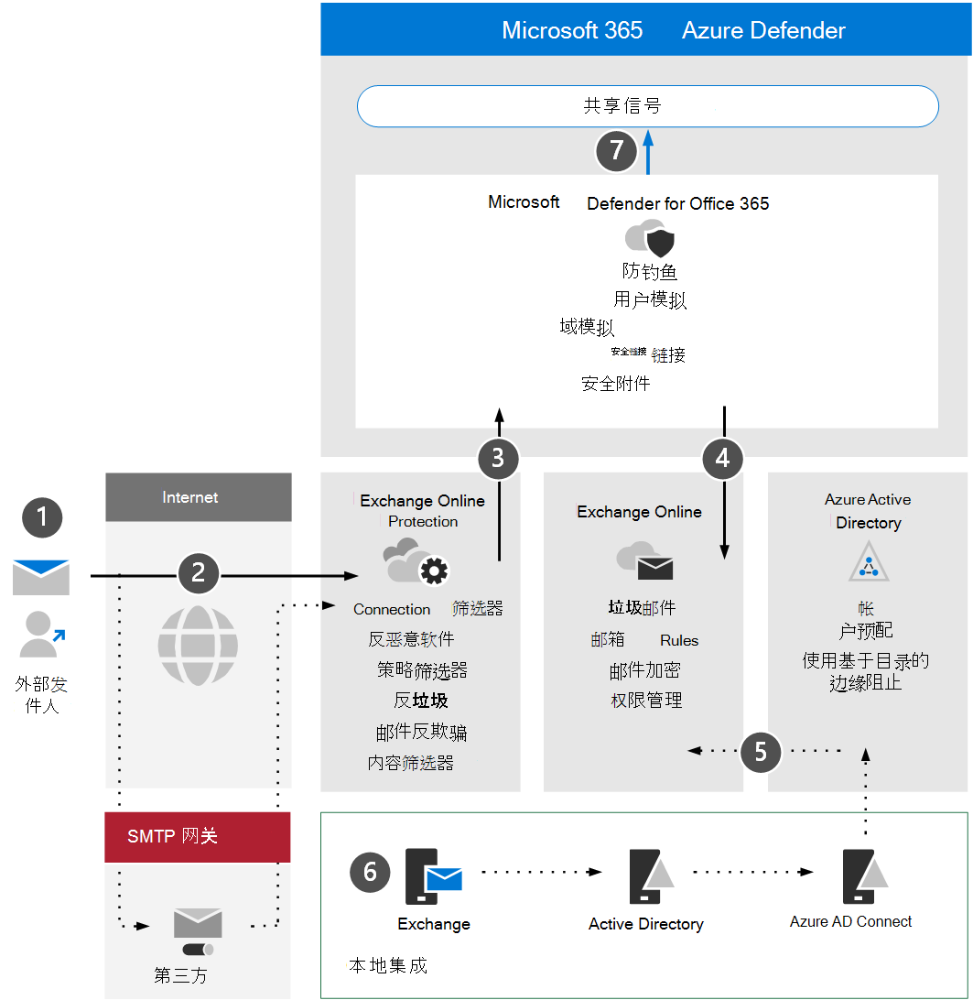

# 查看 Microsoft Defender Office 365体系结构要求和关键概念

**适用于：**
- Microsoft 365 Defender

本文是设置 Microsoft Defender for Office 365 评估环境过程中的第 1 步（第[3](eval-defender-office-365-overview.md) Office 365）。 有关此过程详细信息，请参阅 [概述文章](eval-defender-office-365-overview.md)。

在启用 Defender for Office 365，请确保你了解体系结构并满足要求。 本文介绍您的环境必须满足的体系结构Exchange Online概念和先决条件。

## 了解体系结构

下图说明了 Microsoft Defender for Office 的基准体系结构，其中可能包括第三方 SMTP 网关或本地集成。 混合共存方案 (，即生产邮箱为内部部署和联机) 配置需要更复杂的配置，本文或评估指南中未介绍。

下表描述了此图。

|呼叫  |说明  |
|---------|---------|
|1     | 外部发件人的主机服务器通常会对 MX 记录执行公共 DNS 查找，该记录为目标服务器提供中继邮件的目标服务器。  此引用可以是直接Exchange Online (EXO) 或已配置为针对 EXO 中继的 SMTP 网关。  |
|2     | Exchange Online Protection协商并验证入站连接，并检查邮件头和内容以确定需要其他哪些策略、标记或处理。  |
|3     | Exchange Online与 Microsoft Defender for Office 365集成，以提供更高级的威胁防护、缓解和修正。 |
|4     | 在 EXO 中，非恶意邮件、阻止邮件或隔离邮件被处理并传递到收件人，其中评估并触发了与垃圾邮件、邮箱规则或其他设置相关的用户首选项。 |
|5     | 可以使用 Azure AD 连接 启用与本地 Active Directory 的集成，以同步和设置启用邮件的对象和帐户以Azure Active Directory并最终Exchange Online。 |
|6      | 在集成内部部署环境时，强烈建议使用 Exchange 服务器对与邮件相关的属性、设置和配置进行受支持的管理 |
|7      | Microsoft Defender for Office 365向 Microsoft 365 Defender 发送信号，以在 XDR (进行扩展) 。|

本地集成很常见，但是可选的。 如果你的环境是仅云环境，本指南也将适合你。

## 了解关键概念

下表确定了在评估、配置和部署 MDO 时必须了解的重要概念。

|概念  |说明 |更多信息  |
|---------|---------|---------|
|Exchange Online Protection      |    Exchange Online Protection (EOP) 是基于云的筛选服务，可帮助保护组织免受垃圾邮件和恶意软件电子邮件的攻击。 EOP 包含在所有Microsoft 365许可证中，其中包括Exchange Online。     |   [Exchange Online Protection 概述](../office-365-security/exchange-online-protection-overview.md)      |
|反恶意软件保护     |    在 EXO 中拥有邮箱的组织将自动受到恶意软件的攻击。     |  [EOP 中的反恶意软件保护](../office-365-security/anti-malware-protection.md)       |
|反垃圾邮件保护     |   在 EXO 中拥有邮箱的组织会自动受到垃圾邮件和垃圾邮件策略的保护。      |  [EOP 中的反垃圾邮件保护](../office-365-security/anti-spam-protection.md)       |
|防钓鱼保护 |  MDO 提供与网络钓鱼、网络钓鱼、勒索软件和其他恶意活动相关的更高级防钓鱼保护。   | [Microsoft Defender for Office 365 中的其他反网络钓鱼保护](../office-365-security/anti-phishing-protection.md)   |
|防欺骗保护     |   EOP 包括可帮助保护组织免受欺骗 (伪造) 攻击的功能。      |   [EOP 中的防欺骗防护](../office-365-security/anti-spoofing-protection.md)      |
|安全附件     |   保险箱附件通过使用虚拟环境在电子邮件中检查和"触发"附件，然后再传递它们，提供一层额外的保护。      |   [保险箱 Microsoft Defender for Office 365](../office-365-security/safe-attachments.md)      |
|保险箱、SharePoint、OneDrive 和 Microsoft Teams     |    此外，保险箱、SharePoint、OneDrive 和 Microsoft Teams 的附件功能为已上载到云存储存储库的文件提供额外的保护层。     |  [用于 SharePoint、OneDrive 和 Microsoft Teams 的安全附件](../office-365-security/mdo-for-spo-odb-and-teams.md)       |
|安全链接     | 保险箱链接是一项功能，该功能在入站电子邮件中提供 URL 扫描和重写，并提供在传递或单击这些链接之前验证这些链接的功能。        |   [保险箱 Microsoft Defender for Office 365](../office-365-security/safe-links.md)      |
|    |         |         |

有关 Microsoft Defender for Office 中包含的功能的更多详细信息，请参阅 Microsoft [Defender for Office 365 service description](/office365/servicedescriptions/office-365-advanced-threat-protection-service-description)。

## 查看体系结构要求
成功的 MDO 评估或生产试点需要满足以下先决条件：
- 所有收件人邮箱当前都处于Exchange Online。
- 公共 MX 记录直接解析为 EOP 或第三方 SMTP 网关，然后直接将入站外部电子邮件中继到 EOP。
- 主要电子邮件域在 *电子邮件中配置为* Exchange Online。
- 您已成功部署和配置基于 *目录* 的边缘阻止 (DBEB) 配置。 有关详细信息，请参阅使用边缘 [Directory-Based拒绝发送给无效收件人的邮件](/exchange/mail-flow-best-practices/use-directory-based-edge-blocking)。

> [!IMPORTANT]
> 如果这些要求不适用或你仍在混合共存方案中，则 Microsoft Defender for Office 365 评估可能需要更复杂的或高级配置，而本指南未完全涵盖这些配置。

## SIEM 集成

你可以将 Microsoft Defender for Office 365 Microsoft Sentinel 集成，以更全面的分析整个组织的安全事件，并生成有效且即时响应的手册。 有关详细信息，请参阅连接[Microsoft Defender for Office 365 警报](/azure/sentinel/connect-office-365-advanced-threat-protection)。

Microsoft Defender for Office 365 还可以集成到其他安全信息和事件管理 (SIEM) 解决方案（使用 Office 365[活动管理 API）。](/office/office-365-management-api/office-365-management-activity-api-reference)

## 后续步骤

步骤 2/3：[启用评估](eval-defender-office-365-enable-eval.md)环境 Microsoft Defender for Office 365

返回到评估 Microsoft [Defender for Office 365](eval-defender-office-365-overview.md)

返回到评估和试点[计划概述Microsoft 365 Defender](eval-overview.md) 
