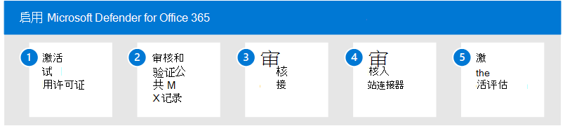

# 启用评估环境Enable the evaluation environment

**适用于：****Applies to:**
- Microsoft 365 DefenderMicrosoft 365 Defender

本文是设置 Microsoft Defender for Office 365 评估环境过程中的第 2 步（第[3](eval-defender-office-365-overview.md) Office 365）。This article is [Step 2 of 3](eval-defender-office-365-overview.md) in the process of setting up the evaluation environment for Microsoft Defender for Office 365. 有关此过程详细信息，请参阅 [概述文章](eval-defender-office-365-overview.md)。For more information about this process, see the [overview article](eval-defender-office-365-overview.md).

使用以下步骤启用 Microsoft Defender for Office 365。Use the following steps to enable the evaluation for Microsoft Defender for Office 365.

- [步骤 1：激活试用许可证Step 1: Activate trial licenses](#step-1-activate-trial-licenses)
- [步骤 2：审核和验证公共 MX 记录Step 2: Audit and verify the public MX record](#step-2-audit-and-verify-the-public-mx-record)
- [步骤 3：审核接受的域Step 3: Audit accepted domains](#step-3-audit-accepted-domains)
- [步骤 4：审核入站连接器Step 4: Audit inbound connectors](#step-4-audit-inbound-connectors)
- [步骤 5：激活评估Step 5: Activate the evaluation](#step-5-activate-the-evaluation)

## 步骤 1：激活试用许可证Step 1: Activate trial licenses

登录到现有 Microsoft Defender for Office 365或租户管理门户。Log on to your existing Microsoft Defender for Office 365 environment or tenant administration portal.

1. 导航到管理门户。Navigate to the administration portal.
2. 从快速启动中选择"购买服务"。Select Purchase Services from the quick launch.

:::image type="content" source="../../media/mdo-eval/1_m365-purchase-services.png" alt-text="单击导航窗格上的&quot;购买服务&quot;Office 365。":::

3.  向下滚动到"Add-On"部分 (或搜索"Defender") 找到 Microsoft Defender for Office 365 计划。Scroll down to the Add-On section (or search for "Defender") to locate the Microsoft Defender for Office 365 plans.
4.  单击要评估的计划旁边的"详细信息"。Click Details next the plan you want to evaluate.

:::image type="content" source="../../media/mdo-eval/2_mdo-eval-license-details.png" alt-text="单击&quot;详细信息&quot;按钮，下一步。":::

5. 单击" *开始免费试用"* 链接。Click the *Start free trial* link.

:::image type="content" source="../../media/mdo-eval/3-m365-purchase-button.png" alt-text="单击此面板上的&quot;开始免费试用 *超链接*&quot;。":::

6. 确认请求并单击"立即 *尝试"* 按钮。Confirm your request and click the *Try now* button.

:::image type="content" source="../../media/mdo-eval/4_mdo-trial-order.png" alt-text="现在，单击&quot;立即尝试 *&quot;按钮*。":::

## 步骤 2：审核和验证公共 MX 记录Step 2: Audit and verify the public MX record

若要有效评估 Microsoft Defender Office 365，必须经过与租户关联的 Exchange Online Protection (EOP) 中继入站外部电子邮件。To effectively evaluate Microsoft Defender for Office 365, it's important that inbound external email be relayed through the Exchange Online Protection (EOP) instance associated with your tenant.

1. 登录到 M365 管理门户，展开"设置"，然后选择"域"。Log on to the M365 Admin Portal, expand Settings, and select Domains.
2. 选择已验证的电子邮件域，然后单击"管理 DNS"。Select your verified email domain and click Manage DNS.
3. 记下生成并分配给 EOP 租户的 MX 记录。Make note of the MX record generated and assigned to your EOP tenant.
4. 访问外部 (DNS) ，并检查与您的电子邮件域关联的主 MX 记录。Access your external (public) DNS zone and check the primary MX record associated with your email domain.
    - *如果公共 MX 记录当前与分配的 EOP* 地址匹配 (例如 tenant-com.mail.protection.outlook.com) ，则不需要进一步路由更改。*If your public MX record currently matches the assigned EOP address (e.g. tenant-com.mail.protection.outlook.com) then no further routing changes should be required*.
    - 如果公共 MX 记录当前解析为第三方或本地 SMTP 网关，可能需要其他路由配置。If your public MX record currently resolves to a third-party or on-premises SMTP gateway then additional routing configurations may be required.
    - 如果公共 MX 记录当前解析为本地Exchange则您可能仍在混合模型中，其中某些收件人邮箱尚未迁移到 EXO。If your public MX record currently resolves to on-premises Exchange then you may still be in a hybrid model where some recipient mailbox have not yet been migrated to EXO.

## 步骤 3：审核接受的域Step 3: Audit accepted domains

1. 登录管理Exchange Online，选择"邮件Flow，然后单击"接受域"。Log on the Exchange Online Admin Portal, select Mail Flow, and then click Accepted Domains.
2. 在租户中添加并验证的接受域列表中，记下 **主电子邮件域** 的域类型。From the list of accepted domains that have been added and verified in your tenant, make note of the **domain type** for your primary email domain.
    - 如果域类型设置为 ***"*** 权威"，则假定组织的所有收件人邮箱当前都位于Exchange Online。If the domain type is set to ***Authoritative*** then it is assumed all recipient mailboxes for your organization currently reside in Exchange Online.
    - 如果域类型设置为" ***内部*** 中继"，则您可能仍在混合模型中，其中某些收件人邮箱仍驻留在本地。If the domain type is set to ***Internal Relay*** then you may still be in a hybrid model where some recipient mailboxes still reside on-premises.

## 步骤 4：审核入站连接器Step 4: Audit inbound connectors

1. 登录管理Exchange Online，选择"邮件Flow，然后单击"连接器"。Log on the Exchange Online Admin Portal, select Mail Flow, and then click Connectors.
2. 从配置的连接器列表中，记下来自合作伙伴组织且可能与第三方 SMTP 网关关联的任何条目。From the list of configured connectors, make note of any entries which are from **Partner Organization** and may correlate to a third-party SMTP gateway.
3. 从已配置的连接器列表中，记下组织的电子邮件服务器中标记的任何条目，这些条目可能指示你仍处于混合方案。From the list of configured connectors, make note of any entries labeled **From your organization's email server** which may indicate that you are still in hybrid scenario.

## 步骤 5：激活评估Step 5: Activate the evaluation

按照此处的说明从 microsoft Defender 门户Office 365 Microsoft Defender Microsoft 365 Defender评估。Use the instructions here to activate your Microsoft Defender for Office 365 evaluation from the Microsoft 365 Defender portal.

1. 使用有权访问租户门户的帐户登录到Microsoft 365 Defender门户。Log on to your tenant with an account that has access to the Microsoft 365 Defender portal.
2. 选择是否要将 Microsoft 365 Defender 门户作为 Microsoft Defender 管理的默认界面Office 365推荐 (Microsoft Defender) 。Choose whether you want to make the **Microsoft 365 Defender portal** your default interface for Microsoft Defender for Office 365 administration (recommended).

:::image type="content" source="../../media/mdo-eval/1_mdo-eval-activate-eval.png" alt-text="单击&quot;打开设置&quot;按钮以使用集中式和改进Microsoft 365 Defender门户进行管理。":::

3. From the navigation menu， select **Policies & Rules** under Email & *Collaboration*.From the navigation menu, select **Policies & Rules** under *Email & Collaboration*.

:::image type="content" source="../../media/mdo-eval/2_mdo-eval-activate-eval.png" alt-text="下面是指向策略&规则的电子邮件协作&图片。单击该按钮！":::

4. 在策略策略 *&仪表板上* ，单击威胁 **策略**。On the *Policy & Rules* dashboard, click **Threat Policies**.

:::image type="content" source="../../media/mdo-eval/3_mdo-eval-activate-eval.png" alt-text="策略策略策略&仪表板的图片和指向威胁策略的箭头。单击下一步！":::

5. 向下滚动到 *"其他策略"，* 然后选择"**评估 Defender Office 365** 磁贴。Scroll down to *Additional Policies* and select the **Evaluate Defender for Office 365** tile.

:::image type="content" source="../../media/mdo-eval/4_mdo-eval-activate-eval.png" alt-text="Eval Defender for Office 365磁贴显示它是跨电子邮件和协作矢量进行 30 &试用版。单击浏览。":::

6. 现在，选择是直接将外部电子邮件路由Exchange Online路由到第三方网关还是第三方网关或服务，然后单击"下一步"。Now choose whether external email routes to Exchange Online directly, or to a third-party gateway or service, and click Next.

:::image type="content" source="../../media/mdo-eval/5_mdo-eval-activate-eval.png" alt-text="Defender for Office 365将评估发送到你的邮箱Exchange Online邮件。提供现在如何路由邮件的详细信息，包括路由邮件的出站连接器的名称。如果您仅Exchange Online Protection (EOP) 您将没有连接器。选择我使用第三方或本地提供商之一，或者我仅使用 EOP。":::

7. 如果使用第三方网关，请从下拉列表中选择供应商名称以及与该解决方案关联的入站连接器。If you use a third-party gateway, select the vendor name from the drop-down along with the inbound connector associated with that solution. 列出答案后，单击"下一步"。When you've listed your answers, click Next.

:::image type="content" source="../../media/mdo-eval/6-mdo-eval-activate-eval-settings.png" alt-text="在此对话框中，选择组织使用的第三方供应商服务，或选择&quot;*其他*&quot;。下一个对话框中，选择入站连接器。然后单击&quot;下一步&quot;。":::

8. 查看设置并单击"创建 **评估"** 按钮。Review your settings and click the **Create Evaluation** button.

|  |  |
|---------|---------|
|  :::image type="content" source="../../media/mdo-eval/7-mdo-eval-activate-review.png" alt-text="此窗格有一个下拉列表，用于查看你的设置。如果需要，它还具有&quot;编辑路由类型&quot;的可单击链接。准备好后，单击大蓝色&quot;创建评估&quot;按钮。":::   |   :::image type="content" source="../../media/mdo-eval/8-mdo-eval-activate-complete.png" alt-text="现在设置已完成。此页面上的蓝色按钮显示&quot;转到评估&quot;。":::      |

## 后续步骤Next steps

步骤 3/3：设置 Microsoft Defender for Office 365Step 3 of 3: Set up the pilot for Microsoft Defender for Office 365

返回到评估 Microsoft [Defender](eval-defender-office-365-overview.md) for Office 365Return to the overview for [Evaluate Microsoft Defender for Office 365](eval-defender-office-365-overview.md)

返回到评估和试点[计划概述Microsoft 365 Defender](eval-overview.md)Return to the overview for [Evaluate and pilot Microsoft 365 Defender](eval-overview.md)