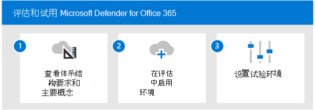

# 启用和试用 Microsoft Defender for Office 365

**适用于：**
- Microsoft 365 Defender

本文概述了启用和试用 Microsoft Defender for Office 365。 在开始此过程之前，请确保你已查看评估项目Microsoft 365 Defender并且已创建Microsoft 365 Defender[评估环境](eval-create-eval-environment.md)。  
 

使用以下步骤启用和试用 Microsoft Defender for Office 365。

下表介绍了图中的步骤。

| |步骤  |说明  |
|---------|---------|---------|
|1|[查看体系结构要求和关键概念](eval-defender-office-365-architecture.md)    | 了解 Defender for Office 体系结构，并确保Exchange Online环境满足体系结构先决条件。       |
|2|[启用评估环境](eval-defender-office-365-enable-eval.md)     |   按照步骤设置评估环境。      |
|3|[设置试点 ](eval-defender-office-365-pilot.md)    |    创建试点组、配置保护并熟悉关键功能和仪表板。     |
||||

