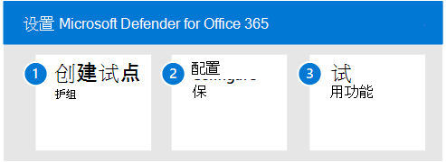

# 试用 Microsoft Defender for Office 365Pilot Microsoft Defender for Office 365
**适用于：****Applies to:**
- Microsoft 365 DefenderMicrosoft 365 Defender

本文是设置 Microsoft Defender for Office 365 评估环境过程中的第 3 步（第[3](eval-defender-office-365-overview.md) Office 365）。This article is [Step 3 of 3](eval-defender-office-365-overview.md) in the process of setting up the evaluation environment for Microsoft Defender for Office 365. 有关此过程详细信息，请参阅 [概述文章](eval-defender-office-365-overview.md)。For more information about this process, see the [overview article](eval-defender-office-365-overview.md).

使用以下步骤设置和配置 Microsoft Defender for Office 365。Use the following steps to setup and configure the pilot for Microsoft Defender for Office 365.

- [步骤 1：创建试点组Step 1: Create pilot groups](#step-1-create-pilot-groups)
- [步骤 2：配置保护Step 2: Configure protection](#step-2-configure-protection)
- [步骤 3：试用功能 - 熟悉模拟、监视和指标Step 3: Try out capabilities — Get familiar with simulation, monitoring, and metrics](#step-3-try-out-capabilities--get-familiar-with-simulation-monitoring-and-metrics)

评估 Microsoft Defender Office 365时，你可以选择先试点特定用户，然后再为整个组织启用和实施策略。When you evaluate Microsoft Defender for Office 365, you may choose to pilot specific users before enabling and enforcing policies for your entire organization. 创建通讯组可帮助管理部署过程。Creating distribution groups can help manage the deployment processes. 例如，创建 Defender *for Office 365 Users - Standard Protection、Defender* for Office 365 Users - Strict *Protection、Defender* *for Office 365 Users - Custom Protection* 或 Defender for Office 365 Users *- Exceptions 等* 组。For example, create groups such as *Defender for Office 365 Users - Standard Protection*, *Defender for Office 365 Users - Strict Protection*, *Defender for Office 365 Users - Custom Protection*, or *Defender for Office 365 Users - Exceptions*.

为何"标准"和"严格"是用于此术语的术语可能并不明显，但在你浏览更多有关 Defender for Office 365安全预设时，这一点将变得清晰。It may not be evident why 'Standard' and 'Strict' are the terms used for this, but that will become clear when you explore more about Defender for Office 365 security presets. 命名组"自定义"和"例外"代表自己，尽管大多数用户都应在标准和严格下，但自定义和例外组将收集关于管理风险的有价值的数据。Naming groups 'custom' and 'exceptions' speak for themselves, and though most of your users should fall under *standard* and *strict*, custom and exception groups will collect valuable data for you regarding managing risk.

## 步骤 1：创建试点组Step 1: Create pilot groups

通讯组可以直接在本地 Active Directory 中创建和Exchange Online或同步。Distribution groups can be created and defined directly in Exchange Online or synchronized from on-premises Active Directory.

1. 使用已Exchange或 (组管理权限) 帐户登录到 EAC 管理中心。Logon to Exchange Admin Center (EAC) using an account that has been granted Recipient Administrator role or been delegated group management permissions.
2. 从导航菜单中，展开 *"收件人"，* 然后选择"组 *"。*From the navigation menu, expand *Recipients* and select *Groups*.

:::image type="content" source="../../media/mdo-eval/1_mdo-eval-pilot.png" alt-text="Exchange导航菜单上的&quot;管理中心 (&quot;) &quot;组&quot;箭头单击&quot;快速启动&quot;菜单。单击&quot;组&quot;。":::

3. 从组仪表板中，选择"添加组"。From the Groups dashboard, select "Add a group".

:::image type="content" source="../../media/mdo-eval/2_mdo-eval-pilot-add-group.png" alt-text="在&quot;组&quot;面板上添加组。":::

4. 对于组类型，选择" *分发"，* 然后单击"下一步"。For group type, select *Distribution* and click Next.

:::image type="content" source="../../media/mdo-eval/3-mdo-eval-pilot-group-type.png" alt-text="在此处选择通讯组类型。":::

5. 为组指定名称和说明，然后单击"下一步"。Give the group a name and description and then click Next.

:::image type="content" source="../../media/mdo-eval/4_mdo-eval-pilot-set-up-basics.png" alt-text="命名并描述组。":::

## 步骤 2：配置保护Step 2: Configure protection

默认情况下，Defender for Office 365中的某些功能已配置并打开，但安全操作可能需要从默认级别提升保护级别。Some capabilities in Defender for Office 365 are configured and turned on by default, but security operations may want to raise the level of protection from the default.

某些功能 *尚未* 配置。Some capabilities are *not yet* configured. 有三个选项用于配置保护：You have three options for configuring protection:

- **自动分配预设安全策略**[—](../office-365-security/preset-security-policies.md)预设安全策略作为一种方法提供，可快速在所有功能之间分配统一的保护级别。**Assign preset security policies automatically** — [Preset security policies](../office-365-security/preset-security-policies.md) are provided as a method to quickly assign a uniform level of protection across all of the capabilities. 可以从标准 _ \**_或_ _ _strict_*中选择\*\*\*。You can choose from **_standard_*_ or _*_strict_**. 一个好方法是从预设安全策略开始，然后在你了解有关功能和你自己的独特威胁环境更多信息时微调策略。A good approach is to start with preset security policies and then fine-tune the policies as you learn more about the capabilities and your own unique threat environment. 此处的优势在于，您可以尽快保护用户组，并随后调整保护。The advantage here is that you protect groups of users as quickly as possible, with the ability to tweak protection afterward.  (建议使用此方法。) (This method is recommended.)
- **手动配置基线保护**- 如果你更喜欢自己配置环境，可以按照防止威胁中的指南快速 [实现保护基线](../office-365-security/protect-against-threats.md)。**Configure baseline protection manually** — If you prefer to configure the environment yourself, you can quickly achieve a *baseline* of protection by following the guidance in [Protect against threats](../office-365-security/protect-against-threats.md). 通过此方法，您可以了解有关可配置设置的信息。With this approach you get to learn more about the settings that are configurable. 当然，您稍后可以微调策略。And, of course, you can fine-tune the policies later.
- **配置 *自定义* 保护策略** — 还可以生成和分配自定义保护策略作为评估的一部分。**Configure *custom* protection policies** — You can also build and assign custom protection policies as part of your evaluation. 在开始自定义策略之前，必须了解应用和强制执行这些保护策略的优先级。Before you start customizing policies, it's important to understand the precedence in which these protection policies are applied and enforced. 即使应用了预设，安全操作也需要创建一些策略，以便为"链接"和"附件"保险箱安全策略保险箱策略。Security ops will need to create some policies even if when the preset is applied, in specific in order to define security policies for Safe Links and Safe Attachments.

> [!IMPORTANT]
> **如果需要配置** 自定义保护策略，应检查此处标准安全定义和严格安全定义的值 *[：EOP](../office-365-security/recommended-settings-for-eop-and-office365.md)* 和 Microsoft Defender 的推荐设置Office 365安全。  **If you need to configure custom protection policies**, you should examine the values that make up the **Standard** and **Strict** security definitions here: *[Recommended settings for EOP and Microsoft Defender for Office 365 security](../office-365-security/recommended-settings-for-eop-and-office365.md)*. 还会列出默认值，如发生任何配置之前所见。Default values, as seen before  any configuration takes place are also listed. 保留自定义内部版本偏离位置的电子表格。Keep a spreadsheet of where your custom build deviates.

### 分配预设安全策略Assign preset security policies

建议在评估 MDO 时先从推荐的基准策略开始，然后在评估期间根据需要细化这些策略。It's encouraged to begin with the *recommended baseline policies* when evaluating MDO and then refine them as needed over the course of your evaluation period.

你可以快速启用推荐的 EOP 和 Defender Office 365保护策略，并将其分配给特定试点用户或定义的组作为评估的一部分。You can enable recommended EOP and Defender for Office 365 protection policies fast, and assign them to specific pilot users or defined groups as part of your evaluation. 预设策略提供基线 **标准** 保护模板或 **更主动的** 严格保护模板，可单独分配或组合使用。Preset policies offer a baseline **Standard** protection template or a more aggressive **Strict** protection template which can be assigned independently, or combined.

下面是概述[步骤的 Preset security policies in EOP and Microsoft Defender for Office 365](../office-365-security/preset-security-policies.md)一文。Here is the [Preset security policies in EOP and Microsoft Defender for Office 365](../office-365-security/preset-security-policies.md) article outlining the steps.

1. 登录到你的 Microsoft 365 租户。Log on to your Microsoft 365 tenant. 使用有权访问 Microsoft 365 Defender 门户的帐户、添加到 Office 365 中的组织管理角色或 Microsoft 365。Use an account with access to the Microsoft 365 Defender portal, added to Organization Management role in Office 365, or Security Administrator role in Microsoft 365.
2. 从导航菜单中，选择"电子邮件 *&协作"* 下的"&规则"。From the navigation menu, select *Polices & Rules* under Email & Collaboration.

:::image type="content" source="../../media/mdo-eval/5_mdo-eval-pilot-policies.png" alt-text="在导航&&quot;电子邮件和协作&quot;下，单击&quot;策略&规则&quot;。":::

3. 在策略策略&仪表板上，单击威胁 *策略*。On the Policy & Rules dashboard, click *Threat Policies*.

:::image type="content" source="../../media/mdo-eval/6-mdo-eval-pilot-threat-policies.png" alt-text="a":::

4. 从Microsoft 365 Defender门户中，从导航菜单中展开"威胁管理"，然后从子菜单中选择"策略"。From the Microsoft 365 Defender portal, expand Threat Management from the navigation menu and then select Policy from the submenu.
5. 在策略仪表板上，单击 *预设安全策略*。On the Policy dashboard, click *Preset security policies*.

:::image type="content" source="../../media/mdo-eval/7-mdo-eval-pilot-template-policies.png" alt-text="单击&quot;预设安全策略&quot;磁贴。":::

6. 单击 *"编辑* "以配置和分配标准策略和/或严格策略。Click *Edit* to configure and assign the Standard policy and/or Strict policy. :::image type="content" source="../../media/mdo-eval/8-mdo-eval-pilot-preset.png" alt-text="在&quot;预设安全策略&quot;面板上，单击&quot;编辑&quot;。":::
7. 根据需要添加条件以将基线 ***EOP** _ 保护应用于特定试点用户或用户组，然后选择"_Next*"继续。Add conditions to apply baseline ***EOP** _ protections to specific pilot users, or groups of users, as needed, and select _Next* to continue.
    - 例如，如果收件人是 Office 365 Standard Protection 组的已定义 Defender 的成员，然后只需向该组添加帐户或删除帐户，就可以管理试点评估的 Defender for *Office 365* 条件。Example, a Defender for Office 365 condition for pilot evaluations could be applied if the recipients are *members* of a defined *Defender for Office 365 Standard Protection* group, and then managed by simply adding accounts to, or removing account from, the group.
 :::image type="content" source="../../media/mdo-eval/9-mdo-eval-pilot-eop-protections.png" alt-text="向试点组添加将 EOP 安全级别应用所需的条件。":::

8. 根据需要添加条件以将基线 \***MDO** _ 保护应用于特定试点用户或用户组。Add conditions to apply baseline \***MDO** _ protections to specific pilot users, or groups of users, as needed. 单击_Next\*继续。Click _Next\* to continue.
    - 例如，如果收件人是 Office 365 Standard Protection 定义的 Defender 组的成员，然后只需通过组添加/删除帐户进行管理，就可以应用适用于试点评估的 Defender for *Office 365* 条件。For example, a Defender for Office 365 condition for pilot evaluations could be applied if the recipients are *members* of a defined *Defender for Office 365 Standard Protection* group and then managed by simply adding / removing accounts via the group.
  :::image type="content" source="../../media/mdo-eval/10-mdo-eval-pilot-mdo-protections.png" alt-text="将应用 Defender for Office 365安全级别所需的条件添加到试点组。":::

9. 查看并确认更改以分配预设安全策略。Review and confirm your changes for assigning preset security policies.
10. 通过返回到 Microsoft 365 Defender 门户 > 策略 & 规则 > 威胁策略 > 并单击"预设安全策略"磁贴，可以管理预设保护策略 (重新配置、重新应用、禁用等 ) 。 Preset protection policies can be managed (re-configured, re-applied, disabled, etc.) by returning to the Microsoft 365 Defender portal > Policies & rules > Threat Policies > and clicking the *Preset security policies* tile.

### 配置自定义保护策略Configure custom protection policies

预定义的 *Standard* 或 *Strict* Defender for Office 365模板为试点用户提供推荐的基线保护。The pre-defined *Standard* or *Strict* Defender for Office 365 policy templates give your pilot users the recommended baseline protection. 但是，作为评估的一部分，还可以生成和分配自定义保护策略。However, you can also build and assign custom protection policies as part of your evaluation.

必须 *了解这些* 保护策略在应用和强制执行时所采用优先级，如电子邮件保护的顺序和优先级 - [Office 365说明。](../office-365-security/how-policies-and-protections-are-combined.md)It's *important* to be aware of the precedence these protection policies take when applied and enforced, as [Order and precedence of email protection - Office 365](../office-365-security/how-policies-and-protections-are-combined.md) explains.

下表提供了有关配置和分配自定义保护策略的参考和其他指南：The table below provides references and additional guidance for configuring and assigning custom protection policies:

|策略Policy   |说明Description  |参考Reference  |
|:---------:|---------|---------|
|连接筛选Connection Filtering     |    按 IP 地址标识好或坏的源电子邮件服务器。Identify good or bad source email servers by their IP addresses.     |     [在 EOP 中配置默认连接筛选器策略Configure the default connection filter policy in EOP](../office-365-security/configure-the-connection-filter-policy.md)    |
|反恶意软件Anti-Malware    |    保护用户免受电子邮件恶意软件的攻击，包括要采取的操作以及检测到恶意软件时要通知的用户。Protect users from email malware including what actions to take and who to notify if malware is detected.     |    [在 EOP 中配置反恶意软件策略Configure anti-malware policies in EOP](../office-365-security/configure-anti-malware-policies.md)     |
|反欺骗Anti-Spoofing     |  使用欺骗智能和欺骗智能见解保护用户免受欺骗尝试。Protect users from spoofing attempts using spoof intelligence and spoof intelligence insights.   |     [在 Defender for Office 365Configure spoof intelligence in Defender for Office 365](../office-365-security/learn-about-spoof-intelligence.md)    |
|反垃圾邮件Anti-Spam     |    防止用户收到垃圾电子邮件，包括检测到垃圾邮件时要采取的操作。Protect users from email spam including what actions to take if spam is detected.     |    [在 Defender for Office 365Configure anti-spam policies in Defender for Office 365](../office-365-security/configure-your-spam-filter-policies.md)     |
|防钓鱼Anti-Phishing     |   保护用户免受网络钓鱼攻击，并配置可疑邮件的安全提示Protect users from phishing attacks and configure safety tips on suspicious messages      |     [在 Defender for Office 365 中配置反钓鱼策略Configure anti-phishing policies in Defender for Office 365](../office-365-security/configure-mdo-anti-phishing-policies.md)    |
|安全附件Safe Attachments     |    保护用户免受电子邮件附件中的恶意内容以及电子邮件SharePoint、OneDrive和Teams。Protect users from malicious content in email attachments and files in SharePoint, OneDrive, and Teams.     |    [在 Defender for Office 365Set up safe attachment policies in Defender for Office 365](../office-365-security/set-up-safe-attachments-policies.md)     |
|安全链接Safe Links     |     防止用户在电子邮件或桌面应用中打开和共享Office链接。Protect users from opening and sharing malicious links in email messages or Office desktop apps.    |    [在 Defender for Office 365 中设置安全链接策略Set up safe links policies in Defender for Office 365](../office-365-security/set-up-safe-links-policies.md)     |

## 步骤 3：试用功能 - 熟悉模拟、监视和指标Step 3: Try out capabilities — Get familiar with simulation, monitoring, and metrics

现在，你的试点已设置和配置，熟悉 Microsoft Defender for Microsoft 365 独有的报告、监视和攻击模拟工具Microsoft 365。Now that your pilot is set up and configured, it's helpful to become familiar with the reporting, monitoring, and attack simulation tools that are unique to Microsoft Defender for Microsoft 365.

|功能Capability  |说明Description  |详细信息More information  |
|---------|---------|---------|
|威胁资源管理器Threat Explorer     | 威胁资源管理器是一个强大的近实时工具，可帮助安全运营团队调查和响应威胁，并显示有关 Office 365 中电子邮件和文件中可疑恶意软件和网络钓鱼的信息，以及组织面临的其他安全威胁和风险。Threat Explorer is a powerful near real-time tool to help Security Operations teams investigate and respond to threats and displays information about suspected malware and phish in email and files in Office 365, as well as other security threats and risks to your organization.        | [威胁资源管理器中的视图和实时检测 Views in Threat Explorer and real-time detections ](../office-365-security/threat-explorer-views.md)       | 
|攻击模拟器Attack Simulator     | 可以使用 Microsoft Defender 365 门户中的攻击模拟培训在组织中运行真实的攻击方案，这有助于你在真正的攻击影响你的环境之前识别和查找易受攻击的用户。You can use Attack Simulation Training in the Microsoft Defender 365 portal to run realistic attack scenarios in your organization which help you identify and find vulnerable users before a real attack impacts your environment.        |  [Microsoft Defender for Office 365 中的攻击模拟器Attack Simulator in Microsoft Defender for Office 365](../office-365-security/attack-simulator.md)       |
|报表仪表板Reports dashboard     | 在左侧导航菜单上，单击"报告"，然后展开"电子邮件&协作"标题。On the left navigation menu, click Reports and expand the Email & collaboration heading. Email & collaboration reports are about detectioning security trends some of which will allow you to take action (through buttons like 'Go to submissions') ， and others that will show trends， like Mailflow status summary， Top Malware， Spoof detections， Compromised users， Mail latency， 保险箱 Links and 保险箱 attachments reports.The Email & collaboration reports are about spotting security trends some of which will allow you to take action (through buttons like 'Go to submissions'), and others that will show trends, like Mailflow status summary, Top Malware, Spoof detections, Compromised users, Mail latency, Safe Links and Safe attachments reports. 这些指标是自动生成的。These metrics are generated automatically.  |    [查看报告View Reports](../office-365-security/view-email-security-reports.md)     |

## 后续步骤Next steps

[评估 Microsoft Defender for EndpointEvaluate Microsoft Defender for Endpoint](eval-defender-endpoint-overview.md)

返回到评估 Microsoft [Defender](eval-defender-office-365-overview.md) for Office 365Return to the overview for [Evaluate Microsoft Defender for Office 365](eval-defender-office-365-overview.md)

返回到评估和试点[计划概述Microsoft 365 Defender](eval-overview.md)Return to the overview for [Evaluate and pilot Microsoft 365 Defender](eval-overview.md)