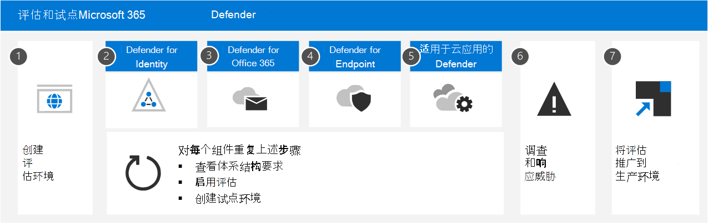

# 评估和试点 Microsoft 365 Defender

**适用于：**

- Microsoft 365 Defender

## 本系列文章的工作原理

本系列文章旨在逐步完成设置端到端试用 XDR 环境的整个过程，以便评估 Microsoft 365 Defender 甚至可以在准备就绪时直接将评估环境推广到生产环境。

如果你对 XDR 有新的了解，可以浏览这 7 篇链接的文章，了解解决方案的全面性。

- [如何创建环境](eval-create-eval-environment.md)
- 设置或了解此 Microsoft XDR 的每个技术
  - [Microsoft Defender for Identity](eval-defender-identity-overview.md)
  - [Microsoft Defender for Office](eval-defender-office-365-overview.md)
  - [Microsoft Defender for Endpoint](eval-defender-endpoint-overview.md)
  - [Microsoft Defender for Cloud Apps](eval-defender-mcas-overview.md)
- [如何使用此 XDR 调查和响应](eval-defender-investigate-respond.md)
- [将试用环境推广到生产环境](eval-defender-promote-to-production.md)

## Microsoft 365 Defender Microsoft XDR 网络安全解决方案

Microsoft 365 Defender 是一种电子数据检测与响应 **(XDR)** 解决方案，可自动收集、关联和分析来自 Microsoft 365 环境中的信号、威胁和警报数据，包括终结点、电子邮件、应用程序和标识。  它利用人工智能 (AI) 自动化来自动停止攻击，将受影响的资产修正为安全状态。

将 XDR 视为安全性的下一步，统一终结点 (终结点检测和响应，或将 EDR) 、电子邮件、应用和标识安全统一在一处。

## Microsoft 对评估Microsoft 365 Defender

Microsoft 建议在现有的生产订阅中创建评估Office 365。 这样，你将立即获得实际见解，并可以调整设置以针对环境中当前的威胁工作。 获得经验并熟悉该平台后，只需将每个组件（一次一个）推广到生产。

## 网络安全攻击剖析

Microsoft 365 Defender是基于云的统一、入侵前和入侵后企业防御套件。 它跨 *终结点、* 标识、应用、电子邮件、协作应用程序及其所有数据协调预防、检测、调查和响应。 

在此图中，攻击正在进行。 网络钓鱼电子邮件到达组织中员工的收件箱，该员工在无意中打开电子邮件附件。 这将安装恶意软件，从而导致一系列可能以敏感数据被盗结束的事件链。 但在这种情况下，Defender for Office 365运行。

在此图中：

- **Exchange Online Protection** 是 Microsoft Defender for Office 365 的一部分，它可以检测网络钓鱼电子邮件并使用邮件流规则确保它永远不会到达收件箱。
- **安全附件Office 365** 安全附件测试附件并确定附件是有害的，因此到达的邮件无法由用户操作，或者策略会阻止邮件到达。
- **Defender for Endpoint** 管理连接到企业网络的设备，并检测可能以其他方式被利用的设备和网络漏洞。
- **Defender for Identity** 记录突然的帐户更改，如特权升级或高风险横向移动。 它还报告轻松利用的身份问题，如不受约束的 Kerberos 委派，供安全团队更正。
- **Microsoft Defender for Cloud Apps** 注意到异常行为，如无法旅行、凭据访问和异常下载、文件共享或邮件转发活动，并报告给安全团队。

### Microsoft 365 Defender组件保护设备、标识、数据和应用程序

Microsoft 365 Defender由这些安全技术共同运行。 无需所有这些组件都受益于 XDR 和 Microsoft 365 Defender。 你还将通过使用一个或两个实现收益和效率。

|组件|说明|参考资料|
|---|---|---|
|Microsoft Defender for Identity|Microsoft Defender for Identity 使用 Active Directory 信号来识别、检测和调查针对你的组织的高级威胁、泄露的身份和恶意预览体验成员操作。|[什么是 Microsoft Defender for Identity?](/defender-for-identity/what-is)|
|Exchange Online Protection|Exchange Online Protection是基于云的本机 SMTP 中继和筛选服务，可帮助保护组织免受垃圾邮件和恶意软件的攻击。|[Exchange Online Protection (EOP) 概述 - Office 365](../office-365-security/overview.md)|
|Microsoft Defender for Office 365|Microsoft Defender for Office 365保护你的组织免受电子邮件、链接和 URL (和协作) 带来的威胁。|[Microsoft Defender for Office 365 - Office 365](../office-365-security/overview.md)|
|Microsoft Defender for Endpoint|Microsoft Defender for Endpoint 是设备保护、攻破后检测、自动调查和建议响应的统一平台。|[Microsoft Defender for Endpoint - Windows安全性](../defender-endpoint/microsoft-defender-endpoint.md)|
|Microsoft Defender for Cloud Apps|Microsoft Defender for Cloud Apps 是一个全面的跨 SaaS 解决方案，为云应用提供深入了解、强大的数据控制和增强的威胁防护。|[什么是 Defender for Cloud Apps 许可？](/cloud-app-security/what-is-cloud-app-security)|
|Azure AD Identity Protection|Azure AD Identity Protection 评估来自数十亿次登录尝试的风险数据，并使用此数据来评估每次登录环境的风险。 此数据由 Azure AD用于允许或阻止帐户访问，具体取决于如何配置条件访问策略。 Azure AD身份保护与组织单独Microsoft 365 Defender。 它包含在Azure Active Directory Premium P2。|[什么是标识保护？](/azure/active-directory/identity-protection/overview-identity-protection)|
||||

## Microsoft 365 Defender体系结构

下图说明了关键组件和集成Microsoft 365 Defender体系结构。 *本系列* 文章中提供了每个 Defender 组件的详细体系结构和用例方案。

在此图中：

- Microsoft 365 Defender来自所有 Defender 组件的信号，以跨域提供 XDR (扩展) 响应。 这包括统一的事件队列、自动响应以停止攻击、 (设备、用户标识和邮箱) 、跨威胁搜寻和威胁分析。
- Microsoft Defender for Office 365 可保护你的组织免受电子邮件、链接 (URL) 和协作工具带来的恶意威胁。 它将与组织共享由这些活动Microsoft 365 Defender。 Exchange Online Protection (EOP) 集成为传入电子邮件和附件提供端到端保护。
- Microsoft Defender for Identity 收集来自运行 Active Directory 联合服务 (AD FS) 和本地 Active Directory 域服务 (AD DS) 的服务器的信号。 它使用这些信号来保护混合标识环境，包括防止黑客使用遭到入侵的帐户在内部部署环境中跨工作站进行稍后移动。
- Microsoft Defender for Endpoint 收集来自组织使用的设备的信号并保护这些设备。
- Microsoft Defender for Cloud Apps 收集组织使用云应用的信号，并保护你的环境与这些应用之间的数据流，包括批准的和未批准的云应用。
- Azure AD Identity Protection 评估来自数十亿次登录尝试的风险数据，并使用此数据来评估每次登录环境的风险。 此数据由 Azure AD用于允许或阻止帐户访问，具体取决于如何配置条件访问策略。 Azure AD身份保护与组织单独Microsoft 365 Defender。 它包含在Azure Active Directory Premium P2。

## Microsoft SIEM 和 SOAR 可以使用来自 Microsoft 365 Defender

此图未包括其他可选体系结构组件：

- 来自所有 Microsoft 365 Defender 组件的详细信号数据可以集成到 **Microsoft Sentinel** 中，并与其他日志记录源结合使用，以提供完整的 SIEM 和 SOAR 功能和见解。
- **有关使用 Microsoft Sentinel（Azure SIEM**，Microsoft 365 Defender 作为 XDR）的更多阅读，请看一下此概述文章和 Microsoft  Sentinel 和 Microsoft 365 Defender [集成步骤](/azure/sentinel/connect-microsoft-365-defender?tabs=MDE)。
- 有关 Microsoft Sentinel (SOAR（包括指向 Microsoft Sentinel GitHub 存储库中的) ）的链接，请阅读[本文](/azure/sentinel/automate-responses-with-playbooks)。

## 网络安全评估Microsoft 365 Defender流程

Microsoft 建议按说明Microsoft 365启用以下组件：

下表描述了此图。

|步骤|链接|说明|
|---|---|---|
|1|[创建评估环境](eval-create-eval-environment.md)|此步骤可确保你拥有适用于你的Microsoft 365 Defender。|
|2|[启用 Defender for Identity](eval-defender-identity-overview.md)|查看体系结构要求、启用评估，并演练用于识别和修正不同攻击类型的教程。|
|3|[启用 Defender for Office 365](eval-defender-office-365-overview.md)|确保满足体系结构要求，启用评估，然后创建试点环境。 此组件包括Exchange Online Protection，因此你将在此处实际 *评估这两* 者。|
|4|[为终结点启用 Defender](eval-defender-endpoint-overview.md)|确保满足体系结构要求，启用评估，然后创建试点环境。|
|5|[启用 Microsoft Defender for Cloud Apps](eval-defender-mcas-overview.md)|确保满足体系结构要求，启用评估，然后创建试点环境。|
|6 |[调查并响应威胁](eval-defender-investigate-respond.md)|模拟攻击并开始使用事件响应功能。|
|7 |[将试用版提升到生产](eval-defender-promote-to-production.md)|将Microsoft 365组件一个一个地提升为生产。|
||||

这是通常推荐的顺序，旨在根据部署和配置功能通常需要多少工作量来快速利用功能的价值。 例如，可以在Office 365 Defender for Endpoint 中注册设备所花费的更少时间配置 Defender for Endpoint。 当然，您应该确定组件优先级以满足业务需求，并可以按不同顺序启用这些组件。

## 转到下一步

[了解和/或创建Microsoft 365 Defender评估环境](eval-create-eval-environment.md)
