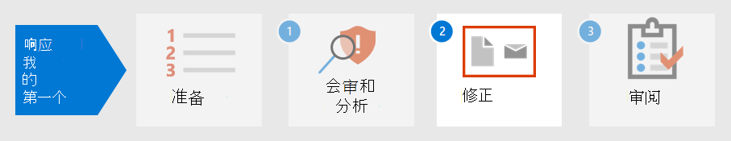

# 步骤 1. 会审和分析第一个事件

[!INCLUDE [Microsoft 365 Defender rebranding](../includes/microsoft-defender.md)]

**适用于：**
- Microsoft 365 Defender

当您花时间根据组织标准建立、实施和维护安全措施时，您可以设置安全解决方案来帮助快速识别安全风险和威胁。 Microsoft 365 Defender通过单窗格体验检测、会审和调查事件，您可以在其中找到及时做出决策时需要的信息。

检测到安全事件后，Microsoft 365 Defender详细信息，您需要对事件或事件进行会审，或将事件安排在其他人的优先级。 确定优先顺序后，分析员可以专注于调查分配给他们的情况。

## 按测试Microsoft 365 Defender

Microsoft 365 Defender多个 Microsoft 安全平台接收警报和事件作为检测源，以创建恶意活动的整体图片和上下文。 这些是可能的检测源：

- [Microsoft Defender for Endpoint](../defender-endpoint/microsoft-defender-endpoint.md) 是终结点检测和响应解决方案 (EDR) ，它使用 Microsoft Security Graph Microsoft Defender 防病毒和启用云的高级威胁Graph。 Defender for Endpoint 是一个统一的平台，用于预防性保护、攻破后检测、自动调查和响应。 它可保护终结点免受网络威胁的攻击，检测高级攻击和数据泄露，自动执行安全事件，并改进安全状况。
- [Microsoft Defender for Identity](/defender-for-identity/what-is) 是一种基于云的安全解决方案，它使用本地 Active Directory 域服务 (AD DS) 信号来识别、检测和调查针对你的组织的高级威胁、泄露的身份和恶意内部操作。
- [Microsoft Defender for Cloud Apps](/cloud-app-security/) 充当网关守卫，在企业用户和用户使用的云资源之间实时代理访问，无论用户位于何处，无论他们使用何种设备。
- [Microsoft Defender for Office 365](../office-365-security/overview.md)保护你的组织免受电子邮件、链接 (URL) 和协作工具中的恶意威胁。
- [Azure 安全](/azure/security-center/security-center-introduction) 中心是一个统一的基础结构安全管理系统，可增强数据中心的安全状态，并跨云和本地混合工作负载提供高级威胁防护。

在Microsoft 365 Defender[中](incidents-overview.md)，通过关联来自这些不同检测源的警报来标识事件。 无需花费资源字符串或将多个警报区分为各自的事件，你可以立即开始在事件Microsoft 365 Defender队列。 这使你可以有效地跨终结点、标识、电子邮件和应用程序对事件进行会审，并减少攻击造成的损失。

## 对事件进行会审

使用组织Microsoft 365 Defender优先顺序对事件列表进行分类后，事件响应中事件响应即开始。 会审是指为事件分配重要性或紧急程度，然后确定调查事件的顺序。

一个有用的示例指南，用于确定要确定事件优先级Microsoft 365 Defender公式可以汇总：*严重性 + 影响 = 优先级*。

- **严重性** 是由安全组件及其Microsoft 365 Defender安全组件指定的级别。
- 影响由组织确定，通常包括但不限于受影响的用户、设备、受影响服务的阈值 (或受影响的用户) ，甚至警报类型。

然后，分析员根据组织设置的 **优先级** 条件启动调查。

事件优先顺序可能因组织而异。 NIST 还建议考虑事件的功能和信息影响以及可恢复性。

下面只是要考虑的一种会审方法：

1. 转到事件 [页面](incidents-overview.md) 以启动会审。 你可以在此处查看影响组织的事件列表。 默认情况下，它们从最近的事件到最早的事件进行排列。 在此处，您还可以查看每个事件的不同列，这些列显示其严重性、类别、活动警报数量以及影响的实体等等。 您可以通过选择列名称来自定义列集，并按其中某些列对事件队列进行排序。 您还可以根据需求筛选事件队列。 有关可用筛选器的完整列表，请参阅确定 [事件的优先级](incident-queue.md#available-filters)。

   :::image type="content" source="../../media/first-incident-analyze/first-incident-analyze-queue.png" alt-text="事件队列的示例。":::

    如何对此组事件执行会审的一个示例是确定影响更多用户和设备的事件的优先级。 本示例中，可能会设置事件 ID 6769 的优先级，因为它影响最多数量的实体：7 个设备、6 个用户和 2 个邮箱。 此外，事件似乎包含来自 Microsoft Defender for Identity 的警报，指示基于标识的警报和可能的凭据盗窃。

   :::image type="content" source="../../media/first-incident-analyze/first-incident-analyze-high-impact.png" alt-text="影响很大事件的示例。":::

2. 选择事件名称旁边的圆圈查看详细信息。 侧窗格将显示在右侧，其中包含可进一步帮助你分类的其他信息。

   :::image type="content" source="../../media/first-incident-analyze/first-incident-analyze-incident-flyout.png" alt-text="事件侧窗格的示例。":::

   例如，通过查看攻击者基于事件类别使用的 [MITRE ATT&CK](https://attack.mitre.org/) 策略，你可能会确定此事件的优先级，因为攻击者使用了被盗的凭据、建立了命令和控制、执行了横向移动并窃取了一些数据。 这表明攻击者已深入网络，并且可能会窃取机密信息。

   此外，如果你的组织已实施零信任框架，则你将凭据访问视为一种重要的安全冲突，值得优先处理。

   向下滚动侧窗格，你将看到特定受到影响的实体，如用户、设备和邮箱。 你可以检查每台设备的曝光级别和受影响邮箱的所有者。

   :::image type="content" source="../../media/first-incident-analyze/first-incident-analyze-incident-flyout-details.png" alt-text="事件侧窗格详细信息的示例。":::

3. 在侧窗格的更下一步，你可以找到关联的警报。 Microsoft 365 Defender警报与单个事件之间的关联，从而节省你修正攻击所花的时间和资源。 警报是可疑的，因此可能是恶意系统事件，这些事件表示网络上存在攻击者。

   本示例中，87 个单独警报被确定为一个安全事件的一部分。 你可以查看所有警报，快速了解攻击的播放。

   :::image type="content" source="../../media/first-incident-analyze/first-incident-analyze-incident-flyout-alerts.png" alt-text="事件侧窗格中的警报示例。":::

## 分析第一个事件

了解警报周围的上下文同样重要。 通常，警报不是单个独立事件。 存在一系列可能未同时发生的进程、命令和操作。 因此，你必须在设备时间线中查找可疑实体的第一个和最后一个活动，以了解警报的上下文。

有多种方法可以读取和分析数据，Microsoft 365 Defender但分析人员的最终目标是尽快响应事件。 尽管Microsoft 365 Defender通过行业领先的自动调查和响应功能 ([修正 MTTR ](https://www.microsoft.com/security/blog/2020/05/04/lessons-learned-microsoft-soc-part-3c/)) 平均时间，但始终存在需要手动分析的情况。

下面是一个示例：

1. 确定会审优先级后，可以通过选择事件名称开始深入分析。 此页面将显示"事件 **摘要** "，其中数据显示在选项卡中，以帮助进行分析。 在 **"警报"** 选项卡下，将显示警报类型。 分析员可以单击每个警报，向下钻取到各自的检测源。

    :::image type="content" source="../../media/first-incident-analyze/first-incident-analyze-summary-tab.png" alt-text="事件&quot;摘要&quot;选项卡的示例。":::

    有关每个检测源涵盖的域的快速指南，请查看本文的 [检测](#detection-by-microsoft-365-defender) 部分。

2. 从 **警报选项卡** 中，你可以透视到检测源，以执行更深入的调查和分析。 例如，选择"使用 Microsoft Defender for Cloud Apps 进行恶意软件检测"作为检测源，分析人员将访问其对应的警报页面。

    :::image type="content" source="../../media/first-incident-analyze/first-incident-analyze-select-alert.png" alt-text="选择事件警报的示例。":::

    :::image type="content" source="../../media/first-incident-analyze/first-incident-analyze-link-to-mcas.png" alt-text="Microsoft Defender for Cloud Apps 中相应页面的示例。":::

3. 若要进一步调查我们的示例，请滚动到页面底部以查看受影响的 **用户**。 To see the activity and context surrounding the malware detection， select Annette Hill's user page .

    :::image type="content" source="../../media/first-incident-analyze/first-incident-analyze-user-page.png" alt-text="用户页面示例。":::

4. 在用户页面上，从 *TOR 网络 IP* 地址警报的"有风险登录"开始的事件按时间顺序排列。 虽然活动的可疑程度取决于组织如何开展业务的性质，但在大多数情况下，使用 Onion 路由器 (TOR) （允许用户在企业环境中匿名浏览 Web 的网络）对于常规联机操作来说，可能性很小，也是不必要的。

    :::image type="content" source="../../media/first-incident-analyze/first-incident-analyze-user-event-list.png" alt-text="用户的事件按时间顺序列表的示例。":::

5. 可以选择每个警报以获取有关活动详细信息。 例如，从 **"Tor IP 地址"** 警报中选择"活动"将引导你访问该警报自己的页面。 Annette 是 Office 365 管理员，这意味着她具有提升的权限，并且源事件可能导致访问机密信息。

    :::image type="content" source="../../media/first-incident-analyze/first-incident-analyze-mcas-alert.png" alt-text="适用于云应用的 Microsoft Defender 的警报详细信息示例。":::

6. 通过选择其他警报，你可以获得攻击的完整图片。

## 后续步骤

了解如何 [修正事件](first-incident-remediate.md)。

## 另请参阅

- [事件概述](incidents-overview.md)
- [调查事件](investigate-incidents.md)
- [管理事件](manage-incidents.md)
