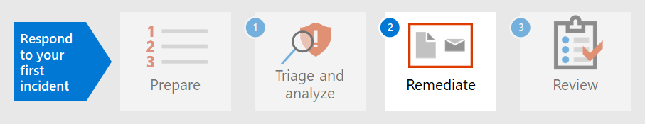

# 步骤 1.Step 1. 会审和分析第一个事件Triage and analyze your first incident

[!INCLUDE [Microsoft 365 Defender rebranding](../includes/microsoft-defender.md)]

**适用于：****Applies to:**
- Microsoft 365 DefenderMicrosoft 365 Defender

当您花时间根据组织标准建立、实施和维护安全措施时，您可以设置安全解决方案来帮助快速识别安全风险和威胁。As you spend some time establishing, implementing, and maintaining security measures according to the organization’s standards, you can set up security solutions to help you quickly identify security risks and threats. Microsoft 365Defender 允许你通过单窗格式体验检测、会审和调查事件，你可以找到及时做出决策时需要的信息。Microsoft 365 Defender allows you to detect, triage, and investigate incidents through its single-pane-of-glass experience where you can find the information you need to make timely decisions. 

检测到安全事件后，Microsoft 365 Defender 会提供详细信息，你需要对事件或事件进行会审，或将事件安排在其他人的优先级。Once a security incident is detected, Microsoft 365 Defender presents details you will need to triage or prioritize an incident or incidents over others. 确定优先顺序后，分析员可以专注于调查分配给他们的情况。After determining prioritization, analysts can then focus their energy on investigating cases assigned to them.

## 通过 Defender Microsoft 365检测Detection by Microsoft 365 Defender

Microsoft 365Defender 接收来自多个 Microsoft 安全平台的警报和事件作为检测源，以创建恶意活动的整体图片和上下文。Microsoft 365 Defender receives alerts and events from multiple Microsoft security platforms as detection sources to create a holistic picture and context of malicious activity. 这些是可能的检测源：These are the possible detection sources:

- [Microsoft Defender for Endpoint](../defender-endpoint/microsoft-defender-endpoint.md)是终结点检测和响应解决方案 (EDR) ，它使用 Microsoft Defender 防病毒以及使用 Microsoft 安全中心启用云的高级威胁Graph。[Microsoft Defender for Endpoint](../defender-endpoint/microsoft-defender-endpoint.md) is an endpoint detection and response solution (EDR) that uses Microsoft Defender antivirus as well as cloud-enabled advanced threat protection using Microsoft Security Graph. Defender for Endpoint 是一个统一的平台，用于预防性保护、攻破后检测、自动调查和响应。Defender for Endpoint is a unified platform for preventative protection, post-breach detection, automated investigation, and response. 它可保护终结点免受网络威胁的攻击，检测高级攻击和数据泄露，自动执行安全事件，并改进安全状况。It protects endpoints from cyberthreats, detects advanced attacks and data breaches, automates security incidents, and improves security posture. 
- [Microsoft Defender for Identity](/defender-for-identity/what-is) 是一种基于云的安全解决方案，它使用本地 Active Directory 域服务 (AD DS) 信号识别、检测和调查针对你的组织的高级威胁、泄露的身份和恶意内部操作。[Microsoft Defender for Identity](/defender-for-identity/what-is) is a cloud-based security solution that uses your on-premises Active Directory Domain Services (AD DS) signals to identify, detect, and investigate advanced threats, compromised identities, and malicious insider actions directed at your organization. 
- [Microsoft Cloud App Security](/cloud-app-security/)充当网关人，在企业用户和用户使用的云资源之间实时代理访问，无论用户位于何处，无论他们使用何种设备。[Microsoft Cloud App Security](/cloud-app-security/) acts as a gatekeeper to broker access in real time between your enterprise users and the cloud resources they use, wherever your users are located and regardless of the device they are using. 
- [Microsoft Defender for Office 365](../office-365-security/overview.md)保护你的组织免受电子邮件、链接 (URL) 和协作工具中的恶意威胁。[Microsoft Defender for Office 365](../office-365-security/overview.md) safeguards your organization against malicious threats in email messages, links (URLs), and collaboration tools. 
- [Azure 安全](/azure/security-center/security-center-introduction) 中心是一个统一的基础结构安全管理系统，可增强数据中心的安全状态，并跨云和本地混合工作负载提供高级威胁防护。[Azure Security Center](/azure/security-center/security-center-introduction) is a unified infrastructure security management system that strengthens the security posture of your data centers and provides advanced threat protection across your hybrid workloads in the cloud as well as on premises. 

在 Microsoft 365 Defender[中，](incidents-overview.md)通过关联来自这些不同检测源的警报来标识事件。In Microsoft 365 Defender, [incidents](incidents-overview.md) are identified by correlating alerts from these different detection sources. 你可以立即开始使用 defender 中的事件队列，而不是花费资源在一起或将多个警报区分到其各自事件中Microsoft 365队列。Instead of spending resources stringing together or distinguishing multiple alerts into their respective incidents, you can start with the incident queue in Microsoft 365 Defender right away. 这使你可以有效地跨终结点、标识、电子邮件和应用程序对事件进行会审，并减少攻击造成的损失。This allows you to triage incidents in an efficient manner across endpoints, identities, email, and applications, and reduce the damage from an attack.

## 对事件进行会审Triage your incidents

使用组织Microsoft 365优先顺序对事件列表分类后，Defender 中的事件响应将启动。Incident response in Microsoft 365 Defender starts once you triage the list of incidents using your organization’s recommended method of prioritization. 会审是指为事件分配重要性级别或紧急程度，然后确定调查事件的顺序。To triage means to assign a level of importance or urgency to incidents, which then determines the order in which they will be investigated. 

一个有用的示例指南，用于确定在 Microsoft 365 Defender 中应优先处理的事件，公式如下：严重性 *+ 影响 = 优先级*。A useful sample guide for determining which incident to prioritize in Microsoft 365 Defender can be summarized by the formula: *Severity + Impact = Priority*. 

- **严重性** 是由 defender 及其Microsoft 365安全组件指定的级别。**Severity** is the level designated by Microsoft 365 Defender and its integrated security components. 
- 影响由组织确定，通常包括但不限于受影响的用户、设备、受影响服务的阈值 (或其组合) ，甚至警报类型。**Impact** is determined by the organization and generally includes, but not limited to, a threshold number of impacted users, devices, services affected (or a combination thereof), and even alert type. 

然后，分析员根据组织设置的 **优先级** 条件启动调查。Analysts then initiate investigations based on the **Priority** criteria set by the organization.

事件优先顺序可能因组织而异。Incident prioritization might vary depending on the organization. NIST 还建议考虑事件的功能和信息影响以及可恢复性。NIST recommends also considering the functional and informational impact of the incident, and recoverability.  

下面只是一种会审方法：The following is just one approach to triage: 

1. 转到事件 [页面](incidents-overview.md) 以启动会审。Go to the [incidents](incidents-overview.md) page to initiate triage. 你可以在此处查看影响组织的事件列表。Here you can see a list of incidents affecting your organization. 默认情况下，它们从最近的事件到最早的事件进行排列。By default, they are arranged from the most recent to the oldest incident. 在此处，您还可以查看每个事件的不同列，这些列显示其严重性、类别、活动警报数量以及影响的实体等等。From here, you can also see different columns for each incident showing their severity, category, number of active alerts, and impacted entities, among others. 您可以通过选择列名称来自定义列集，并按这些列中的一些列对事件队列进行排序。You can customize the set of columns and sort the incident queue by some these columns by selecting the column name. 您还可以根据需求筛选事件队列。You can also filter the incident queue according to your needs. 有关可用筛选器的完整列表，请参阅确定 [事件的优先级](incident-queue.md#available-filters)。For a full list of available filters, see [Prioritize incidents](incident-queue.md#available-filters).
  
   :::image type="content" source="../../media/first-incident-analyze/first-incident-analyze-queue.png" alt-text="事件队列示例"::: 

    如何对此组事件执行会审的一个示例是确定影响更多用户和设备的事件的优先级。One example of how you might perform triage for this set of incidents is to prioritize incidents that affected more users and devices. 本示例中，可能会设置事件 ID 6769 的优先级，因为它影响最多数量的实体：7 个设备、6 个用户和 2 个邮箱。In this example, you might prioritize incident ID 6769 because it affected the largest number of entities: 7 devices, 6 users, and 2 mailboxes. 此外，事件似乎包含来自 Microsoft Defender for Identity 的警报，这些警报指示基于标识的警报和可能的凭据盗窃。Furthermore, the incident appears to contain alerts from Microsoft Defender for Identity which indicate an identity-based alert and possible credential theft.

   :::image type="content" source="../../media/first-incident-analyze/first-incident-analyze-high-impact.png" alt-text="影响很大事件的示例":::
 
2. 选择事件名称旁边的圆圈查看详细信息。Select the circle next to the incident name to review the details. 侧窗格将显示在右侧，其中包含可进一步帮助你分类的其他信息。A side pane will appear on the right side, which contains additional information that can assist your triage further. 
 
   :::image type="content" source="../../media/first-incident-analyze/first-incident-analyze-incident-flyout.png" alt-text="事件侧窗格示例"::: 

   例如，通过查看攻击者基于事件类别使用的 [MITRE ATT&CK](https://attack.mitre.org/) 策略，你可能会确定此事件的优先级，因为攻击者使用了被盗的凭据、建立了命令和控制、执行了横向移动并窃取了一些数据。For example, by looking at which [MITRE ATT&CK](https://attack.mitre.org/) tactics the attacker used based on the incident’s categories, you might prioritize this incident because the attacker used stolen credentials, established command and control, performed lateral movement, and exfiltrated some data. 这表明攻击者已深入网络，并且可能会窃取机密信息。This suggests the attacker has already gone deep into the network and possibly stolen confidential information.

   此外，如果你的组织已实施零信任框架，则你将凭据访问视为一种重要的安全冲突，值得优先处理。Additionally, if your organization has implemented the Zero Trust framework, you would consider credential access as an important security violation worth prioritizing.
 
   向下滚动侧窗格，你将看到特定受到影响的实体，如用户、设备和邮箱。Scrolling down the side pane, you will see the specific impacted entities such as users, devices, and mailboxes. 你可以检查每台设备的曝光级别和受影响邮箱的所有者。You can check the exposure level of each device and the owners of affected mailboxes.

   :::image type="content" source="../../media/first-incident-analyze/first-incident-analyze-incident-flyout-details.png" alt-text="事件侧窗格详细信息的示例"::: 
 
3. 在侧窗格的更下一步，你可以找到关联的警报。Further down the side pane, you can find the associated alerts. Microsoft 365Defender 已经对单个事件执行相关警报，从而节省你修正攻击所花的时间和资源。Microsoft 365 Defender has already performed the correlation of said alerts into a single incident, saving you time and resources better spent remediating the attack. 警报是可疑的，因此可能是恶意系统事件，这些事件表示网络上存在攻击者。Alerts are suspicious and therefore possibly malicious system events that suggest the presence of an attacker on a network. 

   本示例中，87 个单独警报被确定为一个安全事件的一部分。In this example, 87 individual alerts were determined to be part of one security incident. 你可以查看所有警报，快速了解攻击的播放。You can view all the alerts to get a quick view of how the attack played out.

   :::image type="content" source="../../media/first-incident-analyze/first-incident-analyze-incident-flyout-alerts.png" alt-text="事件侧窗格中的警报示例"::: 
 
## 分析第一个事件Analyze your first incident

了解警报周围的上下文同样重要。Understanding the context surrounding alerts is equally important. 通常，警报不是单个独立事件。Often an alert is not a single independent event. 存在一系列可能未同时发生的进程、命令和操作。There is a chain of processes created, commands, and actions that might not have occurred at the same time. 因此，分析员必须在设备时间线中查找可疑实体的第一个和最后一个活动，以了解警报的上下文。Therefore, an analyst must look for the first and last activities of the suspicious entity in device timelines to understand the context of the alerts.

使用 defender 读取和分析数据的方法有多种Microsoft 365，但分析员的最终目标是尽快响应事件。There are multiple ways to read and analyze data using Microsoft 365 Defender but the end goal for analysts is to respond to incidents as quickly as possible. 尽管 Microsoft 365 Defender 可以通过行业领先的自动调查和响应功能大大减少修正 MTTR ([MTTR](https://www.microsoft.com/security/blog/2020/05/04/lessons-learned-microsoft-soc-part-3c/)) 平均时间，但始终存在需要手动分析的情况。While Microsoft 365 Defender can significantly reduce [Mean Time to Remediate (MTTR)](https://www.microsoft.com/security/blog/2020/05/04/lessons-learned-microsoft-soc-part-3c/) through the industry-leading [automated investigation and response](m365d-autoir.md) feature, there are always cases that require manual analysis. 

示例如下：Here's an example:

1. 确定会审优先级后，分析员通过选择事件名称开始深入分析。Once triage priority has been determined, an analyst begins an in-depth analysis by selecting the incident name. 此页面将显示"事件 **摘要** "，其中数据显示在选项卡中，以帮助进行分析。This page brings up the **Incident Summary** where data is displayed in tabs to assist with the analysis. 在 **"警报"** 选项卡下，将显示警报类型。Under the **Alerts** tab the type of alerts are displayed. 分析员可以单击每个警报，向下钻取到各自的检测源。Analysts can click on each alert to drill down into the respective detection source. 

    :::image type="content" source="../../media/first-incident-analyze/first-incident-analyze-summary-tab.png" alt-text="事件&quot;摘要&quot;选项卡的示例"::: 
 
    有关每个检测源涵盖的域的快速指南，请查看本文的 [检测](#detection-by-microsoft-365-defender) 部分。For a quick guide about which domain each detection source covers, review the [Detect](#detection-by-microsoft-365-defender) section of this article.

2.  从 **警报选项卡** ，分析员可以透视到检测源，以执行更深入的调查和分析。From the **Alerts** tab, an analyst can pivot to the detection source to conduct a more in-depth investigation and analysis. 例如，选择"恶意软件检测Microsoft Cloud App Security作为检测源，分析员将访问其相应的警报页面。For example, selecting Malware Detection with Microsoft Cloud App Security as the detection source takes the analyst to its corresponding alert page.
  
    :::image type="content" source="../../media/first-incident-analyze/first-incident-analyze-select-alert.png" alt-text="选择事件警报的示例"::: 
  
    :::image type="content" source="../../media/first-incident-analyze/first-incident-analyze-link-to-mcas.png" alt-text="页面中相应页面Microsoft Cloud App Security"::: 
  
3.  若要进一步调查我们的示例，请滚动到页面底部以查看受影响的 **用户**。To investigate our example further, scrolling to the bottom of the page to view the **Users affected**. To see the activity and context surrounding the malware detection， select Annette Hill's user page .To see the activity and context surrounding the malware detection, select Annette Hill’s user page . 
  
    :::image type="content" source="../../media/first-incident-analyze/first-incident-analyze-user-page.png" alt-text="用户页面示例":::
  
4.  在用户页面上，按时间顺序排列的事件列表，从 *TOR* 网络 IP 地址警报的有风险登录开始。On the user page is a chronological list of events starting with a *Risky Sign-in from a TOR network IP Address* alert. 虽然活动的可疑程度取决于组织如何开展业务的性质，但在大多数情况下，使用 Onion 路由器 (TOR) （允许用户在企业环境中匿名浏览 Web 的网络）对于常规联机操作可能被视为不太可能和不必要的。While the suspiciousness of an activity depends on the nature of how an organization conducts its business, in most cases the use of The Onion Router (TOR), a network that allows users to browse the web anonymously, in an enterprise environment might be considered highly unlikely and unnecessary for regular online operations.
  
    :::image type="content" source="../../media/first-incident-analyze/first-incident-analyze-user-event-list.png" alt-text="用户事件按时间顺序列表的示例":::
  
5.  可以选择每个警报以获取有关活动详细信息。Each alert can be selected to obtain more information on the activity. 例如，从 **"Tor IP** 地址"警报中选择"活动"将引导你访问该警报自己的页面。For example, selecting **Activity from a Tor IP Address** alert leads you to that alert’s own page. Annette 是 Office 365 管理员，这意味着她具有提升的权限，并且源事件可能导致访问机密信息。Annette is an Administrator of Office 365, which means she has elevated privileges and the source incident might have led to access to confidential information. 
  
    :::image type="content" source="../../media/first-incident-analyze/first-incident-analyze-mcas-alert.png" alt-text="适用于用户警报的详细信息Microsoft Cloud App Security"::: 
 
6.  通过选择其他警报，分析员可以全面了解攻击情况。By selecting other alerts, an analyst can get a complete picture of the attack.

## 后续步骤Next step

了解如何 [修正事件](first-incident-remediate.md)。Learn how to [remediate incidents](first-incident-remediate.md).

## 另请参阅See also

- [事件概述Incidents overview](incidents-overview.md)
- [调查事件Investigate incidents](investigate-incidents.md)
- [管理事件Manage incidents](manage-incidents.md)
