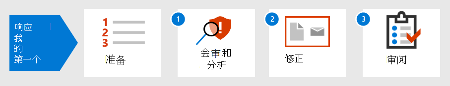

# 响应第一个事件

[!INCLUDE [Microsoft 365 Defender rebranding](../includes/microsoft-defender.md)]

**适用于：**
- Microsoft 365 Defender

组织的事件响应策略决定了其处理破坏性不断增加的安全事件和混乱的能力。 采取预防性措施很重要，但快速采取行动以控制、抑制和从检测到的事件中恢复的能力可以最大限度地减少损失和业务损失。

此事件响应演练演示了作为安全运营团队的一部分，您如何在安全运营团队内执行大部分关键Microsoft 365 Defender。 步骤如下：

- 准备安全状态
- 对于每个事件：
  - 步骤 1：会审和分析
  - 步骤 2： (控制、抑制和恢复) 
  - 步骤 3：事后评审

美国国家标准和技术协会 NIST () 将安全事件定义为"实际或可能危及信息系统的机密性、完整性或可用性的事件;或系统处理、存储或传输的信息;或构成违反安全策略、安全程序或可接受使用策略的违反或即将发生的威胁。"

事件Microsoft 365 Defender是分析和事件响应的逻辑起点。 分析和修正事件通常包括安全运营团队大部分任务。

## 后续步骤

确保你的组织和租户Microsoft 365[事件处理做好准备](first-incident-prepare.md)。

## 另请参阅

事件的事件响应Microsoft 365 Defender：

- [事件概述](incidents-overview.md)
- [调查事件](investigate-incidents.md)
- [管理事件](manage-incidents.md)

第一个事件响应的其他示例：

- [钓鱼电子邮件](first-incident-path-phishing.md)
- [基于身份的攻击](first-incident-path-identity.md)

[详细的事件响应手册](/security/compass/incident-response-playbooks)

