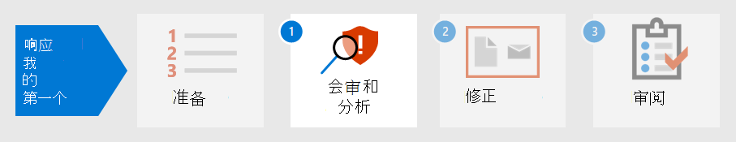

# 为第一个事件准备安全状态

[!INCLUDE [Microsoft 365 Defender rebranding](../includes/microsoft-defender.md)]

**适用于：**
- Microsoft 365 Defender

准备事件处理涉及为组织网络设置来自不同类型的安全事件的充分保护。 为降低安全事件的风险，美国国家标准和技术协会 (NIST) 建议了一些安全做法，包括风险评估、强化主机安全、安全配置网络以及预防恶意软件。 

Microsoft 365 Defender有助于解决事件防护的几个方面： 

- 实现零 [信任](/security/zero-trust/) 框架
- 使用 Microsoft 安全分数分配分数来确定 [安全状态](microsoft-secure-score.md)
- 通过威胁和漏洞管理中的漏洞评估 [防止威胁](../defender-endpoint/next-gen-threat-and-vuln-mgt.md)
- 了解最新的安全威胁，以便通过威胁分析 [做好准备](threat-analytics.md)

## 步骤 1. 实现零信任

[零](/security/zero-trust/) 信任是一种集成的安全理念和端到端策略，它考虑任何现代环境的复杂性质，包括移动工作人员以及用户、设备、应用程序和数据，无论他们位于何处。 通过提供单一窗格以一致的方式管理所有检测，Microsoft 365 Defender使安全运营团队更轻松地实施零信任指导原则。 

Microsoft 365 Defender 组件可以显示违反为建立零信任条件访问策略而实现的规则，通过将来自 Microsoft Defender for Endpoint 或其他移动安全供应商的数据集成为设备合规性策略和基于设备的条件访问策略实现的信息源。 

设备风险直接影响该设备的用户可访问的资源。 基于特定条件拒绝访问资源是零信任的主要主题，Microsoft 365 Defender确定信任级别条件所需的信息。 例如，Microsoft 365 Defender通过"威胁和漏洞管理"页提供设备的软件版本级别，而条件访问策略限制具有过时或易受攻击版本的设备。

自动化是实施和维护零信任环境的重要部分，同时还减少了可能导致发生 IR 事件或 IR 事件 (警报) 数量。 Microsoft 365 Defender组件可以自动化，例如修正操作 (称为  Microsoft 365 Defender 门户) 中事件的调查、通知操作，甚至是创建支持票证（如[在 ServiceNow](https://microsoft.service-now.com/sp/) 中）。

## 步骤 2. 确定组织的安全状态

接下来，组织可以使用 Microsoft 安全分数Microsoft 365 Defender确定当前安全状态，并考虑建议如何改进它。 分数越高，组织采取的安全建议和改进措施就越高。 安全分数建议可以跨不同产品进行，并允许组织提高分数。 

:::image type="content" source="../../media/first-incident-prepare/first-incident-secure-score.png" alt-text="Microsoft 安全中心中的 Microsoft 安全分数示例。":::
 
## 第 3 步。 评估组织的漏洞暴露

预防事件有助于简化安全操作工作，以重点关注进行中的关键和重要的安全事件。 软件漏洞通常是攻击的可阻止入口点，可能导致数据盗窃、数据丢失或业务运营中断。 如果没有攻击在进行中，则安全操作必须努力在组织中实现并保持可接受的漏洞暴露级别。

若要检查软件修补进度，请访问 Defender for Endpoint  中的"威胁和漏洞管理"页，通过"更多资源"选项卡Microsoft 365 Defender访问此页面。

:::image type="content" source="../../media/first-incident-prepare/first-incident-vulnerability.png" alt-text="Microsoft 安全中心中&quot;威胁和漏洞&quot;页的示例。"::: 
 
## 4. 了解新出现的威胁

在[安全门户](threat-analytics.md)Microsoft 365 Defender威胁分析，及时获得最新的安全威胁环境。 专家 Microsoft 安全研究人员创建报告，详细说明最新的网络威胁，以便你了解它们可能会Microsoft 365订阅、设备和用户。 这些报告可能包括：

- 活动威胁参与者及其活动
- 热门和新的攻击技术
- 关键漏洞
- 常见攻击面
- 流行的恶意软件

威胁分析还会查看你的配置和警报，以确定你面临的风险以及是否有适用于报告的活动警报。

你可以实施新兴威胁的建议，以强化安全状况并最大限度地减少攻击面区域。

安排时间，定期查看应用门户中的威胁Microsoft 365 Defender部分。 有关详细信息[，请参阅 Microsoft 365 Defender](incidents-overview.md#example-security-operations-for-microsoft-365-defender) 安全操作示例。

## 后续步骤

了解如何 [对事件进行会审和分析](first-incident-analyze.md)。

## 另请参阅

- [事件概述](incidents-overview.md)
- [调查事件](investigate-incidents.md)
- [管理事件](manage-incidents.md)
