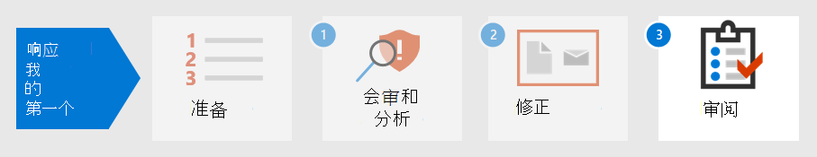

# 步骤 2. 修正第一个事件

[!INCLUDE [Microsoft 365 Defender rebranding](../includes/microsoft-defender.md)]

**适用于：**
- Microsoft 365 Defender

Microsoft 365 Defender不仅提供检测和分析功能，而且还提供恶意软件的控制和攻击。 抑制包括减少攻击影响的步骤，同时确保从网络中删除攻击者活动的所有跟踪。 Microsoft 365 Defender提供几个修正操作，可配置为根据受影响设备的操作系统和攻击类型进行自动修正。

Microsoft 365 Defender分析员可以手动启动的几个修正操作。 操作分为两类：设备上操作和文件操作。 某些操作可用于立即停止威胁，而其他操作有助于进一步取证分析。

## 对设备执行的操作

- 隔离 **设备 - 此** 活动将立即阻止所有网络流量 (Internet 和内部) 以最大限度地减少恶意软件的分布，并允许分析员继续分析，而无需恶意参与者继续攻击。 唯一允许的连接是 Microsoft Defender for Identity 服务云，因此 Microsoft Defender for Identity 可以继续监视设备。 
- **限制应用执行** - 若要限制应用程序运行，应用代码完整性策略，该策略只允许文件在由 Microsoft 颁发的证书签名时运行。 这种限制方法有助于防止攻击者控制受到威胁的设备，并执行进一步恶意活动。
- **运行防病毒扫描** - Microsoft Defender 防病毒扫描可以与其他防病毒解决方案一起运行，无论 Defender 防病毒是否是活动的防病毒解决方案。 如果另一个防病毒供应商产品是主要终结点保护解决方案，可以在被动模式下运行 Defender 防病毒。
- **启动自动调查** - 可以在设备上启动新的通用自动调查。 当调查正在运行时，从设备生成的其他任何警报都将添加到正在进行的自动调查，直到完成该调查。 此外，如果在其他设备上看到相同的威胁，则这些设备将添加到调查。
- **启动实时响应** - 实时响应是一项功能，可让你使用远程 shell 连接即时访问设备。 这让你能够执行深入调查工作，并立即采取响应操作，以实时迅速包含识别的威胁。 实时响应旨在通过让你能够收集取证数据、运行脚本、发送可疑实体进行分析、修正威胁和主动搜寻新出现的威胁来增强调查。
- **收集调查** 包 - 作为调查或响应过程的一部分，你可以从设备收集调查包。 通过收集调查包，你可以确定设备的当前状态，并进一步理解攻击者使用的工具和技术。 
- 咨询 **威胁** 专家 (设备和文件) - 你可以咨询 Microsoft 威胁专家，了解有关可能受到威胁的设备或已受到威胁的设备的更多见解。 Microsoft 威胁专家可以直接在内部参与Microsoft 365 Defender及时准确的响应。 

## 对文件执行的操作

- **停止和隔离文件** - 此操作包括停止正在运行的进程、隔离文件和删除永久数据（如任何注册表项）。 此操作在具有 Windows 11 或 Windows 10 版本 1703 或更高版本的设备（过去 30 天内观测到该文件）上生效。 
- **添加指示器以阻止或允许文件** - 通过禁止潜在恶意文件或可疑恶意软件，阻止攻击在组织中进一步传播。 此操作将阻止在组织的设备上读取、写入或执行文件。
- **下载或收集文件** – 通过此操作，分析员可以下载受密码保护的文件.zip存档文件中，供组织进一步分析。
- **深度分析** – 此操作在安全、完全检测的云环境中执行文件。 深度分析结果显示文件的活动、观察到的行为以及关联的项目，例如丢弃的文件、注册表修改以及与 IP 地址的通信。 

继续检测、 [会审](first-incident-analyze.md#analyze-your-first-incident)和分析事件中的示例，分析员可以使用以下操作修正此事件：

1. 立即重置用户帐户密码
2. 在深度分析Microsoft 365 Defender隔离设备
3. 确保恶意文件被隔离SharePoint
4. 检查哪些终结点受恶意软件影响
5. 重新生成系统
6. 检查其他用户的类似的 Microsoft Defender 云应用警报
7. 在 Microsoft Defender for Endpoint 中创建自定义指示器以阻止 Tor IP 地址
8. 在 Microsoft Defender for Cloud Apps 中为此类型的警报创建管理操作，如下图所示：

   :::image type="content" source="../../media/first-incident-remediate/first-incident-mcas-governance.png" alt-text="Microsoft Defender for Cloud Apps 门户中的管理操作示例。":::

大多数修正操作都可以在 Microsoft 365 Defender 中应用和Microsoft 365 Defender。

## 使用 Playbook

此外，可以使用 Playbook 创建自动修正。 目前，Microsoft 在 [GitHub](https://github.com/microsoft/Microsoft-Cloud-App-Security/tree/master/Playbooks)提供适用于以下方案的 Playbook 模板：

- 请求用户验证后删除敏感文件共享
- 不经常使用的国家/地区警报自动分类
- 禁用帐户之前请求管理员操作
- 禁用恶意收件箱规则

Playbook 使用Power Automate创建自定义机器人流程自动化流，以在触发特定条件后自动执行某些活动。 组织可以从现有模板或从头开始创建游戏手册。 

下面是一个示例。
 
:::image type="content" source="../../media/first-incident-remediate/first-incident-power-automate.png" alt-text="自定义自定义Power Automate自动化流的示例。"::: 
 
还可以在事后评审 [期间创建操作](first-incident-post.md) 手册，以从已解决的事件中创建修正操作。 

## 后续步骤

了解如何 [对事件执行事后评审](first-incident-post.md)。

## 另请参阅

- [事件概述](incidents-overview.md)
- [调查事件](investigate-incidents.md)
- [管理事件](manage-incidents.md)
