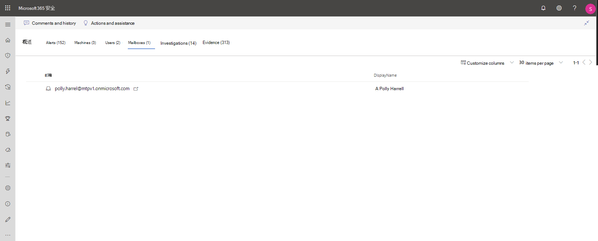

# 调查 Microsoft 365 Defender 中的事件Investigate incidents in Microsoft 365 Defender

[!INCLUDE [Microsoft 365 Defender rebranding](../includes/microsoft-defender.md)]

**适用于：****Applies to:**

- Microsoft 365 DefenderMicrosoft 365 Defender

Microsoft 365 Defender 聚合来自你的设备、用户和邮箱的所有用户的相关警报、资产、调查和证据，以便全面了解整个攻击范围。Microsoft 365 Defender aggregates all related alerts, assets, investigations and evidence from across your devices, users, and mailboxes to give you a comprehensive look into the entire breadth of an attack.

调查影响网络的警报，了解其含义，整理与事件相关的证据，以便可以制定出有效的补救计划。Investigate the alerts that affect your network, understand what they mean, and collate evidence associated with the incidents so that you can devise an effective remediation plan.

## 调查事件Investigate an incident

1. 从事件队列中选择一个事件。Select an incident from the incident queue.   侧面板将打开，并预览重要信息，如状态、严重性、类别和影响的实体。A side panel opens and gives a preview of important information such as status, severity, categories, and the impacted entities.

    

2. 选择“**打开事件页面**”。Select **Open incident page**.   这将打开事件页面，您可以在其中找到事件详细信息、注释和操作、选项卡 (概述、警报、设备、用户、调查、证据) 。This opens the incident page where you'll find more information incident details, comments, and actions, tabs (overview, alerts, devices, users, investigations, evidence).

3. 查看警报、设备、用户、其它涉及事件的实体。Review the alerts, devices, users, other entities involved in the incident.

## 事件概述Incident overview

"概述" 页面提供有关事件的最需要注意事项的概览信息。The overview page gives you a snapshot glance into the top things to notice about the incident.

攻击类别可直观和数字地了解攻击对击杀链的进度。The attack categories give you a visual and numeric view of how advanced the attack has progressed against the kill chain. 与其他 Microsoft 安全产品一样，Microsoft 365 Defender 与[MITRE ATT&&trade; CK](https://attack.mitre.org/)框架一致。As with other Microsoft security products, Microsoft 365 Defender is aligned to the [MITRE ATT&CK&trade;](https://attack.mitre.org/) framework.

“范围” 部分提供了属于此事件的最受影响的资产列表。The scope section gives you a list of top impacted assets that are part of this incident. 如果存在有关此资产的具体信息（例如风险级别、调查优先级以及资产上的任何标记），也将在本节中显示。If there is specific information regarding this asset, such as risk level, investigation priority as well as any tagging on the assets this will also surface in this section.

“警报”时间线能够提前了解警报发生的时间顺序以及警报与此事件关联的原因。The alerts timeline provides a sneak peek into the chronological order in which the alerts occurred, as well as the reasons that these alerts linked to this incident.

最后“证据部分”汇总了事件中包含的项目数量和修正状态，因此能够立即确定是否需要采取措施。And last - the evidence section provides a summary of how many different artifacts were included in the incident and their remediation status, so you can immediately identify if any action is needed on your end.

此概述可通过深入了解事件的首要特征，有助于了解事件的初始会审。This overview can assist in the initial triage of the incident by providing insight to the top characteristics of the incident that you should be aware of.

## 警报Alerts

你可以查看与事件相关的所有警报及其其他信息，例如严重性、警报中涉及的实体、警报的来源 (Microsoft Defender for Identity、Microsoft Defender for Endpoint、Microsoft Defender for Office 365) 以及它们链接在一起的原因。You can view all the alerts related to the incident and other information about them such as severity, entities that were involved in the alert, the source of the alerts (Microsoft Defender for Identity, Microsoft Defender for Endpoint, Microsoft Defender for Office 365) and the reason they were linked together.

警报默认按时间顺序排序，可以首先查看攻击如何随时间推移。By default, the alerts are ordered chronologically, to allow you to first view how the attack played out over time. 单击每个警报将引导你进入相关警报页面，你可以在这里对此警报进行深入调查。Clicking on each alert will lead you to the relevant alert page where you can conduct an in-depth investigation of that alert. 在调查警报中了解如何使用警报页面和 [统一警报队列](investigate-alerts.md)Learn how to use alert pages and the unified alert queue in [Investigate alerts](investigate-alerts.md)

## 设备Devices

"设备" 选项卡列出了出现与事件相关警报的所有设备。The devices tab lists all the devices where alerts related to the incident are seen.

单击执行攻击的计算机的名称，导航至计算机页面，可在其中查看触发的警报和有助于调查的相关事件。Clicking the name of the machine where the attack was conducted navigates you to its Machine page where you can see alerts that were triggered on it and related events provided to ease investigation.

选择 "时间线" 选项卡，将能够在计算机时间线之间滚动，并按时间顺序查看计算机上观察到的所有事件和行为，并与引发的警报交错。Selecting the Timeline tab enables you to scroll through the machine timeline and view all events and behaviors observed on the machine in chronological order, interspersed with the alerts raised.

## 用户Users

查看标记为属于事件或与事件相关的邮箱。See users that have been identified to be part of, or related to a given incident.

单击用户名，将导航至用户的 Cloud App Security 页面，可在此进行进一步调查。Clicking the username navigates you to the user's Cloud App Security page where further investigation can be conducted.

## 邮箱Mailboxes

调查标记为属于事件或与事件相关的邮箱。Investigate mailboxes that's been identified to be part of, or related to an incident. 若要执行进一步的调查工作，选择与邮件相关的警报将打开 Microsoft Defender for Office 365，可在其中执行修正操作。To do further investigative work, selecting the mail-related alert will open Microsoft Defender for Office 365 where you can take remediation actions.

## 调查Investigations

选择 **"** 调查"以查看此事件中的警报触发的所有自动调查。Select **Investigations** to see all the automated investigations triggered by alerts in this incident. 调查将执行修正操作或等待分析员批准操作，具体取决于如何将自动调查配置为在 Microsoft Defender for Endpoint 和 Defender for Office 365 中运行。The investigations will perform remediation actions or wait for analyst approval of actions, depending on how you configured your automated investigations to run in Microsoft Defender for Endpoint and Defender for Office 365.

选择“调查”，以导航到调查详细信息页面，获取有关调查和修复状态的完整信息。Select an investigation to navigate to the Investigation details page to get full information on the investigation and remediation status. 如果有作为调查的一部分等待审批的任何操作，它们将显示在"挂起的操作"选项卡中。采取操作作为事件修正的一部分。If there are any actions pending for approval as part of the investigation, they will appear in the Pending actions tab. Take action as part of incident remediation.

## 证据Evidence

Microsoft 365 Defender 自动调查警报中所有事件支持的事件和可疑实体，从而自动响应和有关重要文件、流程、服务、电子邮件等的信息。Microsoft 365 Defender automatically investigates all the incidents' supported events and suspicious entities in the alerts, providing you with autoresponse and information about the important files, processes, services, emails, and more. 这有助于快速检测并阻止事件中的潜在威胁。This helps quickly detect and block potential threats in the incident.

每一被分析的实体都将标记有裁定（恶意、可疑和清除）以及修正状态。Each of the analyzed entities will be marked with a verdict (Malicious, Suspicious, Clean) as well as a remediation status. 这可有助于解整个事件的修正状态，以及执行进一步补救的后续步骤。This assists you in understanding the remediation status of the entire incident and what are the next steps that can be taken to further remediate.

## 相关主题Related topics

- [事件概述Incidents overview](incidents-overview.md)
- [确定事件优先级Prioritize incidents](incident-queue.md)
- [管理事件Manage incidents](manage-incidents.md)

