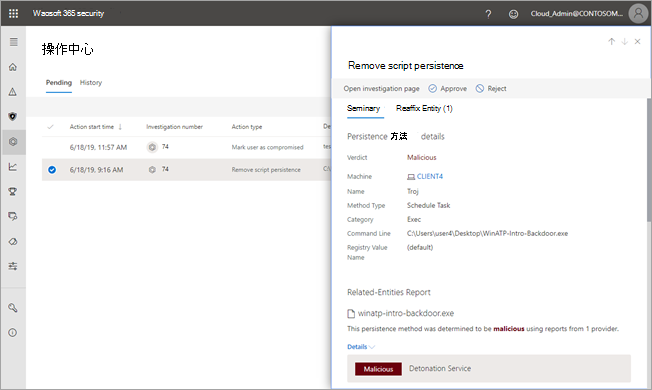

# 在操作中心查看和管理操作

[!INCLUDE [Microsoft 365 Defender rebranding](../includes/microsoft-defender.md)]

**适用于：**
- Microsoft 365 Defender

威胁防护功能Microsoft 365 Defender会导致某些修正操作。 下面是一些示例：

- [自动调查](m365d-autoir.md) 可能会导致自动执行修正操作或等待您的批准。
- 防病毒、反恶意软件和其他威胁防护功能可能会导致修正操作，例如阻止文件、URL 或进程，或将项目发送到隔离区。
- 安全运营团队可以手动采取修正操作，例如，在高级搜寻[期间](advanced-hunting-overview.md)或在调查[警报或](investigate-alerts.md)[事件时](investigate-incidents.md)。

> [!NOTE]
> 必须具有[相应的权限](m365d-action-center.md#required-permissions-for-action-center-tasks)才能批准或拒绝修正操作。 有关详细信息，请参阅 [先决条件](m365d-configure-auto-investigation-response.md#prerequisites-for-automated-investigation-and-response-in-microsoft-365-defender)。

## 在操作中心查看挂起的操作

应尽快批准（或拒绝）挂起的操作，以便自动调查可以继续并及时完成。 

1. 转到 [https://security.microsoft.com](https://security.microsoft.com) 并登录。 

2. 在“导航”窗格中，选择“操作中心”。 

3. 在操作中心的"待定 **"** 选项卡上，选择列表中的项目。 将打开其飞出窗格。 下面是一个示例。

   

4. 查看飞出窗格中的信息，然后执行以下步骤之一：
   - 选择 **"打开调查"** 页以查看有关调查的更多详细信息。
   - 选择 **"批准** "以启动挂起的操作。
   - 选择 **"** 拒绝"以防止执行挂起的操作。
   - 选择 **"开始搜寻**"转到"[高级搜寻"。](advanced-hunting-overview.md) 

## 撤消已完成的操作

如果你已确定设备或文件不是威胁，你可以撤消已采取的修正操作，无论这些操作是自动执行还是手动执行。 在操作中心的"历史记录 **"** 选项卡上，可以撤消以下任何操作：  

| 操作源 | 支持的操作 |
|:---|:---|
| - 自动调查  - Microsoft Defender 防病毒  - 手动响应操作 | - 隔离设备  - 限制代码执行  - 隔离文件  - 删除注册表项  - 停止服务  - 禁用驱动程序  - 删除计划任务 |

### 撤消一个修正操作

1. 转到操作中心 [https://security.microsoft.com/action-center](https://security.microsoft.com/action-center) () 并登录。

2. 在 **"历史记录** "选项卡上，选择要撤消的操作。

3. 在屏幕右侧窗格中，选择"撤消 **"。**

### 撤消多个修正操作

1. 转到操作中心 (https://security.microsoft.com/action-center) 并登录。

2. 在 **"历史记录** "选项卡上，选择要撤消的操作。 确保选择操作类型相同的项目。 将打开一个飞出窗格。

3. 在飞出窗格中， **选择撤消**。

### 跨多个设备从隔离中删除文件 

1. 转到操作中心 [https://security.microsoft.com/action-center](https://security.microsoft.com/action-center) () 并登录。

2. 在" **历史记录** "选项卡上，选择具有隔离文件操作 **类型的** 文件。

3. 在屏幕右侧窗格中，选择"应用到此文件的 **X** 更多实例"，然后选择"撤消 **"。**

## 后续步骤

- [查看自动调查的详细信息和结果](m365d-autoir-results.md)
- [解决误报或漏报问题](m365d-autoir-report-false-positives-negatives.md)
