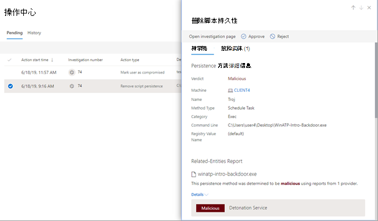

# 在操作中心查看和管理操作View and manage actions in the Action center

[!INCLUDE [Microsoft 365 Defender rebranding](../includes/microsoft-defender.md)]

**适用于：****Applies to:**
- Microsoft 365 DefenderMicrosoft 365 Defender

Microsoft 365 Defender 中的威胁防护功能可能会导致某些修正操作。Threat protection features in Microsoft 365 Defender can result in certain remediation actions. 下面是一些示例：Here are some examples:
- [自动调查](m365d-autoir.md) 可能会导致自动执行修正操作或等待审批。[Automated investigations](m365d-autoir.md) can result in remediation actions that are taken automatically or await approval.
- 防病毒、反恶意软件和其他威胁防护功能可能会导致修正操作，例如阻止文件、URL 或进程，或将项目发送到隔离区。Antivirus, antimalware, and other threat protection features can result in remediation actions, such as blocking a file, URL, or process, or sending an artifact to quarantine.
- 安全运营团队可以手动采取修正操作，例如，在高级搜寻[期间](advanced-hunting-overview.md)或在调查[警报或](investigate-alerts.md)[事件时](investigate-incidents.md)。Your security operations team can take remediation actions manually, such as during [advanced hunting](advanced-hunting-overview.md) or while investigating [alerts](investigate-alerts.md) or [incidents](investigate-incidents.md).

> [!NOTE]
> 必须具有[相应的权限](m365d-action-center.md#required-permissions-for-action-center-tasks)才能批准或拒绝修正操作。You must have [appropriate permissions](m365d-action-center.md#required-permissions-for-action-center-tasks) to approve or reject remediation actions. 有关详细信息，请参阅在 Microsoft 365 Defender 中自动[调查和响应的先决条件](m365d-configure-auto-investigation-response.md#prerequisites-for-automated-investigation-and-response-in-microsoft-365-defender)。For more information, see [Prerequisites for automated investigation and response in Microsoft 365 Defender](m365d-configure-auto-investigation-response.md#prerequisites-for-automated-investigation-and-response-in-microsoft-365-defender).

## 在操作中心查看挂起的操作Review pending actions in the Action center

应尽快批准（或拒绝）挂起的操作，以便自动调查可以继续并及时完成。It's important to approve (or reject) pending actions as soon as possible so that your automated investigations can proceed and complete in a timely manner. 

1. 转到 [https://security.microsoft.com](https://security.microsoft.com) 并登录。Go to [https://security.microsoft.com](https://security.microsoft.com) and sign in. 

2. 在“导航”窗格中，选择“操作中心”。In the navigation pane, choose **Action center**. 

3. 在操作中心中的“挂起”选项卡上，选择列表中的某个项。In the Action Center, on the **Pending** tab, select an item in the list. 将打开其飞出窗格。Its flyout pane opens.

4. 查看飞出窗格中的信息，然后执行以下步骤之一：Review the information in the flyout pane, and then take one of the following steps:
   - 选择 **"打开调查"** 页以查看有关调查的更多详细信息。Select **Open investigation page** to view more details about the investigation.
   - 选择 **"批准** "以启动挂起的操作。Select **Approve** to initiate a pending action.
   - 选择 **"** 拒绝"以防止执行挂起的操作。Select **Reject** to prevent a pending action from being taken.
   - 选择 **"开始搜寻**"转到"[高级搜寻"。](advanced-hunting-overview.md)Select **Go hunt** to go into [Advanced hunting](advanced-hunting-overview.md). 

## 撤消已完成的操作Undo completed actions

如果你已确定设备或文件不是威胁，你可以撤消已采取的修正操作，无论这些操作是自动执行还是手动执行。If you’ve determined that a device or a file is not a threat, you can undo remediation actions that were taken, whether those actions were taken automatically or manually. 在操作中心的"历史记录 **"** 选项卡上，可以撤消以下任何操作：In the Action center, on the **History** tab, you can undo any of the following actions:  

| 操作源Action source | 支持的操作Supported Actions |
|:---|:---|
| - 自动调查- Automated investigation  - Microsoft Defender 防病毒- Microsoft Defender Antivirus  - 手动响应操作- Manual response actions | - 隔离设备- Isolate device  - 限制代码执行- Restrict code execution  - 隔离文件- Quarantine a file  - 删除注册表项- Remove a registry key  - 停止服务- Stop a service  - 禁用驱动程序- Disable a driver  - 删除计划任务- Remove a scheduled task |

### 撤消一个修正操作Undo one remediation action

1. 转到操作中心 [https://security.microsoft.com/action-center](https://security.microsoft.com/action-center) () 并登录。Go to the Action center ([https://security.microsoft.com/action-center](https://security.microsoft.com/action-center)) and sign in.

2. 在 **"历史记录** "选项卡上，选择要撤消的操作。On the **History** tab, select an action that you want to undo.

3. 在屏幕右侧窗格中，选择"撤消 **"。**In the pane on the right side of the screen, select **Undo**.

### 撤消多个修正操作Undo multiple remediation actions

1. 转到操作中心 (https://security.microsoft.com/action-center) 并登录。Go to the Action center (https://security.microsoft.com/action-center) and sign in.

2. 在 **"历史记录** "选项卡上，选择要撤消的操作。On the **History** tab, select the actions that you want to undo. 确保选择操作类型相同的项目。Make sure to select items that have the same Action type. 将打开一个飞出窗格。A flyout pane opens.

3. 在飞出窗格中， **选择撤消**。In the flyout pane, select **Undo**.

### 跨多个设备从隔离中删除文件To remove a file from quarantine across multiple devices 

1. 转到操作中心 [https://security.microsoft.com/action-center](https://security.microsoft.com/action-center) () 并登录。Go to the Action center ([https://security.microsoft.com/action-center](https://security.microsoft.com/action-center)) and sign in.

2. 在" **历史记录"** 选项卡上，选择操作类型为"隔离 **文件"的文件**。On the **History** tab, select a file that has the Action type **Quarantine file**.

3. 在屏幕右侧窗格中，选择"应用到此文件的 **X** 更多实例"，然后选择"撤消 **"。**In the pane on the right side of the screen, select **Apply to X more instances of this file**, and then select **Undo**.

## 后续步骤Next steps

- [查看自动调查的详细信息和结果View the details and results of an automated investigation](m365d-autoir-results.md)
- [了解如何在获得一个 (时处理误报/) Learn how to handle false positives/negatives (if you get one)](m365d-autoir-report-false-positives-negatives.md)
