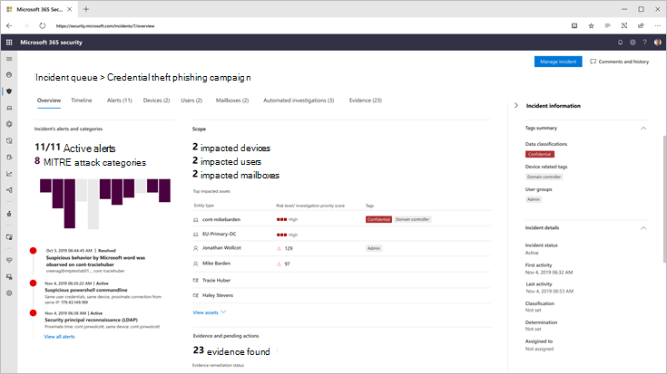

# 打开 Microsoft 365 Defender

[!INCLUDE [Microsoft 365 Defender rebranding](../includes/microsoft-defender.md)]

**适用于：**
- Microsoft 365 Defender

[Microsoft 365 Defender](microsoft-365-defender.md)集成 Microsoft Defender for Endpoint、Microsoft Defender for Office 365、Microsoft Cloud App Security 和 Microsoft Defender for Identity 的关键功能，统一事件响应流程。 这种统一体验添加了可在企业门户中访问Microsoft 365 Defender功能。

Microsoft 365 Defender具有所需权限的合格客户访问门户时，系统Microsoft 365 Defender启用。 阅读本文，了解各种先决条件以及如何Microsoft 365 Defender配置。

## 检查许可证资格和所需权限

安全产品Microsoft 365通常授权你使用Microsoft 365 Defender许可费用。 我们建议获取一个Microsoft 365 E5 E5 安全、A5 或 A5 安全许可证，或提供访问所有受支持的服务的有效许可证组合。

有关详细许可信息，[读取许可要求](prerequisites.md#licensing-requirements)。

### 检查角色

您必须是 **全局管理员** 或安全管理员Azure Active Directory才能启用Microsoft 365 Defender。 [查看角色Azure AD](/azure/active-directory/users-groups-roles/directory-manage-roles-portal)

## 支持的服务

Microsoft 365 Defender 聚合已部署的各种受支持服务中的数据。 它将集中处理和存储数据，以识别新的见解，并使集中响应工作流成为可能。 这样做不会影响与集成服务关联的现有部署、设置或数据。

为了获得最佳保护并优化Microsoft 365 Defender，我们建议在你的网络上部署所有适用的受支持服务。 有关详细信息，请阅读 [有关部署受支持的服务的信息](deploy-supported-services.md)。

## 载入到服务
载入Microsoft 365 Defender非常简单。 从导航菜单中，选择任何项目，如事件&**警报**、搜寻、操作中心或威胁分析，以启动载入过程。  

### 数据中心位置

Microsoft 365 Defender将在 Microsoft Defender for Endpoint 使用的相同位置[存储和处理数据](/windows/security/threat-protection/microsoft-defender-atp/data-storage-privacy)。 如果你没有 Microsoft Defender for Endpoint，则根据活动安全服务的位置自动选择Microsoft 365位置。 所选数据中心位置将显示在屏幕中。

选择 **"需要帮助？"，Microsoft 365 Defender** 联系 Microsoft 支持部门，以Microsoft 365 Defender不同的数据中心位置进行预配。

> [!NOTE]
> 过去，Microsoft Defender for Endpoint 在通过 Azure Defender (欧盟) 数据中心自动预配。 Microsoft 365 Defender将在同一欧盟数据中心为过去以此方式预配 Defender for Endpoint 的客户自动预配。

### 确认服务已开启

设置服务后，它将添加：

- [事件管理](incidents-overview.md)
- [警报队列](investigate-alerts.md)
- 用于管理[自动调查和响应](m365d-autoir.md)的操作中心
- [高级搜寻](advanced-hunting-overview.md) 功能
- 威胁分析

*Microsoft 365 Defender事件管理和其他功能的门户*

### 获取 Microsoft Defender for Identity 数据 
若要启用与Microsoft Cloud App Security集成，你至少需要登录Microsoft Cloud App Security一次。

## 获取帮助

若要获取有关打开"打开"的最常见问题的解答，Microsoft 365 Defender[常见问题解答](m365d-enable-faq.md)。

Microsoft 支持人员可帮助在租户上设置或取消设置服务和相关资源。 要获得帮助，请选择"需要帮助 **？"，Microsoft 365 Defender** 门户。 联系支持人员时，请提及Microsoft 365 Defender。

## 相关主题

- [常见问题](m365d-enable-faq.md)
- [许可要求和其他先决条件](prerequisites.md)
- [部署支持的服务](deploy-supported-services.md)
- [Microsoft 365 Defender概述](microsoft-365-defender.md)
- [Microsoft Defender for Endpoint 概述](../defender-endpoint/microsoft-defender-endpoint.md)
- [Defender for Office 365 概述](../office-365-security/defender-for-office-365.md)
- [Microsoft Cloud App Security 概述](/cloud-app-security/what-is-cloud-app-security)
- [Microsoft Defender for Identity 概述](/azure-advanced-threat-protection/what-is-atp)
- [Microsoft Defender for Endpoint 数据存储](../defender-endpoint/data-storage-privacy.md)
