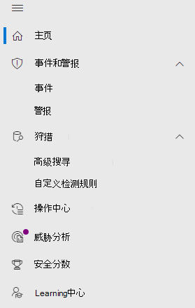

# Microsoft Defender for Endpoint in Microsoft 365 Defender

[!INCLUDE [Microsoft 365 Defender rebranding](../includes/microsoft-defender.md)]

**适用于：**

- [Microsoft 365 Defender](microsoft-365-defender.md)
- [Microsoft Defender for Endpoint](https://go.microsoft.com/fwlink/p/?linkid=2154037)

## 快速参考

图像和下表列出了在导航和导航Microsoft Defender 安全中心Microsoft 365 Defender。

> [!div class="mx-imgBorder"]
> 

| Microsoft Defender 安全中心 | Microsoft 365 Defender |
|---------|---------|
| 仪表板 <ul><li>安全操作</li><li>威胁分析</li></ul>  |家庭版 <ul><li>威胁分析</li></ul>   |
| 事件 | 事件和警报 |
| 设备清单 | 设备清单 |
| 警报队列 | 事件和警报 |
| 自动调查 | 操作中心 |
| 高级搜寻 | 搜寻 |
| 报表 | 报表 |
| 合作伙伴& API | 合作伙伴& API |
| 威胁&漏洞管理 | 漏洞管理 |
| 评估和教程 | 评估&教程 |
| 配置管理 | 配置管理 |
| 设置 | 设置 | 

改进的[Microsoft 365 Defender](microsoft-365-defender.md#the-microsoft-365-defender-portal)结合了保护、检测、调查和响应电子邮件、协作、标识 <a href="https://go.microsoft.com/fwlink/p/?linkid=2077139" target="_blank">https://security.microsoft.com</a> 和设备威胁的管理功能。 这汇集了现有 Microsoft 安全门户中的功能，Microsoft Defender 安全中心安全Office 365安全&中心。

如果您熟悉本文中的Microsoft Defender 安全中心，本文可帮助描述本文中的一些更改Microsoft 365 Defender。 但是，要注意一些新的和更新的元素。

过去[，Microsoft Defender 安全中心](/windows/security/threat-protection/microsoft-defender-atp/portal-overview)一直是 Microsoft Defender for Endpoint 的主页。 Enterprise安全团队已使用它监视和帮助响应潜在高级永久性威胁活动或数据泄露的警报。 为了帮助减少门户数量，Microsoft 365 Defender Microsoft 标识、数据、设备、应用和基础结构中监视和管理安全性的主页。

microsoft Defender for Endpoint in Microsoft 365 Defender supports [granting access to managed security service providers (MSSP) ](/windows/security/threat-protection/microsoft-defender-atp/grant-mssp-access) in the same way [is granted in the Microsoft Defender 安全中心](mssp-access.md).

> [!IMPORTANT]
> 你在当前订阅Microsoft 365 Defender取决于你的当前订阅。 例如，如果你没有 Microsoft Defender for Office 365许可证，将不会显示"电子邮件&协作"部分。

> [!Note]
> Microsoft 365 Defender不适用于：
>- 美国政府社区云 (GCC) 
>- 美国政府社区云高 (GCC高) 
>- 美国国防部
>- 所有拥有商业许可证的美国政府机构

查看 上 <a href="https://go.microsoft.com/fwlink/p/?linkid=2077139" target="_blank">https://security.microsoft.com</a> Microsoft 365 Defender。

详细了解优势：概述[Microsoft 365 Defender](microsoft-365-defender.md)

## 更改内容

此表快速引用了 Microsoft Defender 安全中心 和 Microsoft 365 Defender。

### 警报和操作

| 领域 | 更改说明 |
|---------|---------|
| [事件&警报](incidents-overview.md)  | 在Microsoft 365 Defender中，可以跨所有终结点、电子邮件和标识管理事件和警报。 我们已将体验融合在一起，帮助你更轻松地查找相关事件。 有关详细信息，请参阅 [事件概述](incidents-overview.md)。   |
| [搜寻](advanced-hunting-overview.md)  |  修改在 Microsoft Defender for Endpoint 中创建的自定义检测规则以包含标识和电子邮件表会自动将它们移动到Microsoft 365 Defender。 其相应的警报也会显示在Microsoft 365 Defender。 有关这些更改的更多详细信息，请阅读迁移 [自定义检测规则](advanced-hunting-migrate-from-mde.md#migrate-custom-detection-rules)。   高级 `DeviceAlertEvents` 搜寻的表在Microsoft 365 Defender。 若要在设备上查询特定于设备的警报Microsoft 365 Defender，可以使用 和 表来容纳来自各种源 `AlertInfo` `AlertEvidence` 集的更多信息。 通过以下不含 [DeviceAlertEvents](advanced-hunting-migrate-from-mde.md#write-queries-without-devicealertevents)的 Write 查询制作下一个与设备相关的查询。|
|[操作中心](m365d-action-center.md)    | 列出在自动调查和修正操作之后执行挂起和已完成的操作。 以前，"操作中心"Microsoft Defender 安全中心列出仅对设备上采取的修正操作挂起和已完成的操作，而自动调查列出了警报和状态。 在改进Microsoft 365 Defender中，操作中心将电子邮件、设备和用户之间的修正操作和调查汇集在一起，所有这些操作都位于一个位置。  |
| [威胁分析](threat-analytics.md) |  移动到导航栏顶部，以便更轻松地发现和使用。 现在包括终结点以及电子邮件和协作的威胁信息。    |

### 终结点

| 领域 | 更改说明 |
|---------|---------|
|搜索   |  搜索栏位于页面顶部。 键入时提供建议。 可以在 Defender for Endpoint 和 Defender for Identity 中跨以下实体进行搜索：    - **设备** - 支持 Defender for Endpoint 和 Defender for Identity。 您甚至可以使用搜索运算符，例如，您可以使用"contains"搜索主机名的一部分。    - **用户** - 支持 Defender for Endpoint 和 Defender for Identity。    - **文件、IP 和 URL** - 与 Defender for Endpoint 中的功能相同。   注意：*IP 和 URL 搜索完全匹配，不会显示在搜索结果页面中 ， 它们直接指向实体页面。     - **TVM** - 与 Defender for Endpoint 中的相同功能 (漏洞、软件和建议) 。     增强的搜索结果页面集中了来自所有实体的结果。  |
|[仪表板](/windows/security/threat-protection/microsoft-defender-atp/security-operations-dashboard)   |  这是安全操作仪表板。 请参阅触发的活动警报数、处于风险中的设备、处于风险中的用户以及警报、设备和用户的严重性级别。 还可以查看任何设备是否具有传感器问题、整体服务运行状况，以及如何检测到任何未解决的警报。 |
|设备清单 | 无更改。 |
|[漏洞管理](/windows/security/threat-protection/microsoft-defender-atp/next-gen-threat-and-vuln-mgt)    |    已缩短名称以适合导航窗格。 它与"页面"部分危险和漏洞管理相同，所有页面位于下方。     |
| 合作伙伴和 API | 无更改。 |
| 评估&教程    |     新的测试和学习功能。     |
| 配置管理   |  无更改。  |

> [!NOTE]
> **自动调查和修正** 现在是事件的一部分。 You can see Automated investigation and remediation events in the **Incident > Investigation** tab.

> [!TIP]
> 设备搜索从 Endpoints > Search 完成。

### 访问和报告

| 领域 | 更改说明 |
|---------|---------|
| 报告  | 请参阅终结点和电子邮件报告&协作，包括威胁防护、设备运行状况和合规性以及易受攻击的设备。 |
| 运行状况  |  当前链接到网站中的"服务运行状况["Microsoft 365 管理中心。](https://admin.microsoft.com/) |
| 设置 |  管理你的设置Microsoft 365 Defender、终结点、电子邮件&协作、标识和设备发现。   |

## Microsoft 365安全导航和功能

左侧导航栏或快速启动栏将看起来熟悉。 但是，该门户中新增了一些更新Microsoft 365 Defender元素。 

### 事件和警报

将跨电子邮件、设备和标识的事件和警报管理结合起来。 警报页面通过组合攻击信号来构造详细的情景，为警报提供完整的上下文。 全新的统一体验现在汇集了跨工作负荷的一致警报视图。 您可以快速分案、调查，以及采取有效措施。

- [详细了解事件](incidents-overview.md)
- [深入了解如何管理警报](investigate-alerts.md)

### 搜寻

通过使用 [高级搜索查询来在终结点、Office 365 邮箱等位置主动搜索威胁、恶意软件和恶意](advanced-hunting-overview.md)。 这些强大的查询可用于查找和查看威胁指示器和实体，了解已知威胁和潜在威胁。

[自定义检测规则](custom-detection-rules.md) 可以从高级搜寻查询构建，以帮助你主动监视可能表示泄露活动和错误配置设备的事件。

### 操作中心

操作中心显示自动调查和响应功能创建调查。 Microsoft 365 Defender 中的自动自恢复功能可自动响应特定事件，帮助团队实现安全。

[详细了解操作中心](m365d-action-center.md)。

### 威胁分析

从 Microsoft 安全研究人员获取威胁智能。 威胁分析可帮助安全团队在面对新兴威胁时更有效率。 威胁分析包括：

- Microsoft Defender for Office 365 的与电子邮件相关的检测和缓解措施。 除了从 Microsoft Defender for Endpoint 中可用的终结点数据外，还有一个终结点数据。
- 与威胁相关的事件视图。
- 增强的体验，可快速识别和使用报告中的可操作信息。

你可以从 Microsoft 365 Defender 左上角的导航栏，或者从显示组织的主要威胁的专用仪表板卡片访问威胁分析。

详细了解如何使用威胁 [分析跟踪和响应新出现的威胁](./threat-analytics.md)。

### 终结点部分

查看和管理组织中终结点的安全性。 如果你已使用Microsoft Defender 安全中心，它将看起来很熟悉。

### 访问和报告

查看报表、更改设置和修改用户角色。

### SIEM API 连接

如果你使用 [适用于终结点 SIEM API 的 Defender，](../defender-endpoint/enable-siem-integration.md)你可以继续这样做。 我们已在 API 负载上添加了指向安全门户中的警报页面或事件Microsoft 365链接。 新的 API 字段包括 LinkToMTP 和 IncidentLinkToMTP。 有关详细信息，请参阅将帐户从[Microsoft Defender for Endpoint 重定向到Microsoft 365 Defender。](./microsoft-365-security-mde-redirection.md)

### 电子邮件警报

你可以继续使用 Defender for Endpoint 的电子邮件警报。 我们已在电子邮件中添加指向警报页面或事件页面中的新Microsoft 365 Defender。 有关详细信息，请参阅将帐户从[Microsoft Defender for Endpoint 重定向到Microsoft 365 Defender。](./microsoft-365-security-mde-redirection.md)

### MSSP (托管安全服务) 

统一门户当前不支持在同一浏览会话中同时登录到多个租户。 可以通过还原到以前的 Microsoft Defender for [Endpoint](microsoft-365-security-mde-redirection.md#can-i-go-back-to-using-the-former-portal)门户来选择退出自动重定向，以维护此功能，直到问题得到解决为止。

## 相关信息

- [Microsoft 365 Defender](microsoft-365-defender.md)
- [Microsoft Defender for Endpoint in Microsoft 365 Defender](microsoft-365-security-center-mde.md)
- [将帐户从 Microsoft Defender for Endpoint 重定向到Microsoft 365 Defender](microsoft-365-security-mde-redirection.md)
