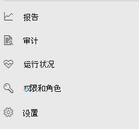

# Microsoft Defender for Endpoint in Microsoft 365 DefenderMicrosoft Defender for Endpoint in Microsoft 365 Defender

[!INCLUDE [Microsoft 365 Defender rebranding](../includes/microsoft-defender.md)]

**适用于：****Applies to:**

- [Microsoft 365 DefenderMicrosoft 365 Defender](microsoft-365-defender.md)
- [Microsoft Defender for EndpointMicrosoft Defender for Endpoint](https://go.microsoft.com/fwlink/p/?linkid=2154037)

## 快速参考Quick reference

图像和下表列出了 Defender 和 Microsoft Defender 安全中心 Microsoft 365 之间的导航更改。The image and the table below lists the changes in navigation between the Microsoft Defender Security Center and Microsoft 365 Defender.

> [!div class="mx-imgBorder"]
> 

| Microsoft Defender 安全中心Microsoft Defender Security Center | Microsoft 365 DefenderMicrosoft 365 Defender |
|---------|---------|
| 仪表板Dashboards <ul><li>安全操作Security Operations</li><li>威胁分析Threat Analytics</li></ul>  |主页Home <ul><li>威胁分析Threat analytics</li></ul>   |
| 事件Incidents | 事件&警报Incidents & alerts |
| 设备清单Device inventory | 设备清单Device inventory |
| 警报队列Alerts queue | 事件&警报Incidents & alerts |
| 自动调查Automated investigations | 操作中心Action center |
| 高级搜寻Advanced hunting | 搜寻Hunting |
| 报表Reports | 报表Reports |
| 合作伙伴& APIPartners & APIs | 合作伙伴& APIPartners & APIs |
| 威胁&漏洞管理Threat & Vulnerability Management | 漏洞管理Vulnerability management |
| 评估和教程Evaluation and tutorials | 评估&教程Evaluation & tutorials |
| 配置管理Configuration management | 配置管理Configuration management |
| 设置Settings | 设置Settings | 

改进的[Microsoft 365 Defender](overview-security-center.md)结合了保护、检测、调查和响应电子邮件、协作、 [https://security.microsoft.com](https://security.microsoft.com) 标识和设备威胁的管理功能。The improved [Microsoft 365 Defender](overview-security-center.md) at [https://security.microsoft.com](https://security.microsoft.com) combines security capabilities that protect, detect, investigate, and respond to email, collaboration, identity, and device threats. 这汇集了现有 Microsoft 安全门户中的功能，包括 Microsoft Defender 安全中心 和 Office 365 安全&中心。This  brings together functionality from existing Microsoft security portals, including Microsoft Defender Security Center and the Office 365 Security & Compliance center.

如果你熟悉本文Microsoft Defender 安全中心，本文可帮助描述 Microsoft 365 Defender 中的一些更改和改进。If you're familiar with the Microsoft Defender Security Center, this article helps describe some of the changes and improvements in Microsoft 365 Defender. 但是，要注意一些新的和更新的元素。However there are some new and updated elements to be aware of.

过去[，Microsoft Defender 安全中心](/windows/security/threat-protection/microsoft-defender-atp/portal-overview)一直是 Microsoft Defender for Endpoint 的主页。Historically, the [Microsoft Defender Security Center](/windows/security/threat-protection/microsoft-defender-atp/portal-overview) has been the home for Microsoft Defender for Endpoint. Enterprise安全团队已使用它监视和帮助响应潜在高级永久性威胁活动或数据泄露的警报。Enterprise security teams have used it to monitor and help responding to alerts of potential advanced persistent threat activity or data breaches. 为了帮助减少门户数量，Microsoft 365 Defender 将成为监视和管理 Microsoft 标识、数据、设备、应用和基础结构的安全性的主页。To help reduce the number of portals, Microsoft 365 Defender will be the home for monitoring and managing security across your Microsoft identities, data, devices, apps, and infrastructure.

Microsoft 365 Defender 中的 Microsoft Defender for Endpoint 支持向托管安全服务提供商[ (MSSP) ](/windows/security/threat-protection/microsoft-defender-atp/grant-mssp-access)授予访问权限，方式与在 Microsoft Defender 安全中心授予访问权限[的方式相同](mssp-access.md)。Microsoft Defender for Endpoint in Microsoft 365 Defender supports [granting access to managed security service providers (MSSPs)](/windows/security/threat-protection/microsoft-defender-atp/grant-mssp-access) in the same way [access is granted in the Microsoft Defender security center](mssp-access.md).

> [!IMPORTANT]
> 在 Defender 中Microsoft 365取决于你的当前订阅。What you see in Microsoft 365 Defender depends on your current subscriptions. 例如，如果你没有 Microsoft Defender for Office 365 许可证，将不会显示"电子邮件&协作"部分。For example, if you don't have a license for Microsoft Defender for Office 365, then the Email & Collaboration section will not be shown.

> [!Note]
> Microsoft 365Defender 不可用于：Microsoft 365 Defender is not available for:
>- 美国政府社区云 (GCC) US Government Community Cloud (GCC)
>- 美国政府社区云高 (GCC高) US Government Community Cloud High (GCC High)
>- 美国国防部US Department of Defense
>- 所有拥有商业许可证的美国政府机构All US government institutions with commercial licenses

请看一下Microsoft 365 [https://security.microsoft.com](https://security.microsoft.com) Defender：。Take a look at Microsoft 365 Defender: [https://security.microsoft.com](https://security.microsoft.com).

了解有关优势的更多信息[：Microsoft 365 Defender 概述](overview-security-center.md)Learn more about the benefits: [Overview of Microsoft 365 Defender](overview-security-center.md)

## 更改内容What's changed

此表快速引用了 Microsoft Defender 安全中心 和 Microsoft 365 Defender 之间的更改。This table is a quick reference of the changes between the Microsoft Defender Security Center and Microsoft 365 Defender.

### 警报和操作Alerts and actions

| 领域Area | 更改说明Description of change |
|---------|---------|
| [事件&警报Incidents & alerts](incidents-overview.md)  | 在 Microsoft 365 Defender 中，你可以跨所有终结点、电子邮件和标识管理事件和警报。In Microsoft 365 Defender, you can manage incidents and alerts across all of your endpoints, email, and identities. 我们已将体验融合在一起，帮助你更轻松地查找相关事件。We've converged the experience to help you find related events more easily. 有关详细信息，请参阅 [事件概述](incidents-overview.md)。For more information, see [Incidents Overview](incidents-overview.md).   |
| [搜寻Hunting](advanced-hunting-overview.md)  |  修改在 Microsoft Defender for Endpoint 中创建的自定义检测规则，以包含标识和电子邮件表会自动将它们Microsoft 365 Defender。Modifying custom detection rules created in Microsoft Defender for Endpoint to include identity and email tables automatically moves them to Microsoft 365 Defender. 其相应的警报也会显示在 Microsoft 365 Defender 中。Their corresponding alerts will also appear in Microsoft 365 Defender. 有关这些更改的更多详细信息，请阅读迁移 [自定义检测规则](advanced-hunting-migrate-from-mde.md#migrate-custom-detection-rules)。For more details about these changes, read [Migrate custom detection rules](advanced-hunting-migrate-from-mde.md#migrate-custom-detection-rules).   高级 `DeviceAlertEvents` 搜寻的表在 Microsoft 365 Defender 中不可用。The `DeviceAlertEvents` table for advanced hunting isn't available in Microsoft 365 Defender. 若要在 Microsoft 365 Defender 中查询特定于设备的警报信息，可以使用 和 表来容纳来自各种源 `AlertInfo` `AlertEvidence` 集的更多信息。To query device-specific alert information in Microsoft 365 Defender, you can use the `AlertInfo` and `AlertEvidence` tables to accommodate even more information from a diverse set of sources. 通过以下不含 [DeviceAlertEvents](advanced-hunting-migrate-from-mde.md#write-queries-without-devicealertevents)的 Write 查询制作下一个与设备相关的查询。Craft your next device-related query by following [Write queries without DeviceAlertEvents](advanced-hunting-migrate-from-mde.md#write-queries-without-devicealertevents).|
|[操作中心Action center](m365d-action-center.md)    | 列出在自动调查和修正操作之后采取的挂起和已完成的操作。Lists pending and completed actions that were taken following automated investigations and remediation actions. 以前，"操作中心"Microsoft Defender 安全中心列出仅对设备上采取的修正操作挂起和已完成的操作，而自动调查列出了警报和状态。Formerly, the Action center in the Microsoft Defender Security Center listed pending and completed actions for remediation actions taken on devices only, while Automated investigations listed alerts and status. 在改进的 Microsoft 365 Defender 中，操作中心跨电子邮件、设备和用户将修正操作和调查汇集在一起，所有这些操作都位于一个位置。In the  improved Microsoft 365 Defender, the Action center brings together remediation actions and investigations across email, devices, and users—all in one location.  |
| [威胁分析Threat analytics](threat-analytics.md) |  移动到导航栏顶部，以便更轻松地发现和使用。Moved to the top of the navigation bar for easier discovery and use. 现在包括终结点以及电子邮件和协作的威胁信息。Now includes threat information for both endpoints and email and collaboration.    |

### 终结点Endpoints

| 领域Area | 更改说明Description of change |
|---------|---------|
|搜索Search   |  Microsoft Defender for Endpoint 搜索栏不是位于标题中，而是在"终结点"部分下移动。Instead of being in the heading, Microsoft Defender for Endpoint search bar is moving under the Endpoints section. 你可以继续搜索设备、文件、用户、URL、IP、漏洞、软件和建议。You can continue to search for devices, files, users, URLs, IPs, vulnerabilities, software, and recommendations.  |
|[仪表板Dashboard](/windows/security/threat-protection/microsoft-defender-atp/security-operations-dashboard)   |  这是安全操作仪表板。This is your security operations dashboard. 请参阅触发的活动警报数、处于风险中的设备、处于风险中的用户以及警报、设备和用户的严重性级别。See an overview of how many active alerts were triggered, which devices are at risk, which users are at risk, and severity level for alerts, devices, and users. 还可以查看任何设备是否具有传感器问题、整体服务运行状况，以及如何检测到任何未解决的警报。You can also see if any devices have sensor issues, your overall service health, and how any unresolved alerts were detected. |
|设备清单Device inventory | 无更改。No changes. |
|[漏洞管理Vulnerability management](/windows/security/threat-protection/microsoft-defender-atp/next-gen-threat-and-vuln-mgt)    |    已缩短名称以适合导航窗格。Name was shortened to fit in the navigation pane. 它与"页面"部分危险和漏洞管理相同，所有页面位于下方。It's the same as the threat and vulnerability management section, with all the pages underneath.     |
| 合作伙伴和 APIPartners and APIs | 无更改。No changes. |
| 评估&教程Evaluations & tutorials    |     新的测试和学习功能。New testing and learning capabilities.     |
| 配置管理Configuration management   |  无更改。No changes.  |

> [!NOTE]
> **自动调查和修正** 现在是事件的一部分。**Automatic investigation and remediation** is now a part of  incidents. You can see Automated investigation and remediation events in the **Incident > Investigation** tab.You can see Automated  investigation and remediation events in the **Incident > Investigation** tab.

> [!TIP]
> 设备搜索从 Endpoints > Search 完成。Device search is done from Endpoints > Search.

### 访问和报告Access and reporting

| 领域Area | 更改说明Description of change |
|---------|---------|
| 报表Reports  | 请参阅终结点和电子邮件报告&协作，包括威胁防护、设备运行状况和合规性以及易受攻击的设备。See reports for endpoints and email & collaboration, including Threat protection, Device health and compliance, and Vulnerable devices. |
| 健康Health  |  当前链接到管理中心 中的"服务运行状况["Microsoft 365页面](https://admin.microsoft.com/)。Currently links out to the "Service health" page in the [Microsoft 365 admin center](https://admin.microsoft.com/). |
| 设置Settings |  管理 Defender、Microsoft 365、电子邮件&协作、标识和设备发现的设置。Manage your settings for Microsoft 365 Defender, Endpoints, Email & collaboration, Identities, and Device discovery.   |

## Microsoft 365安全导航和功能Microsoft 365 security navigation and capabilities

左侧导航栏或快速启动栏将看起来熟悉。The left navigation, or quick launch bar, will look familiar. 但是，这个安全中心中有些新增和更新的元素。However, there are some new and updated elements in this security center.

### 事件和警报Incidents and alerts

将跨电子邮件、设备和标识的事件和警报管理结合起来。Brings together incident and alert management across your email, devices, and identities. 警报页面通过组合攻击信号来构造详细的情景，为警报提供完整的上下文。The alert page provides full context to the alert by combining attack signals to construct a detailed story. 全新的统一体验现在汇集了跨工作负荷的一致警报视图。A new, unified experience now brings together a consistent view of alerts across workloads. 您可以快速分案、调查，以及采取有效措施。You can quickly triage, investigate, and take effective action.

- [详细了解事件Learn more about incidents](incidents-overview.md)
- [深入了解如何管理警报Learn more about managing alerts](investigate-alerts.md)

### 搜寻Hunting

通过使用 [高级搜索查询来在终结点、Office 365 邮箱等位置主动搜索威胁、恶意软件和恶意](advanced-hunting-overview.md)。Proactively search for threats, malware, and malicious activity across your endpoints, Office 365 mailboxes, and more by using [advanced hunting queries](advanced-hunting-overview.md). 这些强大的查询可用于查找和查看威胁指示器和实体，了解已知威胁和潜在威胁。These powerful queries can be used to locate and review threat indicators and entities for both known and potential threats.

[自定义检测](custom-detection-rules.md) 规则可以从高级搜寻查询构建，以帮助你主动监视可能表示泄露活动和错误配置设备的事件。[Custom detection rules](custom-detection-rules.md) can be built from advanced hunting queries to help you proactively watch for events that might be indicative of breach activity and misconfigured devices.

### 操作中心Action center

操作中心显示自动调查和响应功能创建调查。Action center shows you the investigations created by automated investigation and response capabilities. Microsoft 365 Defender 中的自动自恢复功能可自动响应特定事件，帮助团队实现安全。This automated, self-healing in Microsoft 365 Defender can help security teams by automatically responding to specific events.

[详细了解操作中心](m365d-action-center.md)。[Learn more about the Action center](m365d-action-center.md).

### 威胁分析Threat Analytics

从 Microsoft 安全研究人员获取威胁智能。Get threat intelligence from expert Microsoft security researchers. 威胁分析可帮助安全团队在面对新兴威胁时更有效率。Threat Analytics helps security teams be more efficient when facing emerging threats. 威胁分析包括：Threat Analytics includes:

- Microsoft Defender for Office 365 的与电子邮件相关的检测和缓解措施。Email-related detections and mitigations from Microsoft Defender for Office 365. 除了从 Microsoft Defender for Endpoint 中可用的终结点数据外，还有一个终结点数据。This is in addition to the endpoint data already available from Microsoft Defender for Endpoint.
- 与威胁相关的事件视图。Incidents view related to the threats.
- 增强的体验，可快速识别和使用报告中的可操作信息。Enhanced experience for quickly identifying and using actionable information in the reports.

你可以从 Microsoft 365 Defender 中的左上角导航栏，或者从显示组织的主要威胁的专用仪表板卡访问威胁分析。You can access threat analytics either from the upper left navigation bar in Microsoft 365 Defender, or from a dedicated dashboard card that shows the top threats for your organization.

详细了解如何使用威胁 [分析跟踪和响应新出现的威胁](./threat-analytics.md)。Learn more about how to [track and respond to emerging threats with threat analytics](./threat-analytics.md).

### 终结点部分Endpoints section

查看和管理组织中终结点的安全性。View and manage the security of endpoints in your organization. 如果你已使用Microsoft Defender 安全中心，它看起来会很熟悉。If you've used the Microsoft Defender Security Center, it will look familiar.

### 访问和报告Access and reports

查看报表、更改设置和修改用户角色。View reports, change your settings, and modify user roles.

### SIEM API 连接SIEM API connections

如果你使用 [适用于终结点 SIEM API 的 Defender，](../defender-endpoint/enable-siem-integration.md)你可以继续这样做。If you use the [Defender for Endpoint SIEM API](../defender-endpoint/enable-siem-integration.md), you can continue to do so. 我们已在 API 负载上添加了指向安全门户中的警报页面或事件Microsoft 365链接。We’ve added new links on the API payload that point to the alert page or the incident page in the Microsoft 365 security portal. 新的 API 字段包括 LinkToMTP 和 IncidentLinkToMTP。New API fields include LinkToMTP and IncidentLinkToMTP. 有关详细信息，请参阅将帐户从[Microsoft Defender for Endpoint 重定向到 Microsoft 365 Defender](./microsoft-365-security-mde-redirection.md)。For more information, see [Redirecting accounts from Microsoft Defender for Endpoint to Microsoft 365 Defender](./microsoft-365-security-mde-redirection.md).

### 电子邮件警报Email alerts

你可以继续使用 Defender for Endpoint 的电子邮件警报。You can continue to use email alerts for Defender for Endpoint. 我们已在电子邮件中添加指向 defender 中的警报页面或事件页面Microsoft 365链接。We've added new links in the emails that point to the alert page or the incident page in Microsoft 365 Defender. 有关详细信息，请参阅将帐户从[Microsoft Defender for Endpoint 重定向到 Microsoft 365 Defender](./microsoft-365-security-mde-redirection.md)。For more information, see [Redirecting accounts from Microsoft Defender for Endpoint to Microsoft 365 Defender](./microsoft-365-security-mde-redirection.md).

### MSSP (托管安全服务) Managed Security Service Providers (MSSP)

统一门户当前不支持在同一浏览会话中同时登录到多个租户。Logging in to multiple tenants simultaneously in the same browsing session is currently not supported in the unified portal. 可以通过还原到以前的 Microsoft Defender for [Endpoint](microsoft-365-security-mde-redirection.md#can-i-go-back-to-using-the-former-portal)门户来选择退出自动重定向，以维护此功能，直到问题得到解决为止。You can opt-out of the automatic redirection by [reverting to the former Microsoft Defender for Endpoint portal](microsoft-365-security-mde-redirection.md#can-i-go-back-to-using-the-former-portal), to maintain this functionality until the issue is resolved.

## 相关信息Related information

- [Microsoft 365 DefenderMicrosoft 365 Defender](overview-security-center.md)
- [Microsoft Defender for Endpoint in Microsoft 365 DefenderMicrosoft Defender for Endpoint in Microsoft 365 Defender](microsoft-365-security-center-mde.md)
- [将帐户从 Microsoft Defender for Endpoint 重定向到 Microsoft 365 DefenderRedirecting accounts from Microsoft Defender for Endpoint to Microsoft 365 Defender](microsoft-365-security-mde-redirection.md)
