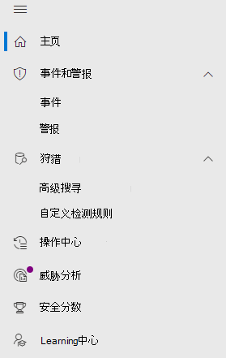

# Microsoft Defender for Office 365 in Microsoft 365 Defender

[!INCLUDE [Microsoft 365 Defender rebranding](../includes/microsoft-defender.md)]

**适用于：**
- [Microsoft 365 Defender](microsoft-365-defender.md)
- [Microsoft Defender for Office 365](/microsoft-365/security/office-365-security/defender-for-office-365)

## 快速参考

下表列出了安全与合规中心之间的导航&更改Microsoft 365 Defender。

 

****

|[安全与合规中心](https://protection.office.com)|[Microsoft 365 Defender](https://security.microsoft.com)|[Microsoft 365 合规中心](https://compliance.microsoft.com/homepage)|[Exchange 管理中心](https://admin.exchange.microsoft.com)|
|---|---|---|---|
|警报|<ul><li>[警报策略](https://security.microsoft.com/alertpolicies)</li><li>[事件&警报](https://security.microsoft.com/alerts)</li></ul>|[警报页面](https://compliance.microsoft.com/homepage)||
|分类||请参阅[Microsoft 365 合规中心](https://compliance.microsoft.com/homepage)||
|数据丢失防护||请参阅[Microsoft 365 合规中心](https://compliance.microsoft.com/homepage)||
|记录管理||请参阅[Microsoft 365 合规中心](https://compliance.microsoft.com/homepage)||
|信息管理政策||请参阅[Microsoft 365 合规中心](https://compliance.microsoft.com/homepage)||
|威胁管理|[电子邮件&协作](https://security.microsoft.com/homepage)|||
|权限|[角色&权限](https://security.microsoft.com/emailandcollabpermissions)|请参阅[Microsoft 365 合规中心](https://compliance.microsoft.com/homepage)||
|邮件流|||请参阅[Exchange管理中心](https://admin.exchange.microsoft.com/#/)|
|数据隐私||请参阅[Microsoft 365 合规中心](https://compliance.microsoft.com/homepage)||
|搜索|[审核](https://security.microsoft.com/auditlogsearch?viewid=Async%20Search)|搜索 (内容搜索) ||
|报告|[报告](https://security.microsoft.com/emailandcollabreport)|||
|服务保证||请参阅[Microsoft 365 合规中心](https://compliance.microsoft.com/homepage)||
|监督||请参阅[Microsoft 365 合规中心](https://compliance.microsoft.com/homepage)||
|电子数据展示||请参阅[Microsoft 365 合规中心](https://compliance.microsoft.com/homepage)||
|||||

[Microsoft 365 Defender](./microsoft-365-defender.md)集现有 Microsoft 安全门户（包括安全与合规中心）中的& <https://security.microsoft.com> 功能于一起。 此改进的中心有助于安全团队更高效地保护组织免遭威胁侵害。

如果您熟悉安全与合规&中心 (protection.office.com) ，本文将介绍 Microsoft 365 Defender 中的一些更改和改进。

详细了解优势：概述[Microsoft 365 Defender](microsoft-365-defender.md)

如果你正在寻找与合规性相关的项目，请访问 [Microsoft 365 合规中心](https://compliance.microsoft.com/homepage)。

## 新增和改进的功能

左侧导航栏或快速启动栏将看起来熟悉。 但是，这个安全中心中有些新增和更新的元素。

通过统一Microsoft 365 Defender解决方案，你可以将威胁信号汇集在一起，确定威胁的完整范围和影响，以及威胁当前对组织的影响。

:::image type="content" source="../../media/M365-defender-converge-experience.png" alt-text="聚合Microsoft 365 Defender的图像。":::

Defender for Office 365保护你的组织免受电子邮件、链接 (URL) 和协作工具造成的恶意威胁。

:::image type="content" source="../../media/Defender-for-O365.png" alt-text="Defender for Office 365 的图像。":::

### 事件和警报

将跨电子邮件、设备和标识的事件和警报管理结合起来。 现可在"调查"节点下使用警报，有助于提供攻击的更广泛视图。 警报页面通过组合攻击信号构建详细信息，为警报提供完整上下文。 以前，警报是特定于不同工作负载的。 全新的统一体验现在汇集了跨工作负荷的一致警报视图。 您可以快速分案、调查，以及采取有效措施。

- [了解有关调查功能深入了解](incidents-overview.md)
- [深入了解如何管理警报](/windows/security/threat-protection/microsoft-defender-atp/review-alerts)

### 搜寻

通过使用 [高级搜索查询来在终结点、Office 365 邮箱等位置主动搜索威胁、恶意软件和恶意](advanced-hunting-overview.md)。 可以使用这些强大的查询查找和查看威胁指示器和针对已知和潜在威胁的实体。

[自定义检测规则](/windows/security/threat-protection/microsoft-defender-atp/custom-detection-rules) 可以从高级搜寻查询构建，以帮助你主动监视可能表示泄露活动和错误配置设备的事件。

下面是 Microsoft Defender [for Office 365](advanced-hunting-example.md)中的高级搜寻示例。

### 操作中心

操作中心显示自动调查和响应功能创建调查。 Microsoft 365 Defender 中的自动自恢复功能可自动响应特定事件，帮助团队实现安全。

详细了解操作 [中心](m365d-action-center.md)。

#### 威胁分析

从 Microsoft 安全研究人员获取威胁智能。 威胁分析可帮助安全团队在面对新兴威胁时更有效率。 威胁分析包括：

- Microsoft Defender for Office 365 的与电子邮件相关的检测和缓解措施。 除了从 Microsoft Defender for Endpoint 中可用的终结点数据外，还有一个终结点数据。
- 与威胁相关的事件视图。
- 增强的体验，可快速识别和使用报告中的可操作信息。

你可以从 Microsoft 365 Defender 左上角导航栏，或者从显示组织的主要威胁的专用仪表板卡访问威胁分析。

详细了解如何使用威胁 [分析跟踪和响应新出现的威胁](./threat-analytics.md)。

### 电子邮件和协作

跟踪和调查对用户电子邮件的威胁，跟踪活动等。 如果你已使用安全与&中心，这将很熟悉。

:::image type="content" source="../../media/converge-3-email-and-collab-new.png" alt-text="电子邮件&quot;排序规则&&quot; (&quot;或&quot;MSDO) &quot;菜单，位于 Microsoft 365 Defender。":::

#### 电子邮件实体页面

"[电子邮件实体"](../office-365-security/mdo-email-entity-page.md)*页面统* 一了过去分散在不同页面或视图中的电子邮件信息。 调查电子邮件中的威胁和趋势是 *集中*。 可在同一电子邮件页面上访问邮件头信息和电子邮件预览，以及其他有用的电子邮件相关信息。 同样，可在同一页面的选项卡上找到恶意文件附件或 URL 的阻止状态。 电子邮件实体页面使管理员和安全运营团队能够快速了解电子邮件威胁及其状态，然后快速确定处理情况。

### Access 和报表

查看报表、更改设置和修改用户角色。

:::image type="content" source="../../media/converge-4-access-and-reporting-new.png" alt-text="安全中心左侧Microsoft 365 Defender权限和报告的快速启动菜单。":::

> [!NOTE]
> DomainKeys Identified Mail (DKIM) 可确保目标电子邮件系统信任从自定义域出站发送的邮件。
> For Defender for Office 365 users， you can now *manage and rotate* DKIM keys through Microsoft 365 Defender： ， or navigate to Policy & <https://security.microsoft.com/threatpolicy> **rules** \> **Threat policies** \> \> **Rules** section \> **DKIM**.
>
> 有关详细信息，请参阅使用 [DKIM 验证从自定义域发送的出站电子邮件](/microsoft-365/security/office-365-security/use-dkim-to-validate-outbound-email)。

## 更改内容

此表是威胁管理的快速参考，其中安全与合规中心与安全&**门户** 之间 **Microsoft 365 Defender** 变化。 单击链接，详细了解这些区域。

 

****

|领域|更改说明|
|---|---|
|[调查](../office-365-security/office-365-air.md#changes-are-coming-soon-in-your-microsoft-365-defender-portal)|将 [Defender for Office 365](/microsoft-365/security/office-365-security/defender-for-office-365) 和 [Defender for Endpoint](../defender-endpoint/automated-investigations.md)。 通过这些更新和改进，安全操作团队将能够在一处查看电子邮件、协作内容、用户帐户和设备中的自动调查和修正操作的详细信息。|
|[警报队列](../../compliance/alert-policies.md)|安全 **与合规中心的**"查看警报"&现在包含指向"警报Microsoft 365 Defender。 单击"打开 **通知页**"链接，Microsoft 365 Defender打开。 可以通过单击警报 **中** Office 365 警报来访问通知页面。|
|[攻击模拟培训](../office-365-security/attack-simulation-training-insights.md)|使用"攻击攻击"培训在组织中运行实际攻击方案。 这些模拟攻击可帮助在真正攻击对组织造成攻击之前对员工进行培训。 攻击攻击培训包括更多选项、增强的报告以及改进的培训课程，有助于更轻松地提供和管理攻击攻击方案和培训方案。|
|

这些方面未发生变化：

- [资源管理器](../office-365-security/threat-explorer.md)
- [策略和规则](../../compliance/alert-policies.md)
- [市场活动](../office-365-security/campaigns.md)
- [提交](../office-365-security/admin-submission.md)
- [审阅](./m365d-action-center.md)
- [威胁跟踪器](../office-365-security/threat-trackers.md)

此外，请查看 **底部的** "相关信息"部分。

> [!IMPORTANT]
> Microsoft 365 Defender门户 () 和 <https://security.microsoft.com> 中组合 <https://securitycenter.windows.com> 了安全功能 <https://protection.office.com> 。 但是，所看到的内容取决于你的订阅。 例如，如果只有适用于 Office 365 计划 1 或 2 的 Microsoft Defender，作为独立订阅，你将看不到终结点安全与适用于 Office 计划 1 的 Defender 客户不会看到威胁分析等项目。

> [!TIP]
> 所有 Exchange Online Protection (EOP) 函数都将包含在Microsoft 365 Defender，因为 EOP 是 Defender for Office 365 的核心元素。

## Microsoft 365 Defender主页

门户主页显示有关你的安全环境的安全状态的重要Microsoft 365信息。

使用 **指导** ，可快速浏览终结点或电子邮件和协作页面。 请注意，此处显示的任何信息取决于拥有适用于 Office 365 的 Defender 和/或 Defender for Endpoint 的许可证。

此外，还包括指向安全与合规& **中心的链接** 进行比较。 最后一个链接是 **更新的"新增功能** 页面。

## 相关信息

- [将安全&中心重定向到Microsoft 365 Defender](microsoft-365-security-mdo-redirection.md)
- [操作中心](./m365d-action-center.md)
- [电子邮件和协作警报](../../compliance/alert-policies.md#default-alert-policies)
- [自定义检测规则](/microsoft-365/security/defender-endpoint/custom-detection-rules)
- [创建钓鱼欺诈欺诈](../office-365-security/attack-simulation-training.md)[有效负载，给员工提供培训](../office-365-security/attack-simulation-training-payloads.md)
