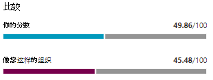

# 跟踪 Microsoft 安全分数历史记录并实现目标

[!INCLUDE [Microsoft 365 Defender rebranding](../includes/microsoft-defender.md)]

[Microsoft 安全](microsoft-secure-score.md) 分数是组织安全状况的度量，较高的数字表示采取更多改进措施。 可以在门户 的 Microsoft 365 Defender https://security.microsoft.com/securescore [找到它](microsoft-365-defender.md#the-microsoft-365-defender-portal)。

## 深入了解影响分数的活动

在"历史记录"选项卡中查看组织一段时间的 **分数** 图。

下图列出了选定时间范围内执行的所有操作及其属性，如生成的点和类别。 您可以自定义日期范围并按类别进行筛选。

如果您选择与活动关联的改进操作，则将显示"完全改进操作"飞出。

若要查看该特定改进操作的所有历史记录，请在飞出视图中选择历史记录链接。

## 发现趋势并设定目标

在 **"指标&** 趋势"选项卡中，可以使用多个图形和图表来进一步查看趋势和设定目标。 你可以为整个可视化页面设置日期范围。 可视化效果包括：

* **安全分数区域** - 根据组织目标和良好、正常和错误分数范围的定义进行自定义。
* **回归趋势** - 由于配置、用户或设备更改而已回归的点的时间线。  
* **比较趋势** - 组织的安全分数如何与其他人员在一段时间进行比较。 此视图可以包含表示具有相似席位计数的组织得分平均值的行和您可以设置的自定义比较视图。
* **风险接受趋势** - 标记为"风险接受"的改进措施的日程表。
* **分数更改** - 在指定的日期范围内获得分数、回归分数和分数更改数。

### 将分数与组织（如组织）进行比较

有两个地方可以了解你的分数与你的组织之间的比较情况。

#### 比较条形图

比较条形图是"概述 **"** 选项卡。将鼠标悬停在图表上可查看得分和得分机会。 对比较数据进行匿名处理，因此我们不确切知道哪些其他租户位于混合中。

- **组织喜欢你的** 组织：如果我们至少有五 (个租户来比较符合以下条件) 租户的平均得分，
    1. 同一行业
    2. 组织规模相同
    3. 所有区域
    4. 使用的 Microsoft 产品有 80% 相似
    5. 机会 (租户 20% 范围内的当前许可证) 可获取的最大分数

#### 比较趋势

在 **"指标&** 趋势"选项卡中，查看组织的安全分数与其他人的比较时间。

## 欢迎提出宝贵意见

如果有任何问题，请通过发布在安全、隐私和合规性社区中& [告知](https://techcommunity.microsoft.com/t5/Security-Privacy-Compliance/bd-p/security_privacy) 我们。 We're monitoring the community and will provide help.

## 相关资源

- [Microsoft 安全分数概述](microsoft-secure-score.md)
- [评估安全状况](microsoft-secure-score-improvement-actions.md)
- [即将推出的功能](microsoft-secure-score-whats-coming.md)
- [新增功能](microsoft-secure-score-whats-new.md)
