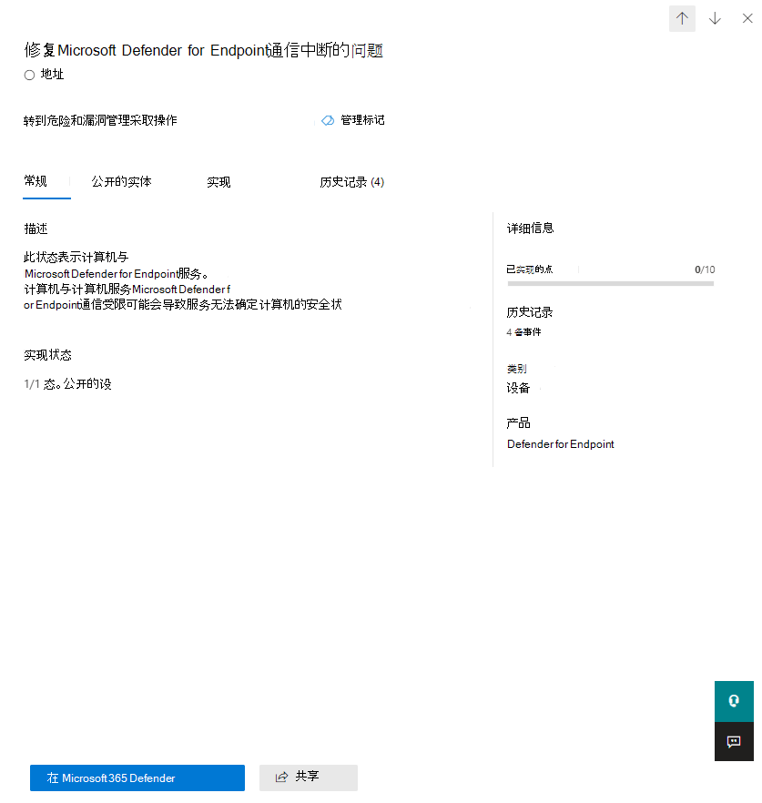

# 使用 Microsoft 安全分数评估安全状态

[!INCLUDE [Microsoft 365 Defender rebranding](../includes/microsoft-defender.md)]

Microsoft 安全功能分数是衡量组织安全状况的指标，数字越高表示采取的改进措施越多。 可以在网站门户 的 Microsoft 365 Defender https://security.microsoft.com/securescore [找到它](microsoft-365-defender.md)。

为了帮助您更快找到所需的信息，Microsoft 改进操作分为以下组：

- 标识 (Azure Active Directory角色&帐户) 
- Device (For Endpoint 的 Microsoft Defender，称为 ["适用于](/windows/security/threat-protection/microsoft-defender-atp/tvm-microsoft-secure-score-devices) 设备的 Microsoft 安全分数) 
- 应用 (电子邮件和云应用，包括Office 365和Microsoft Cloud App Security) 

>[!NOTE]
>在 Microsoft 安全分数的最近版本中，发布了一个改进的评分模型，使得 Microsoft 安全分数暂时与 Identity Secure Score 和 Graph API 不兼容。 [查看详细信息](microsoft-secure-score-whats-new.md)

在"Microsoft 安全分数概述"页中，查看在这些组之间如何拆分分数以及可用分数。 通过基准比较，还可以全面查看总分数、安全分数的历史趋势，以及可采取优先改进措施来提高分数。

## 检查当前分数

若要检查当前分数，请转到 Microsoft 安全分数概述页面，并查找显示你的安全 **分数的磁贴**。 你的分数将显示为百分比，以及你从可能的总分数中实现的点数。

此外，如果你选择分数旁边的 **"包含** "按钮，你可以选择分数的不同视图。 这些不同的分数视图将在分数磁贴和点细分图表的图形中显示。

下面是可添加到总体分数视图的分数，以便更全面了解总体分数：

- **计划分数**：在计划操作完成时显示计划分数
- **当前许可证得分**：显示可以使用当前 Microsoft 许可证实现的分数
- **可得分**：显示可通过 Microsoft 许可证和当前风险接受实现的分数

如果已包含所有可能的得分视图，此视图的外观将如下所示：

## 采取措施提高分数

" **改进操作** "选项卡列出了解决可能的攻击面的安全建议。 它还包括其状态 (解决、计划、接受的风险、通过第三方解决、通过备用缓解解决和已完成) 。 您可以搜索、筛选和分组所有改进操作。  

### 排名

排名基于要实现的分数数、实现难度、用户影响和复杂性。 排名最高的改进操作仍具有很多分数，但难度、用户影响和复杂性较低。

### 查看改进操作详细信息

当您选择特定的改进操作时，将显示一个整页的飞出图。  

若要完成该操作，有几个选项：

- 选择 **"** 管理"转到配置屏幕并做出更改。 然后，你将获得操作有价值的点，在飞出时可见。点通常需要大约 24 小时才能更新。

- 选择 **"** 共享"以复制指向改进操作的直接链接。 还可以选择共享链接的平台，如电子邮件、Microsoft Teams或 Microsoft Planner。

添加 **备注** 以跟踪要注释的进度或其他任何内容。 如果向改进操作 **添加** 自己的标记，可以按这些标记进行筛选。

### 选择改进操作状态

选择任何状态并记录特定于改进操作的记录。

- **要解决** - 您意识到改进操作是必需的，并计划在将来的某一点解决它。 此状态还适用于检测为部分操作，但未完成的操作。
- **计划** - 已制定具体计划来完成改进操作。
- **接受** 风险 - 安全应始终与可用性平衡，而不是每个建议都适用于您的环境。 在这种情况下，可以选择接受风险或剩余风险，而不是实施改进操作。 您不会获得任何分数，但此操作将不再显示在改进操作列表中。 可以在历史记录中查看此操作，或随时撤消此操作。
- **通过第三方解决** ， **通过** 备用缓解解决 - 改进操作已由第三方应用程序或软件或内部工具解决。 你将获得操作有价值的分数，以便你的分数更好地反映你的整体安全状况。 如果第三方或内部工具不再涵盖该控件，可以选择其他状态。 请记住，如果将改进操作标记为上述任一状态，Microsoft 将不能了解实现是否完整。

#### 威胁& 漏洞管理改进操作

对于"设备"类别中的改进操作，你无法选择状态。 相反，你将被定向到危险和漏洞管理[安全](/windows/security/threat-protection/microsoft-defender-atp/tvm-security-recommendation)建议Microsoft Defender 安全中心采取操作。  你选择的例外以及你编写的理由将特定于该门户。 它不会在 Microsoft 安全分数门户中显示。

#### 已完成的改进操作

一旦实现改进操作的所有可能点，改进操作就具有"已完成"状态。 已完成的改进操作通过 Microsoft 数据得到确认，你无法更改状态。

### 评估信息并查看用户影响

名为" **概览"的部分** 将告诉您类别、可以抵御的攻击和产品。

**用户** 影响是用户在执行改进操作时将体验的影响，受影响用户是将受到影响的用户。

### 实施改进操作

" **实现** "部分显示了任何先决条件、完成改进操作所需的分步下一步步骤、改进操作的当前实现状态，以及任何了解更多链接。

先决条件包括解决改进操作之前需要的任何许可证或要完成的操作。 请确保许可证中有足够的席位来完成改进操作，并且这些许可证适用于必要的用户。  

## 欢迎提出宝贵意见

如果有任何问题，请通过发布在安全、隐私和合规性社区中& [告知](https://techcommunity.microsoft.com/t5/Security-Privacy-Compliance/bd-p/security_privacy) 我们。 We're monitoring the community and will provide help.

## 相关资源

- [Microsoft 安全分数概述](microsoft-secure-score.md)
- [跟踪 Microsoft 安全分数历史记录并实现目标](microsoft-secure-score-history-metrics-trends.md)
- [即将推出的功能](microsoft-secure-score-whats-coming.md)
- [新增功能](microsoft-secure-score-whats-new.md)
