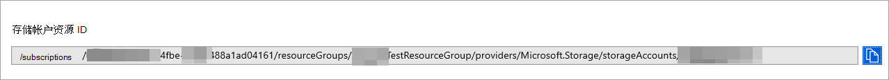

# <a name="configure-microsoft-365-defender-to-stream-advanced-hunting-events-to-your-storage-account"></a>配置Microsoft 365 Defender将高级搜寻事件流式传输存储帐户

[!INCLUDE [Microsoft 365 Defender rebranding](../../includes/microsoft-defender.md)]


**适用于：**
- [Microsoft 365 Defender](https://go.microsoft.com/fwlink/?linkid=2118804)

[!include[Prerelease information](../../includes/prerelease.md)]

## <a name="before-you-begin"></a>准备工作

1. 在[租户存储](/azure/storage/common/storage-account-overview)帐户。

2. 登录到你的 [Azure 租户，](https://ms.portal.azure.com/)转到订阅>你的订阅>**资源>注册到 Microsoft.Insights。**

## <a name="enable-raw-data-streaming"></a>启用原始数据流

1. 以 * <a href="https://go.microsoft.com/fwlink/p/?linkid=2077139" target="_blank">Microsoft 365 Defender</a> **_** 或 _*_安全管理员_**登录。

2. 转到 \> **设置Microsoft 365 Defender** \> **流式处理 API。** 若要直接转到流 **式处理 API** 页面，请使用 <https://security.microsoft.com/settings/mtp_settings/raw_data_export> 。

3. 单击“**添加**”。

4. 在出现的 **"添加新的流式 API** 设置"飞出中，配置以下设置：
   1. **名称**：选择新设置的名称。
   2. 选择 **转发事件以Azure 存储。**
   3. 在出现的 **存储帐户资源 ID"** 框中，存储 **帐户资源 ID"。** 若要获取存储 **帐户资源 ID，** 请在 打开 Azure 门户，单击"存储帐户"转到"属性"选项卡，复制"帐户存储 <https://portal.azure.com>  \> \> **ID"下的文本**。

      

   4. 返回到" **添加新的流式 API** 设置"飞出菜单 **，选择要流** 式传输的事件类型。

   完成后，请单击“**提交**”。

## <a name="the-schema-of-the-events-in-the-storage-account"></a>帐户内事件存储架构

- 将针对每种事件类型创建 blob 容器：

  

- blob 中每行的架构为以下 JSON：

  ```JSON
  {
          "time": "<The time Microsoft 365 Defender received the event>"
          "tenantId": "<Your tenant ID>"
          "category": "<The Advanced Hunting table name with 'AdvancedHunting-' prefix>"
          "properties": { <Microsoft 365 Defender Advanced Hunting event as Json> }
  }
  ```

- 每个 blob 包含多行。

- 每行都包含事件名称、Defender for Endpoint 接收事件的时间、它所属的租户 (你仅从租户) 获取事件，事件采用 JSON 格式，采用名为"properties"的属性。

- 有关事件架构Microsoft 365 Defender，请参阅高级[搜寻概述](../defender/advanced-hunting-overview.md)。

## <a name="data-types-mapping"></a>数据类型映射

为了获取事件属性的数据类型，请执行下列操作：

1. 登录 <a href="https://go.microsoft.com/fwlink/p/?linkid=2077139" target="_blank">以Microsoft 365 Defender</a>并 **转到搜寻** \> **高级搜寻**。 若要直接转到高级 **搜寻** 页面，请使用<security.microsoft.com/advanced-hunting>。

2. 在" **查询** "选项卡上，运行以下查询，获取每个事件的数据类型映射：

   ```text
   {EventType}
   | getschema
   | project ColumnName, ColumnType
   ```

- 下面是设备信息事件的示例：

  

## <a name="related-topics"></a>相关主题

- [高级搜寻概述](../defender/advanced-hunting-overview.md)
- [Microsoft 365 Defender流式处理 API](streaming-api.md)
- [将Microsoft 365 Defender流式处理到 Azure 存储帐户](streaming-api-storage.md)
- [Azure 存储帐户文档](/azure/storage/common/storage-account-overview)
