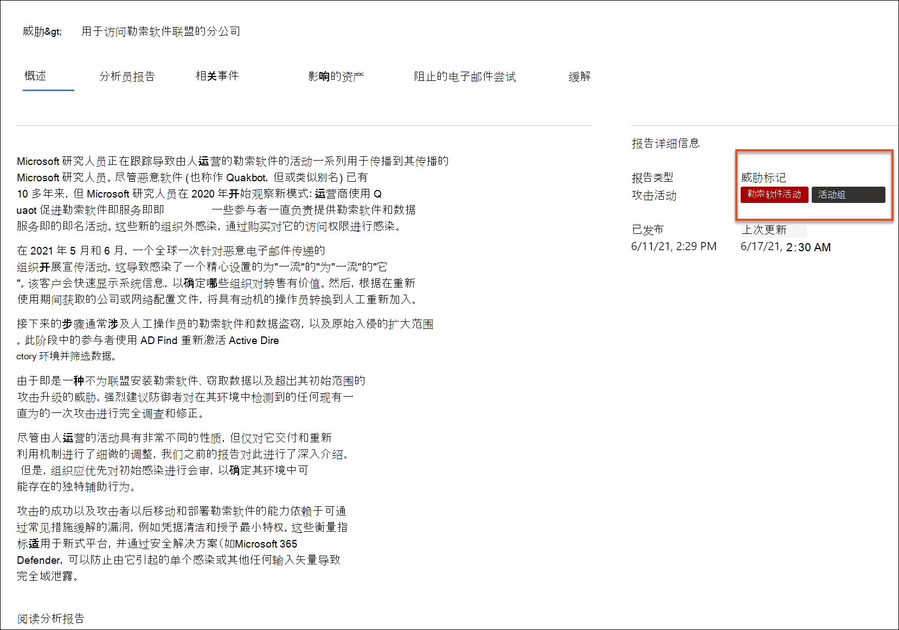
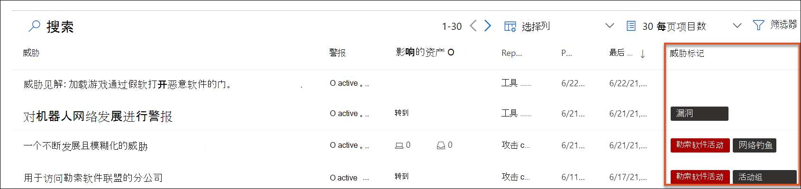
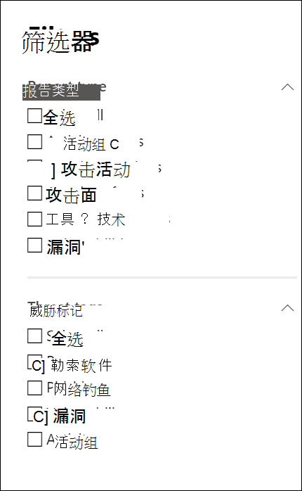
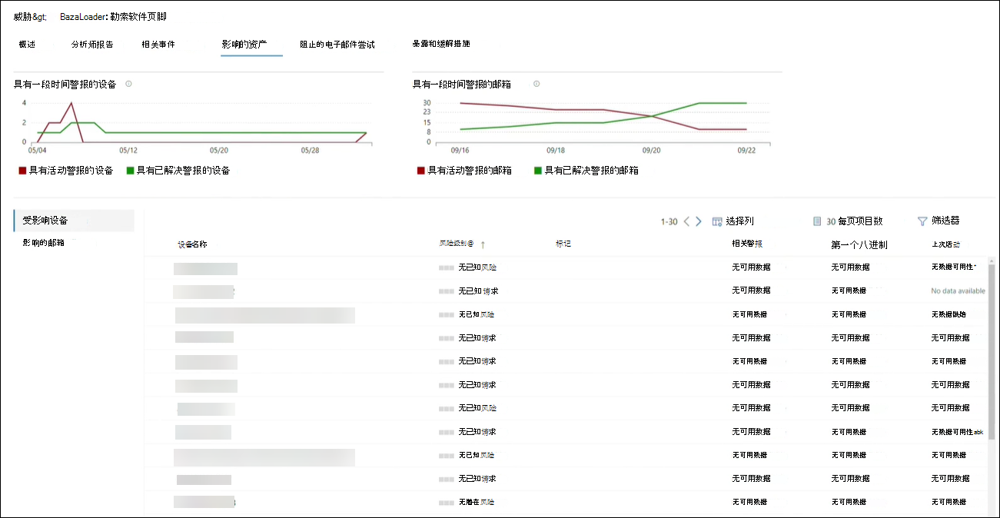

# 威胁分析Microsoft 365 Defender 

[!INCLUDE [Microsoft 365 Defender rebranding](../includes/microsoft-defender.md)]

**适用于：**
- Microsoft 365 Defender

> 想要体验 Microsoft 365 Defender？你可[在验室环境中评估](m365d-evaluation.md?ocid=cx-docs-MTPtriallab)或[生产中运行试点项目](m365d-pilot.md?ocid=cx-evalpilot)。
>

[!INCLUDE [Prerelease](../includes/prerelease.md)]

威胁分析是我们来自专业 Microsoft 安全研究人员的产品内威胁情报解决方案，旨在帮助安全团队尽可能高效地应对新出现的威胁，包括：

- 活动威胁参与者及其活动
- 热门和新的攻击技术
- 关键漏洞
- 常见攻击面
- 流行的恶意软件

观看此简短视频，详细了解威胁分析如何有助于跟踪和阻止最新威胁。

>[!VIDEO https://www.microsoft.com/en-us/videoplayer/embed/RWwJfU]

你可以从 Microsoft 365 安全门户导航栏的左上角，或者从显示组织主要威胁的专用仪表板卡访问威胁分析。了解活动或正在进行的市场活动，了解通过威胁分析可采取哪些措施，有助于让安全运营团队做出明智的决策。 

_在何处访问威胁分析_

随着更复杂的对手和新威胁的频繁和普遍出现，必须能够快速：

- 识别并应对新出现的威胁
- 了解你当前是否受到攻击
- 评估威胁对资产的影响
- 查看抵御威胁或暴露给威胁的恢复能力
- 确定可用于停止或包含威胁的缓解、恢复或防护操作

每个报告都提供跟踪威胁的分析，并提供有关如何防御该威胁的广泛指南。 它还包含来自你的网络的数据，指示威胁是否处于活动状态以及是否具有适用的保护。

## 查看威胁分析仪表板

威胁分析仪表板 (security.microsoft.com/threatanalytics3) 突出显示与组织最相关的报告。 它总结了以下各节中的威胁：

- **最新威胁**— 列出最近发布或更新的威胁报告，以及活动警报和已解决警报数。
- **高影响威胁**— 列出对组织影响最大的威胁。 本节首先列出活动警报和已解决警报数最高的威胁。
- **威胁摘要**— 通过显示具有活动警报和已解决警报的威胁数，提供所有跟踪的威胁的总体影响。

从仪表板中选择威胁以查看该威胁的报告。

_威胁分析仪表板。还可以单击"搜索"图标，在与你要阅读的威胁分析报告相关的关键字中键。_ 

## 查看威胁分析报告

每个威胁分析报告分几节提供相关信息：

- [**概述**](#overview-quickly-understand-the-threat-assess-its-impact-and-review-defenses)
- [**分析报告**](#analyst-report-get-expert-insight-from-microsoft-security-researchers)
- [**相关事件**](#related-incidents-view-and-manage-related-incidents)
- [**影响的资产**](#impacted-assets-get-list-of-impacted-devices-and-mailboxes)
- [**阻止的电子邮件尝试**](#prevented-email-attempts-view-blocked-or-junked-threat-emails)
- [**缓解**](#mitigations-review-list-of-mitigations-and-the-status-of-your-devices)

### 概述：快速了解威胁、评估其影响并审查防御

" **概述** "部分提供详细分析员报告的预览。 它还提供了突出显示威胁对组织的影响以及通过错误配置和未修补的设备暴露的图表。

_威胁分析报告的概述部分_

#### 评估对组织的影响

每个报告都包括旨在提供有关威胁的组织影响的图表：

- **相关事件** 使用以下数据概述了跟踪的威胁对组织的影响：
  - 活动警报数及其关联的活动事件数
  - 活动事件的严重性
- **一段时间的警报** 显示一段时间的相关 **活动****警报和已** 解决警报数。 已解决的警报数指示组织响应与威胁关联的警报的有多快。 理想情况下，图表应显示几天内解决的警报。
- **影响的资产**— 显示当前至少有一个活动警报 (跟踪威胁) 邮箱中的不同设备和电子邮件帐户的数量。 对于收到威胁电子邮件的邮箱，将触发警报。 查看组织级别和用户级别的策略，查看导致发送威胁电子邮件的覆盖。
- **阻止的电子邮件尝试**— 显示过去七天内在传递前被阻止或传递到垃圾邮件文件夹的电子邮件数量。

#### 查看安全恢复和状态

每个报告都包括一些图表，这些图表概述了组织对给定威胁的复原能力：

- **安全配置** 状态 — 显示安全设置错误的设备数量。 应用建议的安全设置以帮助缓解威胁。 如果设备已 **应用** 所有跟踪 _设置，则_ 被视为安全设备。
- **漏洞修补状态** 显示易受攻击的设备的数量。 应用安全更新或修补程序以解决威胁利用的漏洞。

#### 查看每个威胁标记的报告

你可以筛选威胁报告列表，并查看最相关的报告，具体视类别或 () 特定威胁标记。

- **威胁** 标记 — 帮助你根据特定威胁类别查看最相关的报告。 例如，所有与勒索软件相关的报告。
- **报告** 类型 — 帮助您根据特定报告类型查看最相关的报告。 例如，涵盖工具和技术的所有报告。 
- **筛选器**- 帮助你高效地查看威胁报告列表，并基于特定威胁标记或报告类型筛选视图。 例如，查看与勒索软件类别相关的所有威胁报告或包含漏洞的威胁报告。

##### 它的工作原理

Microsoft 威胁智能团队向每个威胁报告添加了威胁标记：

- 现在，有四个威胁标记可用：
  - 勒索软件
  - 网络钓鱼
  - 漏洞
  - 活动组
- 威胁标记在威胁分析页面顶部显示，每个标记下具有可用报告数量的计数器。

  

- 该列表也可以按威胁标记排序：

  

- 筛选器可用于每个威胁标记和报告类型：

  

### 分析员报告：从 Microsoft 安全研究人员获取专家见解

在" **分析员报告** "部分，通读详细的专家撰写。 大多数报告都提供攻击链的详细说明，包括映射到 MITRE ATT&CK 框架的策略和技术、详细的建议列表和强大的 [威胁](advanced-hunting-overview.md) 搜寻指南。

[详细了解分析员报告](threat-analytics-analyst-reports.md)

### 相关事件：查看和管理相关事件

" **相关事件** "选项卡提供与跟踪威胁相关的所有事件的列表。 你可以分配事件或管理链接到每个事件的警报。 

_威胁分析报告的相关事件部分_

### 影响的资产：获取受影响设备和邮箱的列表

如果资产受未解决活动警报的影响，则认为资产受到影响。 " **影响的资产"** 选项卡列出了以下类型的受影响资产：

- **影响的设备**- 具有未解析的 Microsoft Defender for Endpoint 警报的终结点。 这些警报通常在看到已知威胁指示器和活动时触发。
- **受影响的邮箱**— 已接收已触发 Microsoft Defender for Office 365警报的电子邮件。 触发警报的多数消息通常会被阻止，但用户或组织级别的策略可以覆盖筛选器。

_威胁分析报告的"影响的资产"部分_

### 阻止的电子邮件尝试：查看阻止或垃圾邮件威胁电子邮件

Microsoft Defender for Office 365通常阻止具有已知威胁指示器（包括恶意链接或附件）的电子邮件。 在某些情况下，检查可疑内容的主动筛选机制会改为将威胁电子邮件发送到垃圾邮件文件夹。 在任一情况下，威胁在设备上启动恶意软件代码的可能性都降低了。

"**阻止的电子邮件尝试**"选项卡列出了所有在传递前被阻止或由 Microsoft Defender 发送到垃圾邮件文件夹的电子邮件Office 365。 

_威胁分析报告的"阻止的电子邮件尝试"部分_

### 缓解：查看缓解列表和设备的状态

在 **"缓解"** 部分，查看特定可操作建议的列表，这些建议可帮助你提高组织应对威胁的复原能力。 跟踪的缓解列表包括：

- **安全更新**- 部署在载入的设备上发现漏洞的受支持软件安全更新
- **支持的安全配置**
  - 云端保护  
  - PUA 保护 (可能不需要) 应用程序
  - 实时保护

本节中的缓解信息包含来自 危险和漏洞管理的数据，其中还提供了报告中各个链接的详细深化信息。

_威胁分析报告的缓解部分_

## 其他报告详细信息和限制

> [!NOTE]
> 作为统一安全体验的一部分，威胁分析现在不仅适用于 Microsoft Defender for Endpoint，还适用于适用于 Office E5 许可证持有者的 Microsoft Defender。
>
> 如果不使用 Microsoft 365 安全门户 (Microsoft 365 Defender) ，则还可以在 Microsoft Defender 安全中心 门户 (终结点) 中查看报告详细信息 (，而无需 Microsoft Defender for Office data) 。

若要访问威胁分析报告，你需要某些角色和权限。 有关详细信息[，请参阅基于角色的访问控制中的Microsoft 365 Defender](custom-roles.md)角色。

- 若要查看警报、事件或受影响的资产数据，你需要具有 Microsoft Defender for Office 或 Microsoft Defender for Endpoint 警报数据的权限，或同时拥有这两者的权限。
- 若要查看阻止的电子邮件尝试，你需要拥有 Microsoft Defender 的权限，才能Office数据。 
- 若要查看缓解，你需要具有在 Microsoft Defender for Endpoint 危险和漏洞管理数据的权限。

查看威胁分析数据时，请记住以下因素：

- 图表仅反映跟踪的缓解。 查看报告概述，了解图表中未显示的其他缓解功能。
- 缓解不保证完全恢复。 提供的缓解反映了改进恢复能力所需的最佳可能操作。
- 如果设备尚未将数据传输到服务，则被视为"不可用"。
- 防病毒相关的统计信息基于Microsoft Defender 防病毒设置。 具有第三方防病毒解决方案的设备可能显示为"公开"。

## 相关主题

- [使用高级搜寻主动查找威胁](advanced-hunting-overview.md) 
- [了解分析员报告部分](threat-analytics-analyst-reports.md)
- [评估和解决安全漏洞和曝光](/windows/security/threat-protection/microsoft-defender-atp/next-gen-threat-and-vuln-mgt)
