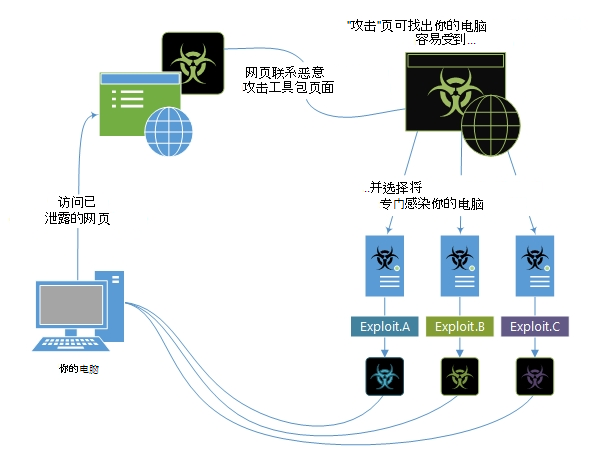

# 攻击和攻击工具包

攻击利用软件中的漏洞。 漏洞就像软件中的一个漏洞，恶意软件可以使用它进入你的设备。 恶意软件利用这些漏洞来绕过计算机的安全保护措施来感染你的设备。

## 攻击和攻击工具包如何工作

攻击通常是更大攻击的第一部分。 黑客扫描包含关键漏洞的过时系统，然后通过部署目标恶意软件来利用这些漏洞。 攻击通常包括 shellcode，这是一种小型恶意软件有效负载，用于从攻击者控制的网络中下载其他恶意软件。 Shellcode 允许黑客感染设备和破坏组织。

攻击工具包是包含攻击集合的更全面的工具。 这些工具包扫描设备中是否有不同类型的软件漏洞，如果检测到任何漏洞，则部署其他恶意软件以进一步感染设备。 工具包可以使用面向各种软件（包括 Adobe Flash Player、Adobe Reader、Internet Explorer、Oracle Java 和 Sun Java）的漏洞。

攻击者分发攻击和攻击工具包最常用的方法是通过网页，但攻击也可以到达电子邮件中。 一些网站在无意中和恶意托管其广告中的恶意代码和攻击。

下面的信息图显示了攻击工具包如何在你访问遭到入侵的网页后尝试攻击设备。

*图 1.如何利用工具包工作的示例*

一些明显的威胁（包括 Wannacry）利用 SMB (服务器消息) 漏洞 CVE-2017-0144 来启动恶意软件。

攻击工具包示例：

- Angler / [Axpergle](https://www.microsoft.com/en-us/wdsi/threats/malware-encyclopedia-description?name=JS/Axpergle)

- [Neutrino](https://www.microsoft.com/en-us/wdsi/threats/malware-encyclopedia-description?name=JS/NeutrinoEK)

- [百分百](https://www.microsoft.com/en-us/wdsi/threats/malware-encyclopedia-description?name=JS/Neclu)

若要了解有关攻击的更多信息，请阅读此博客文章，以分离在与 ESET 联合搜寻中发现的双重零 [日示例。](https://cloudblogs.microsoft.com/microsoftsecure/2018/07/02/taking-apart-a-double-zero-day-sample-discovered-in-joint-hunt-with-eset/)

## 我们如何命名攻击

我们会按照恶意软件恶意软件中攻击的目标"平台"进行分类。 例如，Exploit：Java/CVE-2013-1489。A 是一种攻击，它面向 Java 中的漏洞。

许多安全软件供应商都) 一个称为"CVE (漏洞和公开"的项目。 项目向每个漏洞提供唯一的编号，例如 CVE-2016-0778。
部分"2016"是指发现漏洞的年份。 "0778"是此特定漏洞的唯一 ID。

可以在 [CVE 网站上阅读更多信息](https://cve.mitre.org/)。

## 如何防范攻击

针对攻击的最佳防护是使组织的软件 [保持最新](https://portal.msrc.microsoft.com/)。 软件供应商提供许多已知漏洞的更新，因此请确保这些更新应用于所有设备。

有关更多常规提示，请参阅 [防止恶意软件感染](prevent-malware-infection.md)。
