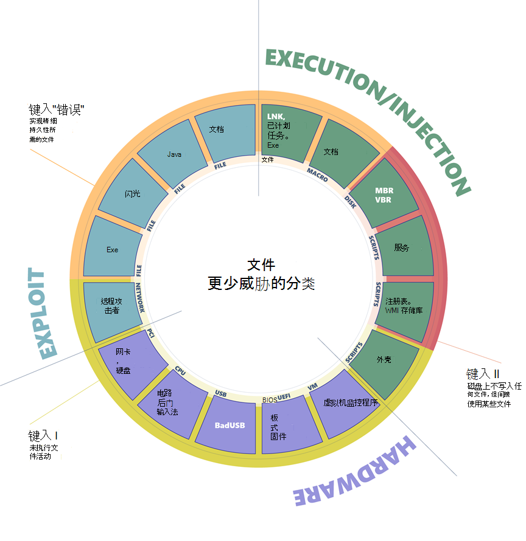
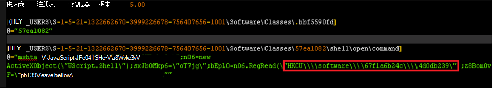

# 无文件威胁

什么是无文件威胁？ "无文件"一词表明威胁不会在文件中存在，例如仅存于计算机内存中的后门。 但是，没有针对无文件恶意软件的定义。 该术语被广泛使用，有时用于描述依赖文件进行操作的恶意软件系列。

攻击 [涉及执行](https://attack.mitre.org/wiki/ATT&CK_Matrix) 、持久性或信息盗窃等功能的几个阶段。 攻击链的某些部分可能是无文件的，而其他部分可能涉及某种形式的文件系统。

为清楚起见，无文件威胁分为不同的类别。

 
*图 1.无文件恶意软件的全面关系图*

无文件威胁可以按其入口点进行分类，这指示无文件恶意软件如何到达计算机。 它们可以通过攻击、受损的硬件或通过定期执行应用程序和脚本到达。

接下来，列出入口点的形式。 例如，攻击可以基于文件或网络数据，PCI 外围设备是一种类型的硬件矢量，脚本和可执行文件是执行矢量的子类别。

最后，对感染的宿主进行分类。 例如，Flash 应用程序可能包含各种威胁，如攻击、简单的可执行文件和来自硬件设备的恶意固件。

分类有助于对各种无文件威胁进行划分和分类。 有些方案更加危险，但也更难实现，而有些则更常用， (或精确原因) 不够高级。

从此分类中，你可以根据它们在受感染的计算机上留下多少指纹收集三种主要的无文件威胁类型。

## 类型 I：未执行文件活动

完全无文件的恶意软件可以视为永远不需要在磁盘上写入文件的恶意软件。 此类恶意软件首先如何感染计算机？ 一个示例是，目标计算机收到恶意网络数据包，这些数据包利用一个不法子漏洞。 此漏洞允许安装 DoublePul更新后门，该回door最终仅驻留在内核内存中。 在这种情况下，不会在文件上写入任何文件或任何数据。

损坏的设备也可能在设备固件 (（如 BIOS) 、USB 外围设备 (如 BadUSB 攻击) ）或网卡固件中隐藏恶意代码。 所有这些示例不要求磁盘上的文件运行，理论上只能在内存中运行。 恶意代码在重新启动、磁盘重新设置和操作系统重新安装后将无法运行。

此类型的感染可能特别难以检测，因为大多数防病毒产品无法检查固件。 如果产品确实能够检查和检测恶意固件，则在此级别修正威胁时仍有重大挑战。 此类无文件恶意软件要求高度复杂，并且通常取决于特定的硬件或软件配置。 这不是一种易于且可靠地被攻击的攻击途径。 虽然此类威胁是危险威胁，但在大多数攻击中并不常见且不实用。

## 类型 II：间接文件活动

还有其他一些方法，恶意软件可以在计算机上实现无文件状态，而无需进行大量的工程工作。 这种类型的无文件恶意软件不会直接在文件系统上写入文件，但它们最终可能会间接使用文件。 例如， [Poshspy](https://www.fireeye.com/blog/threat-research/2017/03/dissecting_one_ofap.html) 后门攻击者在 WMI 存储库中安装了恶意 PowerShell 命令，并配置了 WMI 筛选器以定期运行该命令。

可以通过命令行执行此类安装，而无需在文件中已有一个后门。 可以安装和理论上运行恶意软件，而不会接触文件系统。 但是，WMI 存储库存储在由 CIM 对象管理器管理的中央存储区域中的物理文件上，并且通常包含合法数据。 即使从技术上说，感染链确实使用物理文件，但它被认为是无文件攻击，因为 WMI 存储库是一个无法检测并删除的多用途数据容器。

## 类型 III：操作所需的文件

某些恶意软件可以具有某种无文件持久性，但如果不使用文件进行操作，则不能。 此方案的一个示例是 Kovter，该示例在注册表中为随机文件扩展名创建 shell 打开谓词处理程序。 打开具有此类扩展名的文件将导致通过合法工具mshta.exe。

 
*图 2.Kovter 的注册表项*

调用打开动词时，将启动注册表中的关联命令，这导致执行小型脚本。 此脚本从一个注册表项中读取数据并执行它，从而导致加载最终有效负载。 但是，若要首先触发打开动词，Kovter 必须删除与上述示例中动词 (相同的扩展名的文件，扩展名为 .bbf5590fd) 。 它还必须设置配置为在计算机启动时打开此类文件的自动运行密钥。

Kovter 被视为无文件威胁，因为文件系统没有实际用途。 具有随机扩展名的文件包含垃圾邮件数据，这些数据在验证威胁是否存在时不可使用。 存储注册表的文件是容器，如果存在恶意内容，则不能检测并删除这些文件。

## 按感染主机对无文件威胁进行分类

在介绍了广泛的类别之后，我们现在可以深入了解这些详细信息并提供感染主机的细目。 此全面分类涵盖通常称为无文件恶意软件的全景。 它驱动着我们研究和开发新的保护功能，以中性化攻击类别，并确保恶意软件不会在武器竞争中取得优势。

### 攻击

基于 **文件的 (类型** III：可执行文件、Flash、Java、文档) ：初始文件可能会利用操作系统、浏览器、Java 引擎、Flash 引擎等来执行 shellcode，并传递内存中的有效负载。 虽然有效负载是无文件，但初始输入矢量是一个文件。

**基于网络** (类型 I) ：利用目标计算机中的漏洞的网络通信可以在应用程序或内核的上下文中实现代码执行。 例如，WannaCry 利用 SMB 协议中以前修复的漏洞在内核内存中提供后门。

### 硬件

**基于设备的** (类型 I：网卡、硬盘) ：硬盘和网卡等设备需要芯片集和专用软件正常运行。 驻留和运行在设备芯片集中的软件称为固件。 尽管这是一项复杂的任务，但固件可能会受到恶意软件的感染，因为 ["公式"信息组已捕获到它](https://www.kaspersky.com/blog/equation-hdd-malware/7623/)。

**基于 CPU 的** (类型 I) ：新式 CPU 非常复杂，可能包括出于管理目的运行固件的子系统。 此类固件可能易受劫持，并允许执行将在 CPU 内操作的恶意代码。 2017 年 12 月，两名研究人员报告了一个漏洞，攻击者可以利用此漏洞在管理引擎 [ (ME) 内部 ](https://en.wikipedia.org/wiki/Intel_Management_Engine) 执行代码，这些代码存在于来自 Intel 的任何现代 CPU 中。 同时，已观察到攻击者组"一个使用 Intel 的活动管理技术 [ (AMT) ](https://en.wikipedia.org/wiki/Intel_Active_Management_Technology) 执行不可见的网络通信，同时绕过已安装的操作系统。 ME 和 AMT 实质上是位于 CPU 内部的自治微计算机，并且以非常低的级别运行。 由于这些技术的目的是提供远程可管理性，因此它们可以直接访问硬件，独立于操作系统，并且即使计算机已关闭，也可以运行。

除了在固件级别易受攻击外，CPU 还可以通过直接插入硬件电路中的后门进行制造。 此攻击 [过去已经过研究和](https://www.emsec.rub.de/media/crypto/veroeffentlichungen/2015/03/19/beckerStealthyExtended.pdf) 证明可能。 已报告某些 x86 处理器模型包含类似 RISC 的辅助 CPU 内核，该内核可有效地提供一个后门，常规应用程序可以通过该后门获得特权执行。

**基于 USB** (类型 I) ：所有类型的 USB 设备都可以使用恶意固件重新编程，这些固件可以通过恶意方式与操作系统进行交互。 例如， [BadUSB](https://arstechnica.com/information-technology/2014/07/this-thumbdrive-hacks-computers-badusb-exploit-makes-devices-turn-evil/) 技术允许重新编程的 U 盘充当键盘，通过击键将命令发送到计算机，或者用作可自动重定向流量的网卡。

**基于 BIOS (** 类型 I) ：BIOS 是在芯片集内运行的固件。 它在计算机打开时执行，初始化硬件，然后将控制权转移给启动扇区。 BIOS 是一个重要的组件，在较低级别运行，在启动扇区之前执行。 可以像过去使用 [Mebromi rootkit](https://www.webroot.com/blog/2011/09/13/mebromi-the-first-bios-rootkit-in-the-wild/) 一样，使用恶意代码重新对 BIOS 固件进行编程。

**基于虚拟机** 监控 (类型 I) ：新式 CPU 提供硬件虚拟机监控程序支持，允许操作系统创建可靠的虚拟机。 虚拟机在受限的模拟环境中运行，在理论上不知道模拟。 接管计算机恶意软件可能会实现小型虚拟机监控程序，以在运行的操作系统的域之外隐藏自身。 这种类型的恶意软件在过去已经过系统化，并且最终已观察到真正的虚拟机监控程序 rootkit，尽管到目前为止已知很少。

### 执行和注入

**基于文件 (** 类型 III：可执行文件、DLL、LNK 文件、计划) ：这是标准执行矢量。 简单的可执行文件可以启动为第一阶段恶意软件，以在内存中运行其他有效负载，或注入到其他合法运行的进程。

 基于宏 (类型 III：Office文档) ：[VBA](/office/vba/Library-Reference/Concepts/getting-started-with-vba-in-office) 语言是一种灵活而强大的工具，旨在自动编辑任务和向文档添加动态功能。 因此，攻击者可能会滥用它执行恶意操作，如解码、运行或注入可执行负载，甚至实施整个勒索软件，如 [qkG](https://blog.trendmicro.com/trendlabs-security-intelligence/qkg-filecoder-self-replicating-document-encrypting-ransomware/) 的情况。 宏在脚本过程Office上下文中执行 (例如，Winword.exe) 脚本语言实现。 防病毒无法检查任何二进制可执行文件。 虽然Office需要用户明确同意才能从文档中执行宏，但攻击者使用社交工程技术来诱使用户允许宏执行。

 基于脚本 (类型 II：文件、服务、注册表、WMI 存储库、shell) ：JavaScript、VBScript 和 PowerShell 脚本语言默认在 Windows 平台上可用。 脚本具有与宏相同的优势，它们是文本文件 (而不是二进制可执行文件) ，在解释器 (（如 wscript.exe，powershell.exe) ）的上下文中运行，这是一个干净且合法的组件。 脚本是通用的，可通过双击脚本 (在解释器命令行) 直接执行脚本。 通过命令行运行，恶意软件可以在自动运行注册表项中将恶意脚本编码为自动启动服务，作为 [WMI 存储库的 WMI](https://www.fireeye.com/blog/threat-research/2017/03/dissecting_one_ofap.html) 事件订阅。 此外，获得对受感染计算机的访问权限的攻击者可能在命令提示符上输入脚本。

 基于磁盘 (类型 II： 启动记录) ：启动记录是磁盘或卷的第一个扇区，并且包含启动操作系统启动过程所需的可执行代码。 如 [将 Bootya](https://cloudblogs.microsoft.com/microsoftsecure/2017/06/27/new-ransomware-old-techniques-petya-adds-worm-capabilities/?source=mmpc) 等威胁覆盖到恶意代码，可以感染启动记录。 当计算机启动时，恶意软件将立即获得控制权。 启动记录驻留在文件系统外部，但操作系统可以访问它。 新式防病毒产品能够扫描和还原它。

## 攻击无文件恶意软件

在 Microsoft，我们主动监视安全环境，以识别新的威胁趋势，并开发解决方案来缓解各种威胁。 我们检测可有效抵御各种威胁的持久防护。 通过反恶意软件扫描接口 (AMSI) 、行为监视、内存扫描和启动扇区保护， [Microsoft Defender for Endpoint](/microsoft-365/security/defender-endpoint/microsoft-defender-endpoint) 可以检查无文件威胁，即使模糊处理很重。 云中的机器学习技术允许我们扩展这些防护，以抵御新出现的威胁。

若要了解更多信息，请阅读：不可见但不不可见：通过行为监视、[AMSI](https://cloudblogs.microsoft.com/microsoftsecure/2018/09/27/out-of-sight-but-not-invisible-defeating-fileless-malware-with-behavior-monitoring-amsi-and-next-gen-av/) 和下一代 AV 来攻击无文件恶意软件

## 其他资源和信息

了解如何跨[组织部署威胁防护Microsoft 365 E5](/microsoft-365/solutions/deploy-threat-protection)。
