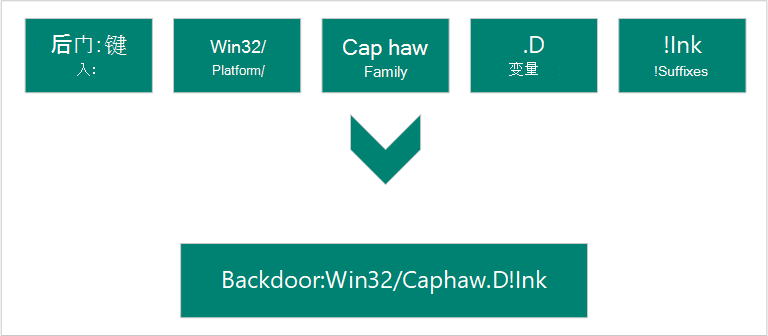

# 恶意软件名称

我们根据计算机防病毒研究组织 (CARO) 恶意软件命名方案来命名恶意软件和不需要的软件。 方案使用下列格式：

当分析人员研究特定威胁时，他们将确定名称的每个组件是什么。

## 类型

描述恶意软件在计算机上所做什么。 蠕虫、病毒、特洛伊木马、后门和勒索软件是一些最常见的恶意软件类型。

* 广告软件
* Backdoor
* 行为
* BrowserModifier
* 无。
* DDoS
* 攻击
* HackTool
* 百年
* 令人误解
* MonitoringTool
* 程序
* PERSONAL Web Server (PWS) 
* 勒索
* RemoteAccess
* 未授权
* SettingsModifier
* SoftwareBundler
* 垃圾邮件制造者
* 欺骗程序
* 间谍软件
* 工具
* 特洛伊木马
* 特洛伊木马Clicker
* 特洛伊木马下载程序
* 特洛伊木马
* 特洛伊木马
* 特洛伊木马
* VirTool
* 病毒
* 蠕虫

## 平台

平台将恶意软件引导到其兼容的操作系统 (如 Windows masOS X 和 Android) 。 平台指南还用于编程语言和文件格式。

### 操作系统

* AndroidOS：Android 操作系统
* DOS：MS-DOS 平台
* EPOC：Psion 设备
* FreeBSD：FreeBSD 平台
* iPhoneOS：iPhone操作系统
* Linux：Linux 平台
* macOS：MAC 9.x 平台或更早版本
* macOS_X：MacOS X 或更高版本
* OS2：OS2 平台
* 手心：手心操作系统
* 行星：基于系统 V 的 Unix 平台
* SunOS：Unix 平台 4.1.3 或更低
* SymbOS：Symbian 操作系统
* Unix：通用 Unix 平台
* Win16：Win16 (3.1) 平台
* Win2K：Windows 2000 平台
* Win32：Windows 32 位平台
* Win64：Windows 64 位平台
* Win95：Windows 95、98 和 ME 平台
* Win98：Windows 98 平台
* WinCE：Windows CE平台
* WinNT：WinNT

### 脚本语言

* ABAP：高级业务应用程序编程脚本
* ALisp：ALisp 脚本
* 完成项目：为完成操作而创建
* ANSI：美国国家标准协会脚本
* AppleScript：编译的 Apple 脚本
* ASP：Active Server Pages脚本
* AutoIt：AutoIT 脚本
* BAS：基本脚本
* BAT：基本脚本
* CorelScript：Corelscript 脚本
* HTA：HTML 应用程序脚本
* HTML：HTML 应用程序脚本
* INF：安装脚本
* IRC：mIRC/pIRC 脚本
* Java：Java二 (类) 
* JS：JavaScript 脚本
* 徽标：徽标脚本
* MPB：MapBasic 脚本
* MSH：Monad shell 脚本
* MSIL：.NET 中间语言脚本
* Perl：Perl 脚本
* PHP：超文本预处理器脚本
* Python：Python 脚本
* SAP：SAP 平台脚本
* SH：命令行管理程序脚本
* VBA：Visual Basic for Applications脚本
* VBS：Visual Basic脚本
* WinBAT：Winbatch 脚本
* WinHlp：Windows帮助脚本
* WinREG：Windows注册表脚本

### 宏

* A97M：Access 97、2000、XP、2003、2007 和 2010 宏
* HE：宏脚本
* O97M：Office 97、2000、XP、2003、2007 和 2010 宏 - 影响 Word、Excel 和 PowerPoint
* PP97M：PowerPoint 97、2000、XP、2003、2007 和 2010 宏
* V5M：Visio5 宏
* W1M：Word1Macro
* W2M：Word2Macro
* W97M：Word 97、2000、XP、2003、2007 和 2010 宏
* WM：Word 95 宏
* X97M：Excel 97、2000、XP、2003、2007 和 2010 宏
* XF：Excel公式
* XM：Excel 95 个宏

### 其他文件类型

* ASX：媒体 .asf Windows XML 图元文件
* HC：HyperCard Apple 脚本
* MIME：MIME 数据包
* Netware：Novell Netware 文件
* QT：快速时间文件
* SB：StarBasic (StarOffice XML) 文件
* SWF：Wave Flash 文件
* TSQL：MS SQL服务器文件
* XML：XML 文件

## 系列

根据共同特征（包括同一作者的属性）对恶意软件进行分组。 安全软件提供商有时对同一恶意软件系列使用不同的名称。

## Variant 字母

按顺序用于每个不同版本的恶意软件系列。 例如，变体".AF"的检测是在检测变量""之后创建的。AE"。

## 后缀

提供有关恶意软件的更多详细信息，包括如何将它用作多组威胁的一部分。 在上一示例中，"！lnk"指示威胁组件是特洛伊木马：Win32/Reveton.T 使用的快捷方式文件。

* .dam：损坏的恶意软件
* .dll：恶意软件的动态链接库组件
* .dr：恶意软件的拖放组件
* .gen：使用通用签名检测到的恶意软件
* .kit：病毒构造函数
* .ldr：恶意软件的加载程序组件
* .pak：压缩恶意软件
* .plugin：插件组件
* .viruss：病毒的遗留物
* .worm：该恶意软件的蠕虫组件
* ！bit：用于引用某些威胁的内部类别
* ！cl：用于引用某些威胁的内部类别
* ！dha：用于引用某些威胁的内部类别
* ！pfn：用于引用某些威胁的内部类别
* ！plock：用于引用某些威胁的内部类别
* ！rfn：用于引用某些威胁的内部类别
* ！rootkit：该恶意软件的 rootkit 组件
* @m：蠕虫邮件程序
* @mm：大量邮件程序蠕虫
